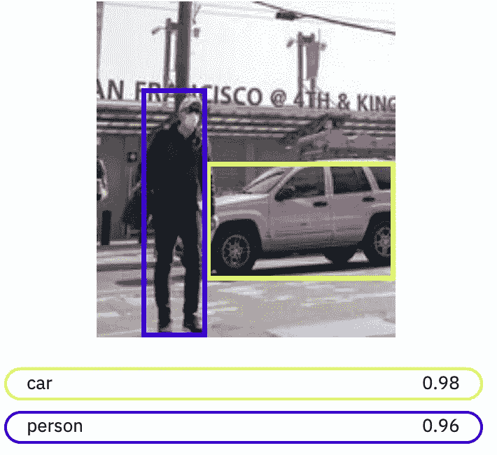
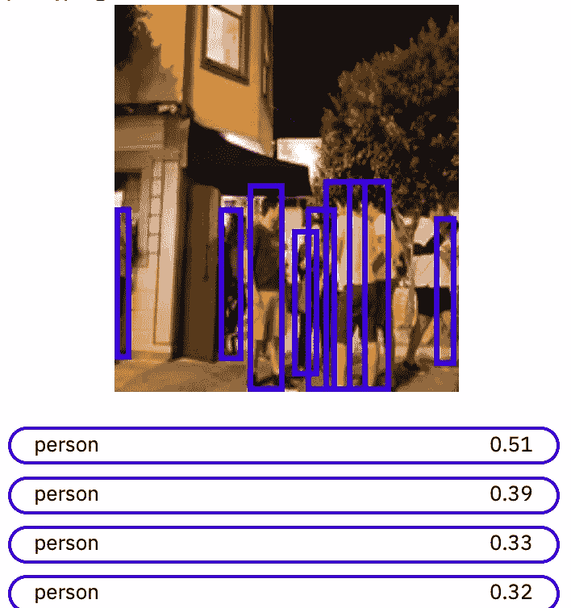

# IBM 和加多图像演示人工智能模型发布任务原型

> 原文：<https://towardsdatascience.com/ibm-and-gado-images-to-demonstrate-ai-model-release-assignment-prototype-17f33345a23c?source=collection_archive---------27----------------------->

## 系统自动检测图像中可能需要模型发布表单的人

New system identifies people who may need a model release form, even if their faces are obscured. Here, the system distinguishes a person from another object (a car). Underlying photo credit Gado Images.

视觉人工智能可以做一些不可思议的事情。2019 年，使用来自多家供应商的现成人工智能和机器学习解决方案，媒体许可方可以自动标记海量图像库，在图像中找到地标或标志，甚至可以获得全文字幕，看起来像是由一个人写的。光学字符识别(OCR)可以从图像中提取文本，即使是手写的，或者是一些微小的视觉元素，如路标，并自动将其翻译成 100 多种语言。

考虑到人工智能仅在几年前所处的位置，这些现成的能力是非凡的。对于许多用户来说，预先训练的模型和现成的解决方案为他们的应用提供了足够多的智能，而且通常成本很低。但是，如果您的解决方案更复杂，并且特定于媒体许可行业，该怎么办呢？

将模型发布形式分配给图像是当今许可行业面临的一个特别具有挑战性的问题。对于用于商业目的的图像(如在广告或政治活动中)，图像中任何可识别的人都必须签署一份授权使用其肖像的发布表格。当投稿人向媒体许可方上传新图像时，许可方需要确定该图像是否包含可识别的人，以及这些人是否签署了发布表格。

起初，在图像中寻找人似乎是一项简单的人工智能任务。但是，看看任何主要的图像库，复杂性立刻就清楚了。如果一个人背对着镜头呢？如果他们戴着口罩，或者使用某种设备来部分遮挡他们的脸，比如呼吸器或外科口罩，会怎么样？如果图像使用了像运动模糊或选择性聚焦这样的创造性技术，一些人脸模糊或扭曲了怎么办？所有这些因素使得识别图像中的人，从而分配适当的释放形式，比它最初出现时更具挑战性的人工智能问题。

考虑到分配模型发布的复杂性(以及出错时可能承担的责任风险),许多媒体授权机构会付钱给审查人员，让他们查看收到的每张图片，手动识别人员，并确保每个需要发布表格的人都有一份存档。这既费时又费钱。

这就是定制人工智能解决方案的用武之地。许多供应商提供定制的人工智能解决方案，但该行业中一个突出的参与者是 IBM Watson。自从 2011 年在电视节目《危险边缘》中战胜人类对手以来，沃森一直是全国关注的焦点。从那时起，IBM 已经将 Watson 从一个为特定任务而专门构建的人工智能带到了一个平台，该平台正在各个行业对人工智能和机器学习的实施进行革命性的变革，从制造和建筑到文化遗产和媒体许可。

在 10 月份的 DMLA 第 24 届年会上，作为以谷歌云、Imagga 和 CloudSight 为特色的实用人工智能会议的一部分，加多图像和 IBM Watson 将展示一个新的定制人工智能系统的原型，该系统专门用于为图像分配模型发布表单。该系统将查看一幅图像，自动找到图像中的所有人，无论他们是在看相机(就像在一幅直截了当的肖像中)，站在人群中，背对着，甚至穿着遮住他们面部的衣服。仅这一功能就向许多机构的工作流程自动化迈出了一大步。

The system has successfully identified a person who would need a model release form for this image to be used commercially. Underlying photo credit Gado Images.

该系统最终将超越这一点，确定人脸是否足够小、模糊或选择性聚焦，从而不需要发布表单。

如果该系统获得成功，它将为定制人工智能解决具体的、具有挑战性的行业问题的能力提供一个很好的例子。

Crowd scenes, especially in low light, are challenging, but the system correctly identified the people present in the scene. Some people in the scene are facing away from the camera and are obscured enough that a release form may not be needed. Underlying photo credit Gado Images.

数字媒体许可协会第 24 届 DMLA 年会将于 10 月 27 日至 29 日在加州玛丽娜·德尔瑞举行，而*实用人工智能*会议将于 10 月 28 日星期一上午 11 点举行。