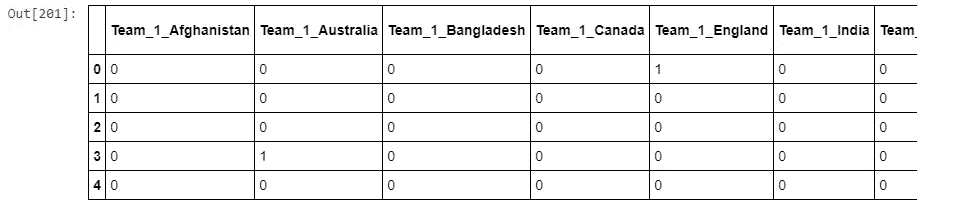

# 使用机器学习的 ICC 2019 板球世界杯预测

> 原文：<https://towardsdatascience.com/icc-2019-cricket-world-cup-prediction-using-machine-learning-7c42d848ace1?source=collection_archive---------4----------------------->


Photo by [Aksh yadav](https://unsplash.com/@aksh1802?utm_source=unsplash&utm_medium=referral&utm_content=creditCopyText) on [Unsplash](https://unsplash.com/search/photos/cricket?utm_source=unsplash&utm_medium=referral&utm_content=creditCopyText)

## 用数据做很酷的事情

被困在付费墙后面？点击[这里](https://medium.com/p/icc-2019-cricket-world-cup-prediction-using-machine-learning-7c42d848ace1?source=email-c3f5233f3441--writer.postDistributed&sk=9d0b05e9cccda139ccc1b954db167da3)阅读完整故事与我的朋友链接！

2019 年 ICC 男子板球世界杯准备于周四(5 月 30 日)开始。第 12 届板球世界杯将在英格兰和威尔士进行近一个半月。本次锦标赛将有 10 支球队参加，他们将在一个循环赛小组中进行比赛，小组赛结束时的前四名将进入半决赛。

预测未来听起来像是魔术，无论是提前发现潜在客户购买你产品的意图，还是计算出股票价格的走向。如果我们能够可靠地预测某事的未来，那么我们就拥有巨大的优势。机器学习只是放大了这种神奇和神秘。

# 应用程序

体育预测的主要目的是提高团队的表现，增加赢得比赛的机会。一场胜利的价值以不同的形式表现出来，比如涓涓细流渗透到体育场座位上的球迷、电视合同、球迷商店商品、停车、优惠、赞助、注册和保留。

# 数据

真实世界的数据是肮脏的。我们不能指望像 [Kaggle](https://www.kaggle.com/) 提供的那样有一个良好的格式和干净的数据。因此，数据预处理至关重要，我怎么强调都不为过。这是最重要的阶段，因为它可能占据整个工作流程的 40%-70%，仅仅是清理要提供给模型的数据。

我从 Crickbuzz 网站上刮了三个脚本，包括截至 2019 年 5 月的球队排名，2019 年世界杯的比赛细节以及每支球队在历届世界杯上的历史细节。我将上述数据存储在三个单独的 csv 文件中。对于第四个文件，我从 Kaggle 的另一个 csv 文件中抓取了 1975 年至 2017 年间比赛的 odi 数据集。在这个文件中，我删除了 1975 年到 2010 年的所有数据。这样做是因为过去几年的结果只会影响我们的预测。由于我没有得到 2018 年和 2019 年的数据，所以这个模型可能不是那么准确，但我仍然相信这给出了一个相当好的想法。然后，我根据我的需要对数据进行了手动清理，以制作一个机器学习模型。

# 环境和工具

1.  Jupyter 笔记本
2.  Numpy
3.  熊猫
4.  海生的
5.  Matplotlib
6.  sci kit-学习

我一步一步地遵循一般的机器学习工作流程:

1.  数据清理和格式化。
2.  探索性数据分析。
3.  特征工程和选择。
4.  在性能指标上比较几种机器学习模型。
5.  对最佳模型执行超参数调整。
6.  评估测试集上的最佳模型。
7.  解释模型结果。
8.  得出结论并记录工作。


Machine learning workflow

# 代码在哪里？

事不宜迟，让我们从代码开始吧。github 上的完整项目可以在这里找到[。](https://github.com/abhinavsagar/ICC-2019-WC-prediction)

我从导入所有的库和依赖项开始。

然后我加载了包含历届世界杯各队历史详情的 csv 文件。我还加载了包含 2010 年和 2017 年之间比赛结果的 csv 文件。


# 1.数据清理和格式化

接下来，让我们显示印度队比赛的详细情况。


接着，我创建了一个专栏来展示 2010 年的比赛细节，并将其作为未来工作的参考。


# **2。探索性数据分析**

之后，我把今年参赛的队伍的详细情况和他们过去的成绩合并在一起。


我删除了比赛日期、胜算和比赛场地等栏目。这些特征看起来对我们的预测并不重要。


# **3。特征工程和选择**

这可能是机器学习工作流程中最重要的部分。由于算法完全取决于我们如何将数据输入其中，因此对于每个机器学习项目来说，特征工程应该被赋予最高的优先级。

> *特征工程是将原始数据转化为特征的过程，这些特征可以更好地代表预测模型的潜在问题，从而提高未知数据的模型准确性。*

# 特征工程的优势

**减少过度拟合**:冗余数据越少，基于噪声做出决策的机会就越少。

**提高精度**:误导性数据少意味着建模精度提高。

**减少训练时间**:数据点越少，算法复杂度越低，算法训练越快。

所以继续工作，我创造了这个模型。如果团队 1 赢了比赛，我给它分配标签 1，否则如果团队 2 赢了，我给它分配标签 2。


然后，我使用 pandas 函数 *pd.get_dummies 将 team-1 和 team-2 从分类变量转换为连续输入。*此变量只有两个答案选择:团队 1 和团队 2。它创建一个由 0 和 1 组成的新数据帧。在这种情况下，数据帧将有一个 1，这取决于特定游戏的团队。

此外，我将训练集和测试集分开，分别占训练集和验证集的 70%和 30%。


Train/Test Split

# **4。在性能指标上比较几个机器学习模型**

我使用逻辑回归、支持向量机、随机森林和 K 近邻来训练模型。

随机森林以 70%的训练准确率和 67.5%的测试准确率超过了所有其他算法。


Photo by [Lukasz Szmigiel](https://unsplash.com/@szmigieldesign?utm_source=unsplash&utm_medium=referral&utm_content=creditCopyText) on [Unsplash](https://unsplash.com/search/photos/forest?utm_source=unsplash&utm_medium=referral&utm_content=creditCopyText)

> *随机森林结合了数百或数千棵决策树，根据一组略有不同的观察值训练每棵树，考虑有限数量的特征来分割每棵树中的节点。随机森林的最终预测是通过对每棵树的预测进行平均而得到的。*

RFs 使用随机数据样本独立训练每棵树。这种随机性有助于使模型比单个决策树更健壮，并且不太可能过度适应训练数据。

# **5。对最佳模型进行超参数调整**

```
Training set accuracy:  0.700
Test set accuracy:  0.675
```

随机森林模型的流行是由它的各种优势解释的:

*   在大型数据库上运行时准确高效
*   多个树减少了较小集合或单个树的方差和偏差
*   抗过度配合
*   可以在不删除变量的情况下处理数千个输入变量
*   可以估计哪些变量在分类中是重要的
*   为估计缺失数据提供有效的方法
*   当大部分数据丢失时保持准确性


Decision boundary from random forests (as more trees are added)

# **6。评估测试集上的最佳模型**

我们继续。我增加了 ICC 的球队排名，今年优先考虑排名更高的球队获胜。

接下来，我添加了新的列，为每支球队排名，并对前 45 场比赛的数据集进行切片，因为总共有 45 场联赛阶段的比赛。


然后，我根据每个团队的排名位置将团队添加到新的预测数据集中。


之后，我添加了获取虚拟变量的脚本，并添加了与模型训练数据集相比缺少的列。



# **7。解释模型结果**

最后，下面的代码是为了得到每个联赛阶段比赛的结果。

有关结果，请随意参考[相应的 jupyter 笔记本](https://github.com/abhinavsagar/ICC-2019-WC-prediction)。因此，进入半决赛的四支队伍是新西兰、印度、英格兰和南非。

然后我创建了一个函数来重复上面的工作。这是预测 2019 年 ICC 板球世界杯冠军的最终函数。

我运行了半决赛预测功能。

**新西兰和印度
冠军:印度**

**南非和英格兰
冠军:英格兰**

因此，进入决赛的两支队伍是印度和英格兰，这是显而易见的，因为他们被认为是今年的夺冠热门。此外，他们是国际商会排名第一和第二的球队。

# **8。得出结论并记录工作**

最后运行主函数。

**印度和英国**

获胜者:英国

# 按照这种模式，英格兰很有可能赢得本届世界杯。

本文旨在展示如何使用机器学习来计算模拟中的概率，并不试图实际获得正确的结果，因为使用的数据还不够(或者事件本身根本不可预测)。请把这当成一个教程，用世界杯比赛只是因为这是一个很酷的和最新的主题。应该使用更深入的方法来获得更好的结果，并使它们更有意义。

# 需要进一步改进的领域

1.  数据集——为了改善数据集，你可以通过从 ESPN 网站上抓取 2018 年和 2019 年的数据来考虑它们，也可以使用球员的数据来评估每个团队球员的质量。
2.  尝试更复杂的机器学习算法，如 Xgboost 和微调 hyper 参数
3.  一个混淆矩阵将会很好地分析模型出错的游戏。
4.  我们可以集合，也就是说，我们可以尝试将更多的模型堆叠在一起，以提高精确度。
5.  更进一步，基于玩家统计数据建立一个模型。

# 参考资料/进一步阅读

[](/why-random-forest-is-my-favorite-machine-learning-model-b97651fa3706) [## 为什么随机森林是我最喜欢的机器学习模型

### “模特就像一副护目镜。它让某些事情成为焦点。”—我的数据科学导师。

towardsdatascience.com](/why-random-forest-is-my-favorite-machine-learning-model-b97651fa3706) [](https://www.sciencedirect.com/science/article/pii/S2210832717301485) [## 运动成绩预测的机器学习框架

### 您的浏览器禁用了 JavaScript。请启用 JavaScript 以使用此页面上的所有功能。机器学习…

www.sciencedirect.com](https://www.sciencedirect.com/science/article/pii/S2210832717301485) [](https://medium.com/futuristone/artificial-intelligence-failed-in-world-cup-2018-6af10602206a) [## 为什么人工智能在 2018 年 FIFA 世界杯上失败了？

### 以下是我们从人工智能未能预测 2018 年俄罗斯世界杯结果中学到的东西。

medium.com](https://medium.com/futuristone/artificial-intelligence-failed-in-world-cup-2018-6af10602206a) 

# 在你走之前

github 上相应的项目可以在这里找到。

[](https://github.com/abhinavsagar/ICC-2019-WC-prediction) [## abhinavsagar/ICC-2019-WC-预测

### 我用机器学习做了一个模型，用 scikit-learn，pandas，numpy，seaborn 和 matplotlib 来预测…

github.com](https://github.com/abhinavsagar/ICC-2019-WC-prediction) 

2019 年 15 月 7 日更新 1 —英格兰确实赢得了世界杯。


Eoin Morgan holding the trophy

# 联系人

如果你想了解我最新的文章和项目[，请关注我的媒体](https://medium.com/@abhinav.sagar)。以下是我的一些联系人详细信息:

*   [个人网站](https://abhinavsagar.github.io)
*   [领英](https://in.linkedin.com/in/abhinavsagar4)
*   [中等轮廓](https://medium.com/@abhinav.sagar)
*   [GitHub](https://github.com/abhinavsagar)
*   [卡格尔](https://www.kaggle.com/abhinavsagar)

快乐阅读，快乐学习，快乐编码！