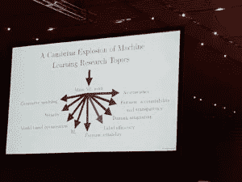

# ICLR 19 集锦(诸如此类)

> 原文：<https://towardsdatascience.com/iclr-19-highlights-and-all-that-jazz-659c294f991d?source=collection_archive---------30----------------------->

## **会议关于强化学习、GANs、公平和其他主题的笔记**

**与 Ofri Mann 的联合帖子**

我们去 ICLR 展示了我们在使用不确定性和注意力调试 ML 模型方面的工作。在美妙的新奥尔良的鸡尾酒会和爵士乐表演之间(我们能在 NOLA 举行所有的会议吗？)我们也看到了很多有趣的讲座和海报。以下是我们从会议中得到的主要收获。

## 主要主题

伊恩·古德费勒在[的演讲](https://www.youtube.com/watch?v=sLAi-H9J3nk)中对这些主题做了一个很好的总结，他在演讲中说，直到 2013 年左右，ML 社区一直专注于让 ML 发挥作用。现在，在给定足够数据的情况下，它正在许多不同的应用程序上工作，重点已经转向为我们的模型添加更多功能:我们希望它们遵守一些公平、问责和透明的约束，保持稳健，有效地使用标签，适应不同的领域等等。

伊恩·古德费勒演讲中关于人工智能主题的幻灯片

我们注意到几个话题引起了很多关注:强化学习，GANs 和对立的例子，公平是最突出的。在训练和优化技术、VAEs、量化和理解网络的不同行为方面也做了大量的工作。

虽然会议的最后一天展示了许多关于不同 NLP 任务的论文，但计算机视觉对我们来说就像是一个已解决的问题，很少有*应用的*视觉论文。然而，大多数关于优化、理解网络、元学习等的工作实际上都是在图像上完成的。尽管会议的重点是学习表示，但在结构化或表格数据的学习表示方面并没有太多的工作。

下面的笔记是根据主题分类的。

## 强化学习

有三个研讨会和整个海报会议(约 90 篇论文)致力于强化学习。

今年讨论的一个突出主题是稀疏奖励或无奖励强化学习。这个主题在**任务不可知强化学习** [研讨会](https://iclr.cc/Conferences/2019/Schedule?showEvent=636)中得到了很好的体现，多张海报和简短的演讲，以及 [Pierre-Yves Oudeyer](http://www.pyoudeyer.com) 的精彩[演讲](https://www.facebook.com/iclr.cc/videos/1061645560700150/)，讨论了好奇心驱动的学习，其中信息增益被用作内在奖励，允许算法探索它们的环境并专注于信息增益最高的领域。这些内在的奖励可以和外在的奖励结合起来，几乎不需要明确的练习就能完成任务。在他的演讲中，Oudeyer 展示了机器人如何在没有事先练习的情况下学会操纵环境和执行任务，以及一种新颖的数学教学方法，其中好奇心驱动的算法用于个性化每个孩子的课程，专注于他/她较弱的科目。

另外两个研讨会讨论了 RL 中的结构:

强化学习中的**结构&先验** [研习班](https://iclr.cc/Conferences/2019/Schedule?showEvent=634)专注于学习结构的不同方式，并将先验引入 RL 任务，以便允许它们从更少的示例中学习，并以更低的计算成本获得更高的泛化能力。

**深度强化学习符合结构化预测** [研讨会](https://iclr.cc/Conferences/2019/Schedule?showEvent=630)建议将结构预测视为一个连续的决策过程，并专注于利用深度强化学习的进步来改进结构化预测的论文。

## 生成对抗模型和对抗范例

除了 Goodfellow 的主题演讲(重点介绍 GAN 在不同 ML 研究领域的应用)之外，还有一个完整的海报会议专门讨论 GAN 和对立的例子。这些也在**调试 ML 模型** [研讨会](https://debug-ml-iclr2019.github.io/)、**高度结构化数据的深度生成模型** [研讨会](https://deep-gen-struct.github.io/)和**安全机器学习:规范、健壮性和保证** [研讨会](https://iclr.cc/Conferences/2019/Schedule?showEvent=632)中得到了很多关注。

例如，在他的演讲**“对立例子的新观点”** [中，Aleksander Madry](https://people.csail.mit.edu/madry/) 声称模型从健壮的特征和与标签相关的非健壮特征中学习，健壮的特征捕捉一些对人类可解释的意义。由于非鲁棒特征对于最大化模型的准确性同样有用，所以模型也关注它们。因此，他声称，我们不能指望训练后的可解释性，因为模型的一些预测能力来自于非稳健的特征。我们称这些特性为对立的例子，但是从模型的角度来看，健壮特性和非健壮特性之间没有真正的区别。为了提高可解释性，Madry 提出了一些方法来迫使模型在训练过程中只关注健壮的特征。

## 公平、问责、安全和人工智能对社会有益

今年有很多(不一定是技术性的)关于公平、安全和人工智能对社会公益的相关问题的讨论。

Cynthia Dwark 做了一个很棒的主题演讲关于**算法公平**的最近发展，她在演讲中提出了两个公平的概念——群体公平，它解决了不同人口统计群体的相对待遇，以及个体公平，它要求对于给定的分类任务，相似的人应该被该任务的分类器相似地对待。她谈到了与这两个概念相关的挑战，以及最近旨在弥合这两个概念之间差距的工作，强调了多重校准的概念——针对不同的群体进行校准，以及公平的排名和评分。

另一个旨在引发对 ML 中可能存在的危险的讨论的演讲是 Zeynep Tufekci 的“**虽然我们都担心 ML 的失败，但如果它(大部分)有效，会潜伏什么危险？”**。

AI for social good 研讨会的重点是应用人工智能来解决医疗保健、教育和农业等重要的社会问题。 **Safe ML** 车间，专注于指定系统用途，使其更加健壮并对其进行监控**。**ML 车间的**再现性和**调试 ML** 车间(我们在此介绍了我们关于不确定性和注意力的工作)，主要关注公平性和可解释性。**

我们认为会议组织者对公平性、问责制和透明度(FAT)的高度重视是公开邀请机构群体参与这一重要讨论，作为主要 ML 会议的一部分。虽然大多数相关论文都发表在指定的会议上，如 [FAT conference](https://fatconference.org/) ，并且今年没有太多相关论文出现在主赛道上，但我们预计这种情况在未来几年将会改变。

## 我们喜欢的其他东西

除了上述主题之外，还有许多其他有趣的论文。很难从发表在《ICLR 19》上的 500 多篇论文中选出几篇。

针对我们感兴趣的一些话题，我们整理了几个。

## 迁移学习

伊利诺伊大学的一个研究小组提交了一篇非常有趣的论文，**知识流——改进你的老师**。该思想是一种新颖的迁移学习方法——“知识流”架构。

在新任务上训练的“学生”网络使用来自一个或多个“教师”网络的中间层权重，在其他任务上预先训练。通过使用可训练的变换矩阵和权重向量，该模型学习每个教师对网络不同部分的学生做出多少贡献。

此外，知识流动损失函数包括学生对教师的依赖，这种依赖随着培训的进行而减少。

使用这种方法，教师对初始培训步骤的贡献很大，允许学生网络的快速“热启动”。当学生在新的任务上训练时，老师的影响减少了，直到最后的训练步骤，当学生变得独立于老师，只使用自己的重量。

这在监督和强化学习任务上都有效，并在几个测试集上取得了最好的结果和更快的收敛。

我们发现另一篇有趣的迁移学习论文是**K for the price of 1:Parameter efficient multi task and transfer learning**。

它展示了迁移和多任务学习的统一框架。这个想法是使用模型补丁——一组特定于每个任务的小的可训练层，与现有层交错。

这些补丁可用于迁移学习，方法是仅微调新任务上的补丁参数，同时使其余预训练层保持不变。对于多任务学习，这意味着除了任务特定的补丁之外，模型共享大部分权重。

## 不确定性(我们最喜欢的主题！)

**深度神经网络的偏差减少的不确定性估计**，显示了不确定性估计的类似“过拟合”的现象，在较简单的情况下，不确定性估计在训练开始时有所改善，但在多次迭代后会下降。为了防止这种情况，建议对训练或早期停止的不同检查点进行平均。

**用对冲实例嵌入对不确定性建模**:如果我们学习概率嵌入而不是学习确定性嵌入，会怎么样？暹罗网络使用建设性损失进行训练，但不是像往常一样输出 z，而是输出期望值和标准偏差，定义表示嵌入的高斯。高斯的大小以后可以作为不确定性估计来处理。

## 为什么批量归一化工作？

我们有三篇值得一提的论文阐明了批处理规范化是如何工作的:[走向理解，批处理规范化中的规范化，](https://openreview.net/forum?id=HJlLKjR9FQ) [批处理规范化的平均场理论](https://openreview.net/forum?id=SyMDXnCcF7)，以及[批处理规范化自动速率调整的理论分析](https://openreview.net/forum?id=rkxQ-nA9FX)

## 关于出勤的几点思考

听众是学术界和工业实验室的混合体。大量的论文来自行业研究中心——deep mind 大约有 50 篇论文，谷歌大约有 55 篇，微软和脸书各有大约 30 篇。还有相当数量的工作来自工业公司。

我们玩得很开心，带回了许多我们迫不及待要开发的想法！