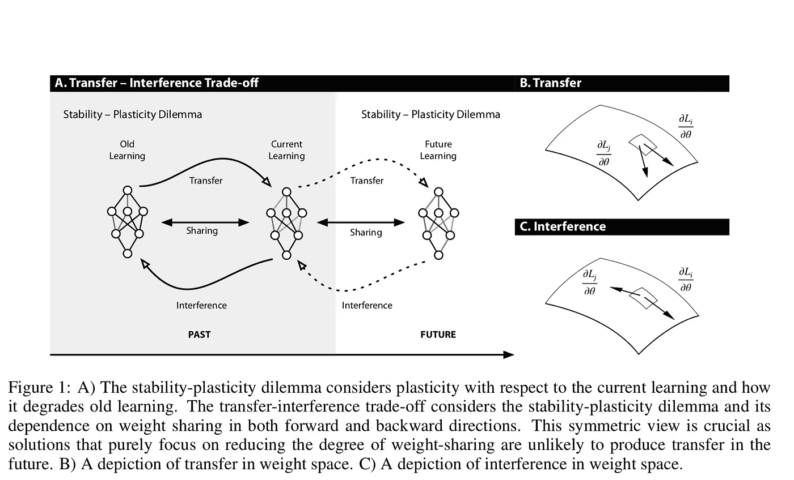

# ICLR 2019:克服有限的数据

> 原文：<https://towardsdatascience.com/iclr-2019-overcoming-limited-data-382cd19db6d2?source=collection_archive---------13----------------------->

## 从几个例子中学习的论文摘要

上周(5/6/19)标志着学习代表国际会议(ICLR)的开始。因此，我想我会深入研究一些我认为最有趣的 ICLR 文件。这些论文中的大多数都与我个人感兴趣的领域相关(无监督学习、元学习、注意力、NLP)，但我选择其中一些只是因为它们在各自领域的高质量和影响力。这第一部分将解决小数据集深度学习领域的突破。第二部分将讨论解决 NLP 和其他类型的序列数据的突破的论文。最后，第三部分将是我觉得有趣的杂七杂八的论文。

# **迁移、元学习和无监督学习**

训练数据有限的问题影响了很多行业，包括医疗保健、农业、汽车、零售、娱乐等。在其他情况下，有很多数据，但是没有注释。由于收集和注释数据的时间/成本过高，这个问题经常成为深度学习集成的障碍。

[**学习无监督学习规则**](https://openreview.net/forum?id=HkNDsiC9KQ) **s**

这篇论文建立在元学习和无监督学习的思想之上。具体来说，该论文提出利用元学习以无监督的方式学习下游任务的有效表示。这篇论文的重点是“半监督”分类，但它特别有趣的是，至少在理论上，学习规则“可以被优化，以生成任何后续任务的表示。”这是有用的，因为在大多数关于表示的无监督学习的工作中，作者定义了特定的训练算法或损失函数。而在这里，模型“*学习【s】*创建由元目标确定的有用表示的算法这些自定义规则通常需要大量的实验和领域知识，因此不容易适应新的领域。这方面的一个例子是使用自动编码器，它通过尝试编码来学习表示，然后解码与原始输出相同的输出。自动编码器通常需要专门的损失函数。

为了准确理解这是如何工作的，回想一下元学习通常有一个内部循环和一个外部循环。在内部循环中，模型处理特定的任务，例如在图像分类中，这可以是识别狗和猫。正常情况下，内部循环将在一定数量的 n 个示例上运行(通常 n 在 1 到 10 之间)。然后，外环将使用来自内环的一些参数(权重本身、累积损失或其他)来执行元更新。这种元更新的细节因模型而异，但它们通常遵循这种方法。

Overview of the meta-learning process.

考虑到这一点，他们模型的架构本质上是元学习一种在创建表示后更新内部模型的方法。此规则在创建表示后更新内部模型时有效地取代了 SGD。此外，无监督更新规则在循环结束时更新，这与 MAML 如何更新权重本身或者在 SNAIL 的情况下更新注意力模型的权重形成对比。这意味着这种无监督学习规则不仅可以应用于类似的任务，还可以应用于全新的任务、新的基础模型，甚至是新的数据形式(例如从图像到文本)。

作者首先通过展示先前方法的问题来评估他们的结果。例如，随着时间的推移，VAE 会遭受目标函数(即损失)不匹配的影响，从而导致性能下降。而原型网络传递特征，因此如果任务之间的特征维度不同，它就开始崩溃。相比之下，因为 Metz 等人的方法学习更新，所以在少数镜头分类任务中，它可以比 VAE 更好地概括。他们还在训练元更新时显示，网络可以概括为改进文本分类，即使它只在图像分类任务上训练(尽管他们确实看到，如果元函数在图像分类任务上训练太长时间，因为它过度适合图像任务，则性能会急剧下降)。

总的来说，这是一篇非常好的论文，也是无监督技术的一大进步。尽管它没有设定任何最先进的结果，但它肯定可以应用于许多数据匮乏的领域。这篇论文的作者代码可以在下面的[链接中找到。](https://github.com/tensorflow/models/tree/master/research/learning_unsupervised_learning)

**通过元学习的无监督学习**

有趣的是，ICLR 今年发表了两篇论文，都提议将元学习和无监督学习结合起来，尽管是以两种完全不同的方式。在本文中，不是使用元学习来学习无监督学习规则，而是使用非监督学习来划分元学习数据集。

这篇论文是我的最爱之一，因为它为没有明确任务描述的元学习打开了大门。元学习的部分问题是，它通常需要非常明确的任务集。这将元学习限制在拥有非常大的带注释的元数据集(已经被划分成不同的子数据集)的领域。这种方法提出将数据集自动划分成不同的子集。作者发现，即使使用简单的无监督聚类算法，如 K-means，元学习者仍然能够从这些任务中学习，并在随后的人类标记的任务中比直接在这些嵌入中学习的方法表现得更好(如无监督学习后进行监督分类的情况)。他们使用的两种元学习技术是质子和 MAML。本文演示了一种有趣的半监督学习形式，其中我们有无监督的预训练，然后是监督学习。在这种情况下，“受监督的”组件正在进行少量的学习。

作者在四个数据集(MNIST、Omniglot、miniImageNet 和 CelebA)上将他们的方法与无监督学习方法进行了比较。最后，他们发现他们的方法比所有其他非监督+监督学习方法都要好，包括聚类匹配、MLP、线性分类器和 KNN。总的来说，这篇论文在使元学习更容易处理各种不同类型的问题，而不仅仅是那些有明确任务划分的问题方面迈出了很好的一步。

[**【潜在嵌入优化元学习】**](https://openreview.net/forum?id=BJgklhAcK7)

本文旨在将基于梯度的元学习与潜在表征网络相结合。LEO 分两步操作:首先它学习模型参数的低维嵌入，然后在模型的低维嵌入空间上执行元学习。具体来说，首先给模型一个带有输入的任务 T，然后输入被传递给编码器。编码器产生一个潜在代码，然后被解码成一组参数。关系网络是这个编码器的一部分，它帮助代码变得依赖于上下文。然后在内环中优化这些参数，而在外环中优化编码器、解码器和关系网。作者指出，他们工作的主要贡献是表明元学习在低维嵌入空间中比在高维空间中工作得更好，如 MAML 使用的空间。LEO 在 tieredImageNet 和 miniImageNet 数据集上都取得了很好的实验结果(包括在 1-shot 5 way 基准上令人印象深刻的 61%的准确率和在 5 shot 5 way 上的 77%)。像许多其他论文一样，它只对图像数据进行测试，所以还不清楚它对其他类型数据的推广效果如何。

[**跨流程转移学习**](https://openreview.net/forum?id=HygBZnRctX)

由于这篇论文的作者已经[发布了一篇关于它如何工作的详细的 Medium](https://medium.com/@flnr/transferring-knowledge-across-learning-processes-f6f63e9e6f46) 文章，所以我不会对技术方面进行过多的描述。在其他元学习论文的大背景下，这篇论文有几个值得强调的部分。首先，它评估了少量学习场景和大量数据场景。这很重要，因为元学习算法通常不考虑元优化在有大量例子时的工作情况，但仍然太少，无法从头训练模型。它还着眼于其他几个尚未探索的领域。具体来说，它解决了“远迁移”这一经常未被充分探索的领域，远迁移是在显著不同的任务之间实现积极的知识转移。

[**学习深度多维聚类的变分自动编码器中的潜在超结构**](https://openreview.net/forum?id=SJgNwi09Km)

本文讨论了使用一种新型的变分自动编码器(VAEs)来更好地聚类高维数据。将项目聚类成不同的组是无监督学习中重要的初步步骤。作者指出，许多类型的数据可以通过其属性的许多不同部分进行聚类。作者指出，“LTVAE 产生多个数据分区，每个分区由一个超级潜在变量给出。”

> LT-VAE 不仅学习每个聚类的位置以最好地表示数据，还学习它们的数量和底层树的层次结构。这是通过三步学习算法实现的。步骤 1 是编码器和解码器神经网络的传统训练，以改善它们对数据的拟合。步骤 2 是类似 EM 的优化，以在学习后验之前更好地拟合潜在的参数。并且步骤 3 调整潜在先验的结构以提高其 BIC 分数[3]，这平衡了潜在后验与潜在先验的参数数量(以及因此的复杂度)的良好拟合。

这种方法的主要优点是，即使总体结果在对数似然性方面不尽如人意，它也能提高聚类的可解释性。此外，基于特定方面进行集群的事实使得它对许多实际应用程序很有吸引力。虽然这篇文章不同于许多其他的论文，并且没有明确地解决少数几次学习的问题，但是我认为它的聚类方法在与少数几次学习方法相结合时会被证明是有用的。例如，它可能被用作“通过元学习设置的无监督学习”中的任务划分

[**通过元学习进行深度在线学习**](https://sites.google.com/berkeley.edu/onlineviameta)

本文关注于使用元学习和一个中国餐馆过程来快速更新在线运行的强化学习模型。这是受到这样一个事实的启发:人类经常面临我们以前没有(确切地)经历过的新情况；然而，我们可以利用过去的经验结合新经验的反馈来快速适应。

作者的方法首先利用 MAML 对模型进行初始训练。在 MAML 给出一个有效的先验后，就出现了在线学习算法的使用。在线学习算法利用中国餐馆过程来产生具有适当初始化的新模型或者选择现有模型。然后使用 SGD 根据结果更新模型参数。作者将这种提议的方法命名为在线学习的元学习(简称为 MoLE)。

作者在几个 RL 环境中评估了他们的方法。第一个环境是模拟猎豹穿越不同难度的斜坡。第二个环境是腿残废的六足履带式机器人。MOLe 优于基于模型的 RL、具有元学习的 k-shot 适应以及具有元学习的连续梯度步骤(尽管有趣的是，它仅略微优于具有 ML 的梯度步骤)。

[**通过最大化迁移和最小化干扰来学会学习而不遗忘**](https://arxiv.org/pdf/1810.11910.pdf)

当神经网络学习一系列任务时，它通常会遇到一个叫做灾难性遗忘的问题。随着灾难性的遗忘，神经网络不再能够很好地执行它之前被训练的任务。灾难性遗忘可以被认为是迁移学习的一个特例，其中存在显著的负向迁移。迁移学习(正如大多数人所说的)和元学习通常寻求在最终任务上最大化正向迁移，但通常不注意对原始任务的影响。本文试图在他们仍然希望进行正迁移的地方取得更多的平衡，但不能以灾难性遗忘(干扰)为代价。

为了解决这个问题，里默尔等人提出了一种称为元体验回放(mer)的方法。MER 利用标准的经验重放，其中过去的训练示例与当前的训练示例交错，以防止灾难性的遗忘。这些过去的例子给出了较低的学习率。其次，MER 采用流行的元学习算法[爬虫](https://openai.com/blog/reptile/)对新数据进行训练。然而，MER 将来自存储缓冲器的先前样本与新进入的样本交织到由爬行动物驱动的内部训练循环中，以防止灾难性的遗忘。

我喜欢这篇论文同时探讨了正迁移和负迁移的观点。它在 Omniglot 和强化学习设置上的结果看起来相当不错。然而，特别是在监督分类设置中，作者只对“玩具”数据集进行测试。他们还应该在 CIFAR-10 benchmark、CALTech-Birds 或 CORRE50 上进行测试。在这一点上，当有许多其他更现实的 CL 数据集时，没有真正的理由只在置换 MNIST 或 Omnigolt 上进行测试。另外。我发现他们的一些术语令人困惑，因为作者“重命名”了几个以前命名的概念。此外，理想情况下，在连续学习的情况下，我们不必对任何先前的数据进行再训练(因为再训练增加了计算成本)。然而，所有这一切都是朝着正确的方向迈出的一步，我希望更多的论文关注正向迁移和反向迁移。关于这篇论文的更多信息，IBM 有一篇[博客文章](https://www.ibm.com/blogs/research/2019/05/meta-experience-replay/)和[代码位于这里](https://github.com/mattriemer/MER)。

[**样本高效自适应文本到语音转换**](https://openreview.net/forum?id=rkzjUoAcFX)

这是元学习在 seq2seq 建模中的一个有趣应用。在这种情况下，作者使用元学习来实现对说话者声音的少量调整。这很重要，因为很多时候你可能没有一百个或一千个特定人声音的例子。具体来说，作者扩展了 WaveNet 架构，以便整合元学习。有趣的是，根据作者的说法，MAML 在他们的初步实验中没有产生有意义的先验。因此，他们不得不开发自己的架构。

该体系结构在三个步骤中起作用:(1)在来自各种说话者的文本说话对的大型语料库上训练模型；(2)在来自单个说话者的几个文本说话对上调整模型；以及(3)最后对纯文本执行推理并将其转换成适当的语音。作者讨论了少镜头学习的两种情况:带有嵌入式编码器的参数化少镜头适应(SEA-ENC)和带有微调的非参数化少镜头适应(SEA-ALL)。在 SEA-ENC 的情况下，作者训练辅助嵌入网络，该网络在给定新数据的情况下预测说话人嵌入向量。相比之下，对于 SEA，所有作者一起训练网络和嵌入。在评估中，SEA-ALL 似乎表现最好，尽管作者指出该模型似乎过度拟合了 SEA-ALL。因此，他们建议使用早期停止。(只有在 10s 范围内，他们的模型优于以前的论文)。

这篇论文是一个很好的例子，它将少量镜头学习应用于典型图像分类领域之外的棘手问题，并为其实际工作进行必要的调整。希望在未来，我们能看到更多将少量学习应用于生成模型的尝试。作者有一个网站，你可以在那里演示他们的 TTS 模型，不幸的是，它似乎不包含他们的实际代码。

## ICLR 大学其他相关论文的简短摘要

[**K 为代价 1:参数高效多任务与迁移学习**](https://openreview.net/pdf?id=BJxvEh0cFQ)

Mudrarkarta 等人介绍了一种模型补丁，它由少量可学习的参数组成，这些参数将专用于每个任务。这种方法代替了微调网络最后一层的常见做法。作者发现，这种方法不仅减少了参数的数量(从 100 多万减少到 35k)，而且提高了迁移和多任务学习环境下的微调精度。唯一的缺点是这个补丁看起来相当特定于架构。

[**距离度量学习的无监督域适应**](https://openreview.net/forum?id=BklhAj09K7)

尽管这篇论文的第一部分标题是“无监督的领域适应”,但它实际上是针对迁移学习的。回想一下，对于域自适应，目标域通常具有相同的标签集。然而，在这种情况下，作者假设一个未标记的目标域。正如一些评论者指出的，由于这个原因，这篇论文令人困惑；然而，它仍然有几个值得带走。作者提出了特征转移网络 FTN，以分离源领域和目标领域的特征空间。作者实现了跨种族人脸识别的艺术表现。

[**学习语法引导程序综合的元解算器**](https://openreview.net/forum?id=Syl8Sn0cK7&noteId=BJlUkwHxeV)

本文讨论了如何应用元学习来合成程序。在这本书里，他们构建了一个语法引导的程序，该程序采用一个逻辑公式和一个语法，然后生成一个程序。这是一个很好的应用元学习的例子，超越了典型的少数镜头图像数据集。

[**深度线性网络中泛化动力学和迁移学习的分析理论**](https://arxiv.org/abs/1809.10374)

本文探讨了学习和迁移学习的理论。作者声明“我们的理论揭示了知识转移敏感地，但可计算地依赖于[信噪比]和成对任务的输入特征排列。”总的来说，这篇论文对那些喜欢钻研理论的人来说很有趣。

# **结论**

我希望这能很好地概述今年 ICLR 大学的大部分少数几个学习论文(尽管我可能错过了一些)。正如你所看到的，有各种有趣的新技术正在开辟在数据受限的情况下使用深度学习的方法。请继续关注我的三部分 ICLR 系列的第二部分，在那里我将讨论 NLP 的进展(包括面向目标的对话)，新的和更好的注意机制，以及一些有趣的新型递归架构。