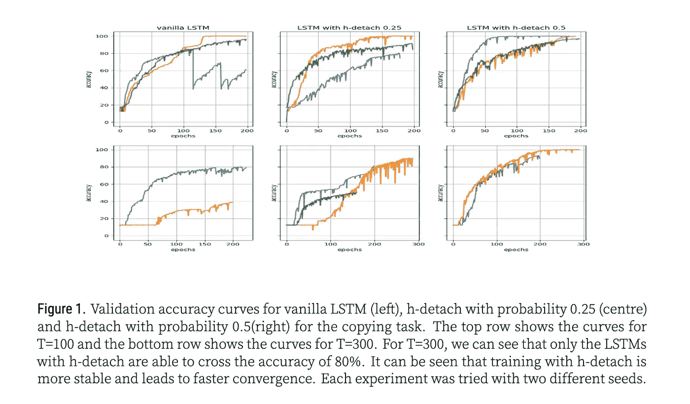

# ICLR 再现性访谈#4: Aniket Didolkar

> 原文：<https://towardsdatascience.com/iclr-reproducibility-interview-4-aniket-didolkar-c0b1c1a15960?source=collection_archive---------28----------------------->

## 再现 h-分离:朝着更好的优化修改 LSTM 梯度

我们对 Aniket Didolkar 的最后采访涵盖了他的工作，再现了一种解决 LSTMs 中爆炸梯度问题的方法。安妮特是 ICLR 再现性挑战中唯一的单独参与者。

继续读下去，看看我们围绕处理长期培训工作的技巧和再现研究时组织的重要性的讨论。

## 采访摘要(TLDR):

*   由于时间限制，Aniket 能够从论文作者那里检索代码库，并重现所有实验，除了一个关于图像字幕任务的实验。
*   对于一个市场来说，再现性意味着拥有关于超参数的细节、调整学习速率、库和包版本、预处理、数据指针等等。以一种有组织的方式与代码库一起工作，并且围绕测试的、失败的超参数有更多的透明度，可以帮助社区更接近可再现性。
*   如果有更多的资源，Aniket 就不必在实例耗尽之前保存所有数据，也不必重复下载数据。他也会用更多的种子进行实验。注意:作者确实指出训练较慢，因为他们是按顺序训练的(通常 PyTorch 和 Tensorflow 并行发送数据)

# 再现性报告详情:

*   原文：<https://openreview.net/pdf?id=ryf7ioRqFX>
*   代号:【https://github.com/dido1998/h-detach 
*   举报:[https://github . com/Dido 1998/iclr _ 2019/blob/master/papers/TeamYakataka-ryf 7 iorqfx/TeamYakataka _ camera _ ready . pdf](https://github.com/dido1998/iclr_2019/blob/master/papers/TeamYakataka-ryf7ioRqFX/TeamYakataka_camera_ready.pdf)
*   PR(包含评论):[https://github . com/reproducibility-challenge/iclr _ 2019/pull/148](https://github.com/reproducibility-challenge/iclr_2019/pull/148)

# 团队成员:

*   **Aniket Didolkar**|[Github](https://github.com/dido1998/)//[Linkedin](https://www.linkedin.com/in/aniket-didolkar-7a9b8912a)//[Twitter](https://twitter.com/dido_ani_1998)

# 面试

*>为便于阅读，本次采访经过编辑*

**Cecelia:** 开球。我很乐意让你介绍一下自己。

是的。我的名字是阿尼基特。我是印度马尼帕尔大学的三年级本科生。我第一次对深度学习感兴趣是在去年的第三个学期，从那时起，我在我的大学里选修了很多课程，并参与了一个与机器人相关的学生项目，我还在一家与 NLP 合作的公司实习。这基本上是我在机器学习方面所做的全部工作。

**Cecelia:** 你是如何发现再现性挑战的？

**Aniket:** 我是在 Quora 上的一个问题回答中发现的。有哪些对 AI 有贡献的好方法？怎么做才能让自己变得更好？我不记得是谁，但答案是来自 Yoshua Bengio 教授接受这个再现性的挑战。

**Cecelia** 你为什么有兴趣参加？

因为我实际上对深度学习非常感兴趣，我想做一个好的项目，我认为再现性将是一个非常好的机会，可以对我所做的论文进行大量深入的学习。有时我在读一篇论文，但我不能完全理解它，但实际上进入并实施它有助于更深入、更好地理解它。

**Cecelia:** 你如何定义再现性？

**Aniket:** 如果作者报道了某些实验，那么这些实验在任何情况下都应该可以被任何人复制。比如这个问题我觉得我发现了很多。每当我工作的时候，特别是强化学习的时候，会有很多论文，但是你真的不能复制结果，我认为这是一个问题。但是我认为再现性挑战是一个伟大的倡议，因为他们有这样的条件，一些实验，你必须再现它们，这对社区真的很好。

**Cecelia:** 对于你试图复制并遇到挑战的论文，你遇到了什么样的问题？

**Aniket:** 举例来说，我在从事强化学习，我们正在研究某些算法，比如 PPO，但我们无法让我们的网络收敛。我们一直在关注报纸，但在某些事情上，他们就是不一致，我们不知道哪里出了问题。我认为最重要的原因之一是没有支持代码。我认为当有代码时，人们很容易在纸上阅读它，并更清楚地理解它。

你认为再现性很重要吗？如果是，为什么？

是的，这很重要，因为研究界不断发表许多新技术和新论文，但他们应该能够将这些应用到现实生活中。有如此多的初创公司正在崛起，行业中有如此多的公司应该能够应用它们，并且许多这些算法应该是可复制的。对其他研究人员来说，在这些算法的基础上进行开发会更容易。

**Cecelia:** 你能描述一下你选择这份报纸的具体原因吗？

**Aniket:** 本文基于 LSTMs。这是一种训练 LSTMs 的新算法，处理 LSTMs 中的爆炸梯度问题。我选择这个的原因是因为我觉得和 LSTM 在一起有点舒服。我以前和他们一起工作过，对此我很有信心。我真的很喜欢这个想法——我认为它很简单，我认为它非常有效，我能够重现结果，所以它非常有效。

作者报告说，当 LSTM 的权重很大时，沿着线性时间路径的梯度得到抑制。这条路径很重要，因为它携带了关于时间依赖性的信息。为了防止这种情况，h-分离块随机地渐变通过 h-状态..

你能描述一下你是如何从头到尾复制这篇论文的吗？

**Aniket:** 基本上，首先我读了论文两三遍，然后我实际上实现了一个较小的版本，我发现它与我之前运行的其他 LSTM 模型相比有点慢，就像通常的 LSTMs 实现是在 PyTorch 或 Tensorflow 中。所以我联系了作者，他们非常友好，给了我他们自己实现的代码库，他们说这很慢，因为他们是按顺序训练的，一般来说，PyTorch 和 Tensorflow 是并行发送数据的。他们这样做是为了确保他们算法的正确性，之后我用了他们的库，因为我可能犯了一些小错误。有了他们的回购，我可以专注于调整超参数和所有。所以我直接使用了他们的回购协议，并进行他们在论文中给出的实验。所以基本上有复制任务，最初给 LSTM 一个特定的数字序列，并要求在特定的时间间隔后复制该序列。有一个连续的 MNIST 任务，其中 MNIST 数据给 LSTM 像素。然后，他们必须进行消融研究，以证明他们的方法与正常的 LSTMs 相比非常有效。事实上，它与另一种称为 c-detach 的算法进行了比较——基本上是分离 lstm 的 c 状态中的梯度，而不是我告诉过你的其他部分。而且，在他们的实验中，他们证明了这真的很有效…有一个实验我没有重现，叫做转移复制任务，因为时间不够。

**Cecelia:** 从开始到结束——从你看报纸到完成这个挑战——你花了多长时间？

**安妮特:**这花了我大约一个半月的时间。主要的瓶颈基本上是网络的培训。对于每个实验来说，大约需要三四天。

好的。你提到你联系了作者，他们实际上给了你这个代码库，这很好。你知道为什么他们一开始没有在论文中包括代码库吗？

我不确定。是啊。他们没有包括它。他们现在可能已经包括它，但是我还没有检查它。当时，他们没有包括它——我不确定，也没有问他们这个问题。

**塞西莉亚:**明白了。你是通过公开评论与作者交流，还是通过某种方式获得了他们的联系方式？

**Aniket:** 我得到了他们的邮件信息，我通过邮件联系了他们。

找到你了。好的，看起来一旦你有了代码库，事情就变得非常简单了，但是在你有代码之前，你在试图复制论文时遇到了哪些挑战？

首先，最初我看了报纸。我对算法有一个相当好的想法，但是我不确定我是否完全正确，所以我不得不从头到尾读两三遍。我想出了一个小的实现方案，并对它进行了测试，结果显示效果不错，但我仍然不确定。就像我告诉你的，真的很慢。他们的实现需要三到四天，但我的实现甚至更慢，所以我有点担心，因为我不确定我是否能完成所有的实验。这也是我联系他们，询问这件事的原因。

**Cecelia** 你将你的实现描述为一个小的实现。你能说得更详细些吗？你说小是什么意思？

**Aniket** 基本上我所做的就是获取一个样本数据集，我只是在 PyTorch 中实现了他们提到的同一个 LSTM 实现，并直接使用了它。

抓到你了。所以你只是从某处获取了一些样本数据。

但是那时我还没有建立一个合适的知识库来记住所有我必须运行的实验。只是试运行。

**Cecelia** 那么当他们给你这个他们工作过的仓库时，里面有什么？这只是一个代码，还是他们也包括他们使用的数据？

**Aniket** 数据是…所以对于复制任务，数据是由代码本身生成的。有了 MNIST，数据可以被下载，下载数据的代码包含在他们的代码中，他们有不同的分支，用于他们独立进行的实验。这相当简单——我克隆了它，它马上就运行了。我不需要做任何改变。

**Cecelia** 明白了。好在它是可运行的代码。当您最初运行这些实验时，需要三到四天的时间才能完全运行。你最初用什么做实验？

最初，我是在 Google Colab 上运行它们的。

好的，他们使用了什么样的环境？

T21:代码是用 PyTorch 写的，我用起来很舒服。测试代码也在 PyTorch 中。我不确定他们用的是哪种 GPU，但我用的是 Colab。我有一段时间可以在中间使用 GTX 1060，那段时间我使用它，但大多数时候，我使用 Colab。

明白了。你也是…实验一开始进行得很慢，但你会说当你试图复制论文时，你面临着计算极限吗？

是的。例如，主要的事情是它花了三天运行。因此，在一次实验中，Google Colab 只运行了十二个小时。所以我不得不不断重启，保存所有东西，一次又一次地下载数据，这是主要的限制。

**塞西莉亚:**明白了。这真是令人沮丧。如果你有更多的时间或资源，你会做些什么不同的事情呢？

**Aniket:** 如果我有更多的资源……目前我可以进行实验，但是我只进行了两个种子的实验，而作者报告了许多种子的结果。如果有更多的资源，我会这么做。我会用更多的种子来测试算法。有一个实验(围绕图像字幕任务)我没有重复，如果我有更多的时间，我会做这个实验。

这篇论文的作者似乎很容易接受。

他们非常支持我。我甚至对算法本身和论文中的概念有些怀疑，我只是给他们发了电子邮件，他们给了我一个回复，并对其进行了适当的解释。

**Cecelia:** 你能解释一下为什么吗，因为其他一些参加挑战的人在 Open Review 上发帖，他们找不到作者的电子邮件。那么，如果你找不到所有这些电子邮件，你会如何尝试与他们沟通？你会在公开评论上提问吗？

**Aniket:** 我在公开评论上提问时会更加小心。我会试着自己弄清楚，因为这是一个公共论坛，但我很容易就获得了电子邮件 ID，我认为给他们发电子邮件会很容易。

**Cecelia: H** 完成挑战后，你描述了你之前对再现性的看法，挑战改变了你对机器学习研究的看法吗？

**Aniket:** 不，没变。我希望机器学习研究朝着我们不断发表论文的方向发展，但我想改变的一点是，每篇论文都应该发布一些代码，以便向人们提供如何使用论文中算法的基本想法。

所以要复制一个实验，你认为代码是必要的吗？

T21:是的，我认为代码或者甚至每篇论文都应该有一个部分来解释他们的方法和一切是如何工作的。

完成挑战后，你会如何以不同的方式对待自己的工作？

是的，我认为完成这个挑战后，我会做的不同的是，每当我开始做某事时，我会尝试首先创建一个存储库，组织它，并从项目开始到结束保持它的组织性。所以这是我从做这个项目中学到的一件事——以一种更有组织的方式使用你的代码库。

**Cecelia:** 那么如果你现在就开始建立一个存储库或者推荐一个存储库结构，那么这个存储库中会包括什么呢？

**Aniket:** 所以基本上不同的分支都有我要报告的每个实验的代码。无论我的算法需要什么数据，指针都应该有数据和下载方法，以及数据需要的任何预处理。我认为任何 NLP 项目的代码库都应该有预处理步骤。

你认为如果你与多人合作，或者如果你有一个团队，你的体验会有所不同吗？

如果我们有一个小组，我们可以做更多的实验，但这是唯一的事情:我们可以做更多的实验。但除此之外，我不认为会有任何不同。

**Cecelia:** 你认为什么将有助于使机器学习研究更具可重复性，并且接下来——可以说是框架第一个问题——你认为研究人员今天在使他们的工作可重复性方面面临的挑战是什么？

我认为在机器学习方面有很多事情需要收敛:这些小的超参数会产生很大的影响，你如何调整学习速率等等。所以我认为这是再现性的主要障碍之一。有时候代码库——我也遇到过这种情况，我见过一些人——是如此的混乱，以至于他们实际上并没有发布它。其次，有很多东西你必须从外面进口，你必须使用不同的软件。这对于开源代码来说可能是不可行的。包含如何运行它的文档会非常冗长。有时运行任何一段代码都会发生这种情况，这取决于你使用的软件和不同的版本。报告所有这些有时会非常冗长，这就是人们不开源代码的原因。

**Cecelia:** 你描述了几个不同的挑战——围绕所有超参数、外部导入的事情，就像所有这些细微差别一样——你会将这些细节视为代码的一部分还是代码的外部？

我认为，有时当人们展示他们的结果时，他们只会展示某一组超参数，而不会谈论他们尝试过但失败了的其他超参数。对于我的论文，作者尝试的超参数在同行评审网站上，而不是在论文或代码库中。当我开始复制这篇论文时，评论还没有公开，随着时间的推移，它们堆积了起来。

**Cecelia:** 对，所以最初的讨论很有帮助。你认为有什么工具或最佳实践可以让这个过程变得更容易、更好吗？

**Aniket:** 我不认为有固定的最佳实践，但这一倡议，可再现性挑战，可以在每个会议上进行，而不仅仅是在 ICLR，进行适当的审查应该是所有主要会议都可以采用的实践。

你认为机器学习的某些领域比其他领域更容易重现吗？

从我的经验来看，我认为每当我从事 NLP 或计算机视觉之类的工作并完成某篇论文时，我都能够重现它，但当我从事强化学习时，我会遇到很多问题。

你认为这是为什么？

我不确定实际上是什么，但确实是个东西。我没有答案。我不是很确定，但是我观察了很多次。我认为这可能是由于 RL 算法难以理解，但如果提供支持代码，就更容易理解这篇论文。此外，有时在一种环境下运行良好的算法在其他环境下并不运行良好。因此，我认为研究社区专注于构建 RL 算法非常重要，这些算法可以在不同的环境中进行归纳并给出一致的结果。

> 有兴趣了解更多关于再现性挑战的信息吗？点击阅读我们的开篇文章

## 想了解 Comet 如何帮助你跟踪、比较、解释和重现你的机器学习实验吗？[了解更多](http://bit.ly/2vP424C)。