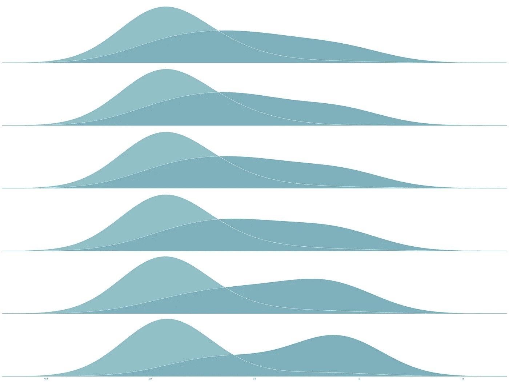
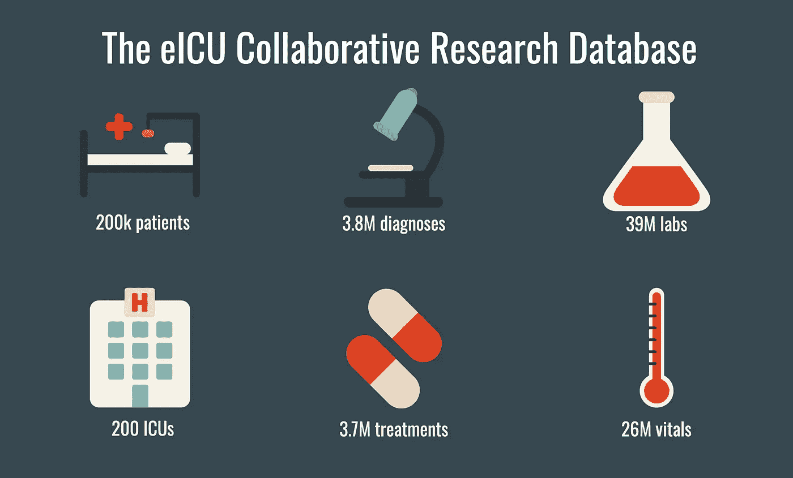
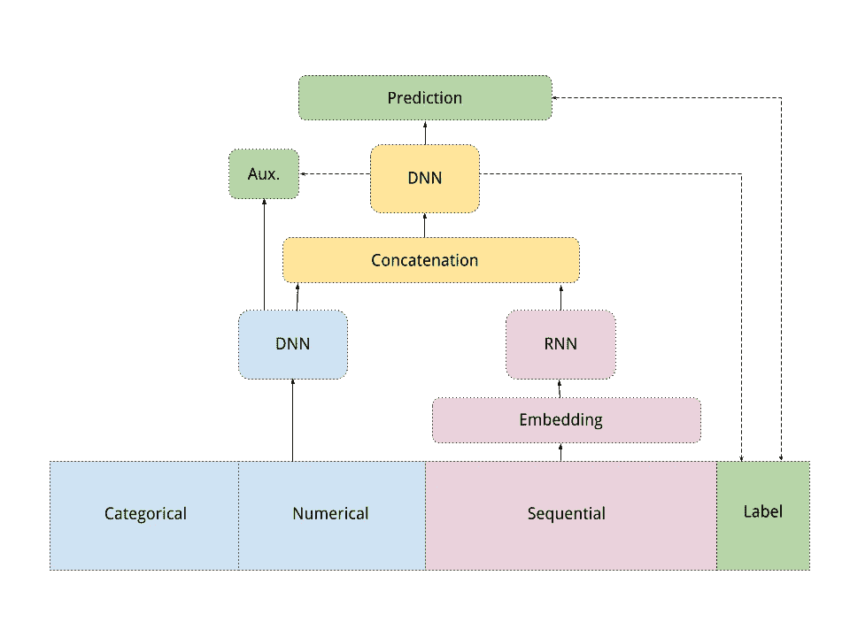
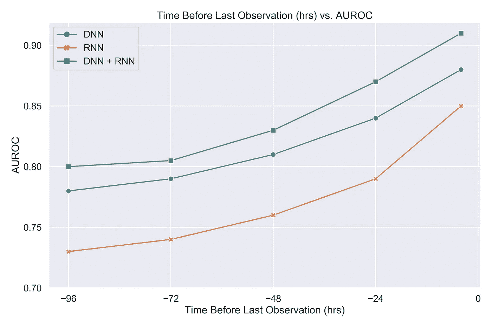
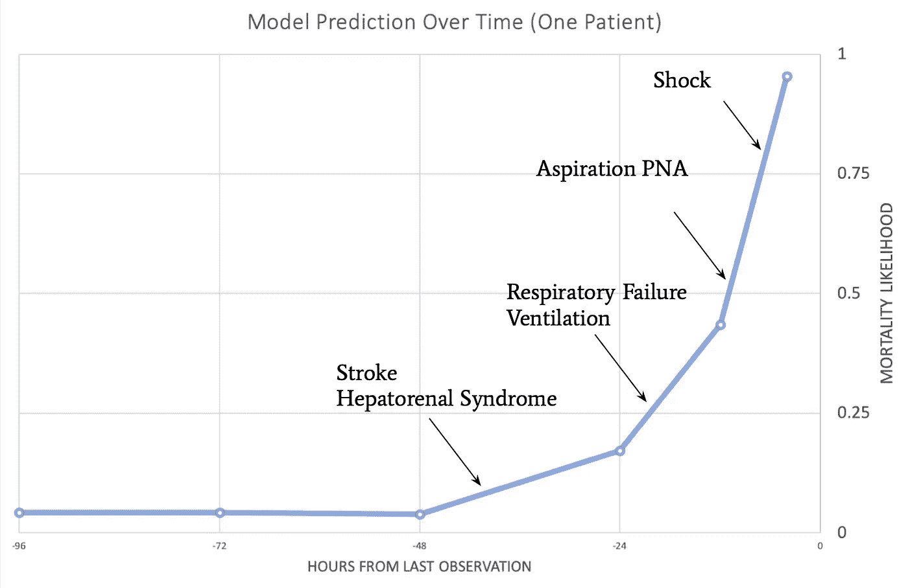
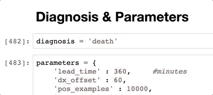
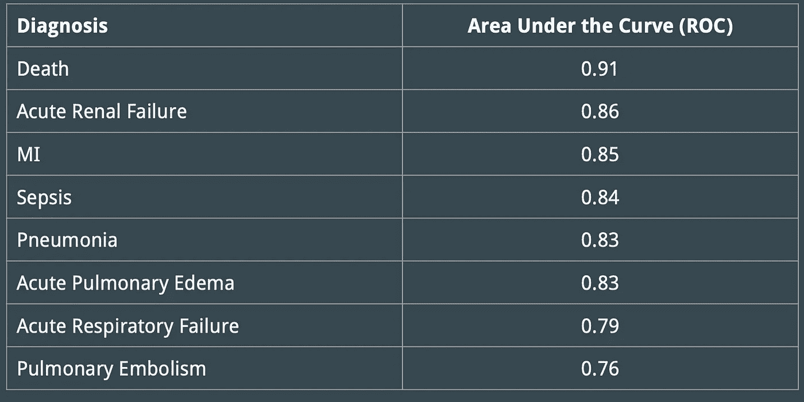

# 深度预后:预测 ICU 的死亡率

> 原文：<https://towardsdatascience.com/icu-mortality-5d0e80539b9e?source=collection_archive---------31----------------------->

在医学院，我们学习识别实验室异常，它们的原因和治疗。当观察到患者的血钾为 5.5 毫摩尔/升时，医生可以迅速确定罪魁祸首(如肾衰竭、急性肾损伤、ACE 抑制剂诱导等)。)根据患者的病史和表现。

对提供者来说，更困难的问题是:这位患者的高钾血症究竟如何影响她未来的健康结果？如果病人的钾是 5.2 而不是 5.5 mmol/L 会怎样？如果她的血钾在 3 天内而不是 5 天内从基线水平上升会怎样？如果她有慢性肾病病史呢？此外，病人“问题清单”上和她过去病史中的所有其他项目如何影响她的结果分布？如果它们的相互作用不仅仅是相加的呢？我们有希望理解成百上千个因素之间的相互作用吗？这些因素决定了一个病人的结果。

如果我们希望成功，我们应该关注复杂的患者，他们可能提供最大的洞察力和机会。重症监护室(ICU)里的病人是医院里最复杂的病人。在我用于这个项目的数据集中，仅在 ICU 时，平均每个病人就被赋予 13 个独特的 ICD-9 诊断代码。这些患者在医院中死亡率最高:美国每年有 400 万 ICU 入院，其中约 50 万导致死亡。他们的护理是最昂贵的:使用包括机械通气、透析和输液在内的强化治疗，住在 ICU 每天的费用可能超过 10，000 美元。对于这个项目来说，最重要的是，这些患者产生了大量的数据——生命体征、实验室结果、干预措施、进度记录等。

有可能用这些丰富的数据来预测这些患者的存活率吗？

这种模型将能够回答上述难题。此外，它将提供一个单一的指标，病人的敏锐度，可以很容易地解释由大型和各种医院团队。它将提供客观的信息，有助于提供者、患者和家属之间的临终讨论。重要的是，该工具可以保持灵活性，以便它可以预测死亡以外的事件。

# 数据:预处理和特征工程

Overview of the Data

我在这个项目中使用了 eICU 合作研究数据库。由麻省理工学院管理，由 Physionet 发行，它是公开的，在访问之前只需要 HIPAA。它是在两年多的时间里(2014 年和 2015 年)从美国各地的 ICU 收集的，包含了超过 200，000 名 ICU 住院患者的大量数据。在这些住院病人中，超过 10，000 人的住院导致了死亡。

**数据预处理**

首先，将 16 岁以下的患者和在 ICU 停留不到 7 小时的患者从数据集中剔除。

每种类型的数据集都需要不同的清理步骤:诊断、治疗、既往病史、周期性生命体征、非周期性生命体征和实验室结果。每一个都是根据需要独立加载和预处理的。

为了训练该模型，需要识别阳性和阴性患者，并且需要保存这些事件的时间点以用于以后的特征提取。因为我选择保持模型的灵活性，所以需要不同的标注算法来识别数据集中的死亡率和其他事件。在死亡率预测的情况下，所有过期的患者被识别，并且该患者的最后事件(治疗或诊断)被用作时间戳。在诊断的情况下，仅选择在入院后三个小时以上收到该诊断的患者，并将该诊断的第一个实例用作时间戳。

**特色工程**

在选择阳性和阴性患者后，为所有这些例子生成特征向量。我使用了三类数据——分类数据、数字数据和序列数据。

分类特征包括种族、性别、入院单位等。这些是一次性编码的。

数字特征代表了特征工程工作的大部分，包括生命体征、实验室结果和静态值，如入院体重。我在这里创造了 66 个特征，运用了我的医学教育。例如，一个特征是血尿素氮(BUN)与血清肌酸酐的比率，其用于指示急性肾损伤的位置。对于每个特征，最大值、最小值或平均值是在三个窗口之一上计算的，即“当前时刻”(即预测时间点)之前的 4 小时窗口，从入院到当前时刻的窗口，或持续入院前六个小时的基线窗口。其他特征，如尿素氮与肌酐的比率、肌酐相对于基线的变化或动脉与吸入氧的比率(PF 比率)都是从这些第一特征中计算出来的。这些特征允许有缺失值，尽管缺失最大数量特征的 10%的示例被移除。剩余的缺失值将替换为特征平均值并进行缩放。

最后，顺序特征包括过去的病史诊断(以英语给出)、直到当前时刻在 ICU 中给出的诊断(以英语和 ICD-9 代码给出)以及直到当前时刻的治疗和诊断干预。在将所有过去的病史诊断翻译成通用语言 ICD-9 代码后，所有这些事件都按时间戳排列——按照它们实际发生的顺序。

# 多模态深度学习模型

A flexible, multimodal model for predicting diagnoses or survival from ICU data.

我选择按顺序对每个病人进行诊断和治疗，以保留我认为重要的临床模式。例如，一个有恶性肿瘤病史的病人，现在有单侧腿部肿胀，相对来说很可能被诊断为肺栓塞。

我需要一个尊重顺序信息的模型架构，所以我使用了一个长短期记忆(LSTM)网络，它有一个双向包装器和 32 个单元。我还希望模型能够学习每个诊断和治疗的表示，所以我使用了一个包含 32 个元素向量的嵌入层，模型在训练时会学习这些向量。

使用三个 16 单元隐藏层，如通过超参数调谐所确定的，RNN 实现了 0.85 的 ROC 曲线下面积(AUROC)。

接下来，我只对分类数据和数字数据训练了一个 DNN。三个隐藏层各有 32 个单元，每层之间有 50%的压差，在这里效果最好，经过特征选择和工程设计，DNN 达到了 0.87 的 AUROC。

为了将两个模型结合起来，我去掉了每个模型的最后一层，并将输出连接起来。该层用作 3 层 64 单元 DNN 的输入。来自分类/数字 DNN 的附加辅助输出确保网络的一部分学习对最终任务有用的表示。那么复合模型表现如何呢？

# **结果**

在最后的时间点，复合材料模型达到了 0.91 的最先进的 AUROC。但是，即使距离最后一次观察还有几天，该模型也表现良好——可靠地识别出预后最差的患者。

At every timepoint, the composite model performs best. Even days out, the model performs well.

如果我们观察一段时间内单个患者预测的例子，我们可以看到模型如何对新信息做出反应:

The model recognizes a patient’s worsening clinical picture.

随着患者的临床状况随着一系列不吉利的事件(中风、呼吸衰竭、肺炎、休克)而恶化，该模型正确地提升了其输出，表明分数可以被视为严重性指数。

查看模型已经学习的嵌入的第一个主要组件的表示，我们看到一个有趣的模式:

升压药在最右边——去甲肾上腺素，血管加压素，去氧肾上腺素。机械通风也在那里。这是有道理的，因为血液动力学不稳定和通气应该是预后不良的标志。

但是如上所述，我希望模型保持灵活性——这样新的模型就可以通过改变诊断来训练。

Training a new model is as easy as changing one input.

我包括了各种各样的特征——肾、肺、肝和心血管——因此该模型在其他诊断中表现良好。

The model performs well across a variety of diagnoses.

# 结论

总之，我为提供商、医院和保险公司建立了一个多模态、灵活的深度学习模型和工具，它不仅可以为患者的严重程度和死亡可能性提供单一指标，还可以预测其他事件。

我在这个项目中获得了很多乐趣。感谢阅读！