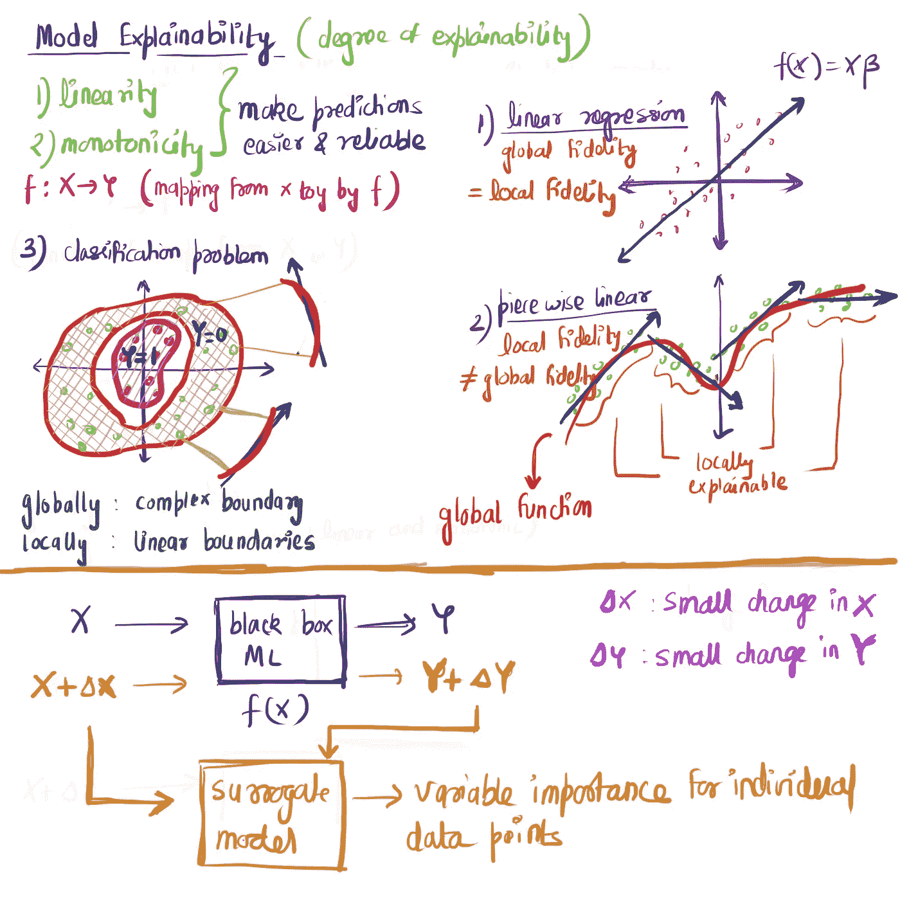
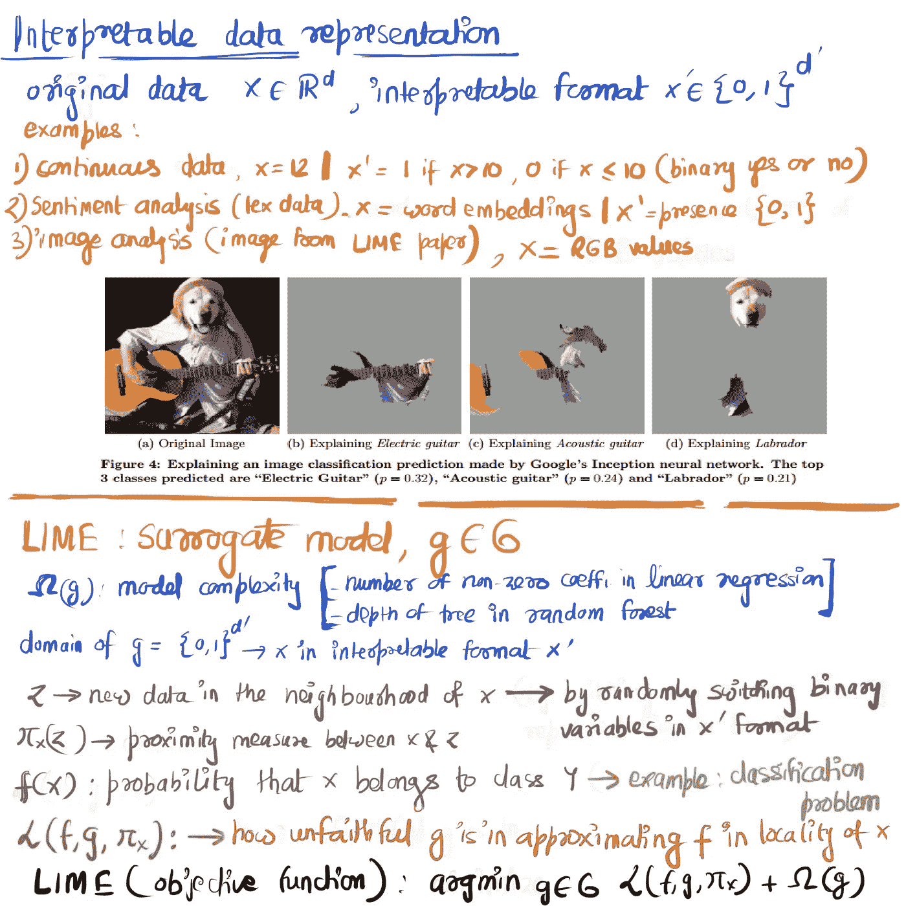
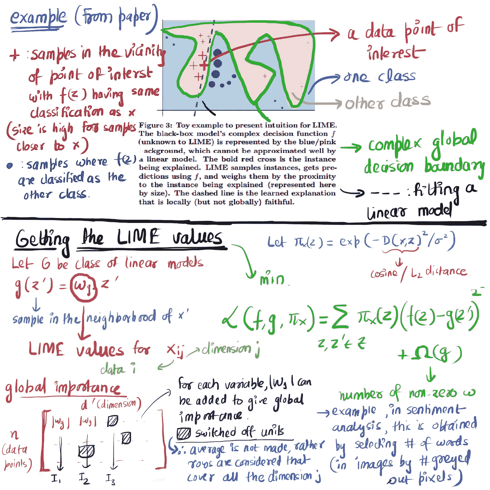
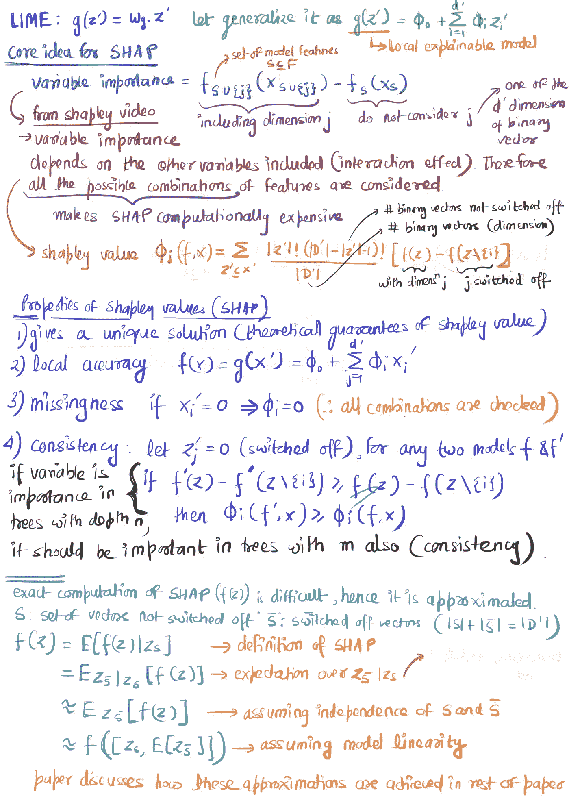

# 莱姆和 SHAP 背后的想法

> 原文：<https://towardsdatascience.com/idea-behind-lime-and-shap-b603d35d34eb?source=collection_archive---------2----------------------->

## ML 解释模型背后的直觉

在机器学习中，在模型复杂性和模型性能之间存在权衡。复杂的机器学习模型，如深度学习(其性能优于线性回归等可解释模型)，已被视为黑盒。Ribiero 等人(2016 年)题为“**我为什么应该相信你”**的研究论文恰如其分地用 ML 黑箱概括了这个问题。模型可解释性是一个不断发展的研究领域。请在此阅读[了解机器可解释性的重要性。这篇博客讨论了**石灰**和 **SHAP** 背后的 ***理念*** 。](/human-interpretable-machine-learning-part-1-the-need-and-importance-of-model-interpretation-2ed758f5f476)

这个博客不是关于如何使用/编码/解释莱姆或 SHAP 的(这方面有很多好的资源)。这些资源显示了如何单独使用给定自变量的石灰和 SHAP 值*(一个数据点的一个变量对应一个石灰/SHAP 值*)。这个博客是关于理解 ***我们是如何得到这些值的，以及我们在使用石灰和 SHAP 库*** *时实际在做什么。*先跳石灰再跳 SHAP，几个引物比较好理解。**

## ***本地与全球可解释性***

*在线性回归模型中， *Beta* 系数解释所有数据点的预测(如果变量值增加 1，则每个数据点的预测增加 *Beta* )。这是全球保真。在因果分析中，它被称为“平均”因果分析。但是，这并不能解释个体差异(异质性)。一个变量对一个用户的影响可能不同于另一个用户。这就是局部保真度(对独立变量联合分布的单个数据点或局部子部分的解释)。局部函数解释(预期的)可能比全局解释更准确，因为在局部区域，函数(更高的概率)是线性和单调的。甚至局部区域也可能是高度非线性的，并且局部可解释性将失败——这些方法的限制。(**这也是平滑度假设的一部分——没有平滑度假设，很多情况下都无法实现，因为很多优化模型都会失败**)。莱姆和 SHAP 探索并使用局部可解释性的属性来构建黑盒机器学习模型的代理模型，以提供可解释性。图 1 中的几个例子。*

**

*Figure 1\. Global vs Local and Surrogate model*

## *代理模型*

*莱姆和 SHAP 是代理模型(图 1)。这意味着他们仍然使用黑盒机器学习模型。他们**稍微调整**输入*(就像我们在敏感度测试中做的那样)并测试预测中的**变化。这种调整必须很小，以便它仍然接近原始数据点(或在局部区域中)。莱姆和 SHAP 模型是替代模型，用于模拟预测中的变化(根据输入的变化)。例如，如果通过调整变量的值，模型预测没有太大变化，则该特定数据点的变量可能不是重要的预测值。因为代理模型仍然将 ML 模型视为黑盒，所以这些模型是 ***模型不可知的*** 。****

## **可解释的数据表示**

**必须将数据点转换成一种更易于构建代理模型的格式(在原始数据点附近采样数据点)。这种表示被称为可解释的(在 LIME paper 中)，因为它是人类可以理解的(它将数据转换为二进制)。如图 2 所示，x: *d 维数据*转换为***x:******d '-维*** 二进制矢量数据用于其可解释性表示。图 2 给出了一些例子。图 2 还展示了 LIME 如何在代理模型中使用可解释的数据格式来提高可解释性。目标(粗略地)是最小化 x 和它的邻居之间的响应(预测)差异。**

****

**Figure 2\. Interpretable data format and LIME as a surrogate model**

## **石灰**

**现在我们有了了解石灰的背景。如果我们选择一个点 x，我们可以通过关闭一些二进制维度(来自 x’)表示(通过邻近度测量加权)来围绕 x 绘制*个样本(z’)*。一旦我们得到了样本，从 z '中恢复一个变量 z。比如 **(1)** 设 f(z)是检测一个句子是否可恶的深度学习模型。我们的数据集包含句子。 **(2)** 如果我们考虑一个数据点(一个句子 x)，我们先把它转换成 x’(单词有无)的格式。 **(3)** 从 x’开始，我们在 x’的邻域周围采样 z’(通过均匀地关闭一些二元向量)。 **(4)** 这些样本转换成 z(句子恢复)。在 z 中，有些单词可能不存在。 **(5)** 用 z 作为输入，得到值 f(z)。图 3 显示了一个采样示例。它还包括什么是单个数据点(和每个变量)的 LIME " ***值* "** 以及我们如何获得它。它展示了我们如何从一个变量的局部重要性(可解释性)得到全局重要性。粗略地说，这意味着将局部权重相加，从而最大限度地覆盖关闭的维度(**当我们穿过 SHAP** 时，记住这一点很有用)。*如前所述，有很多好的资源告诉我们如何使用(或解释)这些价值观，所以本博客不会涉及这些内容*。**

****

**Figure 3\. Example of sampling in the neighborhood of a data point x and Getting the LIME values**

## **石灰的缺点**

**虽然 LIME 具有可加性(单个影响的总和等于总影响)这一理想属性，但它在缺乏稳定性、一致性(如果变量的贡献增加或保持不变，改变模型不会减少变量的属性)和缺失(缺失变量的属性应为 0)方面受到了一些批评。所有这三个属性都由 SHAP 实现(因此更常用)。还有，LIME 需要定义“本地”。**

## **SHAP**

**SHAP 值使用与石灰相似的概念。SHAP 基于沙普利值的博弈论概念提供了理论保证。**请看** [***这段***](https://www.youtube.com/watch?v=w9O0fkfMkx0) **关于 Shapley value 的短视频阅读前进一步了解 SHAP。**Shapley 值的理论背景也可以看[这个](https://www.youtube.com/watch?v=qcLZMYPdpH4)。**

**SHAP 代表上海、应用、T2 和 T4。“添加剂”是一个重要的关键术语。像石灰一样，SHAP 具有加性属性。一个数据点的所有变量的 SHAP 值之和等于最终预测值。如图 4 所示，只要记住石灰，就可以理解 SHAP。图 4 显示了 SHAP 值是如何计算的。在 SHAP，我们不需要建立一个局部模型(像 LIME 中的线性回归)，而是使用相同的函数 f(x)来计算每个维度的 shapley 值。**

****

**Figure 4\. SHAP calculation**

**Shapley 值保证每个变量的公平分配(LIME 不提供这种保证)。莱姆假设局部模型是线性的，SHAP 没有任何这样的假设。SHAP 值计算非常耗时(因为它检查所有可能的组合:它通过蒙特卡罗模拟而不是蛮力来完成)。SHAP 值是**而不是**有和没有变量的预测之间的差，而是变量对实际预测和平均预测之间的差的贡献。通过将每个单独数据点的 SHAP 值的绝对值相加，给出了全局级别的变量重要性。虽然 SHAP 使用了所有的变量，但如果我们想减少变量的数量，我们可以选择一些变量重要性更高的变量，丢弃其他变量并重新运行 SHAP(*因为像一致性这样的属性，变量重要性的顺序不会改变，所以不太重要的变量可以忽略*)。**

## **最后的话**

**我希望我们在莱姆和 SHAP 所做的事情的背景更加清晰。两者都是模型不可知的，并且该库可用于标准的机器学习模型。由于其理论保证和简单性，SHAP 被广泛使用，也许更容易接受[6]。现在，我们需要定义我们是如何看待一个“邻居”的。此外，我们构建了一个*线性局部模型，它在一个非常复杂的决策面*中可能不是线性的(甚至在局部级别)。在 SHAP，我们可以使用使用训练数据训练的相同模型。**

## **参考**

**这篇博客摘自里贝罗等人的论文
【1】[莱姆](https://www.kdd.org/kdd2016/papers/files/rfp0573-ribeiroA.pdf)
【2】[SHAP](https://papers.nips.cc/paper/7062-a-unified-approach-to-interpreting-model-predictions.pdf)伦德伯格和李**

**以下与本博客一脉相承，从较低层次解释石灰与 SHAP:
【3】[石灰前必读](https://christophm.github.io/interpretable-ml-book/shapley.html)
【4】[SHAP 前必读](https://medium.com/@gabrieltseng/interpreting-complex-models-with-shap-values-1c187db6ec83)
【5】[关于石灰的中等博客](/understanding-model-predictions-with-lime-a582fdff3a3b)由 Lar**

**关于我们为什么要考虑可解释性的其他来源:
【6】[H20 视频](https://www.youtube.com/watch?v=Q8rTrmqUQsU&t=1s)
【7】[Scott Lundberg 的博客](/interpretable-machine-learning-with-xgboost-9ec80d148d27)
【8】[白盒 vs 黑盒](/machine-learning-interpretability-techniques-662c723454f3)**

**这个博客不是关于如何使用莱姆和 SHAP 图书馆或者如何解释他们的结果。你可以在以下网址找到如何使用它们:米格尔的
【9】[中型博客](/how-to-avoid-the-machine-learning-blackbox-with-shap-da567fc64a8b)
【0】[中型博客](https://medium.com/civis-analytics/demystifying-black-box-models-with-shap-value-analysis-3e20b536fc80)**