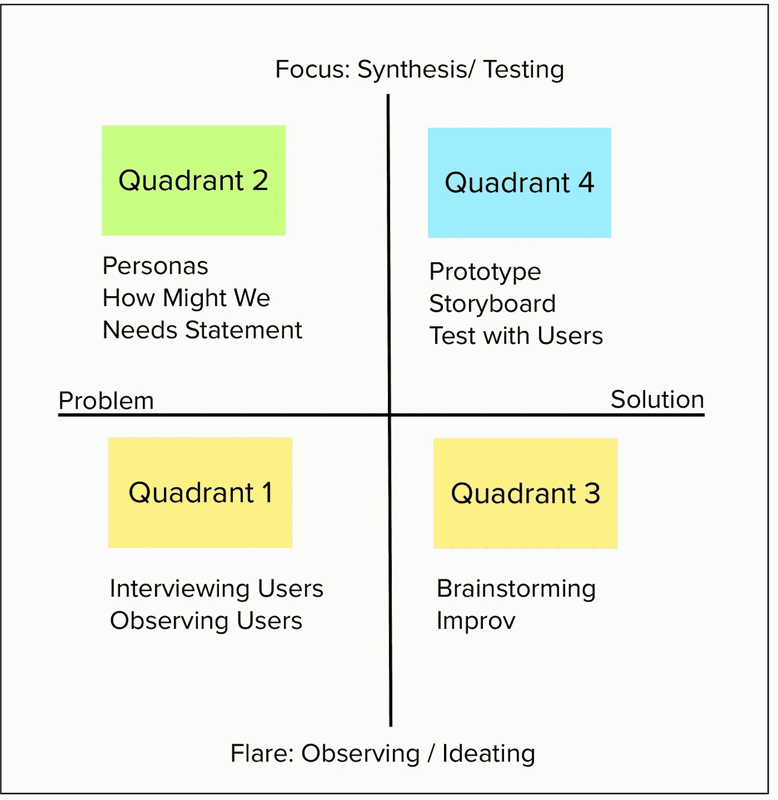
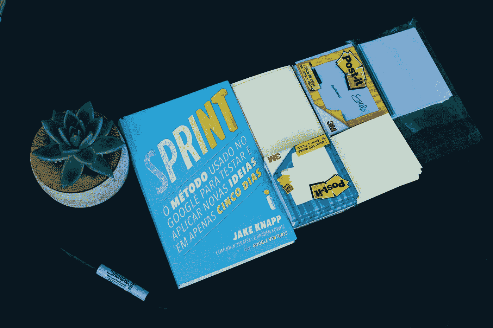

# 想法:数据冲刺的设计方法

> 原文：<https://towardsdatascience.com/ideas-design-methodologies-for-data-sprints-9d10a32090e4?source=collection_archive---------17----------------------->

Photo by [William Iven](https://unsplash.com/@firmbee?utm_source=medium&utm_medium=referral) on [Unsplash](https://unsplash.com?utm_source=medium&utm_medium=referral)

我最近在一个研究实验室呆了四天，与一群数据科学家和一些行为科学家一起深入一个庞大而杂乱的数据集，看看我们是否能找到与群体动力学相关的见解。它被设计为一个初步的潜水，四处看看，对有用的研究见解的潜力进行初步评估，然后根据那周的发现建立一个两到三个月的工作提案。

理论上，我是以行为科学家的身份参加的，但由于我也痴迷于创造性的问题解决过程，或设计思维(我非常固执己见)，以下是对我们使用的过程的一些反思和下一步的想法。

大量的过程方法论占据了软件开发、数据分析和创造性问题解决学科之间重叠的空间:UX、设计思维、思考错误、谷歌设计冲刺、敏捷、看板、用于小组冲刺的新兴数据分析方法等。这很棒，因为如果你很好奇，你可以获得一个相当大的工具集，让一群人聚在一起，在不同的时间内对各种不同类型的问题进行创新——从两个小时的会议到 18 个月的项目。挑战，或者说作为一个主持人对实践的掌握，不仅仅是学习方法论或练习本身的术语，而是学习群体动力学、创造力、心理学和神经科学背后的潜在科学。

在这次研讨会期间，我们有两种不同类型的专业人员在房间里——社会科学和数据科学，每一种在这些分组中都有互补的技能组合。它们对数据集来说都是全新的，当我们第一次看它时，它相当混乱。sprint 赞助商的指导非常广泛，在为期三天的 sprint 中，我们可以了解到这些员工对团队动力的总体认识。

不幸的是，直到第二天下午，我们才清楚地确定了什么样的见解最有用的方向。在那一点上，社会科学组分开来头脑风暴一系列不同的问题，可以问关于群体动力学，以及哪些理论和研究问题正在成为该领域特别感兴趣的问题。除了确保整个团队对研讨会的方向有一个清晰的想法，以及关于团队动力的什么问题主题是最有用的(即小型工作团队的表现，团队组成随时间的变化，在聚集在一起的人群中寻找模式，等等)我们也需要设计约束，但是没有识别它们。介绍设计思维使用一般的文氏图来说明设计必须成功满足的标准，以获得资金/努力开发高保真解决方案的许可。各公司制定了自己的特定标准，这些标准通常属于这些范畴。在没有确定我们自己的情况下，团队依靠聚集在房间里的人的专业知识和直觉。不错——每个人都非常聪明，非常了解自己的领域；但如果你想最大限度地利用资源来理解最重要/最有影响力的问题，这并不太好。

via Legacy Innova

在前两天，我们的主持人采用了 UX 和设计思维练习——人物角色和需求陈述。他们的目的是让小组确定具体的问题，然后由整个团队投票决定。第三天，几个小组被分开，每个小组回答一两个可能会被问到的数据问题。通常，人物角色和需求陈述是一种非常可靠的方法；他们在各种情况下工作。但是在这个冲刺阶段，许多人发现当他们被告知要寻找关于群体动态的洞察力，而不是个人角色时，他们感到沮丧。

人物角色方法的第一个挑战是，它们被设计为与深思熟虑的思维模式或系统 2(从*快速思考和慢速思考*)一起使用，该系统 2 获取各种各样的、看似不相关的信息——通常是定性的人种学——并将其综合以得出一些详细的需求陈述。由于事先没有关于数据集中的人的信息，我们只能查看原始数据的电子表格，并将卡通人物虚构为角色。整个团队勇敢地去做，并试图利用它，但时间可以更好地利用。

关于选择人物角色方法的第二个挑战是，它们应该在设计过程中使用，而设计过程的结果是为原型个体服务的产品或服务。人物角色的问题和解决方案——解决人物角色的需求——之间有关系。对于本次研讨会，我们的团队并不打算生产产品或服务，而是交付见解。而不是人物角色，我们应该探索和绘制群体动力学的复杂概念的空间。

在这个工作坊中，一些设计思维/ UX 方法的笨拙使用和对其他方法的拒绝是完全可以理解的。随着设计冲刺成为一种受欢迎的、合理的工具，让企业将多学科团队聚集在一起，开发新颖的概念和产品，设计和软件开发方法的广阔空间已经进入了一个陌生的领域——数据分析。虽然我对评论设计方法很有经验，但数据科学对我来说还是一个新领域。根据我所做的文献综述，以及分析团队有限的商业经验，似乎他们自己也在纠结什么方法最适合群体数据冲刺。传统上，分析是单独进行的，或者并排进行，不需要更正式的团队流程。三种力量正在推动数据科学家开发群体分析方法:数据科学领域随着专业化和工具数量的不断增加而分成两个部分，数据量呈指数级增长，数据科学正在向以前使用几乎无处不在的定性方法和工具进行分析的学科蔓延，因此多学科团队正在成为常态。在过去的五到七年里，有几篇学术文章和博客描述了群体数据分析过程。

*   [关于管理数据科学团队工作流的思考](https://medium.com/@HarlanH/thoughts-on-managing-data-science-team-workstreams-and-a-shiny-app-f2b25549946f) : Medium 文章更多地介绍了数据科学团队如何在多年的开发、研究、工程和服务中分配工作，而不是针对特定分析问题或冲刺的流程。
*   [管理科技行业数据科学项目的方法](/data-science-agile-cycles-my-method-for-managing-data-science-projects-in-the-hi-tech-industry-b289e8a72818):关于将敏捷的核心价值观应用于研究方法的中间文章。
*   [敏捷、商业智能和数据科学的回顾和未来方向](https://www.sciencedirect.com/science/article/pii/S026840121630233X) : 2016 年学术文章，讨论敏捷原则和实践以及数据科学实践如何作为商业智能的一部分发展
*   [走向运营环境中视觉分析的设计原则](https://dl.acm.org/citation.cfm?id=3173712):尽管只针对视觉分析、vice statistics 和机器学习数据科学，但加州理工学院 2018 年的这篇文章为他们开发视觉分析的研究过程提供了一个有用的视角。

我的博士研究包括开发一个联合设计过程，利用 3D 数据可视化软件来分析一个复杂的概念——幸福。我一直在思考我们如何让团队一起调查和交流复杂的概念，团队和个人的早期工作需要发现，以便最终做政策，服务和产品设计。试图理解复杂的系统和复杂的概念是一件完全不同的事情，甚至比综合人物角色细微的心理和社会需求还要难。口头文化有非常不同的思考和讨论复杂性的方法，我相信我们西方占主导地位的，有文化的，技术文化有很多东西可以向他们学习，关于如何分析复杂性。

我想把这些想法提供给多学科团队，他们致力于在庞大、杂乱的数据集中发现真知灼见。我很好奇其他人在做什么，并希望得到一些反馈。

首先，这是我用来组织设计冲刺的框架，围绕着解决特定原型人物角色的特定需求。四个象限对应于通常与设计思维相关的四个阶段:采访和观察用户，需求综合，构思，原型和测试。我发现这有助于我作为一名辅导员理解我试图引导我的参与者练习不同方法的思维模式。将思考模式与问题和解决方案之间的清晰界限结合起来也是有帮助的。试图同时对问题和解决方案进行头脑风暴是一种混乱的方法，会偏离轨道。这个 2x2 的框架在为围绕理解用户需求和开发一些东西来解决它的研讨会设计练习时最有用——一个软件产品界面，一个家庭用品，一个社会服务。

复杂性，即群体动力学，需要一个不同的框架来思考在冲刺阶段选择哪种方法和使用哪种思维模式。在我们的 sprint 中，工作围绕着获得洞察力、提炼原始数据集和梳理复杂的主题。再次使用 2x2 矩阵，复杂的概念和原始数据集在其中一个轴上代替了问题和解决方案。对于第二个轴，我们可能会使用不同的闪耀和聚焦模式，而不是那些服务于思考个体原型的定义需求的模式，两个例子是归纳/演绎和陈述/模态。Rottman 商学院的 Mihnea Moldoveanu 博士领导了一项长达十年的研究工作，以了解超越学科界限的思维模式或适应性智能。他的训诫本质上是有意识地选择最适合问题和手边人群的思维模式，或思维模式的模式。

另一个数据冲刺的一组假设的方法可能是:1)绘制与所讨论的复杂概念相关的尺度、层和理论，2)向下选择最重要的一组主题或元问题来询问数据集，3)对原始数据集的探索性分析，4)开发一个模式并开始清理数据并将其组织到一个易于访问的数据框架中， 5)分成小组，每个小组处理一个主题或元问题，并使用交替闪烁和集中的思维模式，如归纳/演绎和陈述/模态，以迭代方式分析数据，开发假设性见解，并通过更多的数据分析来完善它们。

这个方法论空间——尤其是 sprint 方法论——使用多学科团队来询问大数据集的复杂问题，确实令人兴奋。我们的政策制定者、科学家和研究人员所面临的许多最有趣的问题都坐在传统上不必找到共同语言就能合作的领域的交叉点上的大量数据上。主持人、数据科学家和设计从业者可能会开发出新的理论，说明如何更好地组织团队，以便更快、更有效地从大型、混乱的数据集中获得洞察力。不可避免地，有人会试图用漂亮的图形图标和简化的描述来将它商品化。但现在这是一个有趣的、协作的社区探索空间，因为我们想出了如何将更多的学科和专业与数据科学家和原始数据结合在一起。

Photo by [Startaê Team](https://unsplash.com/@startaeteam?utm_source=medium&utm_medium=referral) on [Unsplash](https://unsplash.com?utm_source=medium&utm_medium=referral)