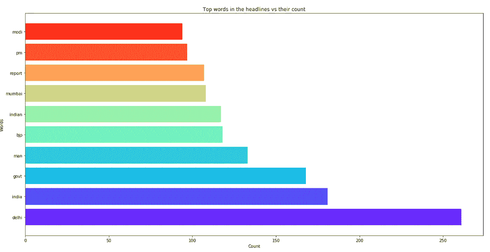

# 使用词云识别热门话题

> 原文：<https://towardsdatascience.com/identify-top-topics-using-word-cloud-9c54bc84d911?source=collection_archive---------8----------------------->


Photo by [AbsolutVision](https://unsplash.com/@freegraphictoday?utm_source=medium&utm_medium=referral) on [Unsplash](https://unsplash.com?utm_source=medium&utm_medium=referral)

我最近在处理文本数据时发现了单词云。我真的很着迷于它们是如何通过一张图片揭示如此多的信息，以及它们是如何通过一个[库](https://github.com/amueller/word_cloud)轻松创建的。因此，我决定做一个快速项目来理解它们。

> **单词云或标签云**是词频的图形表示，对在源文本中出现频率更高的单词给予更大的重视。— [更好的评估](https://www.betterevaluation.org/en/evaluation-options/wordcloud)

基本上，单词云以云的形式显示一组单词。一个单词在文本中出现的频率越高，它就会变得越大。因此，通过简单地看一看云，你就能识别出关键词和热门话题。

# 词云使用的众多领域

我发现云这个词实际上可以用在很多领域。其中一些是:

1.  **社交媒体上的热门话题:**如果我们可以阅读并获取用户发出的帖子/推文的文本，我们可以从中提取热门词汇，并可以在趋势部分使用它们来分类和组织各个部分下的帖子/推文。
2.  **热门新闻话题:**如果我们可以分析各种新闻文章的文本或标题，我们可以从中提取出热门词汇，并确定一个城市、国家或全球最热门的新闻话题。
3.  **网站导航系统:**每当你访问一个由类别或标签驱动的网站时，实际上可以创建一个词云，用户可以直接跳转到任何主题，同时知道该主题在整个社区中的相关性。

# 项目—发现热门新闻话题

我做过一个项目，从这里的[获取新闻文章的数据集](https://www.kaggle.com/sunnysai12345/news-summary)，并根据新闻文章的标题创建一个单词云。完整的代码以 Jupyter 笔记本的形式出现在 [Word Cloud repository](https://github.com/kb22/Word-Cloud) 中。

## 导入库

当使用导入库时，我发现我没有包`wordcloud`。Jupyter 提供了一种在笔记本内部执行命令行命令的简单方法。只需在命令前使用`!`，它就会像在命令行中一样工作。我用它来得到`wordcloud`包。

```
!pip install wordcloud
```

我现在有了我需要的所有库，所以我把它们都导入了。

我们让库`numpy`、`pandas`、`matplotlib`、`collections`使用 Counter 和`wordcloud`来创建我们的单词云。

## 使用数据集

首先，我首先将数据集文件导入 pandas 数据帧。注意，为了正确读取，该文件的编码是`latin-1`。然后，我输出列名来识别哪个与标题匹配。

我们可以看到有 6 列:作者、日期、标题、read_more、text 和 ctext。然而，在这个项目中，我将与头条新闻。因此，我使用`lower()`方法将所有的标题转换成小写，并将它们组合成一个变量`all_headlines`。

## 词云

现在，我们准备创建我们的单词云。做了一轮分析后，我确定其中一个顶上的词是`will`。但是，它没有提供关于该主题的任何有用信息。因此，我将它包含在停用字词集中，以便在从标题中识别顶部字词时不考虑它。

然后，我使用这些停用词调用`WordCloud`方法，将输出图像的背景设为`white`，并将最大字数设为`1000`。图像保存为`wordcloud`。

我用`rcParams`来定义图形的大小，并将`axis`设置为`off`。然后我用`imshow`显示图像，用`show`显示图像。


Word Cloud

从图像中，我们可以清楚地看到前两个话题分别为`India`和`Delhi`。可以清楚地看到，词云对于识别文本集合中的顶级词是多么有用。

我们甚至可以使用条形图来验证热门词汇。

我首先从组合标题中分离出所有单词，同时避开停用词，从而得到`filtered_words`。然后，我用`Counter`来统计每个单词的出现频率。然后，我提取前 10 个单词及其数量。

接下来，我绘制数据，标记轴，并定义图表的标题。我用`barh`显示了一个水平条形图。



Bar Chart of top 10 most frequent words

这也与来自单词云的结果一致。而且由于`Delhi`的计数更高，在字云中比`India`更粗更大。

## 结论

在这篇文章中，我讨论了什么是词云，它们潜在的应用领域，以及我为理解它们所做的一个项目。

一如既往，请随时分享您的观点和意见。