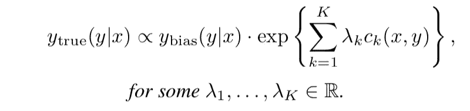
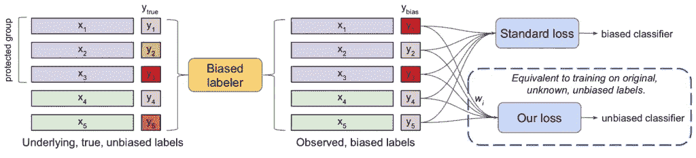
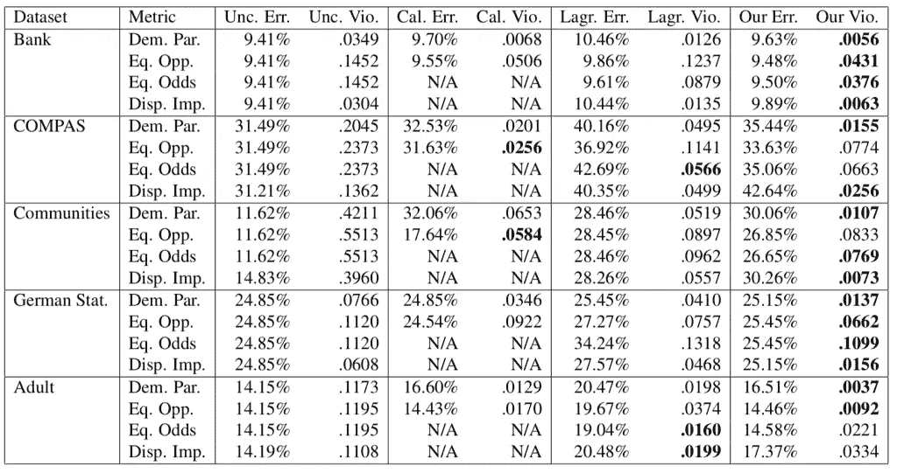
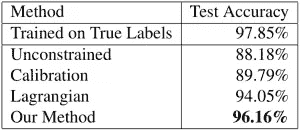

# 识别和纠正机器学习中的标签偏差

> 原文：<https://towardsdatascience.com/identifying-and-correcting-label-bias-in-machine-learning-ed177d30349e?source=collection_archive---------6----------------------->

随着机器学习(ML)变得越来越有效和广泛，它在具有现实生活影响的系统中变得越来越普遍，从贷款建议到工作申请决策。随着使用的增加，偏见的风险也随之而来——有偏见的训练数据可能导致有偏见的 ML 算法，这反过来又可能使社会中的歧视和偏见永久化。

在谷歌的一篇新的[论文](https://arxiv.org/pdf/1901.04966v1.pdf)中，研究人员提出了一种新的技术，即使在有偏见的数据集下，也可以公平地训练机器学习算法。该技术的核心思想是，有偏见的数据集可以被视为经过有偏见的代理操纵的无偏数据集。使用这个框架，有偏数据集被重新加权以适应(理论上的)无偏数据集，然后才作为训练数据输入到机器学习算法中。该技术在几个常见的公平性测试中获得了最先进的结果，同时呈现相对较低的错误率。

# 背景

当试图评估算法中的偏差时，研究人员通常会查看四个关键指标:

1.  人口统计均等-分类器应该以与整个人口相同的比率对受保护的人口群体做出**正面**预测。
2.  完全不同的影响-类似于人口统计均等，但分类器不知道存在哪些受保护的人群以及哪些数据点与这些受保护的人群相关。
3.  机会均等——分类器在受保护人群中的**真阳性**比率应与整个人群中的比率相等。
4.  均衡优势分类器在受保护人群中应具有与整个人群相同的**真阳性**和**假阳性**率。

每个高级度量都表示为一个非负数，它描述了分类器与完全公平的接近程度，0 分表示没有偏差。

近年来，研究人员提出了几种方法来减少算法中的偏差。这些可以分为三个关键类别:数据预处理、数据后处理和算法增强(拉格朗日方法)。

## 数据预处理

在预处理中，研究人员试图通过在训练算法之前操纵训练数据来减少偏差。预处理在概念上是简单的，因此具有潜在的吸引力，但是存在两个关键问题:

*   技术数据可能会以复杂的方式产生偏差，这使得算法很难将其转换为既准确又无偏差的新数据集。
*   合法-在某些情况下[不允许在非原始数据上训练决策算法。](https://papers.ssrn.com/sol3/papers.cfm?abstract_id=2477899)

## 数据后处理

在后处理中，研究人员试图通过在训练算法后操纵训练数据来减少偏差。与预处理一样，后处理的一个关键挑战是找到能够准确识别偏差的技术，从而降低偏差并保持算法精度。

## 算法增强(拉格朗日方法)

最近的一种方法是通过惩罚有偏差样本的影响，将公平性纳入训练算法本身。这是通过一种叫做*拉格朗日乘数*的数学技术来完成的，它接收公平性约束(例如，老年人应该以与年轻人相同的比率被接受)作为输入，并使用它们来影响训练算法中的损失。拉格朗日方法是目前最流行的，但通常难以实施，并给训练过程增加了相当大的复杂性。

# 偏差校正框架

如前所述，在提出的框架中，我们假设有偏数据集(y_bias)是对(理论上的)无偏数据集 y_true 进行操作的结果。这可以表现为:

该技术的第一步是学习λk 的值，λk 表示无偏数据集 y_true 和有偏数据集 y_bias 之间的联系。学习的λk 值用于计算每个训练样本的权重 wk，有偏样本得到低权重，无偏样本得到高权重。然后，ML 算法接收数据点和权重作为输入，并使用它们来训练无偏的分类器。

On the left is y_true, the middle is y_bias, and the right (“Our loss”) represents the result of the unbiased classifier. The different hues of red represent the different label values, which change due to the biasing process. The model learns the weights in order to undo the work of the theoretical “biased labeler” (Image: [Jiang & Nachum](https://arxiv.org/pdf/1901.04966v1.pdf))

如论文中所述，学习λk 的工作方式如下:*“其思想是，如果对于一个保护类 G 的正预测率低于整体正预测率，那么相应的系数应该增加；即，如果我们增加 G 的正标签样本的权重并减少 G 的负标签样本的权重，那么这将鼓励分类器增加其对 G 中的正标签样本的准确度，而对 G 的负标签样本的准确度可能下降。”*

在实践中，我们的过程包含两个部分——系数学习过程，以及基于无偏数据的 ML 模型的最终训练。重要的是要注意，虽然约束学习过程使用分类器来发现λk 偏差系数，但是在构建 ML 模型时不需要使用相同的分类器。

在实践中，我们的过程包含两个部分——系数学习过程，以及基于无偏数据的 ML 模型的最终训练。重要的是要注意，虽然约束学习过程使用分类器来发现λk 偏差系数，但是在构建 ML 模型时不需要使用相同的分类器。

系数学习过程包括四个不同的阶段:

1.  评估人口统计约束，提供约束违反损失函数。
2.  根据约束违反更新λk 系数，意味着尝试最小化损失函数。
3.  计算每个训练样本的权重 wk。
4.  用更新的权重重新训练分类器。

重复这些阶段，直到不再违反约束，这意味着数据集不再存在偏差。此时，计算的权重可用于模型构建阶段，每个训练样本基于其预期偏差接收不同的权重。

# 结果

在五个常见的 ML 偏差框架中使用逻辑回归测试了所提出的技术——银行营销(对直接营销活动的反应)、社区和犯罪(各种社区的犯罪率)、COMPAS(累犯)、德国 Statlog 信用数据(个人的信用风险)和成人(收入预测)。将结果与领先的预处理(“Unc”)进行比较)，后期处理(“Cal。”)和拉格朗日(“Lagr。”)关于四个常见偏差指标的方法——人口统计均等(“Dem。标准杆。”)，不同的影响(“Disp。小鬼。”)，机会均等(“情商。Opp。”)和均衡赔率(“Eq。赔率”)。在大多数情况下，所提出的技术(“我们的……”)在牺牲很少准确性的情况下取得了最好的结果。没有其他技术是类似的准确和公正。

In each column, the “Err.” (left) represents the error of the unbiased classifier and the “Vio.” (right) is the numerical bias value. (Image: [Jiang & Nachum](https://arxiv.org/pdf/1901.04966v1.pdf))

研究人员还通过创建标签偏差在 MNIST 上测试了该技术，随机选择 20%的训练数据点，并将它们的标签更改为 2。然后，他们将数据输入算法，约束条件是“每个数字应该出现 10%的时间”，并将结果与预处理、后处理和拉格朗日方法进行比较。结果再次是所提出的无偏倚技术(“我们的方法”)的最高分:

Unconstrained = pre-processing method, Calibration = post-processing method (Image: [Jiang & Nachum](https://arxiv.org/pdf/1901.04966v1.pdf))

# 实施细节

该技术是用于偏差校正的通用框架，因此独立于任何软件平台或实现。自然地，增加一个体重发现阶段将会延长任何使用它的训练过程。

# 结论

在他们的偏差校正框架中，Jiang 和 Nachum 提出，在有偏差的数据集背后，可以假设一个隐藏的无偏数据集，并表明相应地重新加权有偏差的数据集可以在几种偏差减少技术中获得最佳结果。随着越来越多的最大似然算法涉及到我们的日常生活，预计偏差减少技术将变得越来越重要，并且看起来 Jiang 和 Nachum 技术现在是这种技术的新基准。