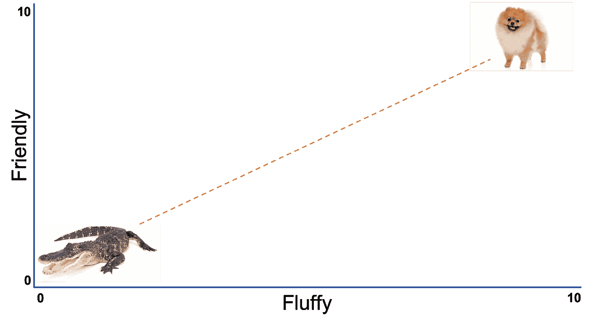
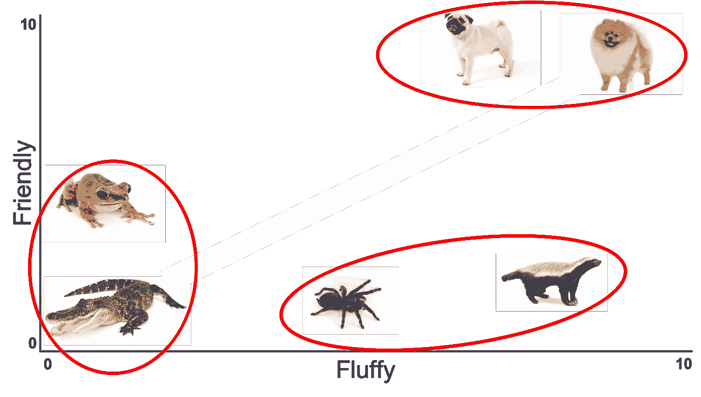
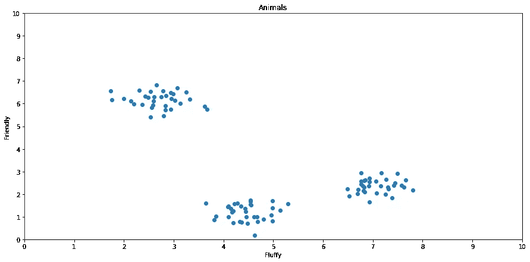
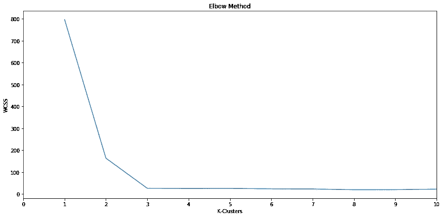
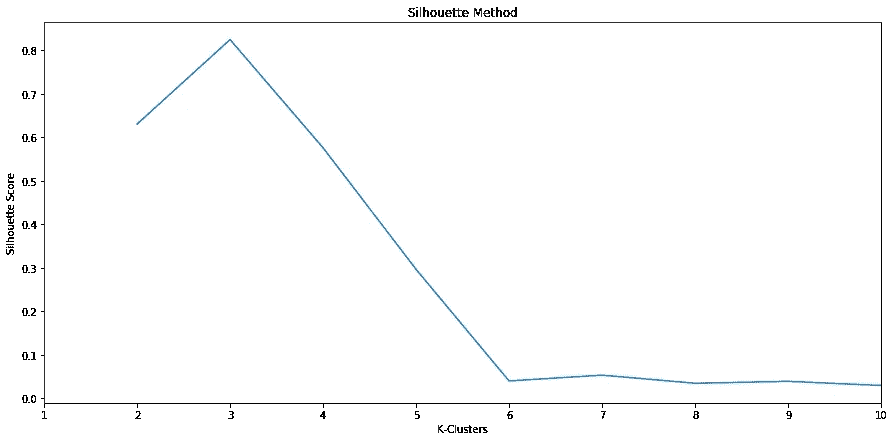

# 使用单词矢量化和 K-Means 聚类识别竞争对手

> 原文：<https://towardsdatascience.com/identifying-competitors-using-word-vectorization-k-nearest-neighbors-412f1cea2506?source=collection_archive---------29----------------------->

## 面向小型企业的数据科学

## 构建一种算法来帮助小企业利用 Yelp 数据。


Yelp 为企业提供了丰富的信息来源，在分析相对于竞争对手的销售和服务表现时可以加以利用。利用这些数据是完全不同的事情。我想创造一种算法，让小企业相对容易地做到这一点。

在本帖中，我们将探讨如何使用分类标签，通过词汇矢量化和 k-means 聚类来确定企业最相关的竞争对手。为了便于说明，我们将使用纽约市我最喜欢的当地餐馆之一: [Chano's Cantina](https://www.yelp.com/biz/chanos-cantina-astoria) 。使用 [Yelp API](/getting-started-with-the-yelp-api-ac30915a77ae) ，我获得了阿斯托里亚*墨西哥餐馆&酒吧*的前 50 个搜索结果，并将它们保存到 dataframe 中。

我们的目标是确定 Chano's 与其竞争对手相比如何，确定餐厅做得好的地方和有待改进的地方。然而，试图将一家餐厅与 49 家潜在竞争对手进行比较可能会引入太多噪音，以至于很难提取出任何有意义的结果。相反，我们想找出 5-10 个在价格和产品供应方面与 Chano 最相似的竞争对手。我们如何找出哪些餐厅在这方面最相似？k-均值聚类！

## 数据选择

让我们看看 Chano 的 Yelp 页面，看看哪些信息可能最适合手头的任务。


[https://www.yelp.com/biz/chanos-cantina-astoria](https://www.yelp.com/biz/chanos-cantina-astoria)

从上面，我们看到了一个带有两个美元符号的价格估计，以及几个关于*鸡尾酒吧*和*新墨西哥美食的标签。*很自然，我们希望将 Chano's 与类似的餐厅进行比较，因此我们希望找到标签和价格范围相同的餐厅。问题是大多数餐馆不会完全匹配，所以我们想尽可能接近。

如果我们回顾我们的 API 结果，我们会看到相关信息在列*类别*和*价格中。*请注意，我们没有使用*评级*变量，因为这将是我们以后的目标。让我们清除一些混乱，以便更好地理解我们正在处理的内容。

## 预处理

这里我们有 50 条记录，我们希望使用类别和价格数据将其减少到不到 10 条。两个问题:

*   **类别**是以字符串形式保存在内存中的字典列表。
*   用美元符号表示的价格，不容易被机器解释。

价格是更容易处理的问题:我们可以用一个表示美元符号数量的整数来代替这个值。然后我们可以用四舍五入到零位的平均价格来填充空值。

```
df.price.replace(to_replace = ['$', '$$', '$$$', '$$$$'], 
                 value = [1, 2, 3, 4], 
                 inplace = True)df.price.fillna(np.round(df.price.mean(), 0), inplace = True)
```

关于分类标签，我们需要 Python 将每个企业的字符串值作为代码读取，这样我们就可以分离出我们需要的信息。例如，Chano's Cantina 的类别保存为:

```
"[{'alias': 'cocktailbars', 'title': 'Cocktail Bars'}, {'alias': 'newmexican', 'title': 'New Mexican Cuisine'}]"
```

我们希望 Python 将这个字符串解释为字典列表，而不是将其作为字符串读取。幸运的是，通过使用[抽象语法树](https://docs.python.org/3/library/ast.html)库并调用 *literal_eval* 方法，然后将结果保存为变量，我们可以很容易地做到这一点。从这里开始，只需遍历每条记录，获取标题单词，删除标点符号，并将所有单词转换为小写。我们可以将这些结果与价格值结合起来，并将结果保存到一个名为*标签的列中。*代码以及 Chano 的相关输出如下。

```
import ast
import redf['tags'] = ''for ix in df.index:
 *# Evaluate categories as code*    cat = ast.literal_eval(df['categories'][ix])

 *# Save tags as single string*    words = ''
    for tag in cat:
        words += f"{tag['title']} "

 *# Remove punctuation*    words = re.sub(r'[^\w\s]', ' ', words)df.loc[ix, 'tags'] = ' '.join([words.lower(), str(int(df.loc[ix, 'price']))])OUTPUT:
'cocktail bars new mexican cuisine 2'
```

我们可以使用自然语言工具包(NLTK)将这些输出转换成单词标记列表。

```
from nltk import word_tokenize
df['tags'] = df['tags'].map(word_tokenize).valuesOUTPUT:
['cocktail', 'bars', 'new', 'mexican', 'cuisine', '2']
```

您可能会问自己，为什么我们不为类别创建虚拟变量。这种方法*会是一种更直接的方式；然而，这也将导致对类别的解释是独特的离散。这种方法的问题是，诸如“墨西哥”和“新墨西哥美食”的标签非常相似。通过使用虚拟变量，我们会错过这种细微差别。为此，我们将使用单词表示的[全局向量](https://nlp.stanford.edu/projects/glove/) (GloVe)来解释分类标签。*

## 单词矢量化

如果你不熟悉的话，单词矢量化是一种在高维空间中用数字表示单词的方法。那是什么意思？好吧，假设我们想根据动物的毛绒绒程度和友好程度来比较它们，我们把它们放在 1-10 的范围内。一只博美犬可能因为非常蓬松而得到 10 分，因为非常友好而得到 9 分。(我妻子告诉我博美犬不是特别友好，但让我们假装它们是！)

另一方面，一只短吻鳄可能在两个评分中都得到 1 分。我们可以用图表直观地表示这些单词:



使用这些维度，我们可以将每种动物表示为一个向量，第一个值表示蓬松度，第二个值表示友好度。更重要的是，我们可以想象在这条线上的不同点可能存在其他动物。你能想到一种比短吻鳄更蓬松、更友好，但没有博美犬蓬松、友好的动物吗？狒狒怎么样？如果我们计算这两个向量的平均值，我们就能算出狒狒在图上的位置。我们可以用算法将这一过程表示如下:

```
pomeranian = np.array([10, 9])
alligator = np.array([1, 1])baboon = (pomeranian + alligator) / 2
baboonOUTPUT:
array([5.5, 5.])
```

输出表示在图表上放置狒狒的坐标。我们可以无限地扩展这个概念来描述各种各样的词，并理解它们之间的关系。面对如此无限的可能性，我们该从哪里开始呢？幸运的是，我们不必回答这个问题，因为斯坦福大学已经建立了一个模型，包含英语中 60 亿个单词的单词向量:这是 GloVe。每个单词都被表示为一个 50-300 维的向量，并且可以免费访问以用于您自己的模型。可以[这里下载](http://nlp.stanford.edu/data/glove.6B.zip)；请记住，该文件高达 822 兆字节。

## 用手套来代表单词

zip 文件包含四个以 UTF 8 格式编码的文本文件。每个文件包含相同的单词库，每行代表该单词的向量。文件之间的区别在于维数:50、100、200 和 300。出于我们的目的，我们将使用 50 个维度，因此我们首先将文件 *glove.6B.50d.txt* 保存到与 Jupyter 笔记本相同的路径。

将向量分配给唯一单词的过程非常简单。

1.  创建一个在我们新创建的*标签*栏中使用的独特词汇列表。
2.  从 GloVe 中获取代表每个单词的向量。
3.  将结果保存为字典，使用单词作为键，向量作为值。

```
*# Get unique words* total_vocabulary = set(word.lower() for tag in df['tags'] for word in tag)def get_vectors(vocabulary):
    *# Function to get vectors for words in vocabulary*
    glove = {}
    with open('glove.6B.50d.txt', 'rb') as f:
        for line in f:
            parts = line.split()
            word = parts[0].decode('utf-8')
            if word in vocabulary:
                vector = np.array(parts[1:], dtype=np.float32)
                glove[word] = vector

    return gloveglove = get_vectors(total_vocabulary)
```

有了我们的相关向量字典，我们现在想将它们应用到每个企业的特定标签集，获得每个公司的平均向量。我们可以创建一个类来完成这项工作，使用 map 函数将它应用到 tags 列。

```
class W2vVectorizer(object):

    def __init__(self, w2v):
        *# Takes in a dictionary of words and vectors as input*
        self.w2v = w2v
        if len(w2v) == 0:
            self.dimensions = 0
        else:
            self.dimensions = len(w2v[next(iter(glove))])

    def fit(self, X, y):
        return self

    def transform(self, X):
        *# Get mean value of vectors from a list of words*
        return np.array([
            np.mean([self.w2v[w] for w in words if w in self.w2v]
                    or [np.zeros(self.dimensions)], axis=0) 
                    for words in X])
```

该类接受单词和向量的字典，并通过调用 transform 方法为任何单词列表提供平均向量。

## 不戴手套的话

超过 40 万个单词有 60 亿个代币，很难想象一个单词不会在手套中找到。然而，在这个例子中我们确实遇到了一种:腹足类。有趣的是，这个单词的单数形式是存在的，所以使用[词干和词汇化](http://www.nltk.org/api/nltk.stem.html)是这个问题的第一个潜在解决方案。然而，在 NLTK 库中也没有找到这个单词。是时候发挥创造力了！

我的下一个想法是使用韦氏词典查找音节，但是没有。最简单的解决方案是为丢失的单词插入零向量，或者从所有标签中删除它，但是我不想丢失信息。相反，我们可以从韦氏词典获得[字典定义](https://www.merriam-webster.com/dictionary/gastropubs)，并应用与上面类似的方法获得单词定义的平均向量。

这个任务从使用[美汤](https://www.crummy.com/software/BeautifulSoup/bs4/doc/)的一些网页抓取开始。作为下一篇文章的一部分，我们将更详细地讨论网络抓取这个话题，所以，现在，我将只向您展示从韦氏词典的网站上获取任何单词的定义的代码。

```
from nltk import word_tokenize
import requests
from bs4 import BeautifulSoup as bsdef get_definition(word):
 *# Get webpage data for word definition*    url = f'https://www.merriam-webster.com/dictionary/{word}'
    r = requests.get(url)

 *# Parse html*    soup = bs(r.content, 'lxml')
    definition = soup.find("span", {"class" : "dt"})
    tag = definition.findChild()
    definition = tag.find('strong').next_sibling.strip()

 *# Clean text & return tokenized definition*    clean_def = re.sub(r'[^\w\s]', ' ', definition)
    return word_tokenize(clean_def)
```

有了这个函数，我们就可以搜索 GloVe 中没有的单词，获得标记化的定义，然后使用我们的 vector 类获得相关单词的近似向量。

```
*# Get tokenized definitions for words not in Glove* no_vectors = {}
for word in total_vocabulary:
    if word not in glove.keys():
        no_vectors[word] = get_definition(word)*# Add unique words from tokenized definitions to glove dictionary* for key in no_vectors.keys():
    words_to_add = []
    for word in no_vectors[key]:
        if word not in list(glove.keys()):
            words_to_add.append(word)

    words_to_add = list(set(words_to_add))
    new_vects = get_vectors(words_to_add)
    glove.update(new_vects)*# Calculate vectors for missing words to glove* vectors = W2vVectorizer(glove)
for key in no_vectors.keys():
    vect = vectors.transform(no_vectors[key])
 **glove[key] = np.average(vect, axis=0)**    
print(sorted(list(glove.keys())))OUTPUT:
['1', '2', '3', 'a', 'american', 'bar', 'bars', 'beer', 'breakfast', 'brunch', 'chicken', 'cocktail', 'coffee', 'cuisine', 'event', 'gastropubs', 'grocery', 'high', 'irish', 'italian', 'latin', 'lounges', 'meals', 'mex', 'mexican', 'new', 'of', 'offers', 'or', 'peruvian', 'plates', 'pub', 'pubs', 'quality', 'seafood', 'small', 'southern', 'spaces', 'spirits', 'sports', 'tacos', 'tapas', 'tavern', 'tea', 'tex', 'that', 'traditional', 'venues', 'wine', 'wings']
```

需要记住的一点是，向量的平均值返回高维空间中的值。但是，我们希望返回一个与所有其他单词形状相同的值，这由加粗的代码行处理。

随着我们所有的标签被正确地矢量化，我们现在可以继续进行聚类，以确定 Chano 的最直接的竞争对手。

## k 均值聚类

有很多博客文章详细介绍了 k-means 聚类的无监督学习机制，所以我在这里不打算全部重复。主要要知道的是，k-means 聚类是一种无监督的学习方法，它根据数据点的相似程度对它们进行分组。

为了说明这一点，让我们回到短吻鳄和博美犬的比较。这一次，我们将在图表中添加一些其他动物。k-均值聚类的目的是识别一组随机动物的适当分组。



在这里，我们可以看到青蛙比鳄鱼友好一点，但一点也不蓬松。哈巴狗不如博美犬蓬松，但它更友好一些。然后还有蜜獾和狼蛛，有点蓬松，但不是特别友好。基于他们的分数，k-means 聚类旨在找出如何最好地对他们进行分组。

这个任务看起来很简单，但是如果我告诉你有必要把这些分成两组而不是三组呢？或者改为四组怎么样？我们可以想象，如果不知道最佳的组数，任务会变得更加复杂。

我们的目标是根据他们的 Yelp 标签和价格估计，找出 5-10 个与 Chano 最相似的竞争对手。对于本分析的其余部分，我们将重点关注 k-means 聚类的实现。尽管如此，如果你不熟悉算法的机制，我还是建议你看一看甲骨文的这篇简介。

## 寻找最佳的聚类数

有两种传统的方法来为 k-means 算法找到最佳的聚类数:

1.  肘法
2.  剪影法

对于每种方法，我们为一组组构建多个 k 均值算法，组的数量由字母 *k* 表示。在这种情况下，我们将设置 2 到 10 个组或集群。使用肘方法，该算法估计每个分类的中心，然后测量分类中每个点离中心的平均距离。取这些距离的平均值得到了**误差平方的组内和(WCSS)。随着星团数量的增加，我们可以绘制 WCSS，寻找 WCSS 趋于平稳的点。**

*为了说明这一点，我们随机生成一组点来代表 100 种不同的[理论上的]动物，并绘制在下面。*

**

*我们可以看到有三个不同的集群。让我们为 2–10 个集群构建 k-means 算法，看看 WCSS 会发生什么。*

**

*我们可以看到，在 3 个星团中，WCSS 到达了一个山谷。直觉上这是有道理的，但是区别并不总是清晰的，使得解释有些主观。更重要的是，我们不希望每次运行算法时都必须进行视觉检查。相反，我们将使用剪影法。*

## *剪影法*

*使用剪影方法，我们查看一个簇中的点之间的平均距离，这被称为**内聚**。这个数字与组间的平均距离进行比较，这是对**间距**的测量。用非常简单的术语来说，我们寻找分离和内聚之间的差异最大化的簇的数量。和肘法一样，我们可以画出这些点。*

**

*同样，我们可以看到最佳聚类数是 3，因为这是轮廓得分最大化的地方。然而，与 Elbow 方法不同，我们得到了一个清晰的最大值，可以很容易地通过编程来识别。*

## *把所有的放在一起*

*有了手套向量和寻找最佳聚类数的方法，我们现在可以确定与 Chano 最相似的竞争对手。您可能已经从上面推断出，我们将需要多次实现该算法。幸运的是，这是这个过程中最简单的部分。*

*第一步:导入 K 均值算法。*

```
*from sklearn.cluster import KMeans*
```

*步骤 2:将标签转换为向量。*

```
*vectors = W2vVectorizer(glove)
X = vectors.transform(df['tags'])*
```

*第三步:找到最佳的聚类数。*

```
*sil = []
kmax = 10for k in range(2, kmax+1):
   kmeans = KMeans(n_clusters = k).fit(X)
   labels = kmeans.labels_
   sil.append(silhouette_score(X, labels, metric = 'euclidean'))

maxpos = sil.index(max(sil))
n_clusters = maxpos + 2*
```

*步骤 4:分配组标签并保存到数据帧。*

```
**# Divide into k groups using k-mean clustering* model = KMeans(n_clusters=n_clusters, init='k-means++',
               max_iter=300, n_init=100)
model.fit(X)

*# Create group label column* df['group'] = list(model.labels_)*
```

*第五步:筛选与 Chano 不在一个组的企业。*

```
*group = df[df['name'] == "Chano's Cantina"]['group'].values[0]
new_df = df[df['group'] == group].reset_index(drop=True)*
```

*步骤 6:对新的数据帧重复步骤 2 到 5，直到记录数少于 10。*

*结果:下面，我们可以看到 Chano's 及其主要竞争对手的基本数据。*

## *后续步骤*

*既然我们已经正确地确定了 Chano 的主要竞争对手，我们就可以开始深入评论了。查看 *review_count* 列，我们可以看到我们有近 1000 条评论要解析，但是 Yelp API 对可以访问的评论数量有严格限制。要绕过这一点，需要使用漂亮的汤进行一些繁重的网络抓取，但这是另一天的主题。*