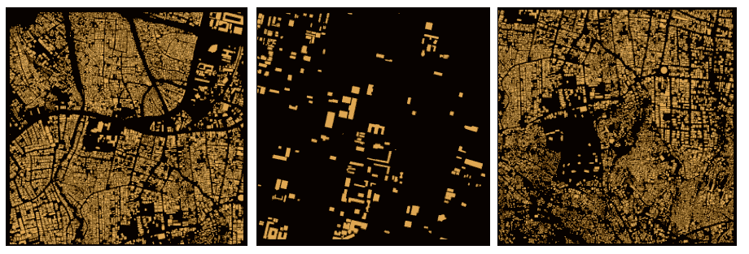
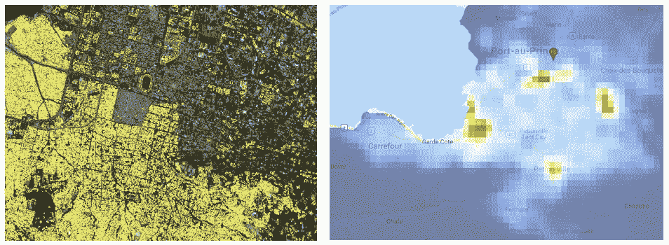
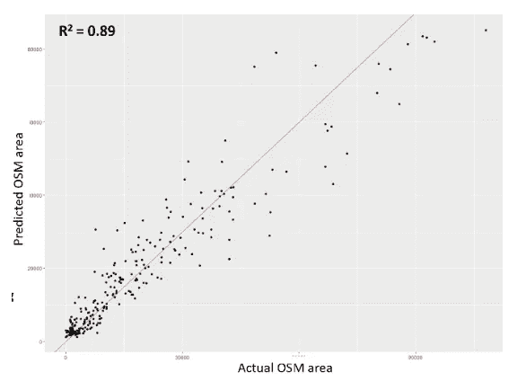
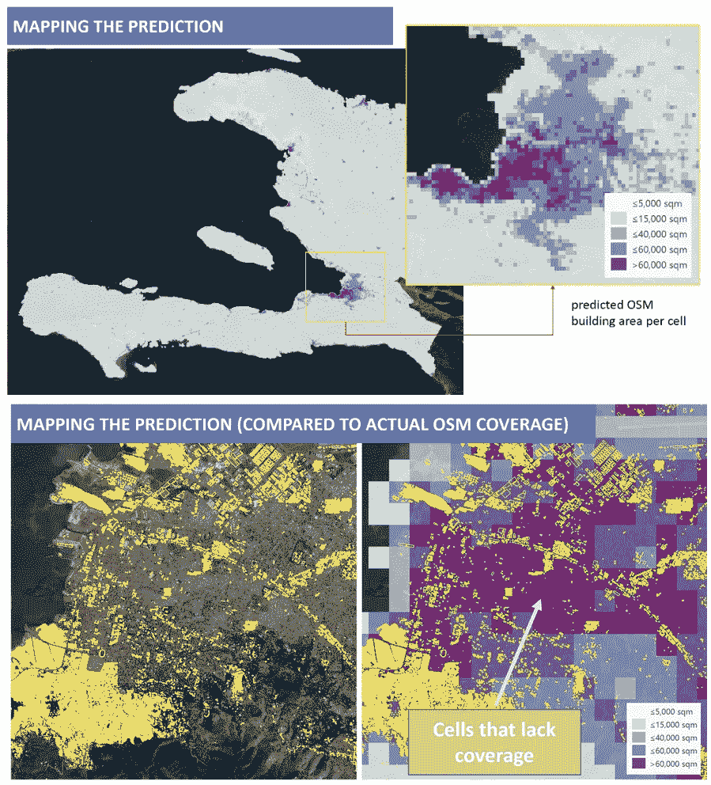

# 通过机器学习识别 OpenStreetMap 覆盖中的缺口

> 原文：<https://towardsdatascience.com/identifying-gaps-in-openstreetmap-coverage-through-machine-learning-257545c04330?source=collection_archive---------23----------------------->

*本帖由* [*冉戈特*](https://www.linkedin.com/in/ran-goldblatt-34365886/) *、新光科技、***、GFDRR Labs/World Bank。**

*OpenStreetMap (OSM)是数字时代的奇迹之一:成立于 2004 年，它允许志愿者绘制大约 4200 万座建筑物和 100 万公里道路的地图——创造了一个在完整性和易用性方面往往超过官方地图的宝贵资源。*

*在很少情况下，完整的地图比备灾和救灾更重要。巴哈马的飓风道林只是最新的例子，救援机构依靠 OSM 的数据来了解受灾房屋、学校和诊所的位置。*

*但是我们如何评估 OSM 在给定区域覆盖的完整性呢？请继续阅读我们使用的关键步骤——以海地为例——以区分完全测绘的地区和额外测绘(例如通过众包活动)将带来最大收益的地区。*

## *评估 OSM 完整性*

*麦吉尔大学最近的一项研究发现，OSM 拥有世界上大约 83%的街道和道路，但在治理薄弱和互联网接入较少的国家，覆盖差距更大。在本帖中，我们将特别关注构建足迹。*

*你已经可以使用人道主义 OpenStreetMap 团队的[缺口检测](http://osm-analytics.org/#/gaps)地图，将 OSM 建筑的足迹与[全球人类居住层](https://ghsl.jrc.ec.europa.eu/)进行比较。有了机器学习工作流，我们可以走得更远一点。我们将利用免费和开源的卫星数据，以更高的分辨率对 OSM 覆盖范围的缺口进行建模，评估模型的准确性，并预测地图绘制不足的区域。*

## *1.获取和检查 OSM 数据*

*对于一个地区的 OSM 数据的探索性可视化，Python 库 OSMNx 是一个非常有价值的资源-它有助于精确调用 transition API，将您需要的数据段提取到笔记本环境中。*

*在下图中，我们展示了城市三个人口密集区的建筑足迹。这些平方英里地块的坐标是通过在谷歌地图上放一枚大头针选择的，卫星图像显示那里有密集的建筑覆盖。*

*显然，太子港的一些地区已经开展了大量的制图工作，但其他地区还没有。为了进行全面的分析，我们获取了整个海地的建筑足迹数据(使用诸如 [GeoFabrik](https://gist.github.com/nj935/41b0146dc8e7157ac284edf840fa68f9) 这样的服务器)。*

*Python code: Download OSM building footprints for selected locations in Haiti*

**

*Building footprints: Three square mile plots for dense areas of Port-au-Prince (note differential coverage)*

## *2.构建一组预测功能*

*一些地理空间层可能被证明可以预测建筑密度，特别是那些来自免费、公开获取的最新卫星图像的地理空间层。现有产品，如全球人类住区图层(GHSL)在描绘城市区域方面做得很好，但它们没有捕捉到自发布日期以来的任何变化-将实时卫星数据引入我们的工作流可以弥补这一点。*

*我们评估了几种遥感方法作为建筑物覆盖范围的潜在预测指标，包括:*

*夜间发出的光的强度(VI IRS)；*

*源自 Sentinel-2 图像的植被和建筑区光谱指数(如 NDVI、NDBI、SAVI)；*

*表面结构(基于 Sentinel-1 的合成孔径雷达数据)；*

*海拔和坡度；*

*其他 OSM 衍生图层，包括道路交叉点的密度。*

*就像机器学习一样，更高质量的特征意味着更好的预测精度和更少的噪声。我们评估了 16 个预测要素，利用谷歌地球引擎(GEE)有效地创建和聚合遥感衍生层。下面的代码片段突出了 GEE 提供的便利和强大功能；在这里，我们引入了过去三年的 VIIRS 图像，这是一个高分辨率数据集，从 2012 年开始作为当地经济增长的替代物提供了巨大的好处，并绘制了整个海地的中值夜间照明强度。*

*Google Earth Engine code (Javascript): Median night-light intensity over Haiti, 2015–2018*

## *3.创建培训和测试数据*

*我们将区域划分为网格(您可以使用 QGIS 来实现)。我们将单元格的大小设置为 500m*500m，但是如果您愿意，也可以使用任何其他大小。我们的目标是根据预测值预测像元中 OSM 建筑物覆盖区的覆盖范围(覆盖区的总面积)。*

*为了创建训练数据，我们手动标记网格单元，其中我们评估至少 75%的要完全绘制的建筑物(我们依靠高分辨率卫星图像作为此评估的基础层)。大约 1，600 个细胞被标记为完全映射。*

*然后，我们将这些细胞中的 70%作为训练数据，并将剩余部分作为测试数据——它在模型训练期间保持不可见。*

**

*Left: Complete cells are tagged to create training and test data; Right: Remote sensing layers such as night-lights intensity (pictured) serve as predictive features.*

## *4.构建和评估模型*

*我们的训练数据包括我们判断接近完全 OSM 映射的区域上的大约 1，100 个像元(即，根据目测，至少 75%的建筑物出现在 OSM 上)。*

*多元线性回归分析表明，九个变量的综合效应可以解释一个单元中 OSM 建筑占地面积变化的 82%。这些变量加在一起的预测精度远远高于每个变量独立的预测精度:例如，仅使用世界定居足迹只能解释 62%的变异。*

**

*Model evaluation: actual vs. predicted building floorspace*

*使用随机森林算法，我们看到了更高的预测精度。该模型预测每个单元的 OSM 建筑占地面积的 89%的变化。模型中最重要的预测因子是全球城市足迹和世界住区足迹，其次是 NDBI、道路交汇点数量和 VIIRS 夜间照明。*

## *产出:已确定的 OSM 差距*

*发现我们的模型足够有效后，我们将其应用于预测整个海地的 OSM 建筑足迹，以及预测将被完全映射但实际上未被 OSM 覆盖的标志单元。*

*海地的许多地区缺乏他们建筑的完整地图。检查太子港的预测，我们看到这些地图黑点与 OSM 覆盖密集、详细且相对完整的其他单元共存-考虑到许多发展中国家社区地图的间歇性，这可能并不奇怪，在这些国家，2010 年地震等紧急情况激发了人们的努力。*

*当住宅、学校、诊所和其他重要基础设施所在的区域没有被绘制成地图时，规划和应对极端事件就变得非常困难。但是一个简单的机器学习工作流程可以通过指出额外的地图绘制活动提供最大利益的区域来帮助通知众包工作。*

**

***致谢**:感谢[新光科技](https://newlighttechnologies.com/)的珍妮·曼尼克斯和布拉德·博顿斯为这个项目做出的贡献。*