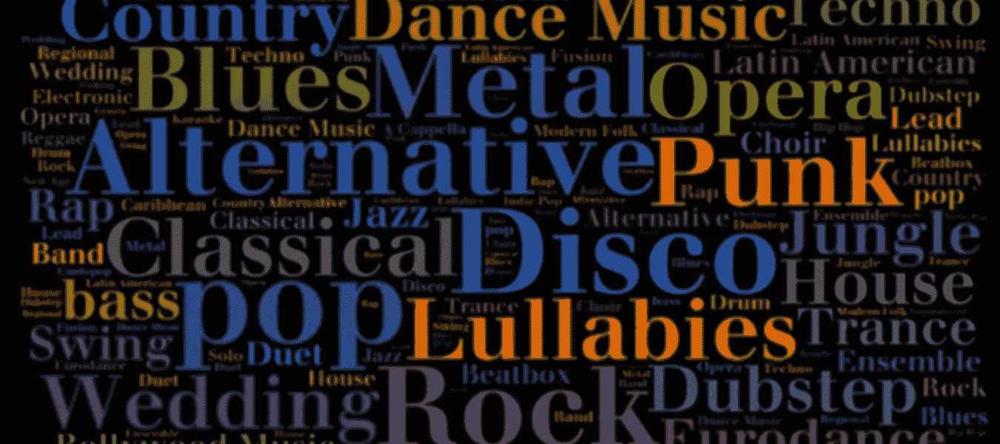
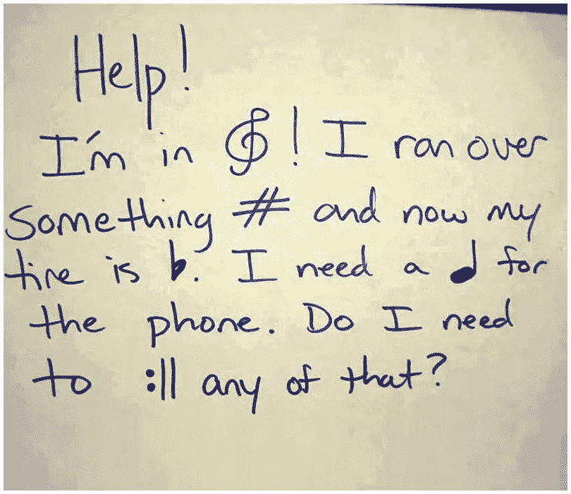
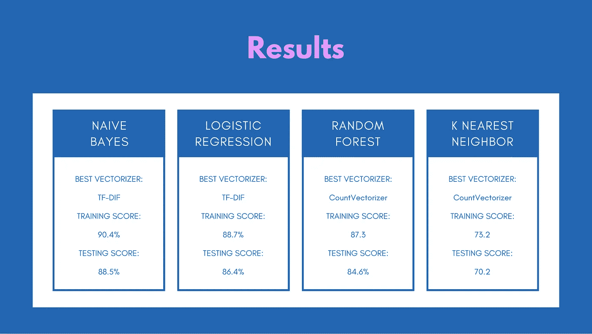
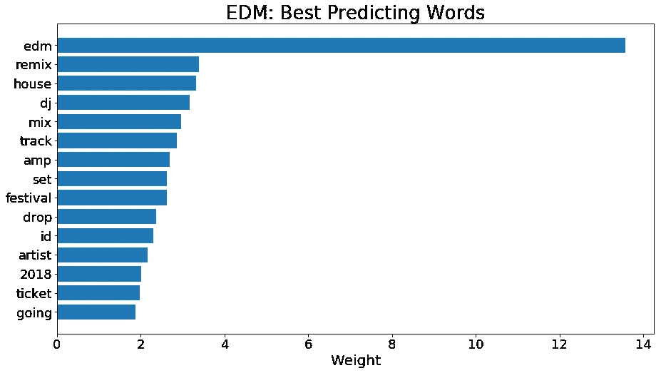

# 识别特定于音乐流派的语言

> 原文：<https://towardsdatascience.com/identifying-langauge-specific-to-a-musical-genre-58dc27bb74c3?source=collection_archive---------33----------------------->

> "音乐是人类的通用语言." *―* ***亨利·沃兹沃斯·朗费罗***

不管说什么语言，人类都有一种与他们所听的音乐建立联系，并通过他们创作的音乐与他人交流的天生能力。随着音乐的发展，我们已经开发出了通过口语和书面语谈论音乐的新方法。例如，音乐记谱法被作为一种以书面形式记录一段音乐的手段，这样任何熟悉这种记谱法的人都可以拿起它来演奏。

在现代社会，音乐变得更加容易理解和广泛传播，音乐风格也更加多样化。这种现象导致了基于流派对音乐进行分类的关注。在许多情况下，这些流派围绕它们发展出了完整的亚文化。一种特定音乐风格的粉丝可能会在更多方面认同这些亚文化，而不仅仅是他们选择听的音乐。他们可能穿着特定的时尚，经常去特定的场所，甚至发展出一种特定的方式来谈论他们喜欢的音乐。

人们通常用一些术语来描述音乐，但我想看看我是否能分析人们在特定流派中使用的语言的差异。为了做到这一点，我创建了一个机器学习模型，以测试计算机能够在多大程度上根据一个人正在使用的单词来确定他可能在谈论什么类型。作为案例研究，我选择了比较两种特定的流派:EDM 和 Rock。用于分析的数据来自 Reddit 上关于这两种类型的帖子。我从 subreddit [r/EDM](https://www.reddit.com/r/EDM/) 中抽取了一组帖子，从 [r/rock](https://www.reddit.com/r/rock/) 中抽取了另一组帖子，以获取人们专门谈论这两种音乐的文本数据。这个项目的链接可以在这里找到。

这个过程的下一步是清理文本，以便可以正确处理它。因为这些是 Reddit 的帖子，里面有很多东西不是真正的单词，比如 YouTube 视频和播放列表的链接，所以这些必须被删除。因为单词本身是唯一相关的内容，所以所有的标点都被删除了。除了帖子本身的内容之外，我选择使用帖子的标题，因为对于这些特定的子主题，在许多情况下，标题和内容一样重要。

一旦文本都被适当地清理了，就该使用自然语言处理来分析文本了。我通过计数矢量器运行了所有帖子，它识别了帖子中所有独特的单词，并计算了每个单词在每个帖子中出现的次数。我还尝试了一种稍微不同的方法，使用 TF-IDF 矢量器处理该文本，它不是简单地计算所有单词，而是考虑包含该单词的帖子的数量。这些结果现在可以通过一个模型来运行，该模型能够预测一个给定的帖子来自两个子帖子中的哪一个。我还分析了同时出现的两个单词的任何组合，这有助于考虑单词的上下文，从而提高模型的性能。

我试用了几种型号，比较了一下，看看哪种性能最好。每个模型使用不同的算法根据帖子的内容将帖子分类为 r/EDM 或 r/rock。我选择比较的模型是朴素贝叶斯、逻辑回归、随机森林和 K-NN。每个模型都用计数矢量器和 TF-IDF 矢量器进行了测试。每个模型预测文章类型的准确度结果如下所示:

性能最好的模型是朴素贝叶斯，它在与 TF-IDF 矢量器一起使用时比与计数矢量器一起使用时表现更好。该模型能够正确预测近 90%帖子的类型，要么是 EDM，要么是 Rock。这表明，人们用来描述不同音乐流派的语言存在显著差异，足以让一个模型能够仅根据分析人们使用的词汇来区分这些方言。

我们甚至可以识别与特定风格高度相关的特定单词，这提供了一些关于哪些特定单词使每种风格独一无二的深刻见解。随着越来越多的人在谈论某种音乐时更频繁地使用这些词，他们开始围绕一种音乐流派塑造语言和文化。为了进行预测，我的模型会学习哪些单词是最重要的，并相应地对它们进行加权。为了确定最重要的词，我检查了哪些词在我的模型中权重最高，并找出了 EDM 和 rock 的前 15 名。

从上面的图表中可以看出，与某个流派联系最紧密的词符合你期望看到的行话。直观地说，这两种类型的第一个词就是类型本身的名字。对于摇滚流派，我们可以看到“乐队”这个词的排名几乎和“摇滚”一样高。这表明“乐队”这个词在人们谈论摇滚音乐时非常流行，这是有道理的，因为大多数摇滚艺术家都是乐队。我们会看到“吉他”或“金属”这样的词在这张图上排名靠前，这也是有道理的，因为摇滚通常涉及大量的吉他演奏，而金属是摇滚乐中一个受欢迎的子类别。

对于涉及 EDM 的最重要的词，我们可以看到类似的趋势。例如，像“混音”、“DJ”、“节日”和“下降”这样的词，出于不同的原因，都与电子音乐高度相关。大多数 EDM 艺人都是 DJ，这些 DJ 通常会将另一位艺人的歌曲进行混音。许多现场 EDM 活动是大型音乐节，歌曲通常围绕一个被称为“下降”的高潮部分我们对这些热门词汇了解得越多，我们就越能了解每种音乐风格的文化。

这个概念当然可以应用到其他流派，我希望能找到与上述每种流派相关的独特语言。人们确实以非常不同的方式谈论不同风格的音乐，在这个领域总有更多的东西可以探索。通过更多的数据和对我的清理和建模过程的微调，我相信我可以提高这个模型的准确性，甚至超过 90%，但这些结果仍然显示了自然语言处理在确定特定风格音乐周围的独特方言方面的有效性。我有兴趣在未来的其他音乐领域尝试一下，但我发现这是一个非常有趣的案例研究。我希望你也是！