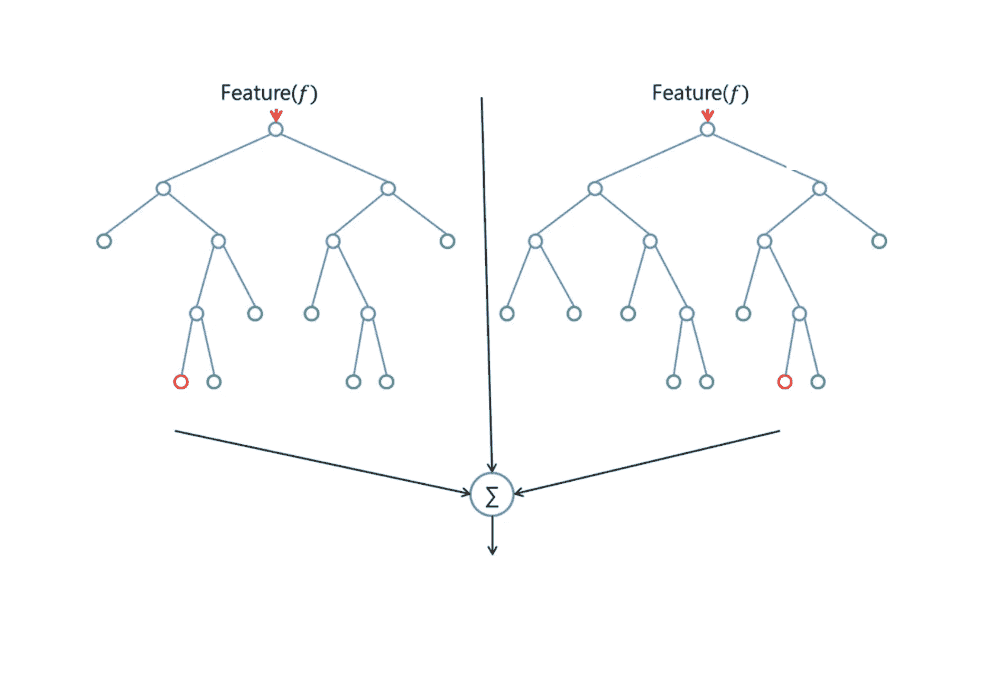
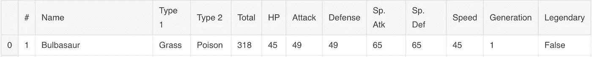
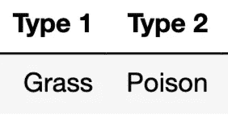
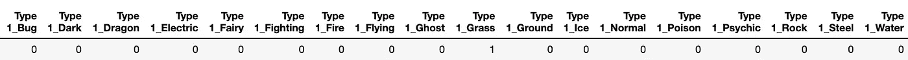
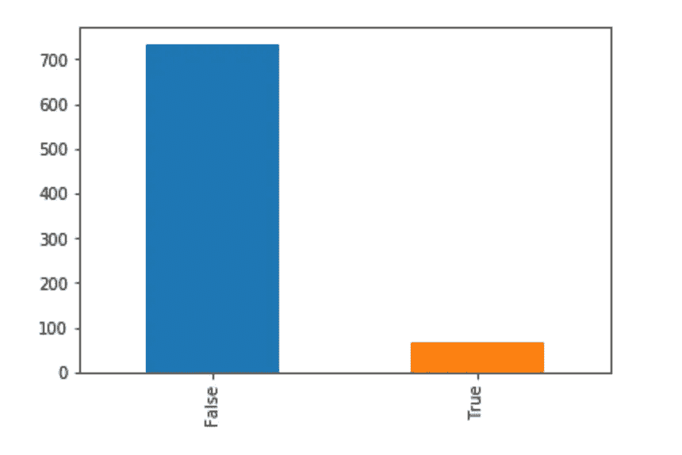
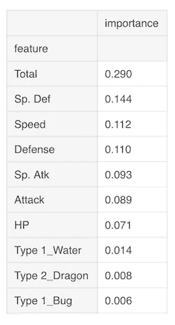
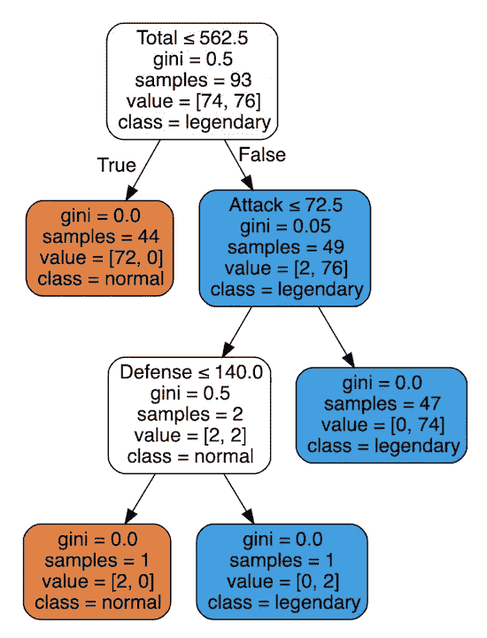

# 使用随机森林算法识别传奇神奇宝贝

> 原文：<https://towardsdatascience.com/identifying-legendary-pok%C3%A9mon-using-the-random-forest-algorithm-ed0904d07d64?source=collection_archive---------17----------------------->

okémon，一群可爱的动物和平地居住在一个星球上，直到人类出现并让它们互相争斗，以获得闪亮的徽章和自称为神奇宝贝大师的权利，听起来很疯狂，对吗？

在这个世界上，存在着一群稀有且往往强大的神奇宝贝，被称为**传奇神奇宝贝。**


[Legendary Pokémon Mew](https://gph.is/2efKSN5)

不幸的是，没有明确的标准来定义这些神奇宝贝。

识别传奇神奇宝贝的唯一方法是通过官方媒体的声明，如游戏或动漫。

这个问题突然出现在我的脑海里。

**如果我们可以使用机器学习来识别传说中的神奇宝贝会怎么样？**

为了回答这个问题，我们将使用**随机森林算法。**

# 随机森林

随机森林是一种灵活、易于使用的机器学习算法，即使没有超参数调整，也能产生很好的结果。

它是一个由许多决策树组合而成的集成分类器。它在**随机**数据子集上构建每棵树，这是一种被称为**打包的技术。**

集成分类器聚合每棵树的单个预测，并使用多数投票将它们组合起来以做出最终预测。

随机森林通常防止**过度拟合**并降低**方差，**由于其随机性(双关)。



Example Random Forest constructed from 2 trees

# 数据集

对于这个项目，我们将使用统计数据数据集[口袋妖怪。](https://www.kaggle.com/abcsds/pokemon)


[Pikachu](https://gph.is/1JksT3z)

它包含 800 只神奇宝贝的数据，包括它们的名字、统计数据，最重要的是它们是否是传奇。

首先，让我们看看典型的神奇宝贝在数据集中是什么样的。

```
dataset = pd.read_csv("../input/Pokemon.csv")
# Display first row of dataset
dataset.head(1)
```



First row in dataset — Bulbasaur

神奇宝贝的类型表明它具有哪些属性(可能有一种或两种类型)。目前游戏中有 18 种类型，从火和水到龙和精灵。

与神奇宝贝相关的统计数据( **stats** )决定了游戏中战斗的各个方面。

例如，速度统计决定了神奇宝贝在战斗中的行动顺序，例如，速度较高的神奇宝贝通常会在速度较低的其他神奇宝贝之前先行动。

我们将使用类型和统计作为随机森林的输入，这些输入被称为**特性**。

## 一个热编码

接下来，所需的数据将被预处理成适合随机森林分类器的格式。大多数机器学习算法不能对标签值进行操作，而是需要输入数值。这是由于这些算法的有效实现，而不是苛刻的限制。

所以我们通常使用 [**一热编码**](https://hackernoon.com/what-is-one-hot-encoding-why-and-when-do-you-have-to-use-it-e3c6186d008f) **将这些标签值编码成二进制形式。**

在这个数据集中，有两个特征需要编码:**类型 1** **和** **类型 2。**



Bulbasaur is a grass and poison type

如前所述，一个类型可以有 18 个不同的值。

一个热编码将把每种类型的特征转换成 18 个独立的特征，例如‘是草’，‘是毒’等等。

这些新特性中的每一个都将填充一个 **1** 或 **0。**

幸运的是，我们可以使用一个名为 **get_dummies** 的熊猫内置函数来执行编码。

```
dataset = pd.get_dummies(dataset)
```



Bulbasaur’s Type 1 is Grass

这种数据的二进制编码使模型能够更好地从数字上解释我们的数据，并更准确地进行预测。我们现在总共有 42 个特征被输入到算法中。

## 分成训练和测试数据集

对数据进行编码后，我们需要将数据划分为训练集和测试集。在此之前，回答以下问题会超级有帮助:

**数据集中到底有多少传说中的神奇宝贝！？**



Number of Legendary Pokemon in Dataset

从上面我们可以看到，数据内有 **65 个传说中的神奇宝贝**，只占数据集的 7%！

这种数据的不平衡在训练我们的森林时不会有帮助，因为它会导致**过度拟合。**

**过度拟合是指我们的模型不能很好地从训练数据归纳到看不见的数据。这是因为数据中特定类别的过度表示，从而使模型更难学习数据中的潜在信号。**

为了解决这个问题，我使用了两种常用的统计方法来减少不平衡:

*   多数类的欠采样(正常神奇宝贝)
*   小众类的过采样(传说中的神奇宝贝)

## 欠采样普通口袋妖怪

为了对多数类进行欠采样，我将数据集中普通神奇宝贝的数量减少到了 100 个。

然后我在数据集上应用了一个 **70/30 列车测试分割**。`x`是每个神奇宝贝的特征，`y`是相应的真相标签(如果是传奇，则为真)。

```
X_train, X_test, y_train, y_test = train_test_split(x,y, random_state = 47, test_size = 0.30)
```

## 使用 SMOTE 对传奇神奇宝贝进行过采样

为了对传说中的神奇宝贝进行过采样，我使用了 **SMOTE** 算法(这里用[很好地解释了](http://rikunert.com/SMOTE_explained))。

SMOTE 算法能够通过使用现有的示例数据来合成新的传奇神奇宝贝。这意味着我们可以增加训练数据中传奇的数量，在训练数据中产生 1.0 的比率！

```
from imblearn.over_sampling import SMOTEsm = SMOTE(random_state=12, sampling_strategy= = 1.0)X_train_res, y_train_res = sm.fit_sample(X_train, y_train)
```

这种过采样技术只有应用于训练集，以防止测试数据流入 SMOTE 算法。这确保了该模型在尚未用于创建合成数据的数据上得到验证。

## 训练随机森林

有了训练数据，我们现在可以建立我们的森林了！

```
from sklearn.ensemble import RandomForestClassifiermodel = RandomForestClassifier(n_estimators=100,max_depth=7)model.fit(training_data,training_labels)
```

`n_estimators`参数决定了林中使用的决策树的数量。森林中每棵树的`max_depth`被设置为 7 级，主要是为了可视化的目的。我们不想看巨大的树！

# 估价

那么，森林如何处理这些数据呢？

```
Accuracy Score on train data:  0.99
Accuracy Score on test data:  0.96
```

我们可以看到森林在测试数据上达到了 **96%** 的准确率简直牛逼！这表明森林已经避免了过度适应，并且能够很好地概括看不见的例子！

## 特征重要性

由于决策树的贪婪本性，它们能够在分类时突出哪些特征是重要的决定因素，这被称为**特征选择**。

这将有助于我们理解在决定神奇宝贝传奇的过程中，哪些特征相对重要。

Sk-learn 有一个被称为`[feature_importances_](https://scikit-learn.org/stable/modules/generated/sklearn.ensemble.RandomForestClassifier.html#sklearn.ensemble.RandomForestClassifier.feature_importances_)`的简洁功能，它可以通过查看该功能平均降低森林熵的程度来衡量该功能的重要性。它对结果进行缩放，使所有重要度之和等于 1。

得分最高的功能如下所示。



Top 10 Important Features

有趣的是，似乎最具决定性的特征是 **Total (** 所有基础统计的总和)。

传说中的神奇宝贝通常比普通的神奇宝贝更强大，所以总属性是传说中地位的一个重要指标是有道理的。

此外，我们可以看到重要性值从总体到次要特征快速下降。这向我们表明，某些特征，如**类型**实际上并没有给我们多少识别传奇口袋妖怪的信息。(Type 1_Bug 只降低熵 0.6%的时候！)

所以它们可能会被从我们的数据集中删除，因为它们只是噪音。

让我们想象一棵森林中的随机树，看看它是如何利用这些特征进行预测的！



Random tree from the forest

在这个特殊的树中，总数、攻击和防御统计被用作决定因素。我们可以看到，这棵树已经学会了避免将总数**高**而攻防**低**的口袋妖怪错误归类为传奇，这很酷！

# 结论

在这篇文章中，我们了解到，我们可以仅使用统计数据来准确识别传奇神奇宝贝！

神奇宝贝的世界里没有太多的传奇故事，不幸的是，这意味着我们可以利用的数据更少了。然而，随着时间的推移和传奇数量的增加，这也意味着传奇的标准可能会发生变化。所以某些特性的重要性也必然会改变！

随机森林工作起来很有趣，但是由于它们的大小，很难可视化和分析。尽管如此，使用森林的`features_importances_`属性让我们从数据中掌握了什么是传奇神奇宝贝的有用指标。

感谢您的阅读！我希望这篇文章已经向您展示了如何将 ML 应用于最牵强的问题。如果你有什么问题或者只是想聊聊天，就在下面留言评论吧！

我的 python 笔记本可以在这里找到

下次再见:)


Photo by [Kamil S](https://unsplash.com/@16bitspixelz?utm_source=medium&utm_medium=referral) on [Unsplash](https://unsplash.com?utm_source=medium&utm_medium=referral)