# 用 R 确定英国围产期精神健康指标的地区差异

> 原文：<https://towardsdatascience.com/identifying-regional-differences-in-perinatal-mental-health-indicators-in-the-uk-with-r-1e8a8f1e7fb0?source=collection_archive---------14----------------------->

**fingertipsR** 包提供了一个简单的接口来访问[指尖](https://fingertips.phe.org.uk/) API。该库包含由英国公共卫生部管理的大量公共卫生指标。

我将重点关注与**围产期心理健康**相关的数据，因为[我们的实验室](https://www.meaney.lab.mcgill.ca/)对早期逆境的表观遗传嵌入(以及其他方面)感兴趣。围产期心理健康问题发生在怀孕期间或孩子出生后的第一年。多达 20%的女性患有围产期精神疾病。围产期心理健康问题也会对儿童的情感、社交和认知发展产生长期影响。如果不进行治疗，它会对妇女及其家庭产生重大而持久的影响。

我认为在监测指标上使用主成分分析和中等量分割来识别区域差异会很有意思，这可以为这些区域的控制提供改进(就像对 [TB](https://www.samabbott.co.uk/post/cluster-england-tb/) 所做的那样)。

```
# load the needs package to load a bunch of libraries quickly (or install them if you don't already have them)
library(needs)needs(purrr,
      dplyr,
      tibble,
      fingertipsR,
      tidyr,
      magrittr,
      FactoMineR,
      impute,
      DT,
      broom,
      stringr,
      skimr,
      cluster,
      ggplot2,
      ggfortify,
      viridis,
      hrbrthemes,
      ggthemes,
      cluster,
      maptools,
      gpclib
      )
```

## 让我们看看指尖 API 中有什么

**profiles()** 功能用于搜索 *profiles* —与特定疾病或风险因素相关的指标。

```
profs <- profiles()
DT::datatable(profs, rownames= FALSE)
```

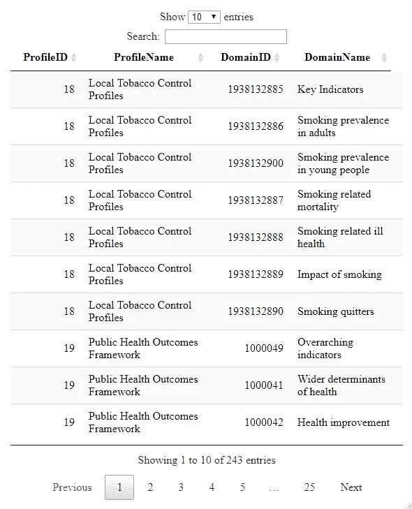

如前所述，我对**围产期心理健康**感兴趣，所以我会选择这些档案。

```
sel_profs <- profs[grepl("Perinatal Mental Health", profs$ProfileName),]
DT::datatable(sel_profs, rownames = FALSE)
```

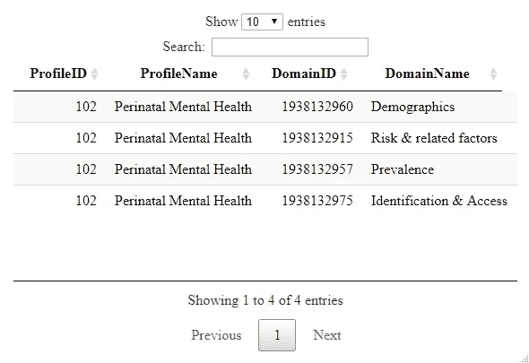

有四个**领域**与**围产期心理健康**相关。在这些领域中，有许多在不同时期、不同地域、不同性别、不同年龄段等出现的**指标**。

```
peri_inds <- indicators(ProfileID = sel_profs$ProfileID)
DT::datatable(peri_inds, rownames= FALSE)
```

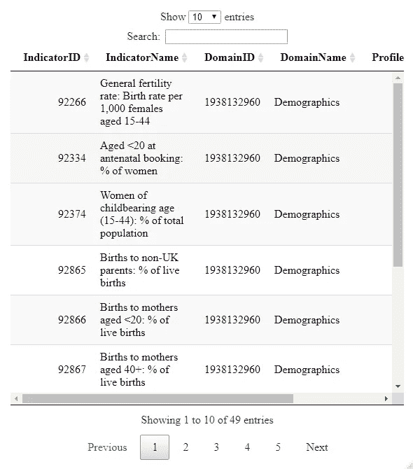

这给了我们 **49** 围产期心理健康**指标**，我们现在可以使用**指尖 _ 数据()**函数结合调用 **purrr::map()** 来提取这些指标。

```
peri_df <- peri_inds$IndicatorID %>% map(~fingertips_data(IndicatorID = .))
```

这导致 **49** 不稳定；但是，许多是空的，需要删除。

我将对这 49 个指标使用降维(PCA)和聚类(PAM)来生成具有类似围产期心理健康指标特征的县的聚类。这可能有助于确定区域差异，并可能有助于改进研究和控制工作的未来框架。

我将从**风险&相关因素**领域中选择**抑郁症:%记录患病率(18 岁以上)**作为所有其他指标匹配的关键指标。下面的代码在县一级提取这些数据，将值变量重新编码为最近的发病率，并提取病例的总体发病率。我过滤掉缺失的数据，并调整时间段来代表每个滚动平均值的最后一年。

```
peri_inc <- as_tibble(peri_df[[10]]) %>% 
        dplyr::filter(AreaType %in% "County & UA") %>% 
        dplyr::select(AreaName, Timeperiod, rec_inc_rate = Value) %>% 
        mutate(Timeperiod = Timeperiod %>% 
                 str_split("/") %>% 
                 map_chr(first) %>% 
                 as.numeric() %>% 
                 {. + 2} %>% 
                 as.character())peri_df_extraction <- function(peri_df, var_name, area_type = "County & UA") {
  df <- peri_df %>% 
    filter(AreaType %in% area_type) %>% 
    dplyr::select(AreaName, Value, Timeperiod) %>% 
    rename_at(.vars = vars(Value), funs(paste0(var_name)))

  return(df)
}var_names <- c("fertility_rate",
               "booking_under_20",
               "reproductive_age",
               "non_UK",
               "birth_under_20",
               "booking_over_40",
               "booking_BAME",
               "poverty",
               "IDACI",
               "homelessness",
               "contraceptions_under_18",
               "single_parent",
               "sever_mental_illness",
               "drug_treatment",
               "alcohol_treatment",
               "child_protection", 
               "child_in_need", 
               "infant_mortality",
               "child_looked_after", 
               "sole_birth",
               "complex_social_factors",
               "multiparity",
               "caesarean",
               "preterm",
               "stillbirth",
               "abuse", 
               "skin_contact",
               "distress_lb", 
               "distress_ub", 
               "mild_depressive_lb", 
               "mild_depressive_ub", 
               "chronic_SMI", 
               "postpartum_psychosis", 
               "PTSD", 
               "severe_depressive",
               "booking_detection",
               "booking_substance",
               "booking_support",
               "booking_alcohol",
               "booking_complex_social_factors",
               "booking_early",
               "less_14_days",
               "review_8_weeks",
               "review_12_months",
               "antenatal_MH_detection",
               "postnatal_MH_detection",
               "postnatal_emotional_change",
               "postnatal_MH_support"
               )extracted_tb <- map2(peri_df[-10], var_names, ~peri_df_extraction(.x, .y)) %>% 
    reduce(full_join, by = c("AreaName", "Timeperiod"))com_peri_df <- peri_inc %>% 
  left_join(extracted_tb, by = c("AreaName", "Timeperiod")) %>% 
  mutate(year = Timeperiod %>% as.numeric) %>% 
  mutate_if(is.character, as.factor) %>% 
  dplyr::select(-Timeperiod)skimr::skim(com_peri_df)
```

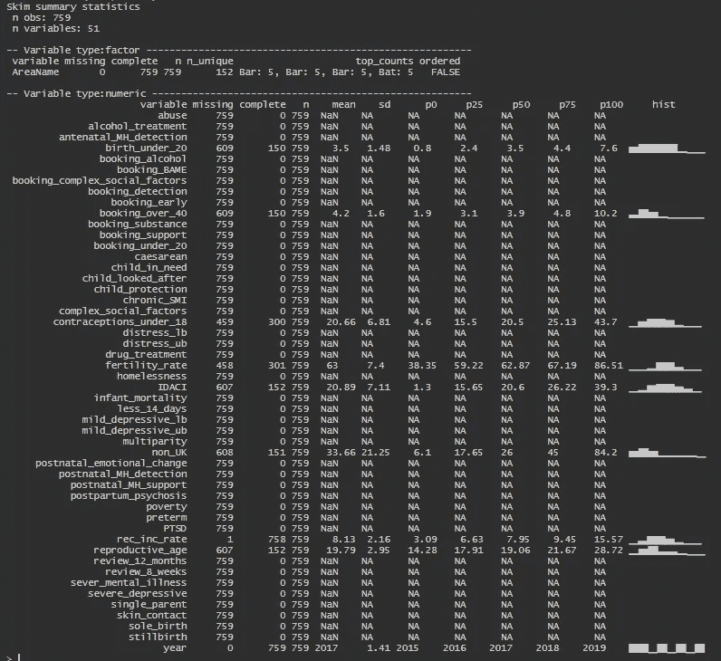

我们需要检查数据的完整性:

```
get_frac_missing <- function(df) {
  df %>% 
    nest() %>% 
    mutate(missing = map(data,~map_dfr(. ,~sum(is.na(.))/length(.)))) %>% 
    dplyr::select(-data) %>% 
    unnest(missing) 
}## Get the proportion missing per variableby year
peri_miss_per_year <- com_peri_df %>% 
  group_by(year) %>% 
  get_frac_missing %>% 
  mutate_all(~round(., 2)) %>% 
  arrange(year)## Drop full missing variables
peri_partial_miss_year <- peri_miss_per_year %>% 
  select_if(~!sum(.) == length(.))## Full missing variables
com_miss_vars <- setdiff(names(peri_miss_per_year), names(peri_partial_miss_year))## Which year has the most complete data
peri_complete_years_all_vars <- com_peri_df %>% 
  group_by(year) %>% 
  nest() %>% 
  mutate(missing = map(data,~mean(colSums(is.na(.))/nrow(.)))) %>% 
  dplyr::select(-data) %>% 
  unnest(missing) %>% 
  mutate(missing = round(missing, 2)) %>% 
  arrange(year)DT::datatable(peri_complete_years_all_vars, rownames = FALSE)
```

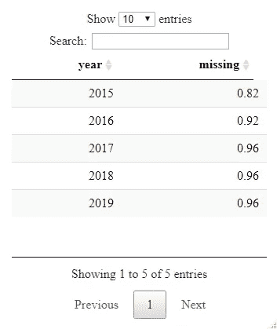

通常我会用最新的可用数据；然而，在这种情况下，它是相当稀疏的，所以让我们看看来自 **2015 年的数据。**

```
peri_df_2015  <- janitor::remove_empty(com_peri_df) %>% 
  filter(year == 2015) %>% 
  filter(rec_inc_rate > 7.39) %>% 
  select(-year)DT::datatable(peri_df_2015, rownames = FALSE)
```

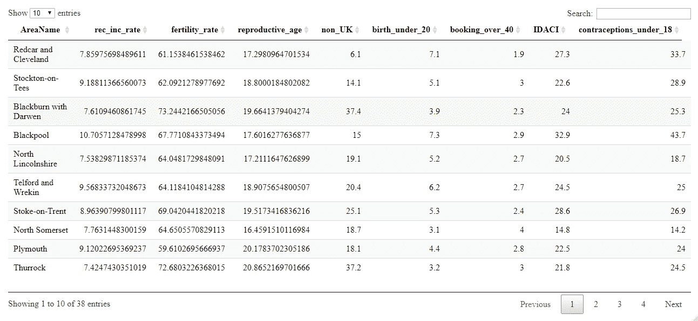

这给我们留下了 2015 年以来 38 个县的 8 个孕产妇心理健康指标的整洁数据集。

## 降维

我们现在准备对数据进行一些聚类分析。第一步是使用 PCA 降低数据的维数。我们使用 FactoMineR 包中的 **estim_ncp** 函数(该函数使用本文中概述的[方法)来估计所需的主要组件的数量。然后，我们执行主成分分析，并绘制每个成分解释的方差，作为对 **estim_ncp** 的检查。以下所有分析都是使用嵌套 tibbles 完成的，因此可以很容易地推广到更高维的用例。](https://www.sciencedirect.com/science/article/pii/S0167947311004099)

让我们使用 **estim_ncp** 函数计算主成分的最佳数量，使用 **prcomp** 函数执行 PCA，并绘制每个成分解释的方差，作为对 **estim_ncp** 的检查。

```
df <- as.data.frame(peri_df_2015)
FactoMineR::estim_ncp(df[2:9], ncp.min = 2, ncp.max = 10) 
```

组件的最佳数量为 **4。**

```
peri_pca <- peri_df_2015 %>% 
  nest() %>% 
  mutate(
    numeric_data = map(data, ~select_if(., is.numeric) %>% 
                         as.data.frame()),
    optimal_pca_no = map(numeric_data, ~estim_ncp(., 
                                                  scale = TRUE, 
                                                  ncp.min = 2, 
                                                  ncp.max = 6)) %>% 
      map_dbl(~.$ncp),
    pca = map(numeric_data, ~prcomp(.x, 
                                    center = TRUE, 
                                    scale = TRUE)),
    pca_data = map(pca, ~.$x),
    pca_aug = map2(pca, data, ~augment(.x, data = .y)))## Variance explained
var_exp <- peri_pca %>% 
  dplyr::select(-optimal_pca_no) %>% 
  unnest(pca_aug) %>% 
  summarize_at(.vars = vars(contains("PC")), .funs = funs(var)) %>% 
  gather(key = pc, value = variance) %>% 
  mutate(var_exp = variance/sum(variance) * 100,
         cum_var_exp = cumsum(var_exp),
         pc = str_replace(pc, ".fitted", "") %>% 
           str_replace("PC", ""))## Plot variance explained
var_exp %>% 
  rename(
    `Variance Explained` = var_exp,
    `Cumulative Variance Explained` = cum_var_exp
  ) %>% 
  gather(key = key, value = value, `Variance Explained`, `Cumulative Variance Explained`) %>%
  mutate(key = key %>% 
           factor(levels  = c("Variance Explained", 
                              "Cumulative Variance Explained"))) %>% 
  mutate(value = value / 100) %>% 
  mutate(pc = factor(pc, levels = as.character(1:max(var_exp$pc %>% as.numeric)))) %>% 
  ggplot(aes(pc, value, group = key)) + 
  geom_point(size = 2, alpha = 0.8) + 
  geom_line(size = 1.1, alpha = 0.6) + 
  facet_wrap(~key, scales = "free_y") +
  theme_bw() +
  labs(
    title = "Variance Explained by Principal Component",
    subtitle = paste0("The optimal number of principal components suggested by estim_ncp was ",
                      peri_pca$optimal_pca_no, " which explains ", round(var_exp$cum_var_exp[[2]], 0), "% of the data."),
    x = "Principal Component",
    y = "Variance Explained (%)",
    caption = "[@MattOldach](http://twitter.com/MattOldach) Source: Public Health England (fingertipsR)"
  )
```

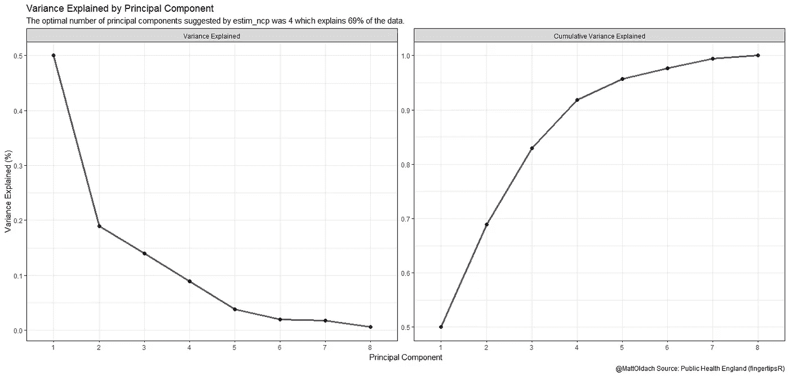

```
## Perform pam on pca data 1 to 6 groups
peri_pca_pam <- peri_pca %>%
  mutate(centers = list(2:10)) %>% 
  unnest(centers, .preserve = everything()) %>% 
  dplyr::select(-centers, centers = centers1) %>% 
  group_by(centers) %>% 
  mutate(
    pam = map(pca_data,
              ~ pam(x = .x[, 1:optimal_pca_no], k = centers, stand = TRUE)),
    clusters = map(pam, ~.$clustering),
    avg_silhouette_width = map(pam, ~.$silinfo$avg.width),
    data_with_clusters = map2(.x = data, .y = clusters, ~mutate(.x, cluster = factor(.y, ordered = TRUE)))
  ) %>% 
  ungroup## Get max silhouette width
max_silhouette_width <- peri_pca_pam %>% 
  dplyr::select(centers, avg_silhouette_width) %>% 
  unnest(avg_silhouette_width) %>% 
  arrange(desc(avg_silhouette_width)) %>% 
  slice(1)

## Plot average silhouette width
peri_pca_pam %>% 
  dplyr::select(centers, avg_silhouette_width) %>% 
  unnest(avg_silhouette_width) %>% 
  ggplot(aes(x = centers, y = avg_silhouette_width)) +
  geom_line(size = 2, alpha = 0.4) +
  geom_point(size = 3, alpha = 0.8) +
  theme_bw() +
  scale_x_continuous(breaks = seq(1, 10, 1), minor_breaks = NULL) +
  scale_y_continuous(limits = c(NA, NA), breaks = seq(0, 1, 0.01), minor_breaks = NULL) +
  labs(title = "Average Silhouette Width by Number of PAM Clusters",
       subtitle = paste0("The optimal number of clusters identifed by avg. silhouette width was ",
                      max_silhouette_width$centers,
                      " with an avg. silhouette width of ", 
                      round(max_silhouette_width$avg_silhouette_width, 2)
       ),
       x = "Clusters",
       y = "Avg. Silhouette Width",
       caption = "[@MattOldach](http://twitter.com/MattOldach) Source: Public Health England (fingertipsR)")
```

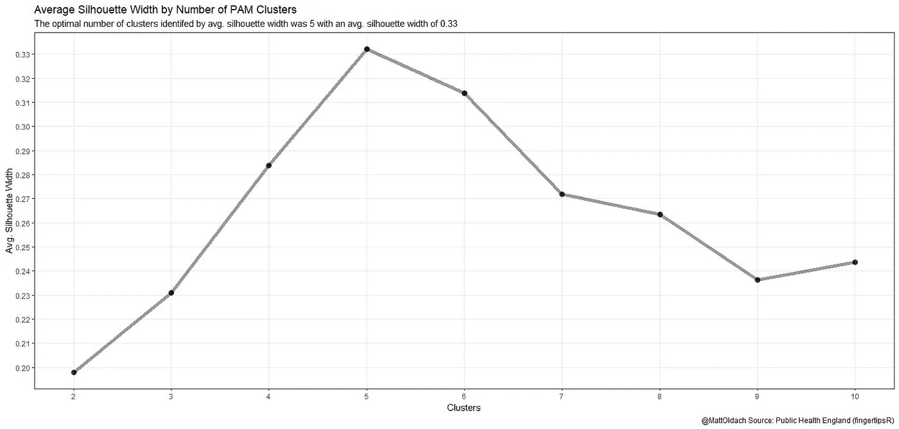

```
## Plot clusters
pca_plot <- peri_pca_pam %>% 
  filter(centers == max_silhouette_width$centers) %>% 
  select(data_with_clusters, pca) %>% 
  mutate(pca_graph = map2(.x = pca, 
                          .y = data_with_clusters,
                          ~ autoplot(.x, x = 1, y = 2, 
                                     loadings = TRUE, loadings.label = TRUE,
                                     loadings.label.repel = TRUE,
                                     loadings.label.size = 2, loadings.alpha = 0.8,
                                     loadings.label.vjust = -1, data = .y, 
                                     label = TRUE, label.label = "AreaName",
                                     label.size = 1.5, label.vjust = -1, 
                                     alpha = 0.3, frame = TRUE, 
                                     frame.type = 'convex', frame.alpha= 0.05,
                                     colour = "cluster", size = "rec_inc_rate") +
                            theme_bw() +
                            labs(x = paste0("Principal Component 1 (Variance Explained: ",
                                            round(var_exp$var_exp[[1]], 1), "%)"),
                                 y = paste0("Principal Component 2 (Variance Explained: ",
                                            round(var_exp$var_exp[[2]], 1), "%)")) +
                            guides(colour=guide_legend(title = "Cluster", ncol = 2), 
                                   fill=guide_legend(title= "Cluster", ncol = 2),
                                   size = guide_legend(title = "Depression: % recorded prevalence",
                                                       ncol = 2)) +
                           scale_color_manual(name = "Cluster",
                                              values = c("#6b5b95",
                                                         "#feb236",
                                                         "#d64161",
                                                         "#ff7b25",
                                                         "#87bdd8")) +
                           scale_fill_manual(name = "Cluster",
                                              values = c("#6b5b95",
                                                         "#feb236",
                                                         "#d64161",
                                                         "#ff7b25",
                                                         "#87bdd8")) +
                            theme(legend.position = "bottom", 
                                  legend.box = "horizontal") +
                            labs(
                              title = "Maternal Mental Health in England",
                              subtitle = "The arrows are variable loadings and points are counties coloured by cluster membership",
                              caption = "[@MattOldach](http://twitter.com/MattOldach) Source: Public Health England (fingertipsR)"
                            )
  )) %>% 
  pull(pca_graph) %>% 
  firstpca_plot
```

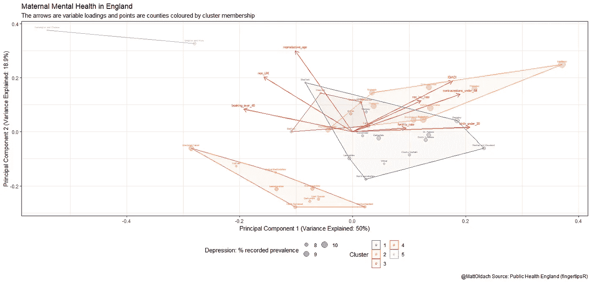

```
sum_peri_df <- peri_pca_pam %>% 
  filter(centers == max_silhouette_width$centers) %>% 
  pull(data_with_clusters) %>% 
  map(~ gather(., key = "Variable", value = "value", -AreaName, -cluster)) %>% 
  first %>% 
  rename(Cluster = cluster)plot_cluster_diff <- sum_peri_df %>% 
  ggplot(aes(x = Variable, y = value, col = Cluster, fill = Cluster)) +
  geom_violin(draw_quantiles = c(0.025, 0.5, 0.975), alpha = 0.2, scale = "width") +
  geom_jitter(position = position_jitterdodge(), alpha = 0.3) +
  coord_flip() +
  theme_minimal() +
  scale_y_continuous(breaks = seq(0, 100, 6), minor_breaks = NULL) +
  scale_fill_manual(name = "Cluster",
                                              values = c("#6b5b95",
                                                         "#feb236",
                                                         "#d64161",
                                                         "#ff7b25",
                                                         "#87bdd8")) +
  scale_color_manual(name = "Cluster",
                                              values = c("#6b5b95",
                                                         "#feb236",
                                                         "#d64161",
                                                         "#ff7b25",
                                                         "#87bdd8")) +
  theme(legend.position = "bottom") +
  labs( 
    title = "Maternal Mental Health in England; Summarised by Cluster",
    subtitle = "Violin plots are scaled by width, with the 2.5%, 50% and 97.5% quantiles shown.",
    x = "Variable",
    y = "Recorded % depression prevalance (aged 18+) for rec_int_rate, otherwise proportion (0-100%)",
    caption = "[@MattOldach](http://twitter.com/MattOldach) Source: Public Health England (fingertipsR)")plot_cluster_diff
```

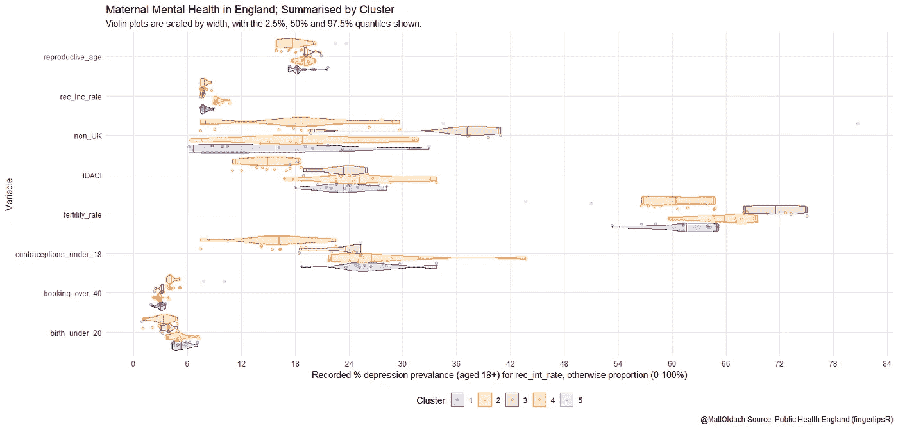

从这些图中，我们看到，显示较高近期增长率的第三组有较高比例的产后精神病、轻度抑郁和苦恼。

我们可以在地图上用英国数据服务提供的英国各县的轮廓来绘制每个县的聚类成员关系([在此](https://borders.ukdataservice.ac.uk/easy_download_data.html?data=England_ct_2011)下载 ShapeFiles，在此[下载](https://borders.ukdataservice.ac.uk/easy_download_data.html?data=England_urb_2001))。

```
peri_cluster_map <- function(peri_pca_pam) {
gpclibPermit()england_counties <- rgdal::readOGR("england_ct_2011.shp") %>%
  fortify(region = "code") %>% 
  as_tibbleengland_urban_areas <- rgdal::readOGR("england_urb_2001.shp") %>% 
  fortify(region = "name") %>% 
  as_tibble %>% 
  filter(id %in% c("Sheffield Urban Area", 
                   "Plymouth",
                   "Skelton (Redcar and Cleveland)",
                   "Brighton/Worthing/Littlehampton",
                   "Leicester Urban Area"
                   ))## Make custom positions for urban area labels
urban_area_labels <- england_urban_areas %>%
  group_by(id) %>% 
  slice(100) %>% 
  ungroup() %>% 
  mutate(long = long - 200000,
         lat = lat + 20000)

peri_cluster_results <- peri_pca_pam %>% 
  filter(centers == max_silhouette_width$centers) %>% 
  pull(data_with_clusters) %>% 
  firstperi_cluster_results <- peri_df[[14]] %>% 
              dplyr::select(AreaName, AreaCode, AreaType) %>% 
  filter(AreaType %in% "County & UA") %>% 
              unique %>% 
  left_join(peri_cluster_results,
            by = "AreaName") %>% 
  left_join(england_counties, by = c("AreaCode" = "id"))peri_cluster_results %>% 
  rename(Cluster = cluster) %>% 
  drop_na(Cluster) %>% 
  dplyr::select(long, lat, Cluster, group) %>% 
  ggplot( 
                 aes(x = long, 
                     y = lat,
                     fill = Cluster)) +
    geom_polygon(data = england_urban_areas, 
                 aes(group = group, fill = NULL),
                 alpha = 0.4) +
    geom_path(data = peri_cluster_results, 
              aes(group = group, fill = NULL), 
              alpha = 0.4) +
    geom_polygon(data = peri_cluster_results, 
                 aes(group = group, fill = NULL),
                 alpha = 0.1) +
    geom_polygon(aes(group = group), alpha = 0.6) +
    geom_line(data = urban_area_labels %>% 
                bind_rows(urban_area_labels %>% 
                            mutate(long = long + 200000, 
                                   lat = lat - 20000)),
              aes(fill = NA, group = id), alpha = 0.8) + 
    geom_label(data = urban_area_labels,
              aes(label = id), fill = "grey") +
    scale_fill_manual(name = "Cluster",
                                              values = c("#6b5b95",
                                                         "#feb236",
                                                         "#d64161",
                                                         "#ff7b25",
                                                         "#87bdd8")) +
    coord_equal() +
    theme_map() +
    theme(legend.position = "bottom") +
    labs(title = "Maternal Mental Health Indicators; Map of County Level Clusters in England",
         subtitle = "Using data from 2015",
         caption = "Selected urban areas are shown (dark grey) and labelled.
[@MattOldach](http://twitter.com/MattOldach) Source: Public Health England (fingertipsR)
Contains National Statistics data © Crown copyright and database right 2019\. 
         Contains OS data © Crown copyright and database right 2019")
}plot_peri_cluster_map <- peri_cluster_map(peri_pca_pam)plot_peri_cluster_map
```

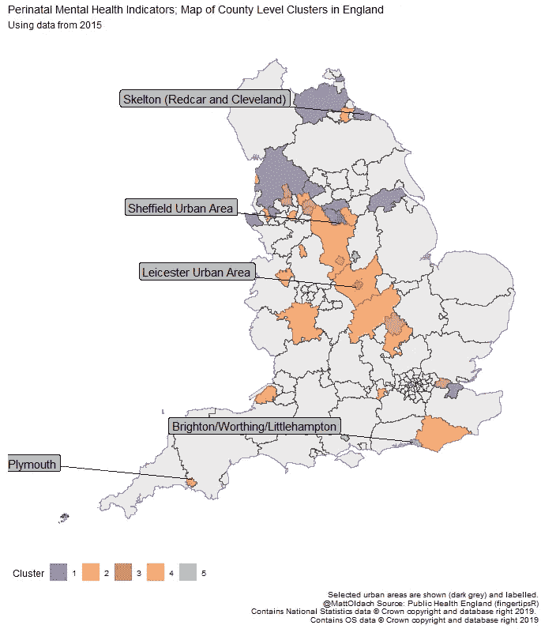