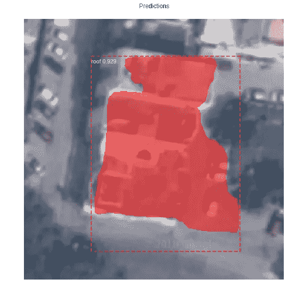
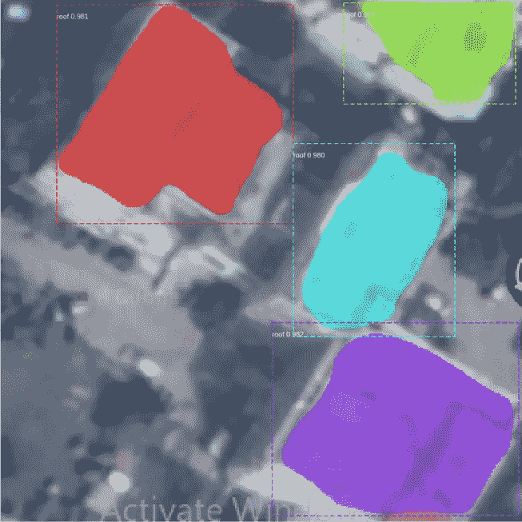
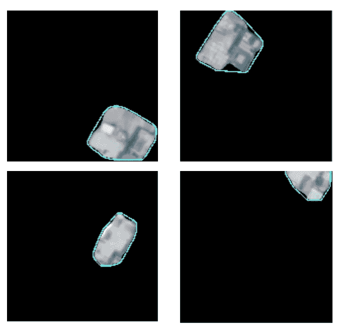

# 用掩蔽 R-CNN 模型识别低分辨率图像上的屋顶

> 原文：<https://towardsdatascience.com/identifying-rooftops-on-low-resolution-images-with-masked-r-cnn-model-6edd79310ec0?source=collection_archive---------25----------------------->

*工作由* [*传承巴胡古纳*](https://www.linkedin.com/in/smriti-bahuguna/)*[*拉西卡乔希*](https://www.linkedin.com/in/rasikajoshi1/) *完成。**

*在我之前的帖子中，我写了我们如何使用 U-Net 模型来识别低分辨率卫星图像中的屋顶。我还写了我们如何利用一个 ML 爱好者社区来构建解决方案。在这篇文章中，我将分享另一个模型的结果，即掩蔽 R-CNN。如果你想了解更多关于我们正在解决的问题，请阅读[机器学习如何在清洁能源领域带来一个新时代](https://medium.com/savera-ai/machine-learning-bringing-a-new-era-in-the-energy-sector-distributed-abundant-and-a-clean-world-cf06365c29ff)。*

*由于来自印度(和大多数发展中国家)的卫星图像的质量是低分辨率的，手头的任务的复杂性增加了。类似的解决方案如[谷歌天窗项目](https://www.google.com/get/sunroof#p=0)只适用于高分辨率图像，不适用于大多数发展中国家。*

*面具 R-CNN 是由脸书人工智能研究小组制造的。Mask R-CNN 的工作原理相当简单。研究人员将两个先前存在的模型结合在一起，并对线性代数进行了研究。该模型可以分为两部分——区域建议网络(RPN)和二值掩码分类器。第一步是获得一组可能包含相关对象的边界框。第二步是给盒子上色。*

*我们使用该模型的目的是分割或分离图像中的每个屋顶实例。*

**

*Example of outputs we want*

*我们的挑战始于缺乏数据，因为没有屋顶数据集。*

*我们使用在“coco”数据集上训练的来自 Mask R-CNN 网络的权重作为我们模型的起点，该数据集最初被训练来识别 80 个类，但是没有屋顶。Resnet 101 被用作主干结构。我们开始为“头”层训练我们的模型，即网络的 RPN、分类器和掩码头；因为训练整个网络将需要大量的数据，并且因为它是在许多不同的类上预先训练的模型，所以这将是一个好的开始。然后，为了查看它在预测中产生的差异，我们将培训提升到 Resnet 101 体系结构的第 4 和第 5 阶段。*

*我们也尝试了不同的变化。图像大小从 1024X1024 更改为 320X320，因为我们的训练图像大小为 300X300，而填充将其增加到 1024 似乎不是一个好主意。*

**

*Multiple models that we used with changing image size and processing*

*下面是一些输入图像的结果。*

**

*Original Image (1)*

******

*我们比较了另外 20 个屋顶的结果，我们的结果显示模型 4 通常表现最好。*

*然后，我们尝试将最小检测置信度阈值从 0.9 更改为 0.7。低于该值的感兴趣区域(ROI)将被跳过。这样做是因为对于检测屋顶来说，0.9 似乎是一个非常高的阈值，当它可以被降低到足以预测任何区域作为屋顶时，因为屋顶不是复杂的，定义良好的和非常具体的区域；因此，任何地区，可以成为一个很好的候选屋顶应予以考虑。值为 0.7 时，我们有更多的区域，但它也显示了许多重叠的屋顶区域，而值为 0.9 时，我们有几个大斑点将所有相邻的屋顶作为一个区域。*

**

*Detection confidence 0.7*

**

*Detection confidence 0.9*

*除此之外，我们试图通过将优化器从随机梯度下降(SGD)改为 Adam 优化器来训练模型。*

*以下是使用 SGD 和 Adam optimizer 训练的模型的结果图像。训练是有 70%和 90%的把握完成的。对每个训练好的模型进行 70%和 90%置信度的测试。*

**

*Adam Optimizer 0.7 threshold*

**

*SGD 0.7 threshold*

**

*Adam Optimizer threshold 0.7*

**

*SGD threshold 0.7*

***我们的发现:***

*1.与 SGD 训练模型相比，Adam optimizer 训练模型无法预测所有实例，也无法区分相邻屋顶。*

*2.SGD 训练的模型比 Adam 训练的模型预测更清晰的遮罩。这表明 SGD 对我们的模型更好，我们将继续使用它。*

*关于 SGD 变化:*

*1.以 70%的置信度训练模型增加了遮罩的数量，因为它已经被训练为也考虑低概率屋顶，这导致重叠遮罩。而 90%的训练是给更干净更少的面具。所以，用 90%训练似乎是更好的选择。*

*2.现在，用 70%的置信度还是 90%的置信度来预测口罩？90%太精确，可能会删除其他选项，而 70%将包括它们，如图 4 和 7 所示。因此，在训练了更多数量的图像(目前训练了超过 95 张图像)之后，我们将能够看到哪一张能够最终被使用。*

*作为识别各个屋顶的最后一步，我们做了一些后期处理。我们从奇怪的彩色形状中创造出规则的形状。在 607 幅图像的数据集上进行后处理。*

**

*Output from Masked R-CNN*

**

*Individual rooftops*

********

*最后，我们还要感谢 Paul 和 Piyush 提供了培训数据。如果有人想进一步帮助我们，请加入我们的 [git repo](https://github.com/SaveraLLC/rooftop-edge-detection) 或联系 rudradeb@savera.ai*