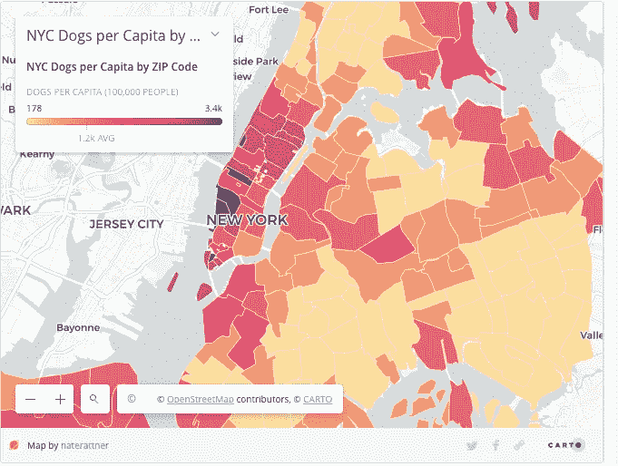
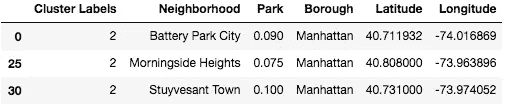
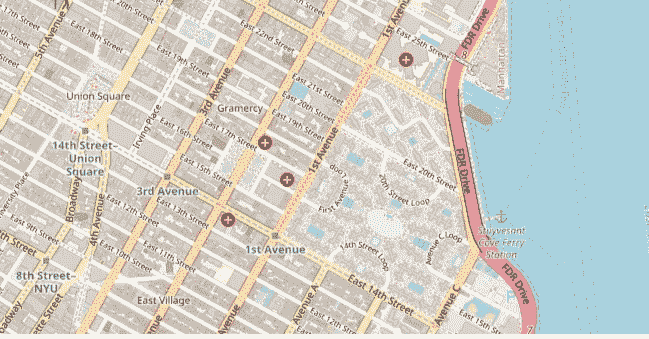
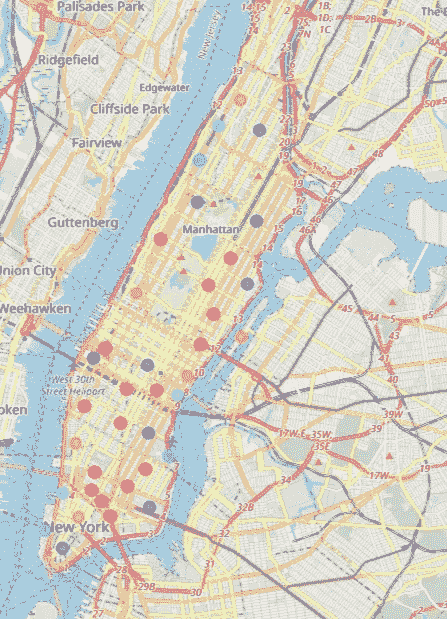
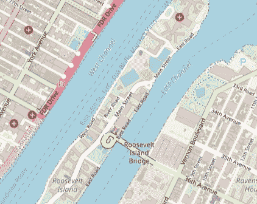
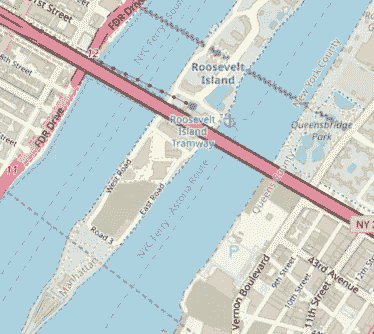
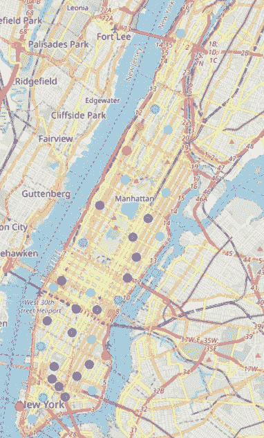

# 确定纽约曼哈顿对狗最友好的社区

> 原文：<https://towardsdatascience.com/identifying-the-most-dog-friendly-neighborhoods-in-manhattan-new-york-city-732080688353?source=collection_archive---------24----------------------->

## 介绍

无论你是狗主人还是狗护理行业的企业，确定城市中对狗友好的地点始终是一项重要的任务。在世界各地的大都市中，纽约市(NYC)被认为是对狗最友好的城市之一，它有许多公园、狗场和适合散步的社区。根据纽约市政府的在线数据平台纽约开放数据(New York Open Data)的数据，截至 2019 年 7 月 26 日，该市有 345，727 只狗拥有有效的许可证。这份报告旨在确定曼哈顿对狗最友好的社区，这是纽约市狗最密集的一个区。

A heat map of New York’s dog population per capita by Nate Rattner showing that Manhattan is the most dog-dense borough in New York City

## 目标

这份报告评估了曼哈顿社区的友好程度，从而为这个大都市的狗主人和狗护理企业确定了最佳社区。为此，我们主要集中分析曼哈顿社区养狗所需的公共设施的可用性，即公园、狗场和宠物设施。这份报告的发现将为纽约市，尤其是曼哈顿的狗主人和狗护理行业的企业提供有用的信息来源。

## 数据

为了实现其目标，该报告使用了以下数据:
·纽约大学的纽约市社区列表，包含 5 个区的 306 个社区:[https://geo.nyu.edu/catalog/nyu_2451_34572](https://geo.nyu.edu/catalog/nyu_2451_34572)。
使用 Python 地理编码包
获得每个社区的经度和纬度；使用 Foursquare API 获得每个社区的场地数据。特别是，Foursquare API 提供了基于位置的体验，提供了关于地点、用户、照片和签到的各种信息。它支持实时访问地点，将用户分配到特定位置。

## 方法学

首先，我们需要创建一个数据框，其中包含曼哈顿所有街区的完整列表及其坐标纬度和经度。此步骤需要:
从纽约大学的空间数据存储库中加载 2014 年纽约市街区名称数据集，并将其转换为 panda 数据框。
使用 Geocoder 检索每个街区的经度和纬度，这是一个允许我们将位置地址转换为地理坐标的包。

下一步，我们将使用 Foursquare API 探索曼哈顿附近的场地位置。Foursquare API 是一种社交定位服务，允许用户探索他们周围的世界。有了 Foursquare 开发人员帐户，我们可以使用我们的用户凭证来搜索附近特定类型的场馆，探索特定的场馆，以及搜索某个位置周围的热门场馆。

出于这个项目的目的，我们将主要关注公共公园和遛狗场，这两个设施对于任何一个对狗友好的社区都是必不可少的。使用 Foursquare API，我们可以很容易地在曼哈顿的各个街区检查公园和狗跑的出现频率的平均值。从这里开始，我们评估曼哈顿社区对狗友好程度的任务可以归结为找出公园和狗赛跑出现频率最高的社区。为了使结果在视觉上引人入胜，我们还会将邻域分组，并为每个分组分配颜色和标签。这一步将通过采用 k-means 聚类来完成，k-means 聚类是最简单和最流行的无监督机器学习算法之一，它将数据点分组到以质心为中心的最近的聚类中。

最终结果将是代表曼哈顿公园和狗群不同聚集程度的彩色编码地图。

## 结果和观察

我们的数据分析显示，曼哈顿公园最集中的 3 个街区是:
·斯图文森镇
·巴特利公园市
·晨边高地

Manhattan’s neighborhoods with the highest concentration of parks

A Map of Stuyvesant Town showing that the neighborhood has plenty of parks and open spaces

A map of Manhattan showing clusters of neighborhood by the concentration of parks

值得注意的是，对公园最集中的社区 Stuyvesant Town 的场馆的进一步检查表明，在该社区 1 公里范围内的 30 个顶级场馆中，不仅有各种公园，还有一条小径、一个风景了望台、一家宠物咖啡馆甚至一家宠物服务店！这表明 Stuyvesant 镇确实是一个有各种选择或享受活跃的狗的社区。

关于**狗跑**，以下 3 个街区是最集中的区域:

Maps of Roosevelt Island showing that the neighborhood has plenty of parks and open spaces

对罗斯福岛附近热门场馆的进一步调查还显示，该岛附近 30 个顶级场馆中有 7 个是开放空间，包括 4 个公园、一个观景台、一个休闲公园和一个滨水区！在像纽约这样的混凝土丛林中，狗友好型社区是多么好的选择啊！

Map of Manhattan showing clusters of neighborhoods by the concentration of dog runs

## 讨论

有趣的是，在我们的分析中，炮台公园城是第二个最集中的公园社区，也被美国房地产市场 Street Easy 选为 2017 年纽约市对狗最友好的社区。Street Easy 的分析是基于每个社区的以下关键变量:(1)宠物友好型租赁单元的份额(2)狗保姆的份额(3)狗公园、狗跑道和非牵引带区域的数量(4)兽医的份额。我们的分析和 Street Easy 的相似性表明，公园和遛狗场等开放空间的高度集中确实是决定任何社区对狗友好的一个重要因素。

然而，我们也注意到，除了这些开放空间，还有相当多的其他设施对享受狗的乐趣同样重要，但我们没有能力包括在这份报告中，如步行人行道，宠物友好型餐厅和咖啡店，兽医诊所和宠物护理店。此外，除了所有必要的设施之外，一个社区只有在拥有大量健康的狗和热情的主人的情况下，才能真正做到对狗友好。事实上，在像纽约这样的大城市找到一个具备所有这些元素的社区并不容易。希望有了越来越多的有用信息，比如这份报告中提供的信息，狗的父母将会在为他们自己和他们毛茸茸的孩子选择最好的家时得到充分的信息。

## 局限性和进一步研究的建议

正如在讨论中提到的，在这项研究中，我们只研究了公园和遛狗区这两个对狗友好的社区的基本设施。我们认为，有相当多的其他变量应该包括在内，以提高研究的全面性。这些变量包括(但不限于)可步行性、安全性、宠物友好型餐厅和咖啡店的可用性、兽医诊所以及拥有有效许可证的狗的数量。据我们所知，纽约市/曼哈顿区的此类变量数据仅以邮政编码为单位。由于邮政编码不是一个通用的地理区域，而是由美国邮政服务为邮件投递创建的路线和地址的集合，因此通常更难处理。未来的研究可以找到一种方法将这一单位转换成相应的地理区域，以便上述数据可以很容易地投入使用。

参考资料:

1.  [https://www . nytimes . com/interactive/2018/02/08/real estate/dogs-of-new-York . html](https://www.nytimes.com/interactive/2018/02/08/realestate/dogs-of-new-york.html)
2.  [https://medium . com/@ nater attner/new-York-city-most-dog-dense-zip-codes-3697 e 2993908](https://medium.com/@naterattner/new-york-citys-most-dog-dense-zip-codes-3697e2993908)
3.  [https://street easy . com/blog/nycs-most-dog-friendly-neighborhoods/](https://streeteasy.com/blog/nycs-most-dog-friendly-neighborhoods/)
4.  [https://data . cityofnewyork . us/Health/NYC-Dog-Licensing-Dataset/nu7n-tubp/data](https://data.cityofnewyork.us/Health/NYC-Dog-Licensing-Dataset/nu7n-tubp/data)