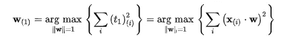
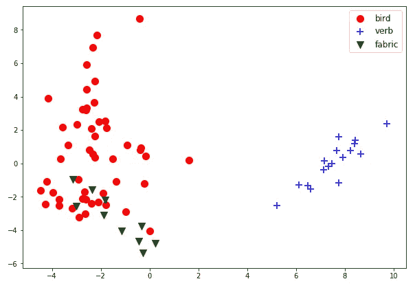
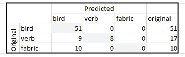

# 使用 BERT 识别单词的正确含义

> 原文：<https://towardsdatascience.com/identifying-the-right-meaning-of-the-words-using-bert-817eef2ac1f0?source=collection_archive---------16----------------------->

使用语境化单词嵌入的一个重要原因是，标准嵌入为单词的每个含义分配一个向量，然而，存在多个含义的单词。假设上下文的使用可以解决将多个意思的单词(同音异义词和同形异义词)分类到同一个嵌入向量中的问题。在这个故事中，我们将分析伯特嵌入是否可以用来对一个词的不同含义进行分类，以证明语境化的词嵌入解决了这个问题。

Duck or duck — based on images from [Pixabay](https://pixabay.com)

# 构建数据集

使用“鸭子”这个词的想法来自我今天早些时候看到的一条推文。由于单词有多种含义，这种误解比较常见。根据[韦氏词典，](https://www.merriam-webster.com/dictionary/duck)单词“duck”有 4 个意思。为了这个项目的简单，我把动词‘duck’和相应的名词归类为相同的意思:

1.  a)各种游禽(鸭科，鸭科),颈和腿短，足有蹼，喙通常宽而平，雌雄之间的羽毛通常不同
    ; b)这些鸟的肉可用作食物
2.  突然低下头或身体
3.  a)一种耐用的紧密编织的通常是棉布的纤维
    b)鸭子*复数 *:* 轻便的衣服尤其是鸭子做的裤子*

Misunderstanding the meaning of ‘duck’ — Tweet by [natsmama75](https://twitter.com/natsmama75) on [Twitter](https://twitter.com/natsmama75/status/1138878850832719878)

为了建立一个数据集，我使用了[你的字典](https://sentence.yourdictionary.com/duck)的句子数据库，搜索包括‘duck’的句子。从给出的例子中，我排除了那些我不能区分含义的名字、长句和案例。

最终数据集可在 GitHub 中获得。它包含 77 个句子，分布如下:50 个是指动物(类型 0)，17 个是动词的一种形式(类型 1)，10 个是指织物(类型 2)。

The duck dataset

# 伯特嵌入

对于这个故事的下一部分，我们将使用原始 BERT 基础无案例模型[1]中的 BERT 嵌入。这意味着使用最后一个隐藏层，我们为每个单词生成一个 768 大小的向量。

我们根据句子为每个单词生成上下文嵌入向量。然后，我们只保留“duck”单词标记的嵌入。这个故事的问题是，我们能否用这 768 个大小向量来对不同的意义进行分类。

# 主成分分析

[PCA](https://en.wikipedia.org/wiki/Principal_component_analysis) 是一种正交变换，我们将使用它来降低向量[2，3]的维数。PCA 以最大化降维数据的方差的方式为投影找到特殊的基向量(特征向量)。使用 PCA 有两个重要的好处。一方面，我们可以将 768 维向量投影到 2D 子空间，在那里我们可以将其绘制成数据。另一方面，它保持最大可能的方差(投影丢失信息)，因此，它可能保持足够的方差，以便我们可以识别图片上的类别。

Maximising variance for the first principal component — Equation from [Wikipedia](https://en.wikipedia.org/wiki/Principal_component_analysis)

使用带有`[sklearn.decomposition.PCA](https://scikit-learn.org/stable/modules/generated/sklearn.decomposition.PCA.html)`的 PCA 是一行程序:
`duck_pca = PCA(n_components=2).fit_transform(duck_embs)`

下图显示了使用前两个主成分的预测结果。这些类是手动注释的类型。正如我们所看到的，使用主成分分析，我们可以很容易地将动词类型与其他类型分开。

Duck meaning types. Projection using PCA

# 最近邻分类

由于数据集相对较小，我们将使用 k-NN 分类器，而不是神经网络[4]。k-NN 使用 k 个最接近的样本来预测新样本的类别。因为我们在第三类中只有 10 个样本，所以需要使用 k <20 as the k-NN selects the most represented class from the neighbourhood.

For the validation, we will use LOOCV (Leave One Out Cross-Validation) [5]. This means that for every sample, we build a model based on the other 76 samples and validate it with the single sample. Then, we calculate the accuracy of these 77 successful or unsuccessful prediction.

Using 【 , these steps are well prepared and easy to execute:

【

The evaluation of the LOOCV states**精度为 92.208%** 标准差为 26.805%。

# 与谷歌翻译的比较

我的母语匈牙利语用不同的词来表达“鸭子”的不同含义。因此，使用英匈翻译器，我们可以识别翻译器背后的神经网络(称为 GNMT [6]) *认为*，‘鸭子’是哪个意思。

Google Translate English-Hungarian translation of the ‘duck’ sentences

上表显示，所有鸟型“鸭”字都使用正确的类型进行翻译，17 个动词型字中有 8 个被翻译，但是，所有织物“鸭”字都被识别为鸟。这个结果显示了 75.641% 的准确率。

# 摘要

在这个故事中，我们展示了使用语境化的单词嵌入可以成功地解决多义词的问题。实验支持假设，即当我们使用 k-NN 分类器重建类型时，BERT 嵌入存储单词的不同含义。

[所有对应的代码都可以在 Google Colab](https://colab.research.google.com/drive/1rbhuZYjMGezLJmpzc9p8T38gXqILTHt_) 上找到。

# 参考

[1] Devlin，j .，Chang，M. W .，Lee，k .，& Toutanova，K. (2018 年)。 [Bert:语言理解深度双向转换器的预训练。](https://arxiv.org/abs/1810.04805) *arXiv 预印本 arXiv:1810.04805* 。

[2]皮尔逊，K. (1901 年)。 [LIII。在最接近空间点系统的直线和平面上。](https://www.tandfonline.com/doi/pdf/10.1080/14786440109462720) *《伦敦、爱丁堡和都柏林哲学杂志和科学杂志*， *2* (11)，559–572 页。

[3]h .霍特林(1933 年)。[将复杂的统计变量分析成主要成分。](https://psycnet.apa.org/record/1934-00645-001) *《教育心理学杂志》*， *24* (6)，417 页。

[4]盖，t .，&哈特，P. (1967 年)。[最近邻模式分类。](https://ieeexplore.ieee.org/abstract/document/1053964/) *IEEE 信息论汇刊*， *13* (1)，21–27。

[5]拉兴布鲁奇，P. A .，&米基，M. R. (1968 年)。[判别分析中错误率的估计。](https://amstat.tandfonline.com/doi/abs/10.1080/00401706.1968.10490530) *技术计量学*， *10* (1)，1–11。

[6]吴，m .舒斯特，陈，z .乐，Q. V .，m .马切里，w .，… &克林纳，J. (2016)。[谷歌的神经机器翻译系统:弥合人类和机器翻译之间的鸿沟。](https://arxiv.org/abs/1609.08144) *arXiv 预印本 arXiv:1609.08144* 。

# 用伯特的故事学习 NMT

1.  [BLEU-BERT-y:比较句子得分](https://medium.com/@neged.ng/bleu-bert-y-comparing-sentence-scores-307e0975994d)
2.  [嵌入关系可视化(word2vec，BERT)](https://medium.com/@neged.ng/visualisation-of-embedding-relations-word2vec-bert-64d695b7f36)
3.  机器翻译:一个简短的概述
4.  [使用 BERT 识别单词的正确含义](/identifying-the-right-meaning-of-the-words-using-bert-817eef2ac1f0)
5.  [机器翻译:对比 SOTA](/machine-translation-compare-to-sota-6f71cb2cd784)
6.  [使用 TensorFlow 2.0 的简单 BERT】](/simple-bert-using-tensorflow-2-0-132cb19e9b22)