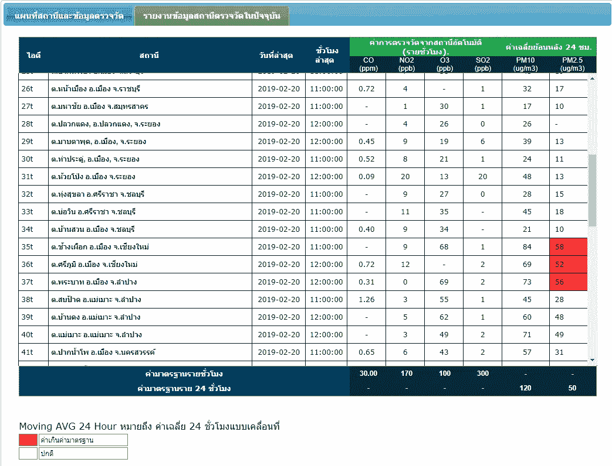
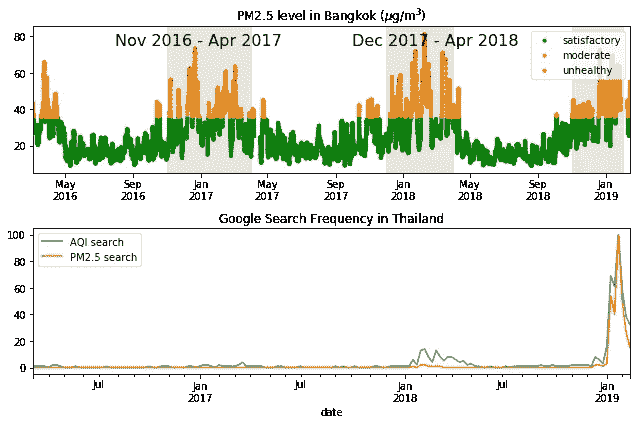
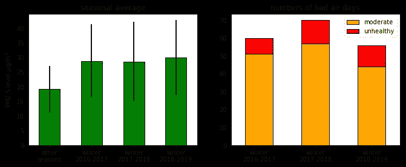
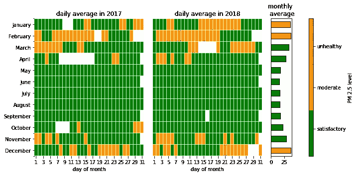
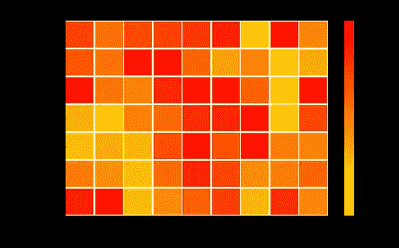
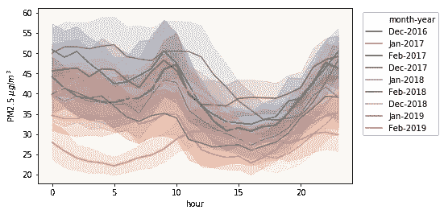
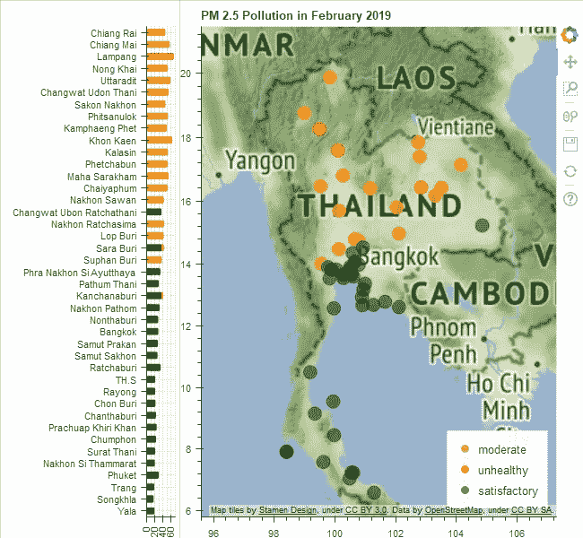
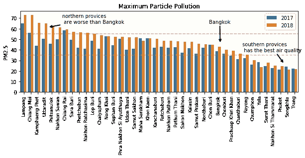
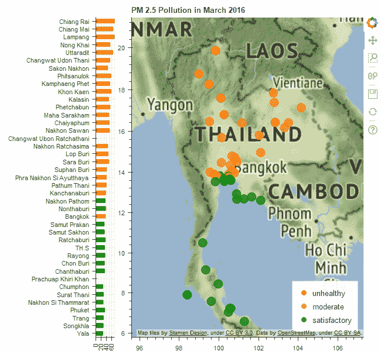

# 确定曼谷冬季空气污染的来源第一部分

> 原文：<https://towardsdatascience.com/identifying-the-sources-of-winter-air-pollution-in-bangkok-part-i-d4392ea608dc?source=collection_archive---------10----------------------->

Air Pollution Map near Bangkok in January 2019

在许多亚洲国家，空气污染是一个严重的环境威胁。在泰国，由于 2019 年冬季曼谷的空气污染程度较高，这个问题最近变得更加突出。空气污染通过空气质量指数(AQI)来报告，数值越高表明空气污染越严重。了解当前的室外空气质量可以帮助你保护自己。

游客和当地人可能会有这样的疑问:空气污染越来越严重了吗？是否存在一天中的某个时间或一周中的某天的依赖性？曼谷以外的省份呢？在这篇博文的第一部分，我将通过可视化公开的空气污染数据来回答这些问题。根据这些数据，我们可以对空气污染的来源提出一些假设。在这篇博文的第二部分，我将对空气污染数据进行建模。

用于生成这些图的代码可以在 GitHub 上我的[笔记本](https://github.com/worasom/aqi_thailand/blob/master/viz_AQI.ipynb)中找到。这项工作的灵感来自于数据狂人在脸书的一篇帖子。看看我早先的[博客](https://medium.com/@worasom/scraping-air-pollution-data-from-thailand-epa-a866f291c06)的帖子，详细介绍了如何从政府网站上删除空气污染数据。

# AQI 是如何计算的？

环境机构使用空气质量指数(AQI)报告空气污染测量值。如何将这些测量值转换成数字的细节取决于当地法律。一般来说，环境机构需要监测四种污染源:地面 ozone(O₃、颗粒污染(PM2.5 和 PM10)和有毒气体(NO₂、CO、SO₂).下面的快照显示了泰国环境署网站提供的 2019 年 2 月 2 日泰国各监测站的 CO，NO₂，O₃，SO₂，PM10 和 PM2.5 水平的报告。空气污染指数在大多数地方都是正常的，除了北部省份的高水平 PM2.5，以红色显示。

计算每种主要污染物的 AQI 值(每种都有自己的公式)，并报告 24 小时内的最高平均 AQI 值  。由于上述数据表明 PM2.5 污染物较高，我们将重点分析 PM2.5 数据。

PM2.5 是对大气中小于 2.5 微米的颗粒的测量。在美国，PM2.5 浓度高于 35.4 g/m 相当于 AQI 为 100，对于普通人群来说被认为是中度污染，对于敏感人群(儿童、孕妇和老年人)来说是不健康的。高于 55.4 克/立方米的 PM2.5 对应的 AQI 为 150，被认为是不健康的。

是什么导致了去年冬天曼谷高度的空气污染？PM2.5 颗粒的主要来源是汽车发动机、发电厂和农业废物燃烧的废气，这导致了许多理论——停滞的气流、老旧的柴油车、燃煤电厂和邻近省份的农业燃烧。随着公众对这个问题关注的增加，人们也开始怀疑空气污染是否正在恶化。政府提出了一些短期措施来解决这个问题。但是为了最有效的缓解，我们需要了解污染的来源。

# 曼谷的冬季阴霾

PM 2.5 pollution in Bangkok over time( the gray vertical bands are guide to the eyes), and the corresponding google trend

让我们从寻找一般趋势开始。这些数据来自伯克利地球 T2 数据库 T3。曼谷的空气污染似乎是季节性的，在冬天会激增。这似乎不是一个新问题，但公众的认识只是最近才提高的。曼谷的空气质量实际上仍然比许多亚洲国家好。

空气污染越来越严重了吗？我取了每年年末(9 月—5 月)的平均值，并计算了 PM 2.5 AQI 较高的天数:

Yearly average PM 2.5 AQI and the number of bad air days

PM2.5 AQI 的年平均值在 2018-2019 年冬季似乎略有增加，而前几年的污染情况相当。这可能是由于测量次数较少，因为 2018-2019 年冬季剩余时间的数据尚未测量。对于天数图，我使用前几年同一时间的天数来估计缺失的数据。在空气不良天数方面，2017-2018 年冬季有 70 天空气质量指数非常高，比上一年多 10 天。在没有更多数据的情况下，很难从这张图表判断情况是否在恶化。

如果你担心空气质量，作为一名去曼谷旅游的游客，你应该避开哪几个月？作为一名居民，什么时候去慢跑最合适？放假大家都不在的时候空气污染好一些吗？为了回答这些问题，我使用 2017 年和 2018 年的数据绘制了不同月份的日平均值。

Daily average of PM2.5 pollution in 2017 and 2018

我们再次看到 PM2.5 污染的季节性趋势。2017 年和 2018 年，污染大约从 10 月下旬开始，持续到 4 月初。2017 年新年假期期间的空气质量似乎更好，但 2018 年的数据缺失，因此无法确定。平均来说，游客应该在 10 月底到 4 月初避开曼谷。你可能在想，“但那是我休假的时候！我还能去哪里？”我建议您去普吉岛或苏梅岛。泰国南部全年 AQI 较低，如下图所示。

当地居民呢？空气质量是早上好还是周末好？高峰时间污染会激增吗？要回答这些问题，让我们来看看冬季的每小时平均值。请注意，为了更好地进行比较，我绘制了标准化数据。

Normalized average PM 2.5 for different days

周末的空气污染并没有好转。这可能是因为交通同样糟糕(这是真的，周六交通非常糟糕)。或者高空气质量指数是由其他因素造成的。首先，让我们仔细看看空气污染与交通的关系。

Hourly average of PM2.5 pollution

在早高峰时段(早上 6-10 点)有一些高峰，但在晚高峰时段没有。由此，我们可以假设其他因素，如温度和风，在决定空气污染水平方面起着更重要的作用。

# 北方的人们受苦更多

随着季风季节的开始，曼谷的天气会变好，公众对这个问题的关注可能会消退。然而，如果不立即采取政策措施，这个问题将在明年冬天再次出现。事实上，曼谷地区并不是唯一遭受颗粒空气污染的地方。下面，我展示一张 2019 年 2 月的颗粒物污染图。

particle pollution map in February 2019

季节性污染不仅限于中部地区。虽然曼谷的空气污染在 1 月份达到顶峰，但污染转移到了北部省份。事实上，从下面显示的全国最高污染水平来看，他们的情况要糟糕得多。请注意，这是一个月平均值的最大值图，用于剔除异常值。

maximum particle pollution in each province

北部省份，如南邦、清迈和清莱，空气污染比曼谷更严重，但受到的媒体关注却少得多。南部省份，如普吉、宋卡和庄，全年空气质量良好。

总之，PM 2.5 污染在曼谷和北部省份有季节性趋势，只是最近才受到公众关注。在这次冬季雾霾期间，有害颗粒污染水平全天都很高，包括周末。在这篇博文的第二部分，我将尝试使用机器学习来识别曼谷的空气污染源。

感谢您的阅读，敬请期待第二部分！如果你有任何建议，请在下面留下你的评论。我将给你们留下一张泰国每月平均颗粒污染的 gif 图。

