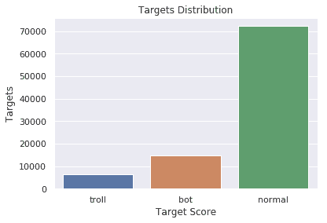
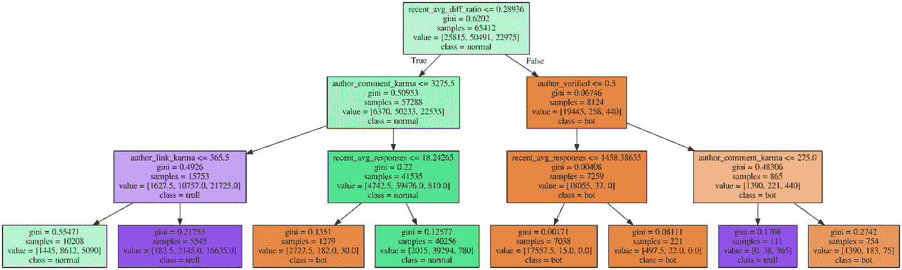
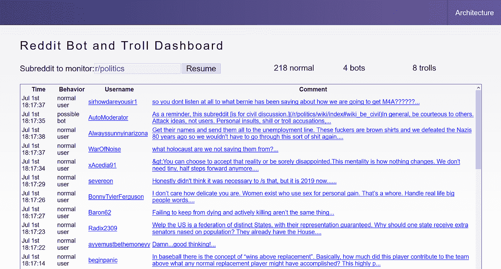

# 用机器学习识别 Reddit 上的巨魔和机器人(第二部分)

> 原文：<https://towardsdatascience.com/identifying-trolls-and-bots-on-reddit-with-machine-learning-709da5970af1?source=collection_archive---------12----------------------->

巨魔和机器人遍布社交媒体，它们以我们并不总是意识到的方式影响着我们。巨魔可能相对无害，只是试图以他人为代价来娱乐自己，但他们也可能是散播不信任或不和的政治行为者。虽然一些机器人提供了有用的信息，但其他机器人可以用来操纵投票数和推广支持其议程的内容。我们将向您展示机器学习如何帮助保护我们的社区免受虐待。


Source: [pixabay.com](https://pixabay.com/illustrations/binary-code-privacy-policy-woman-2175285/)

在本系列的第一部分[，我们报道了流行网站 Reddit 上的巨魔和机器人问题。我们描述了如何构建一个仪表板来控制可疑的巨魔和机器人。在这一部分，我们将向您展示我们如何使用机器学习来检测政治讨论中的机器人和巨魔，然后在我们的版主仪表板上标记可疑的评论。](/trolls-and-bots-are-disrupting-social-media-heres-how-ai-can-stop-them-d9b969336a06)

# 巨魔和僵尸检测的背景

巨魔和机器人检测是一个相对较新的领域。从历史上看，公司雇佣人工主持人来检测和删除不符合他们服务条款的内容。然而，这种手动过程是昂贵的，另外，对于人类来说，审查最差的内容可能是情绪上的疲劳。随着像[开放 GPT-2](https://openai.com/blog/better-language-models/) 自然语言生成这样的新技术的释放，我们将很快触及人类版主效率的极限。随着机器人技术的进步，采用反制技术来保护在线社区的完整性变得非常重要。

已经有一些关于机器人检测的研究。例如，一名研究人员在 Twitter 上发现了竞争[的支持特朗普和反对特朗普的机器人。印第安纳大学的研究人员提供了一个名为](https://www.oreilly.com/ideas/identifying-viral-bots-and-cyborgs-in-social-media) [botornot](https://botometer.iuni.iu.edu/#!/) 的工具来检查 Twitter 用户。

也有关于网络巨魔的有趣研究。斯坦福大学的研究表明，仅仅 1%的账户就造成了 74%的冲突。[佐治亚理工学院的研究人员](https://www.cc.gatech.edu/%7Eeshwar3/uploads/3/8/0/4/38043045/eshwar-norms-cscw2018.pdf)使用自然语言处理模型来识别违反行为规范的用户，如进行人身攻击、歧视女性的诽谤，甚至是男性抱怨。

# 筛选评论进行审核

我们的目标是创建一个机器学习模型来筛选政治子编辑上的评论，供版主审阅。它不需要有完美的准确性，因为评论将由人类主持人审查。相反，我们衡量成功的标准是我们能让人类调解人更有效率。他们不需要审阅每个评论，而是能够审阅预先筛选的子集。我们并不试图取代 Reddit 提供的现有审核系统，该系统允许版主审查用户报告的评论。相反，这是一个补充现有系统的额外信息来源。

正如我们在第一部分的文章中所描述的，我们已经创建了一个仪表板，允许版主查看评论。机器学习模型会将每个评论分为普通用户、机器人或巨魔。


在[reddit-dashboard.herokuapp.com](https://reddit-dashboard.herokuapp.com/)亲自体验一下。

为了满足您的期望，我们的系统被设计为概念验证。它不是一个生产系统，也不是 100%准确。我们将用它来说明构建一个系统所涉及的步骤，希望平台提供商将来能够提供像这样的官方工具。

# 收集培训数据

我们最初的训练数据集是从已知的机器人和巨魔列表中收集的。我们将使用两个列表，分别是这些[已知的 393 个机器人](https://www.reddit.com/r/autowikibot/wiki/redditbots)和来自机器人观察子网站的 [167 个机器人](https://www.reddit.com/r/botwatch/comments/1wg6f6/bot_list_i_built_a_bot_to_find_other_bots_so_far/cf1nu8p/)。我们还将使用 Reddit 2017 年透明度报告中的 944 个巨魔账户，这些账户被怀疑为俄罗斯互联网研究机构工作。

我们正在使用一个事件驱动的架构，该架构由一个从 Reddit 下载数据并将其放入 Kafka 队列的流程组成。然后，我们有一个 Kafka 消费者，它将数据批量写入红移数据仓库。我们编写了一个 [Kafka producer 应用程序](https://github.com/devspotlight/Reddit-Kafka-Producer/blob/master/kafka-export.js)来下载机器人和巨魔列表中的评论。因此，我们的数据仓库不仅包含来自已知僵尸和巨魔的数据，还包含来自 politics 子编辑的实时评论。

虽然 Reddit 评论并不完全是隐私，但你可能有隐私数据。例如，您可能有受 HIPAA 或 PCI 管制的数据，或者对您的业务或客户敏感的数据。我们遵循了一个旨在保护私人数据的 Heroku 参考架构。它提供了一个 Terraform 脚本来自动配置一个红移数据仓库，并将其连接到一个 Heroku 私有空间。因此，只有在私有空间中运行的应用程序才能访问这些数据。

我们可以直接在 dyno 上训练我们的模型，也可以运行一次性的 dyno 将数据下载到 CSV 并在本地训练模型。为了简单起见，我们将选择后者，但是您可能希望将敏感数据保存在私有空间中。

```
heroku run bash -a kafka-stream-viz-jorge
export PGPASSWORD=<password>
echo “select * from reddit_comments” | psql -h tf-jorge-tf-redshift-cluster.coguuscncu3p.us-east-1.redshift.amazonaws.com -U jorge -d redshift_jorge -p 5439 -A -o reddit.csv
gzip reddit.csv
curl -F “file=@reddit.csv.gz” [https://file.io](https://file.io)
```

如果您更喜欢使用我们的培训数据亲自尝试，您可以下载我们的 [CSV](https://drive.google.com/file/d/1FDvHMLbJ8mXlsiiNnLgFCV6Yom1m_xbU/view?usp=sharing) 。

现在我们有了两组用户的评论，总共有 93，668 条。不同职业之间的比例固定在 5%巨魔，10%机器人和 85%正常。这对于训练很有用，但是可能低估了正常用户的真实百分比。



# 选择功能

接下来，我们需要选择特征来构建我们的模型。Reddit 为每个用户和评论提供了几十个 JSON 字段。有些没有有意义的价值。例如，banned_by 在任何情况下都是 null，可能是因为我们缺少版主权限。我们选择了下面的字段，因为我们认为它们作为预测器或了解我们的模型表现如何很有价值。我们添加了列 recent_comments，其中包含该用户最近发表的 20 条评论。

```
no_follow
link_id
gilded
author
author_verified
author_comment_karma
author_link_karma
num_comments
created_utc
score
over_18
body
is_submitter
controversiality
ups
is_bot
is_troll
recent_comments
```

像“分数”这样的字段对于历史评论是有用的，但是对于实时仪表板来说就不那么有用了，因为用户还没有时间对评论进行投票。

我们添加了额外的计算字段，我们认为这些字段与机器人和巨魔有很好的关联。例如，我们怀疑用户最近的评论历史将提供关于他们是机器人还是巨魔的有价值的洞察。例如，如果一个用户反复发布带有负面情绪的有争议的评论，也许他们是一个巨魔。同样，如果一个用户用相同的文本重复发布评论，也许他们是一个机器人。我们使用了 [TextBlob](https://textblob.readthedocs.io/en/dev/) 包来计算这些的数值。我们将很快看到这些特性在实践中是否有用。

```
recent_num_comments
recent_num_last_30_days
recent_avg_no_follow
recent_avg_gilded
recent_avg_responses
recent_percent_neg_score
recent_avg_score
recent_min_score
recent_avg_controversiality
recent_avg_ups
recent_avg_diff_ratio
recent_max_diff_ratio
recent_avg_sentiment_polarity
recent_min_sentiment_polarity
```

有关这些字段是什么以及如何计算的更多信息，请参见我们在 https://github.com/devspotlight/botidentification[的 Jupyter 笔记本中的代码。](https://github.com/devspotlight/botidentification)

# 构建机器学习模型

我们的下一步是基于这个列表创建一个新的机器学习模型。我们将使用 Python 出色的 [scikit learn](https://scikit-learn.org) 框架来构建我们的模型。我们将训练数据存储到两个数据框中:一个用于训练要素集，另一个包含所需的类标签。然后，我们将数据集分成 70%的训练数据和 30%的测试数据。

```
X_train, X_test, y_train, y_test = train_test_split(
 input_x, input_y,
 test_size=0.3, random_state=16)
```

接下来，我们将创建一个[决策树分类器](https://scikit-learn.org/stable/modules/generated/sklearn.tree.DecisionTreeClassifier.html)来预测每个评论是机器人、巨魔还是普通用户。我们将使用决策树，因为创建的规则非常容易理解。使用更健壮的算法(如随机森林)可能会提高准确性，但为了保持示例简单，我们将坚持使用决策树。

```
clf = DecisionTreeClassifier(max_depth=3,
  class_weight={‘normal’:1, ‘bot’:2.5, ‘troll’:5},
  min_samples_leaf=100)
```

您会注意到上面代码示例中的几个参数。我们将树的最大深度设置为 3，不仅是为了避免过度拟合，也是为了更容易可视化生成的树。我们还设置了类别权重，这样机器人和巨魔就不太可能被遗漏，即使是以错误地标记一个普通用户为代价。最后，我们要求叶节点至少有 100 个样本，以保持我们的树更简单。

现在，我们将根据作为测试集的 30%的数据来测试模型。这将告诉我们，我们的模型在猜测每个评论是来自机器人、巨魔还是普通用户方面表现如何。

```
matrix = pd.crosstab(y_true, y_pred, rownames=[‘True’], colnames=[‘Predicted’], margins=True)
```

这将创建一个[混淆矩阵](https://en.wikipedia.org/wiki/Confusion_matrix)，显示每个真实目标标签有多少评论被正确或错误预测。例如，我们可以在下面看到，在总共 1，956 条 troll 评论中，我们正确预测了其中的 1，451 条。

```
Predicted    bot        normal    troll        All
True                                 
bot          3677       585       33           4295
normal       197        20593     993          21783
troll        5          500       1451        1956
All          3879       21678     2477        28034
```

换句话说，巨魔的召回率是 74%。精度较低；在所有被预测为巨魔的评论中，只有 58%是真的。

```
Recall : [0.85611176 0.94537024 0.74182004]
Precision: [0.94792472 0.94994926 0.58578926]
Accuracy: 0.917493044160662
```

我们可以计算出 91.7%的整体准确率。该模型对普通用户表现最好，准确率和召回率约为 95%。对于机器人来说，它表现得相当好，但是很难区分巨魔和普通用户。总的来说，即使使用一个相当简单的模型，结果看起来也相当不错。

# 这个模型告诉了我们什么？

现在我们有了这个伟大的机器学习模型，可以预测机器人和巨魔，它是如何工作的，我们可以从中学到什么？一个很好的开始是看看哪些特性是最重要的。

```
feature_imp = pd.Series(
 clf.feature_importances_,
 index=my_data.columns.drop(‘target’)).sort_values(ascending=False)recent_avg_diff_ratio 0.465169
author_comment_karma 0.329354
author_link_karma 0.099974
recent_avg_responses 0.098622
author_verified 0.006882
recent_min_sentiment_polarity 0.000000
recent_avg_no_follow 0.000000
over_18 0.000000
is_submitter 0.000000
recent_num_comments 0.000000
recent_num_last_30_days 0.000000
recent_avg_gilded 0.000000
recent_avg_sentiment_polarity 0.000000
recent_percent_neg_score 0.000000
recent_avg_score 0.000000
recent_min_score 0.000000
recent_avg_controversiality 0.000000
recent_avg_ups 0.000000
recent_max_diff_ratio 0.000000
no_follow 0.000000
```

有意思！最重要的特征是最近评论文本中的平均差异率。这意味着如果最后 20 条评论的文本非常相似，它可能是一个机器人。下一个最重要的特性是评论因果关系、链接因果关系、最近评论的回复数量以及账户是否被验证。

为什么剩下的都是零？我们将二叉树的深度限制为 3 级，所以我们有意不包括所有的特性。值得注意的是，我们没有考虑之前评论的分数或情绪来对巨魔进行分类。要么这些巨魔相当有礼貌，赢得了相当多的选票，要么其他特征有更好的区分能力。

让我们看看实际的决策树，以获得更多信息。

```
export_graphviz(estimator, out_file=’tree.dot’,
 feature_names = data.drop([‘target’], axis=1).columns.values,
 class_names = np.array([‘normal’,’bot’,’troll’]),
 rounded = False, proportion = False, 
 precision = 5, filled = True)
```



现在我们可以了解这个模型是如何工作的了！您可能需要放大才能看到细节。

让我们从树的顶端开始。当最近的评论彼此相当相似(平均差异率高)时，那么它更有可能是一个 bot。当他们有不同的评论，低评论因果报应，高链接因果报应，他们更有可能是一个巨魔。这可能是有道理的，如果巨魔使用小猫的帖子来提升他们的链接业力，然后在论坛上发表令人讨厌的评论，要么被忽略，要么被否决。

# 托管 API

为了让我们的机器学习模型对全世界可用，我们需要让它对我们的版主仪表板可用。我们可以通过托管一个 API 供仪表板调用来做到这一点。

为了服务我们的 API，我们使用了 [Flask](http://flask.pocoo.org/) ，这是 Python 的一个轻量级 web 框架。当我们加载我们的机器学习模型时，服务器启动。当它接收到包含带有注释数据的 JSON 对象的 POST 请求时，它用预测进行响应。

一个**机器人**用户的例子:

```
{
 “banned_by”:null,
 “no_follow”:true,
 “link_id”:”t3_aqtwe1",
 “gilded”:false,
 “author”:”AutoModerator”,
 “author_verified”:false,
 “author_comment_karma”:445850.0,
 “author_link_karma”:1778.0,
 “num_comments”:1.0,
 “created_utc”:1550213389.0,
 “score”:1.0,
 “over_18”:false,
 “body”:”Hey, thanks for posting at \\/r\\/SwitchHaxing! Unfortunately your comment has been removed due to rule 6; please post questions in the stickied Q&amp;A thread.If you believe this is an error, please contact us via modmail and well sort it out.*I am a bot”,
 “downs”:0.0,
 “is_submitter”:false,
 “num_reports”:null,
 “controversiality”:0.0,
 “quarantine”:”false”,
 “ups”:1.0,
 “is_bot”:true,
 “is_troll”:false,
 “recent_comments”:”[…array of 20 recent comments…]”
}
```

返回的响应是:

```
{
 “prediction”: “Is a bot user”
}
```

我们在 [Heroku](https://heroku.com/) 上部署了我们的 API，因为它非常容易运行。我们仅仅创建了一个 [Procfile](https://devcenter.heroku.com/articles/procfile) ，其中有一行告诉 Heroku 哪个文件用于 web 服务器。

```
web: python app.py ${port}
```

然后我们可以把我们的代码推送给 heroku:

```
git push heroku master
```

Heroku 负责解决下载需求、构建 API、设置 web 服务器、路由等问题。我们现在可以在这个 URL 访问我们的 API，并使用 [Postman](https://www.getpostman.com) 发送一个测试请求:

[https://botidentification.herokuapp.com/](https://botidentification-comments.herokuapp.com/)

# 看到它工作了吗

感谢我们在本系列第一部分[中写的伟大的版主仪表板](/trolls-and-bots-are-disrupting-social-media-heres-how-ai-can-stop-them-d9b969336a06)，我们现在可以看到我们的模型在真实评论上的表现。如果你还没有，看看这里:[reddit-dashboard.herokuapp.com](https://reddit-dashboard.herokuapp.com/)。



Dashboard at [reddit-dashboard.herokuapp.com](https://reddit-dashboard.herokuapp.com/)

这是来自 r/politics 子网站的实时评论。你可以看到每条评论，以及模型是以机器人、巨魔还是普通用户的身份给它打分。

你可能会看到一些被标记为机器人或巨魔的评论，但在检查他们的评论历史后，这并不明显。请记住，为了让我们的教程更容易理解，我们使用了一个简单的模型。标注巨魔的准确率只有 58%。这就是为什么我们把它设计成人类版主审核的过滤器。

如果你对自己玩这个模型感兴趣，可以在 GitHub 的[https://github.com/devspotlight/botidentification](https://github.com/devspotlight/botidentification)查看代码。您可以尝试通过使用更复杂的算法(如随机森林)来提高模型的准确性。剧透警告:对于更复杂的模型，有可能在测试数据上获得 95%以上的准确性，但是我们将把它作为一个练习留给你。