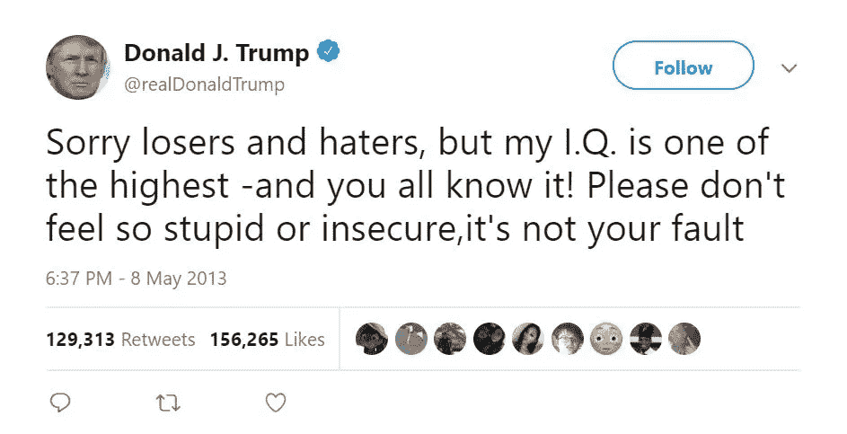
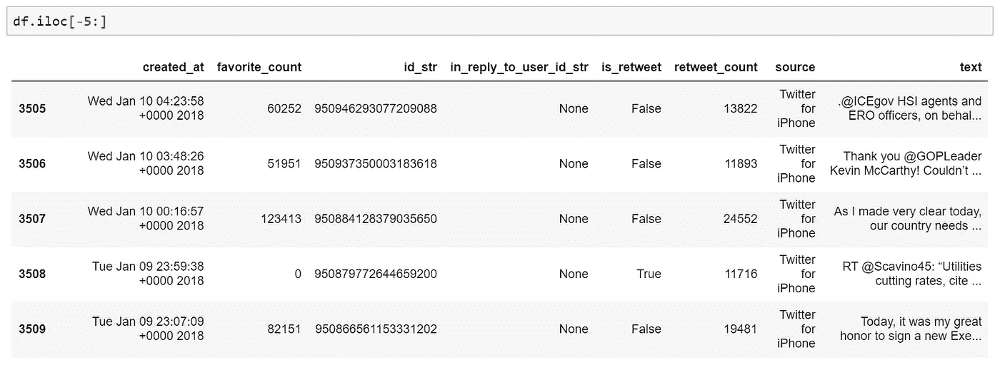

# 用神经网络识别特朗普和希拉里的推文

> 原文：<https://towardsdatascience.com/identifying-trumps-tweets-vs-hillary-s-with-neural-networks-4ed77dd230c6?source=collection_archive---------32----------------------->

## 我相信我们都听说过特朗普臭名昭著的推文…



[https://twitter.com/realDonaldTrump/status/332308211321425920](https://twitter.com/realDonaldTrump/status/332308211321425920)

等等，我是不是听到了再来一次的呼声？好吧，这里还有一些他的推文…

特朗普的推文很容易成为标志性的，(并因其引起混乱的能力而闻名)。如果你看到上面的任何一条推文，你可能会猜到作者是特朗普。换句话说，它们也很容易识别。

事实上，过去识别一条推文是特朗普的甚至更容易…

在 2018 年 3 月之前，特朗普使用 Andriod 手机发推文，在 **Twitter API** 中，你可以检查推文的来源。这就清楚了哪些话来自**特朗普**和**白宫工作人员**。特朗普换成 iPhone 后，情况就不一样了，所以让我们想出一个新方法来**区分**这两者！

为了识别特朗普的推文，我们将使用**神经网络**。神经网络可以**模拟**变量**之间的复杂关系**并预测**可能的结果**，这意味着它是这项工作的完美工具！

# 收集数据📃

我从挖掘大量数据开始，收集了特朗普从 2015 年开始的推文。这恰好是来自三个来源的推文的集合，分别是 Andriod、他的新 iPhone 和 Twitter 网络客户端。有了这个庞大的数据集，我把数据分成一个**训练集**(训练神经网络)，和一个**测试集**(检查神经网络的准确性)。

我能够通过使用访问令牌密钥从 twitter 中挖掘数据。

```
# Since I applied for a twitter developer here: [https://developer.twitter.com/](https://developer.twitter.com/)
# I created an app and generated the access token keysimport numpy as np
import pandas as pd
import twittertwitter_keys = {
    'consumer_key':        'veqNWYqeq46WB2tKM5FmDGilD',
    'consumer_secret':     '  2o1K5qMCU66gU5nzpm4C7xulj3ZR4K149U1DPLEw2itpnxAFIZ',
    'access_token_key':    '1190255551864885248-  5TOmS02DRKKd74ygZibYjh5bKdS3wX',
    'access_token_secret': 'cXImA3BCajKgxvXgBepDHw8j83VYbq9n8emts612veyD0'
}api = twitter.Api(
    consumer_key         =   twitter_keys['consumer_key'],
    consumer_secret      =   twitter_keys['consumer_secret'],
    access_token_key     =   twitter_keys['access_token_key'],
    access_token_secret  =   twitter_keys['access_token_secret'],
    tweet_mode = 'extended'
)
```

我将它们格式化为**熊猫数据框架**(有点像电子表格)，并将 2016 年至 2018 年的挖掘数据连接在一起。

```
df = pd.concat([pdata2016, pdata2017, pdata2018])
```

这是数据集的最后几行…



Here are the last rows of the DataFrame with all of Trump’s tweeting data

# 准备数据📈

神经网络不能直接处理文本，所以我使用了来自 **Scikit Learn model** 的 **TFIDF 矢量器**来拟合文本数据。这实际上是将文本数据转换成一个数字模式，我们可以将它输入神经网络。想象一个巨大的电子表格，每个单词都有一列。**为每个单词生成值**。这些值可以是**频率**或者甚至是它对整个上下文的**重要性/显著性**。

下面是将数据从**文本格式**更改为**数字数组**的部分代码。

```
# Transform text data into numerical pattern for neural networks to read 
# [https://scikit-learn.org/stable/modules/generated/sklearn.feature_extraction.text.TfidfVectorizer.html](https://scikit-learn.org/stable/modules/generated/sklearn.feature_extraction.text.TfidfVectorizer.html)tfidf_num = TfidfVectorizer(max_df=0.95,min_df=0.02)
# max_df -> ignore terms with frequency higher than threshold
# min_df -> ignore terms with frequency lower than thresholdtfidf_num.fit(df.text) #Learn vocabulary from training set.
column = len(tfidf_num.get_feature_names())
```

# 神经网络🧠

这就是它的工作原理！我们正在使用神经网络**来模拟**一个复杂的**关系**，在这个例子中是推文(**输入**)和谁发送它们(**输出**)之间的关系。神经网络由**三个主要**部分组成:

1.  **模型框架(节点和层的连接)**
2.  **激活功能(决定节点是否被触发)**
3.  **学习算法(逻辑回归和反向传播)**

> 顺便说一句，如果你还没有读过，在这里读一读我的神经网络简介[让你快速上手！](https://medium.com/@ariel.yc.liu/understanding-neural-networks-the-secret-lies-in-our-brains-5d8dc907ab34)

我们将带有**标签**的推文数据输入神经网络，表明它是来自 Trump 还是他的工作人员，这是算法的**输入**数据。该模型计算一个**预测**，将其与正确的**标签**进行比较，并对其**权重**和**偏差**进行调整。

## 预言；预测；预告

它基于**模型框架**计算一个**预测**，这意味着首先我们为每个节点生成随机**权重**和**偏差**，以达到一个**预测**。

## **激活功能**

在节点计算其输入的**加权和**之后，激活函数**决定**信息是被**激发**还是被传递。一个简单的激活功能是**步进功能**。阶跃函数计算加权和是否高于某个**特定值**，如果是，则认为**激活**，否则认为不是。

**softmax** **激活函数**做类似的事情，除了它计算概率。 **softmax** 的输出将总是从 0 到 1，并累加到 1。例如，这作为一个置信度得分，我们可以有 60%的把握认为该推文来自特朗普。

## 学习算法

在生成一个**概率**后，该模型计算一个**误差值**(我们离正确的标签有多远)。使用这个误差值，我们回溯并编辑所有的**权重**和**偏差**，从而更接近正确答案。这个过程被称为**反向传播**，它是减少**错误**和增加**准确度得分**的关键。

这是通用模型，我们将使用它来生成多个具有不同框架的模型，以找到哪个**架构**工作得最好。

```
def baseModel(inputSH, outputSH, layers=2, nodes=100):
    base_model = Sequential()
    base_model.add(Dense(100, activation='relu', inputSH = (inputSH,)))
    for x in range(layers):
        model.add(Dense(nodes, activation='relu'))
    model.add(Dense(outputSH, activation='softmax')) # Softmax activation - probabilities between 0-1
    model.compile(optimizer='adam',loss='binary_crossentropy', metrics=['accuracy','mean_squared_error'])
    return model
```

我们希望**训练**模型，直到**预测**接近实际标签。我们还想测试它从未遇到过的推文的**准确性**，这就是**测试数据集**派上用场的地方。

# 正确的模型📐

这个项目最困难的部分之一是找到正确的神经网络。改变**节点**和**层数**可以改变模型的最终**精度**。所以我使用**训练数据**的不同部分测试了各种不同的模型**架构**。

最后，我计算了哪些模型的得分最高(T36，T37)，并利用了那个模型(T38，T39)(这次是 4 个隐藏层，每个隐藏层有 1000 个节点)。因为这个模型之前只使用了一部分训练数据进行训练。我用整个**训练数据集**重新训练了这个模型，并在**训练数据**上评估了它的性能(准确率为 93%)。

有趣的部分来了！测试时间！现在，我们将测试数据输入到不带**标签**的算法中，并要求模型给我们一个**预测**。总体而言，它能够以 80%的**高准确率**区分特朗普和白宫工作人员的。

> 但是还有更多…

# 如果我们把他的推特和他的对手希拉里的相比会怎么样？

事实证明，在**挖掘**和**清理**希拉里的推文之后，我能够做到这一点。在**测试**该模型后，我发现我能够**以 87%的准确率预测**希拉里的推文，以 60%的准确率预测特朗普的推文。

这是我的算法认为最有可能成为希拉里的推文:

> “我们敦促选民抛弃川普，在这场竞选中选择明显合格的候选人:希拉里。”——@ Denver post[https://t.co/bpbgC5VhYV](https://t.co/bpbgC5VhYV)

这是我的算法认为有**最高**概率成为川普的推文:

> …..与乌克兰新总统的通话很好，这不可能更好或更光荣了，假新闻媒体和民主党人作为一个团队，欺骗性地让它看起来很糟糕。还不错，非常合法，非常好。持续的政治迫害！

出于好奇，我调查了川普与希拉里相比最常见的 **n 字母组合**。 **N-grams** 是一段文本中一定数量单词(本例中为 2-5 个)的**连续序列**。

**以下是特朗普最常见的 n 字母组合:**

```
[('fake news', 112),
 ('united states', 79),
 ('witch hunt', 74),
 ('president trump', 48),
 ('new york', 44),
 ('adam schiff', 44),
 ('north carolina', 40),
 ('republican party', 39),
 ('radical left', 32),
 ('news media', 31),
 ('federal reserve', 31),
 ('fake news media', 30),
 ('ukrainian president', 28),
 ('america great', 28),
 ('nancy pelosi', 27)]
```

**以下是希拉里最常见的 n 字母组合:**

```
[('donald trump', 117),
 ('make sure', 66),
 ('vote https', 63),
 ('health care', 48),
 ('debatenight https', 47),
 ('human rights', 37),
 ('hillary clinton', 36)
 ('human rights', 37),
 ('hillary clinton', 36),
 ('today https', 28),
 ('trump https', 27),
 ('president https', 27),
 ('climate change', 26),
 ('debate https', 25),
 ('election day', 24),
 ('young people', 24)]
```

# 其他应用⚙️

神经网络应用于数据分析有无限的可能性和方式。神经网络是**非线性数据建模工具**，这意味着它们可以对各种**变量**之间的**复杂关系进行建模。**

大多数申请可以分为三类:

1.  **分类——观察结果将被分成几类**
2.  **时间序列——预测未来结果的预测模型**
3.  **优化——找到解决问题的最有效方法**

这里有几个神经网络可能应用的例子

*   信用卡欺诈检测(分类)
*   字符识别(分类)
*   预测天气模式(时间序列)
*   预测和识别心脏病发作(时间序列)
*   车辆的有效路径问题(最优化)

# 关键要点📌

*   神经网络能够对数据中的**复杂非线性关系**进行建模，找到**模式**，并且**预测结果**
*   神经网络允许对**数据**进行更快更**有效的分析**
*   它们可以应用于各种领域，并且在大数据时代的**处理**和理解**海量**数据**中至关重要**

如果仅仅从推特上就能获得这么多数据，想想我们周围到处都有多少数据！**大数据**时代已经开启，应用和可能性**无穷**。我们不仅可以将它用于推特，还可以将其应用于语音识别、天气预报，甚至为路由问题提供更有效的解决方案。

有了这么多数据，**神经网络**是理解这一切的关键**！我们需要他们对数据进行适当的利用，并从数据中获得比以往更多的洞察力！**

这绝对是一个非常有趣的项目，我希望我已经激发了你对神经网络和数据分析的探索！

在我的网站上查看我的项目页面[这里](http://liuariel.com/tweet_analysis.html)！

如果你想在未来阅读更多的文章，给我的帐户一个关注！

与此同时，你可以随时在 ariel.yc.liu@gmail.com 联系我，或者通过 LinkedIn 联系我。

你也可以在这里阅读我的每月简讯！

或者访问我的个人网站查看我的全部作品集[这里](http://liuariel.com/)！

下次见！👋