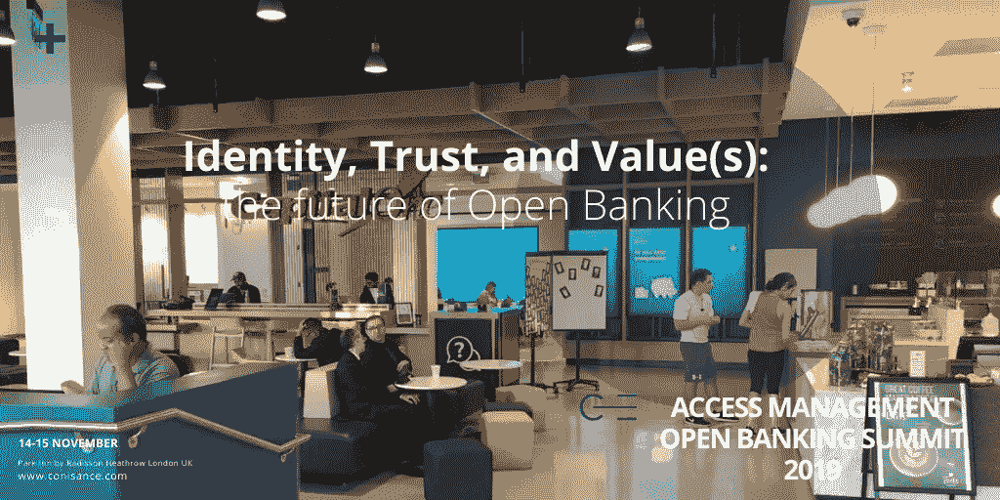

# 身份、信任和价值:开放银行的未来

> 原文：<https://towardsdatascience.com/identity-trust-and-value-s-the-future-of-open-banking-7926e22f085b?source=collection_archive---------28----------------------->

## *将有希望的想法转化为相关的数据实践需要超越 API*

理论上，开放式银行可以利用创新的信息基础设施来重新定义金融数据的创建、应用和交流方式。在实践中，开放标准对金融服务的贡献取决于人类对价值、信任和身份的理解。对于传统银行机构和金融科技的新参与者来说，将有前途的想法转化为相关数据实践的能力需要超越编程接口，以了解人类智能如何影响新服务场景的机遇和挑战。

*开放标准不会将数据转化为价值，人们会*。开放银行业的承诺到底是什么？开放银行将如何规范个人数据的机构使用？技术标准本身是否足以建立信任，从而吸引传统银行和新市场的新服务提案？财务价值和人的价值之间有什么联系。管理层如何确保他们的数据实践将允许他们的组织在今天和不久的将来收获人工智能的好处？

# 开放银行业的承诺

*开放的银行业建立在开放的标准之上，其中身份、信任和价值是设定所有标准的基础。*开放式银行承诺从根本上改变消费者与银行和金融服务的互动方式。在 EC 修订版支付服务指令(PSD2)以及英国竞争和市场管理局(CMA)法规的推动下，开放银行框架有望增强金融机构之间的竞争，为消费者提供更个性化的产品，并增加服务创新。这一呼吁在整个欧洲引起了共鸣:仅 2018 年，欧洲前十大国家的金融科技初创公司就在 477 笔独立交易中积累了€28.9 亿美元的风险资本。开放银行业也在国际上引起了反响，刺激了新西兰、墨西哥、阿根廷、尼日利亚、香港、日本和台湾等不同市场的创新。[【我】](http://file///C:/Users/Lee/Dropbox/Conferences/OpenBankingDraft.docx#_edn1)

机构银行传统上是围绕垂直整合模式建立的，涵盖价值链的所有方面，从发起到服务，再到风险和资产负债表管理。开放式银行框架规定了关于第三方访问、知情消费者同意、数据安全和个人金融数据争议解决的法律准则。从监管的角度来看，这些法规要求零售银行通过应用程序编程接口与授权的第三方共享其经常账户数据。从技术上讲，这些服务的实现将需要基于应用程序编程接口(API)的信息架构，以确保端到端的比较服务、自动储蓄和信用评分。这些架构反过来为金融数据的消费者和生产者创造了无数的潜在商机。

对政府和社会而言，开放的银行业可以推动市场做出更负责任、反应更灵敏的投资和债务决策。对于零售银行而言，开放银行业务将测试传统银行模式，并鼓励它们围绕“银行即服务”(BaaS)找到专业领域并开发自己的独特品牌。对于新的市场进入者，开放银行将有助于创造结合预测分析、人工智能和融资的创新服务主张，以触及不同的客户群。最后，消费者将受益于更容易地比较来自不同提供商的银行服务的能力，从而获得更好的产品和更广泛的选择。

# 身份的首要地位

准确识别每笔交易的合同方一直是金融机构的基础之一。确保严格身份标准的愿望要求企业和个人提供确认其身份的物理文件。新服务的客户入职需要更多面对面的互动，导致耗时、重复的账户注册、登录和支付授权申请流程。新的透明度监管要求，包括反洗钱(AML)和了解您的客户(KYC)程序，使这些流程变得更加复杂。因此，金融机构目前每年在身份管理解决方案上的花费超过 10 亿美元。[【ii】](http://file///C:/Users/Lee/Dropbox/Conferences/OpenBankingDraft.docx#_edn2)

开放银行的愿景是让消费者能够控制自己的数据，并在此过程中促进他们获得贷款、测试其他金融产品和在线购买更广泛产品的能力。银行信息系统中持续存在的不兼容和记录不良的遗留应用程序阻碍了这一承诺:在入职流程中验证客户信息时，需要大量的人工劳动和运营成本。事实证明，如果没有一个无缝的产品组合管理平台，很难吸引客户转换或使用来自多个提供商的服务。最后，向第三方运营商开放遗留系统有其自身的风险，银行很可能会因为金融科技支持的第三方提供商的提议而失去其作为特许供应商的地位。

随着数据科学和分析的发展，机构对其客户的信念、动机和行为了解得越多，就越能更好地定制其服务和交易。数据科学已经广泛应用于银行的许多核心流程，包括成本和收入分配、客户拓展、欺诈检测、营销拓展、产品开发和风险管理。互联网银行、社交媒体和移动银行应用程序提供了大量数据，可以帮助金融机构更好地了解他们的客户和市场。机器学习算法和数据科学技术可以在促进客户细分、构建推荐引擎和简化客户支持方面显著改善银行的分析策略。

每天淹没市场的大量数据有助于金融部门做出更好的决策吗？算法还不能解释有效的客户经理与机器的区别:人类代理的概念，他或她的移情能力，人类智能的本质，以及一个人区分对错的能力。有限理性证明了组织如何使用数据来理解过去、分析现在和预测未来的伦理问题。隐性偏见限制了数据科学在描绘金融服务现实方面的相关性:人类的态度和先入之见污染了我们对数据、认知、逻辑和道德的看法。多次金融危机中凸显的数字化转型的管理问题值得思考:管理者和组织需要在多大程度上对其数据实践负责？

# 信任的悖论

如果开放银行是为了建立数据交换的标准，那么信任就是所有其他标准的基础。新监管框架的目的是提供在线信息基础设施，提供与机构银行遗留系统一样安全的服务。这项立法的主旨是顺应货币体系数字化转型的大趋势:20%的消费者交易已经在网上发生。从 2018 年到 2021 年，无现金交易的数量预计将每年增长 12.7%。[【iv】](http://file///C:/Users/Lee/Dropbox/Conferences/OpenBankingDraft.docx#_edn4)这些数字提供了预期转变的证据，以及消费者倾向于金融服务提供商与其客户之间建立更开放关系的前提。

这一数据讲座为银行和金融科技公司打开了新的机遇，让它们将自己定位为客户的终身顾问。从总账的发明到区块链的概念，技术的基本目标之一一直是提供单一版本的真相，即作为可信中介的证据记录，以促进产品和服务的交换。最近的一项 nCipher 安全调查表明，与其他行业相比，消费者更信任金融行业，尤其是他们的银行能够保护他们的个人数据。然而，这种信任可能是相当不稳定的，只有 36%的英国消费者相信银行会为他们客户的最大利益服务，而在德国(35%)、意大利(30%)、法国(29%)和日本(27%)，这种怀疑程度更高。[【VI】](http://file///C:/Users/Lee/Dropbox/Conferences/OpenBankingDraft.docx#_edn6)

数据永远不会比消费者对组织的数据实践的信心更有价值。已经提出了几个假设来解释这种信任悖论。基于“人是产品”哲学的商业模式越来越受到那些讨厌被分类然后被产品化的人的质疑。公司对数据的感知需求超过了对个人隐私的任何关注，这种零和经验受到了公众的广泛谴责。基于“越大越好”的数据囤积实践被证明是毫无意义的，因为它们具有潜在的危险。最后，数字营销的社会机制进一步扭曲了真相和信任之间的关系，促使心理剖析成为反映现实矛盾版本的镜子。

数据架构需要超越满足数据机构的法律约束，在组织和他们的客户之间培养信任关系。我们在其他地方已经指出，数字化转型的最终目标不仅仅是优化销售流程，而是提供帮助消费者做出更好的经济和社会决策的洞察力。[【VII】](http://file///C:/Users/Lee/Dropbox/Conferences/OpenBankingDraft.docx#_edn7)开放银行业的相关性与其说取决于其工具和技术的复杂程度，不如说取决于消费者利用金融应用来改善个人和集体福祉的程度。*信任不是你拥有多少数据的数量的属性，而是消费者对这些数据如何被使用的看法的结果。*

# 哪些物有所值？

“物有所值”在今天的行业中几乎就像一个累赘，即使什么是物有所值的问题仍然是一个公开的问题。开放式银行创造了多种途径来增强客户对金融服务价值的认识。消费者现在可以直接与他们的金融产品互动，而不是通过每个单独的银行。商家使用 API 代表客户发起支付的能力为新的支付方案打开了大门。金融科技可以利用交易和行为数据来建议和个性化产品。

对于金融机构本身而言，开放的银行监管可能会促使它们在再造合作伙伴生态系统时，重新考虑自己的商业模式和价值主张。一些机构很可能试图利用开放银行的可能性，直接控制产品和服务的生产和分销。有些人可能选择投资开发新产品和服务，由他们的商业伙伴分销。许多人可能会专注于金融科技创造的分销金融产品和服务。其他人仍将专注于该平台，充当市场中介，促进其生态系统中的活动。

开放银行业务的当前绩效指标(涉及账户、交易、余额、直接借记、长期订单、受益人、产品的处理时间)是否充分反映了金融价值和人文价值之间的关系？理查德·塞勒关于“一价定律”的经济学原理的研究表明，消费者的行为通常会违背理性思考。Gerald Zaltman 认为，多达 95%的购买决定都是基于潜意识的考虑。[【IX】](http://file///C:/Users/Lee/Dropbox/Conferences/OpenBankingDraft.docx#_edn9)消费者对价值的感知取决于他们的感觉、直觉和洞察力。仅仅基于流程效率来阐述度量标准，充其量只能捕捉到消费者所看重的更大图景的一部分。*指标捕捉到了它们被设计用来衡量的东西，算法按照它们被教授的方式执行，而金融决策则是由对价值的认知形成的。*

在 *Trust by Design* 的首字母缩写下，我们认为开放银行的未来更多地依赖于开发以客户为中心的数据实践，而不是 API。金融机构需要提高其现有能力，特别是在数据和分析方面，以便利用新出现的机会。组织应该明智地集中投资，鼓励在整个企业和生态系统中使用开放数据。在利用非专有数据时，银行和金融科技需要解决使用个人数据的问题。最后，他们需要与客户就开放式银行如何应对数字经济的挑战和机遇展开有意义的对话。*客户价值不是您拥有多少数据的数量属性，而是消费者对这些数据使用方式的看法。*

开放银行业的未来需要超越数据，看到身份、信任和价值的基础。在为即将于 11 月 14 日和 15 日在伦敦举行的[访问管理和开放银行业务峰会](https://www.conisance.com/)所做的贡献中，我们认为

*   身份、信任和价值是建立开放银行业标准的基础。
*   人口统计和行为特征还不能捕捉到有效的客户经理和机器之间的区别
*   数据永远不会比消费者对组织的数据实践的信心更有价值。
*   什么是物有所值的问题仍然是一个悬而未决的问题
*   价值不是金融机构持有的数据量的属性，而是消费者对其数据使用方式的看法的结果。

Lee Schlenker 是商业分析和社区管理教授，也是 http://baieurope.com 商业分析研究所[的负责人。](http://baieurope.com./)他的 LinkedIn 个人资料可以在[查看](http://www.linkedin.com/in/leeschlenker.)你可以在[的 Twitter 上关注白](https://twitter.com/DSign4Analytics)

_____________________________

[【I】](http://file///C:/Users/Lee/Dropbox/Conferences/OpenBankingDraft.docx#_ednref1)Tobin，G. (2018)，[全球开放银行体系](https://www.lexology.com/library/detail.aspx)

[【ii】](http://file///C:/Users/Lee/Dropbox/Conferences/OpenBankingDraft.docx#_ednref2)埃森哲(2013)，[银行业身份的未来](http://file///C:/Users/Lee/Dropbox/Conferences/accenture.com/_acnmedia/accenture/conversion-assets/dotcom/documents/global/pdf/dualpub_9/accenture-future-identity-banking.pdf)

[【iii】](http://file///C:/Users/Lee/Dropbox/Conferences/OpenBankingDraft.docx#_ednref3)Cochrane，m .(2019)，[投资者需要知道的关于现金之战的一切](https://www.fool.com/investing/what-investors-need-know-about-war-on-cash.aspx)

[【iv】](http://file///C:/Users/Lee/Dropbox/Conferences/OpenBankingDraft.docx#_ednref4)Rolfe，a .，(2018)[世界支付报告 2018:数字支付蓬勃发展](https://www.paymentscardsandmobile.com/world-payments-report-2018-digital-payments-booming/)

[【v】](http://file///C:/Users/Lee/Dropbox/Conferences/OpenBankingDraft.docx#_ednref5)助网安，(2019)，[消费者最信任银行的个人资料](https://www.helpnetsecurity.com/2019/04/26/consumers-trust-banks-most-with-their-personal-data/)

[【VI】](http://file///C:/Users/Lee/Dropbox/Conferences/OpenBankingDraft.docx#_ednref6)Palenicek，J. (2018)，[大多数英国人信任银行…](https://yougov.co.uk/topics/politics/articles-reports/2017/05/19/most-brits-trust-banks-dont-think-they-work-custom)

[【VII】](http://file///C:/Users/Lee/Dropbox/Conferences/OpenBankingDraft.docx#_ednref7)sch lenker，Lee(2018)[设计信任](/trust-by-design-a864f1062baa)

[【VIII】](http://file///C:/Users/Lee/Dropbox/Conferences/OpenBankingDraft.docx#_ednref8)泰勒，理查德(2016)，行为不端:行为经济学的形成，W. W .诺顿&公司

萨尔特曼，杰拉尔德(2003)，顾客如何思考:对市场心理的基本洞察，哈佛商业评论出版社