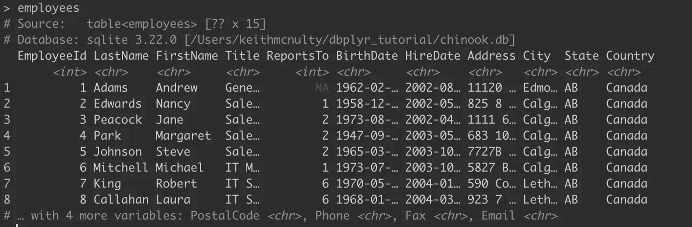
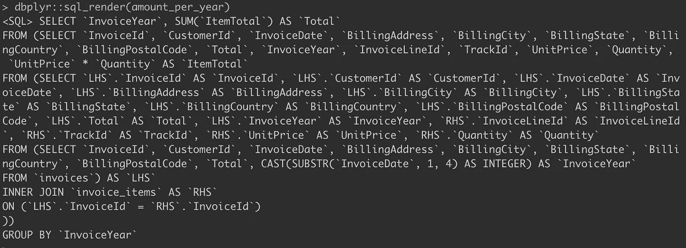

# 如果玛丽·近藤做了 SQL…

> 原文：<https://towardsdatascience.com/if-marie-kondo-did-sql-be86374b7cd8?source=collection_archive---------23----------------------->

## …她会使用 dbplyr

在以前的一些帖子中，我提到过`dbplyr`包是一种在 r 中处理 SQL 数据库的非常酷的方式。`dbplyr`是一个非常聪明的 SQL 翻译器，随着每次更新，它变得越来越强大。它允许您将数据库表视为一个 R dataframe 对象，并使用简单、干净的 tidyverse 命令来操作它。在 R 控制台中处理所有这些乱七八糟的 SQL 字符串要好得多，也更直观。

我想我会用一个简单的例子来说明`dbplyr`是如何工作的，我希望你能拿起这个例子并进一步发挥它。不知不觉中，你就再也不想用 SQL 写东西了！

## 使用 chinook 数据库

`chinook`是一个 SQLite 数据库，可以在[这里](http://www.sqlitetutorial.net/sqlite-sample-database/)下载，练习用起来真的很方便。一旦你把它解压到一个文件夹，打开你的 R 会话，我们将使用下面的包:

```
library(tidyverse)
library(dbplyr)
library(DBI)
library(RSQLite)
```

首先，我们将建立与 SQLite 数据库的连接。虽然这个数据库只是一个本地保存的文件，但是您可以使用类似的连接到您的 Oracle 或 MSSQL 数据库或其他数据库[1]。

```
chinook <- DBI::dbConnect(
  drv = RSQLite::SQLite(),
  dbname = "chinook.db"
)
```

我们现在可以有效地连接到`chinook`数据库。我们可以使用`RSQLite::dbListTables(chinook)`来浏览其中的表格，这表明其中有以下表格:

```
"albums"          "artists"         "customers"       "employees"       "genres"         "invoice_items"   "invoices"        "media_types"     "playlist_track"  "playlists"      "sqlite_sequence" "sqlite_stat1"    "tracks"
```

我们将使用`dbplyr`对其中的一些表格进行试验，特别是以下表格:

*   `employees` —公司员工的详细信息
*   `customers` —客户详情表
*   `invoices` —附在客户 id 上的发票明细表
*   `invoice_items` —每个发票 ID 中订购单位和价格的详细信息表

我们可以很容易地使用`dplyr`将这些表设置为数据库对象，如下所示[2]:

```
employees <- dplyr::tbl(chinook, "employees")
customers <- dplyr::tbl(chinook, "customers")
invoices <- dplyr::tbl(chinook, "invoices")
invoice_items <- dplyr::tbl(chinook, "invoice_items")
```

这些表现在都是 R 会话中的 SQL 数据库对象，您可以像操作数据帧一样操作它们。注意，只需在 R 控制台中键入表名，就可以看到每个表中的数据摘录。重要的是，在定义这些表时，*您并没有实际下载它们*，只是创建了一个最少的摘录来使用。



## 使用 dbplyr 查询

现在让我们试着做一个非常简单的查询，比如我们按照雇佣他们的年份分组了多少员工。如果我们把它写成一个简单的 SQL 查询，它看起来会像这样:

```
qry <- "SELECT HireYear, COUNT(EmployeeId) FROM
(SELECT SUBSTR(HireDate, 1, 4) AS HireYear, EmployeeId
FROM employees)
GROUP BY HireYear"
```

现在，如果我们运行`DBI::dbGetQuery(chinook, qry)`,就会得到这个返回:

```
 HireYear count(EmployeeId)
1     2002                 3
2     2003                 3
3     2004                 2
```

但是我们也可以使用如下的代码来实现:

```
employees_by_hire_year <- employees %>% 
  dplyr::mutate(HireYear = substr(HireDate, 1, 4)) %>% 
  dplyr::group_by(HireYear) %>% 
  summarize(Total = n())
```

由于这是一个非常小的表，您只需在控制台中键入它的名称就可以看到它，它确实会返回与上面的表相同的表。如果它比较大，您就必须从数据库中收集它——稍后会详细介绍。

这种魔力似乎是如何发生的？因为 R 将`employees`识别为 SQL 数据库对象，所以 R 在后台调用`dbplyr`将管道化的 tidyverse 代码翻译成 SQL。您可以使用`dbplyr::sql_render()`函数查看翻译后的 SQL。例如，`dbplyr::sql_render(employees_by_hire_year)`返回这个:

```
<SQL> SELECT `HireYear`, COUNT() AS `Total`
FROM (SELECT `EmployeeId`, `LastName`, `FirstName`, `Title`, `ReportsTo`, `BirthDate`, `HireDate`, `Address`, `City`, `State`, `Country`, `PostalCode`, `Phone`, `Fax`, `Email`, SUBSTR(`HireDate`, 1, 4) AS `HireYear`
FROM `employees`)
GROUP BY `HireYear`
```

## 让复杂的查询变得简单

上面的例子非常简单，直到你的查询变得非常复杂，你才能真正看到使用`dbplyr`的好处。

假设您想计算出客户每年在订单上花了多少钱。这意味着您必须从发票日期中提取年份，然后使用`InvoiceId`将`invoice`连接到`invoice_items`，然后按年份分组，然后计算该年的总单价乘以订购数量。多亏了`dbplyr`，我们可以使用我们漂亮的 tidyverse 语法来做到这一点:

```
amount_per_year <- invoices %>% 
  dplyr::mutate(InvoiceYear = substr(InvoiceDate, 1, 4) %>%          
                  as.integer()) %>% 
  dplyr::inner_join(invoice_items, by = "InvoiceId") %>% 
  dplyr::mutate(ItemTotal = UnitPrice * Quantity) %>% 
  dplyr::group_by(InvoiceYear) %>% 
  dplyr::summarise(Total = sum(ItemTotal))
```

这比它的 SQL 等价物好得多，也更容易使用。注意，在其当前形式下,`amount_per_year`仍然只是一个数据库对象，数据还没有正式从数据库中提取出来。要正式提取数据，您可以使用`dplyr`的`collect()`函数，如下所示:

```
amount_per_year %>% dplyr::collect()
```

它将返回:

```
# A tibble: 5 x 2
  InvoiceYear Total
        <int> <dbl>
1        2009  449.
2        2010  481.
3        2011  470.
4        2012  478.
5        2013  451.
```

如果您在远程数据库上工作，而不是在本地 SQLite 数据库上工作，额外的优势是`dbplyr`确保所有的操作都在数据库上完成，您只需收集结果，而不必将所有数据提取到您的会话中。

## 练习练习

通过尝试以下练习，看看您能否让`dbplyr`为您的`chinook`数据集工作:

1.  按国家分有多少客户？
2.  2009 年第一季度开出了多少张发票，按客户所在国家分组？
3.  卖给美国顾客的前十首歌曲的名字是什么？(对于这一个，您还需要`tracks`表)。

## 附录

[1]连接远程数据库的一般代码如下:

```
conn <- DBI::dbConnect(
  drv = [database driver, eg odbc::odbc()],
  dsn = "database_name",
  uid = "User_ID",
  pwd = "Password"
)
```

[2]要在远程数据库的模式中创建一个类似的表，可以使用`dbplyr`中的`in_schema()`函数:

```
my_db_tbl <- dplyr::tbl(
  conn, 
  dbplyr::in_schema("SCHEMA_NAME", "TABLE_NAME")
)
```

[3]下面是我写的最后一个`dbplyr`查询的 SQL 翻译:



最初我是一名纯粹的数学家，后来我成为了一名心理计量学家和数据科学家。我热衷于将所有这些学科的严谨性应用到复杂的人的问题上。我也是一个编码极客和日本 RPG 的超级粉丝。在 [*LinkedIn*](https://www.linkedin.com/in/keith-mcnulty/) *或*[*Twitter*](https://twitter.com/dr_keithmcnulty)*上找我。*

