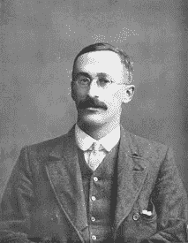
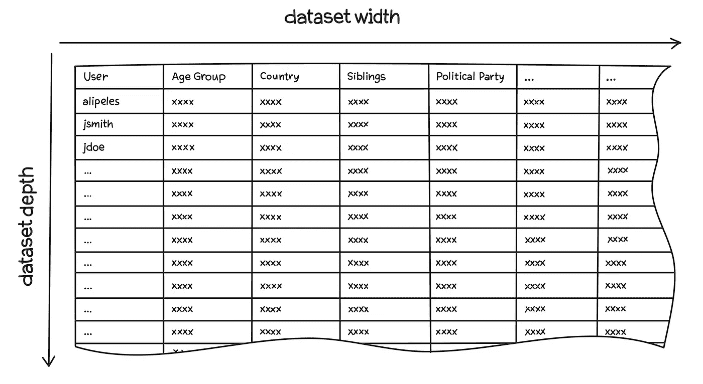
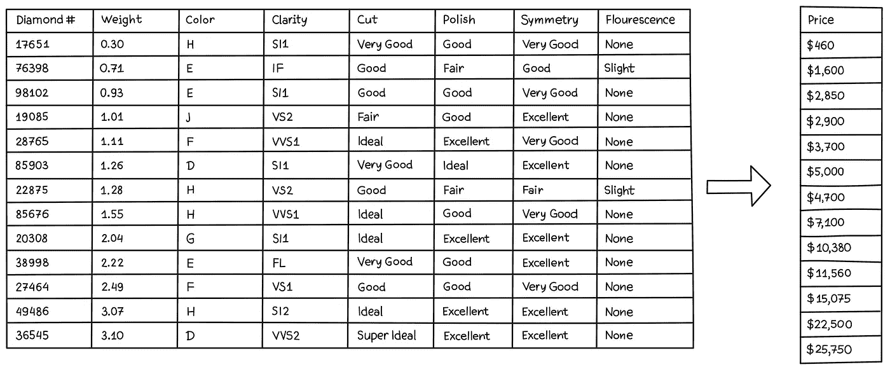
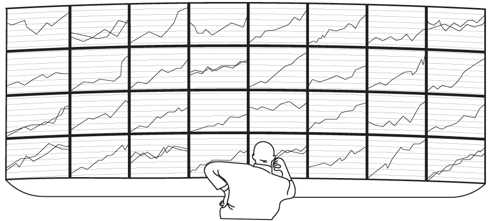

# 如果“多维”伤脑…

> 原文：<https://towardsdatascience.com/if-multi-dimensional-hurts-your-brain-c137c9c572d6?source=collection_archive---------24----------------------->

## [AI/ML 实用性](https://towardsdatascience.com/tagged/ai-ml-practicalities)

## 放松点。思考 N 维空间可能对机器学习至关重要，但这并不难。

Photo by [Casey Horner](https://unsplash.com/@mischievous_penguins?utm_source=unsplash&utm_medium=referral&utm_content=creditCopyText) on [Unsplash](https://unsplash.com/collections/6798085/dimensions?utm_source=unsplash&utm_medium=referral&utm_content=creditCopyText)

*本文是* [*AI/ML 实用性*](/ai-ml-practicalities-bca0a47013c9?source=post_page---------------------------) *系列的一部分。*

# 深度和广度数据集

隐藏在大量人工智能/人工智能炒作背后的是一个简单的事实:机器学习没有什么新意。这是一种建立统计模型的工具，自 1899 年吉尼斯啤酒厂开始使用这些方法测试新的啤酒配方以来，基本上使用了相同的方法。

Statistical pioneer and Guinness brewmaster
William Sealy Gosset, aka “Student” (Wikipedia)

《吉尼斯世界纪录》没有做到的是，机器学习使这一过程自动化，让计算机完成大部分统计工作。此外，由于计算机变得如此强大和廉价，机器学习可以处理巨大的数据集并开发复杂的模型，这在 19 世纪甚至 20 世纪是无法想象的。

这些“巨大的”数据集既深，因为它们包含许多例子，又广，因为它们包含关于每个例子的许多信息。

深度:脸书声称拥有超过 20 亿用户。

Wide:他们(至少)有每个帖子的记录，比如，点击，滚动，查看等。对于每个用户，加上大量的推断数据。他们知道大多数人的年龄、地点、家庭成员、朋友、兴趣、政治倾向、收入等。

Depth = number of examples / Width = number of features per example

换句话说，一个数据集有许多关于每个例子的信息，它有许多*维度*。

# 但是，什么是维度呢？

如果你觉得我刚刚把这个带到了技术 10，深呼吸，让我们解开“维度”是什么。

Thinking about dimensions in space makes it very hard to imagine what other dimensions could be

作为一名学生，我对可能有超过 3 个维度的想法感到困惑。4 维物体是什么样子的，更何况是 10 维物体？我希望一些神奇的澄清洞察力。

我期待错了。至少以物理学家谈论更高维度的方式，人类根本无法想象超过 3 维的空间。但是，我们不需要。

*维度*只是描述事物的独立方式，与空间没有必然联系。在日常语言中，我们习惯于将“维度”理解为长度、宽度和高度。

是的，盒子的尺寸是长、宽和高。但我们无时无刻不在遇到非空间维度。我们来看一个具体的例子。

# 七度空间中的钻石

Photo by [Edgar Soto](https://unsplash.com/@edgardo1987?utm_source=unsplash&utm_medium=referral&utm_content=creditCopyText) on [Unsplash](https://unsplash.com/s/photos/diamonds?utm_source=unsplash&utm_medium=referral&utm_content=creditCopyText)

当美国宝石学院(GIA)对一颗钻石进行分级时，他们报告的 7 个维度是重量、颜色、净度、切割、抛光、对称和荧光。

如果你能想象出一个钻石列表，每颗钻石有 7 条信息，那么恭喜你。你在考虑更高维度，特别是 7 维空间。

在机器学习中，我们学习或预测的每个数据点都是一组输入。这些输入就是尺寸。如果我们想要建立一个模型，仅根据钻石的等级来预测其销售价格，那么该模型的输入将有 7 个维度(等级的详细信息),其输出将有 1 个维度，即预测销售价格。即它将从 7 个维度或 7 条信息映射到 1 个维度或 1 条信息，即价格。

A pricing model maps 7 dimensions (i.e. pieces of information) down to just 1 dimension: the price

# 机器学习伴随着高维度

有效地使用深度数据集带来了计算上的挑战，因为处理如此多的例子需要很长时间。但是，有效地利用深度要困难得多。

使用传统方法确定潜在指标之间的有用关系需要训练有素的统计人员的判断。在数以千计的潜在指标中寻找这样的信号，甚至超过了大型(且昂贵)团队的能力。

要评估的交互的数量随着输入的数量呈指数增长。在 2000 年代，我领导的团队负责预测借款人何时提前偿还抵押贷款。每次我们改变模型时，我们都会评估数以千计的图表，这些图表描绘了十几个输入之间的相互作用。五倍于此的投入会使努力变得棘手。想象 100 倍或者 1000 倍！

机器学习自动化了这种信号寻找过程，并且因为它可以在没有持续人类指导的情况下在巨大的计算农场上处理，所以我们通常可以让它寻找甚至微小而微妙的影响。

因此，机器学习对高维度有天然的亲和力。正如伟大的技术往往会做的那样，机器学习不仅取代了过程的一部分，而且通过其规模，使我们能够做我们以前不能做的事情。