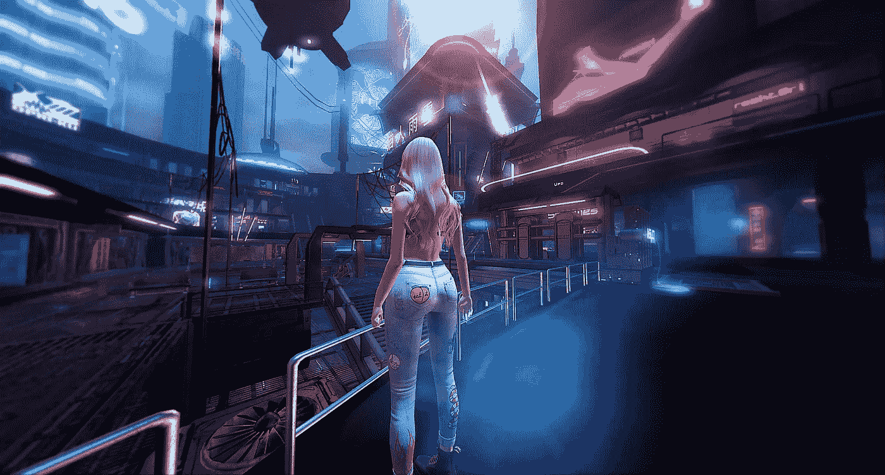

# 如果虚拟现实是现实，虚拟虐待只是虐待。

> 原文：<https://towardsdatascience.com/if-virtual-reality-is-reality-virtual-abuse-is-just-abuse-34f09f1007ef?source=collection_archive---------20----------------------->

## 随着越来越多的人拥抱虚拟空间，我们应该如何处理平行世界中发生的攻击性、辱骂性或猥亵行为？

*“如果你有独立于你的思想之外的东西，它有因果力量，你能以所有这些方式感知，对我来说，你离真实还有很长的路要走，”*哲学家大卫·查尔莫斯最近在接受 [*《纽约时报》*](https://www.nytimes.com/2019/06/18/opinion/david-chalmers-virtual-reality.html?action=click&module=Opinion&pgtype=Homepage) 采访时告诉普拉尚·罗摩克里希纳。查默斯引用了澳大利亚哲学家塞缪尔·亚历山大的话，他说:“*真实就是拥有因果力量*”，科幻作家菲利普·K·蒂克说:“T10 真实的东西是当你不再相信它时不会消失的。

Chalmers 教授的评论是关于新的和日益复杂的虚拟现实世界的；他认为某些东西在我们已知的物理现实中具有“次现实”(或类似)的地位。一个独立于我们的想象仍然存在的地方，在那里行动有结果。

Chalmers 将我们信任的物理现实进行了类比，这在许多层面上已经是如此虚幻。毕竟，大脑与世界没有直接联系，它依赖于我们感官的调节。正如这位数学家兼哲学家指出的那样，科学告诉我们，像颜色这样的生动体验“只是物体的物理反射特性产生的一束波长，在我们身上产生某种体验”

在他的观察中，他肯定不是唯一的。有一个既定的传统，即询问我们的世俗经历是否只不过是一种欺骗——一种为了娱乐某种更高力量的虚拟欺骗(见[这里](https://en.wikipedia.org/wiki/Evil_demon)和[这里](https://en.wikipedia.org/wiki/Brain_in_a_vat))。在这种情况下，虚拟现实世界只是一个更大的虚拟世界中的另一种虚拟体验。

无论我们更熟悉的现实状况如何，我们可能很快就会在区分这些所谓的物理体验和虚拟体验方面遇到问题。即使在两者在视觉上截然不同的情况下，其中一个实施的行为的显著性可能会在另一个中产生反响——特别是当涉及到激发情绪反应的行为时。

在身临其境的互动环境中，我们应该如何应对令人苦恼的、操纵的或虐待的行为？尤其是当它从“内容”发展到更像是一种生活体验的时候？

事实上，这些问题已经开始显现。

以类似于 [*【第二人生】*](https://secondlife.com/) 的在线模拟环境为例，在这些环境中，虐待儿童的虚拟模拟是由同意的成年人在没有法律含义的情况下进行的。2018 年，[一份关于“性年龄游戏”](https://link.springer.com/article/10.1007/s10676-018-9449-5)的研究报告研究了这一现象——随着更加流动和匿名的虚拟环境的出现，这一现象将变得更加普遍——指出在大多数司法管辖区，不存在违法行为，因为不存在对涉案儿童的直接伤害*。尽管其他用户分享了一个*“对性年龄游戏的共同理解是一种虚拟的恋童癖，而不是一种双方同意的成年人之间的性恋物癖。”**

*尽管这一活动被描述为“无受害者”，但第二人生的创造者林登实验室试图用他们的社区规则来监管它。但是随着虚拟世界的不断增加，很有可能会涌现出以“年龄游戏”为特定目的的新的虚拟世界。他们在玩打地鼠游戏。*

*其他*第二人生*用户的反弹很有趣。尤其是考虑到同样的观众似乎对其他“边缘戏”有不同的看法。报告告诉我们:“*……强奸游戏、谋杀游戏、乱伦游戏等行为在文化上被广泛接受，因为它们只是被构建为双方同意的幻想，因此不能反映或影响 RL[现实生活]居民及其未来的行为。**

**

*尽管这些用户接受了双方同意的例子，但很明显，在虚拟环境中，性骚扰和性侵犯不涉及双方同意的例子数不胜数。*

*2016 年，一位名为 Jordan Belamire [的女子写下了她在一款名为](https://medium.com/athena-talks/my-first-virtual-reality-sexual-assault-2330410b62ee#.f5qivxxi6) [QuiVR](http://quivr.net/) 的虚拟现实游戏中被性侵的经历，在该游戏中，另一名(男性)玩家开始虚拟地摩擦她的胸部，当她大声喊他停下来时(该游戏允许口头交流)，她开始用“*抓捏动作*进行追逐。可以理解的是，尽管没有实际发生身体接触，乔丹还是觉得这次遭遇被极大地侵犯了。*

*这场袭击既是真实的*也是虚拟的*。使用 Chalmers 的现实标准——它独立于 Belamire 的想象，它绝对有因果关系。*

*这种令人生畏的情况并不是孤立的事件。经常踏入 VR 环境的女性用户通常会有[一串类似的例子](https://www.revealnews.org/article/when-virtual-reality-feels-real-so-does-the-sexual-harassment/)来分享。随着头像和自我表达变得更加逼真，目前还不清楚平台和法律将如何适应这种行为。正如迈阿密大学的法学教授玛丽·安妮·弗兰克斯所警告的:*

> *“我们正在接近这样一种情况，即将一个人的体型以惊人的准确度输入到他们可能被强奸、攻击甚至杀害的场景中。你永远也不会知道，在火车上，坐在你隔壁小隔间的人或者坐在你对面的人，是不是在用手机做同样的事情。”*

*令人沮丧的是，这种宽容的虚拟现实环境正在与另一种现象并行发展，这种现象允许坏演员控制另一个人的身体和身份: [deepfakes](https://en.wikipedia.org/wiki/Deepfake) 。我们已经看到这种媒介武器化的方式侵犯了个人——尤其是女性——同时通过玩弄微妙的现实模拟边界逃避真正的责任。*

*我们是否正在走向一个虚拟的疯人院，在那里掠食者可以在另一个现实的更深、更暗的角落里重建和操作我们近乎精确的人类肖像？或许还可以出售这种使用权？举证的责任落在否认这种可能性的人身上。*

*当然，有人会说这仍然是一项没有受害者的努力。毕竟，这不会是你，甚至不是你真正的身体。这是一个头像或相似物，没有身体接触。任何违反都只是一种感知。也许是冒犯，但不是冒犯。*

*然而，这削弱了我们与自己相似之处的非常真实的心理-生理联系——这种联系在不久的将来只会变得更强。在 2010 年，[研究人员展示了](https://www.researchgate.net/publication/44584485_Virtual_Hand_Illusion_Induced_by_Visuomotor_Correlations)一种身体所有权效应(可与[橡胶手错觉](https://www.nature.com/articles/35784.epdf?referrer_access_token=pEcqX-aDOn3eISxcgW225NRgN0jAjWel9jnR3ZoTv0MfkH1gXvvC4FP0kc-odxNVshtdWs4jPCMmaKkspP21NI4SuMBCCxa1LLvvXI-px1THO1Dm6gbZVzLsBsfzgHPb7IxIFEhx26-7psWrqQmIujVk6t9S9zQHBwV3d6rHGovMoaocWwvQdVhH6F6YSwoClzbdjYcsgySqmSNI1xONE2Xnqt_UJOgN5u3gPy9c7DRVQ_jidCkCvcSm72sBr8QGYi88weU4R-Bg7tIUHjGVc18-K9U-48N7AnoiAUC10-mL3eI9KujEqhjvToZOJyJL&tracking_referrer=www.technologyreview.com)相媲美)可以在虚拟现实中触发，方法是通过跟踪受试者的身体运动的细微细节，手和手指的运动水平，然后在虚拟身体中精确地复制这些运动。最近，另一组研究人员发现，这种所有权效应甚至可以在非人类动物的化身中重现，如蜘蛛和蝙蝠。《T4 麻省理工科技评论》很快指出这种效应“在色情世界中不可避免地会有应用”。*

*因此，如果我们对我们的虚拟身体有一种观点，认为它是某种形式的拥有，那么对这种形式的任何强加不就是对暂时居住在其中的人的强加吗？看起来的确如此，而且毫无疑问，它的攻击会造成真正的心理影响。*

*但是现在我们有一个问题。即使我们同意在虚拟环境中对用户的骚扰或攻击构成了现实生活中的伤害，这也不能谴责那些假扮成未成年人和施虐者参与道德上可疑的年龄游戏的用户。毕竟没有投诉人，所以有没有真正的伤害？我们不能像 *Second Life* 社区成员在 2018 年的研究中所做的那样，假设虚拟现实中的行为代表了现实生活中的行为。我们也不能对它可能促进的行为做出模糊的概括，这些行为最终会在一些感知的因果链上对儿童造成实际的伤害。如果我们认为这是一个虚拟的兽交问题——而不是虚拟的儿童虐待——由两个同意的成年人进行，我们不太可能使用“虐待动物”的论点来游说消除它。*

*然而，凭直觉，任何一个头脑正常的人都会反对虚拟虐童。那么，我们如何才能保护我们的新虚拟现实环境，而不被指责毫无必要地审查无受害者的幻想？*

*也许答案就在研究为什么某些虐待行为在现实世界中几乎普遍被定为犯罪。它总是建立在对受害者的伤害上吗？我觉得不是这样的。有些情况下，我们会谴责一种行为，即使我们不容易定义它的不良后果。事实上，一些行为——如通奸、习惯性说谎或侮辱死者——通常被认为是本质上错误的，不管是否有任何具体的后果。*

*这无疑是一个更复杂的场景，但也有一些先例。2008 年，英国宣布儿童性虐待漫画为非法。正如在虚拟世界中一样，在这些插图的创作和发行过程中，没有儿童受到直接伤害，因此它是一个有用的比较工具。值得注意的是，当时的司法部政务次官 Maria Eagle 评论说:*

> *“这并不是将艺术或色情漫画定为犯罪，而是针对淫秽的、通常非常真实的儿童性虐待图像，这些图像在我们的社会中没有一席之地。”*

*这是对所描述的行为的广泛和明确的谴责。这是因为我不想生活在这样一个世界里，这样严重的虐待可以被成人轻视和公开庆祝。试图消除在它的描绘中有毒的东西。*

**

*因此，如果这种没有受害者的图像足以让我们至少感到非常不舒服——如果我们可以将它视为文明社会中的一种虐待——我们也应该认为现实虚拟世界中的表演性性虐待同样令人不安，如果不是更令人不安的话。当然，很多人会。但是，随着这个新的西部荒野展现在我们面前，重要的是我们要弄清楚什么是可接受的和有利可图的使用，以及什么样的行为会成为污染物。特别是如果像查尔莫斯教授所说的那样，虚拟现实实际上是另一个*现实*，而不是一些无法无天的游乐场，在那里我们可以想象的任何事情都可以成为现实。*

*当然，这是一个滑坡。如果现实世界的规则阻止游戏玩家在末日般的虚拟世界中热情地向对手射击，他们会感到震惊。同样，在现实生活中，出于安全原因，有大量的行为是非法的——比如高速驾驶——虚拟现实可能是完美的发泄途径。我们也知道，这是一个学习和练习特殊技能的好地方，比如外科手术，以主动减少真正的伤害。因此，似乎从物理现实到虚拟现实的法律的全面应用可能会破坏媒体的最佳使用，并很快恶化成闹剧。*

*然而，这并不意味着我们不应该适当考虑我们能够并且应该引入哪些规则。当一个行为对个人或更广泛的社会有真正的因果影响时，我们就应该采取措施保护那些珍贵的东西。不只是在现实生活中，而是在所有可能的世界里。*