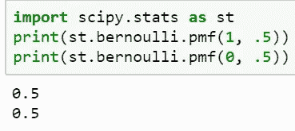
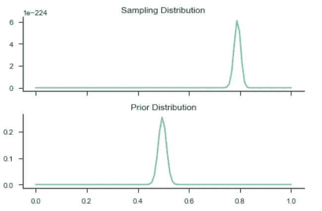
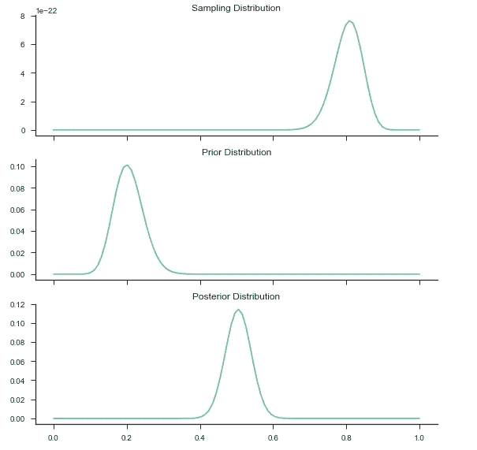
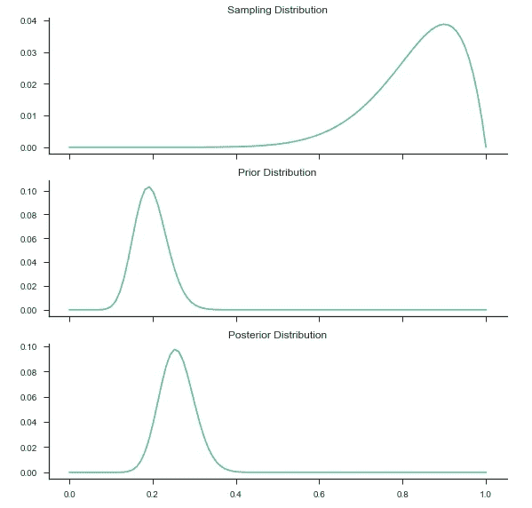

# 如果你是贝叶斯主义者，你必须是天真的！

> 原文：<https://towardsdatascience.com/if-you-are-a-bayesian-you-have-to-be-naive-ac55492889bf?source=collection_archive---------17----------------------->

## 贝叶斯定理

source: Chris Albon

让我们从一个谜题开始吧

如果你第一次面试很成功，你获得第二次面试的可能性有多大？

*   接受第一次面试的人中有 50%接受了第二次面试
*   95%接受复试的人第一次面试都很顺利
*   75%没有得到复试的人在第一次面试中表现良好

我们可以用常识来解决这个问题。这并不像听起来那么可怕。

假设有 200 人参加了面试，其中 100 人进入了第二轮，100 人没有。在第一批人中，有 95 人认为他们的第一次面试很棒。在第二批人中，有 75 人认为他们的第一次面试很成功。总共有 95 + 75 (170)人觉得他们的第一次面试很不错。

最后，在 170 人中，只有 95 人获得了第二轮面试。这就是了。

我们可以用贝叶斯定理把它复杂化。这就是我在这篇文章中要讨论的内容。

**什么事？**

贝叶斯定理允许我们从**抽样(或似然)分布**和**先验分布**到**后验分布**。

简单来说，它可以利用一些相关观察的知识让你得到一些你还不知道的东西。

# 什么是抽样分布？

抽样分布是在给定我们的**参数(** θ **)的情况下看到**我们的数据(X)** 的概率。**这个写成 p(X|θ)。

例如，我们可能有 1000 次抛硬币的数据。其中 1 表示头部。这在 python 中可以表示为:

抽样分布允许我们指定我们认为这些数据是如何产生的。对于掷硬币，我们可以认为我们的数据是由伯努利分布产生的。这个分布有一个参数 p，它是得到 1 的概率(或者掷硬币的正面)。然后，它以概率 p 返回值 1，以概率(1-p)返回值 0。

你可以看到这是如何完美的抛硬币。对于一个公平的硬币，我们知道我们的 p = .5，因为我们同样有可能得到 1(正面)或 0(反面)。我们可以从这个分布中创建样本，如下所示:

现在，我们已经定义了我们认为我们的数据是如何生成的，我们可以计算给定我们的参数𝑝(𝑋|𝜃).看到我们的数据的概率既然我们选择了伯努利分布，我们只有一个参数:p。

我们可以使用伯努利分布的**概率质量函数(PMF)** 来获得单次抛硬币的期望概率。PMF 取一个观察到的数据点，然后给定参数(在我们的例子中为 p ),返回在给定这些参数的情况下看到该数据点的概率。对于伯努利分布，很简单:如果数据点是 1，PMF 返回 p，如果数据点是 0，它返回(1-p)。

这是一个非常简单的 PMF，但是其他发行版可能会复杂得多。所以很高兴知道 Scipy 内置了大部分这些功能。我们可以从 PMF 得出如下结论:

这很好，但我们真正想知道的是看到我们所有 1000 个数据点的概率。我们如何做到这一点？这里的技巧是假设我们的数据是[独立且同分布的](http://en.wikipedia.org/wiki/Independent_and_identically_distributed_random_variables)。这个假设允许我们说看到我们所有数据的概率只是每个个体概率的乘积:𝑝(𝑥1,…,𝑥𝑛|𝛽)=𝑝(𝑥1|𝛽)∗…∗𝑝(𝑥𝑛|𝛽)p(x1,…,xn|β)=p(x1|β)∗…∗p(xn|β).这很容易做到:

这个数字对我们有什么帮助？就其本身而言，它并没有太大的帮助。我们现在需要做的是为我们的采样模型得到更多的分布。目前，我们只测试了 p = .5 的模型，但是如果 p = .8 呢？还是. 2？那么我们的数据的概率会是什么样的呢？这可以通过为我们的 p 定义一个值网格来实现。下面我将制作一个由 0 和 1 之间的 100 个值组成的网格(因为 p 必须在 0 和 1 之间)，然后我将计算在给定这些值的情况下看到我们的数据的概率:

现在我们有所进展。我们可以看到，看到我们的数据的概率在 p = .5 时达到峰值，几乎肯定在 p = .4 和 p = .6 之间。很好。现在我们有了一个很好的想法，假设 p 值是从伯努利分布中提取的，那么是什么 p 值产生了我们的数据。我们完了，对吧？不完全是…

# 先验分布

贝叶斯定理说，我们需要考虑我们的抽样分布和先验分布。我说的优先分配是什么意思？它是𝑝(𝜃)或看到我们参数的特定值的概率。在我们的抽样分布中，我们为参数 p 定义了从 0 到 1 的 100 个值。现在我们必须定义看到每个值的先验概率。这是我们在看到任何数据之前假设的概率。最有可能的是，我们会假设一个公平的硬币，它看起来像上面的分布。让我们看看如何做到这一点:

基本上，我们创建了 1，000 次公平抛硬币，然后像之前一样生成了抽样分布(除了我们除以抽样分布的总和以使值总和为 1)。现在，在我们的参数之前，我们有一个“公平硬币”。这基本上意味着，在我们看到任何数据之前，我们认为掷硬币是公平的。我们可以在我们的先验分布中看到这个假设，因为我们的先验分布峰值在 0.5，几乎都在 0.4 到 0.6 之间。

我知道你在想什么——这太无聊了。抽样分布和先验分布看起来完全一样。所以让我们把事情混在一起。让我们保持我们的公平先验，但改变我们的数据是一个不公平的硬币:

啊——这很有趣。我们有强有力的数据证据证明硬币是不公平的(因为我们生成了 p = .8 的数据，我们知道它是不公平的)，但是我们先前的信念告诉我们硬币是公平的。我们该如何应对？

贝叶斯定理允许我们从抽样和先验分布到后验分布。**后验分布是** 𝑃(𝜃|𝑋).或者用英语来说，给定我们的数据，我们的参数的概率。如果你仔细想想，这就是我们真正想要的。我们通常从调查或网络流量中获得数据，我们希望找出哪些参数最有可能给定我们的数据。那么我们如何得到这个后验分布呢？下面是一些数学问题(不要担心，不算太糟):

根据定义，我们知道(如果你不相信我，查看这个[页面](https://people.richland.edu/james/lecture/m170/ch05-cnd.html)复习一下):

*   𝑃(𝐴|𝐵)=𝑃(𝐴,𝐵) / 𝑃(𝐵)或者在英语中，看到给定 b 的概率是看到两者的概率除以 b 的概率
*   𝑃(𝐵|𝐴)=𝑃(𝐴,𝐵) / 𝑃(𝐴).或者用英语来说，给定 A 看到 B 的概率就是看到他们两个的概率除以 A 的概率。

您会注意到这两个值共享同一个分子，因此:

*   𝑃(𝐴,𝐵)=𝑃(𝐴|𝐵)∗𝑃(𝐵)
*   𝑃(𝐴,𝐵)=𝑃(𝐵|𝐴)∗𝑃(𝐴)

因此:

𝑃(𝐴|𝐵)∗𝑃(𝐵)=𝑃(𝐵|𝐴)∗𝑃(𝐴)

这意味着:

𝑃(𝐴|𝐵)=(𝑃(𝐵|𝐴)∗𝑃(𝐴)) / 𝑃(𝐵)

𝐴使用𝜃插件，𝐵:使用𝑋插件

𝑃(𝜃|𝑋)=(𝑃(𝑋|𝜃)∗𝑃(𝜃)) / 𝑃(𝑋)

不错！现在我们可以插入一些我们知道的术语:

𝑃𝑜𝑠𝑡𝑒𝑟𝑖𝑜𝑟=(𝑙𝑖𝑘𝑒𝑙𝑖ℎ𝑜𝑜𝑑∗𝑝𝑟𝑖𝑜𝑟) / 𝑃(𝑋)

但是什么是𝑃(𝑋)？或者用英语说，我们数据的概率？这听起来很奇怪…让我们回到数学上，再次使用𝐵和𝐴:

我们知道𝑃(𝐵)=∑𝑃(𝐴,𝐵)(查看第[页](http://en.wikipedia.org/wiki/Marginal_distribution)进行复习)

从上面的定义中，我们知道:

𝑃(𝐴,𝐵)=𝑃(𝐵|𝐴)∗𝑃(𝐴)

因此:

𝑃(𝐵)=∑ 𝑃(𝐵|𝐴)∗𝑃(𝐴)

插上我们的𝜃和𝑋:

𝑃(𝑋)=∑𝜃𝑃(𝑋|𝜃)∗𝑃(𝜃)

插入我们的术语:

𝑃(𝑋)=∑𝜃 𝑙𝑖𝑘𝑒𝑙𝑖ℎ𝑜𝑜𝑑 ∗ 𝑝𝑟𝑖𝑜𝑟

哇！是不是很牛逼！但是我们所说的∑𝜃是什么意思呢？这意味着对所有参数值求和。在掷硬币的例子中，我们为参数 p 定义了 100 个值，因此我们必须计算每个值的概率，并对所有答案求和。这是贝叶斯定理的分母。因此，我们对贝叶斯的最终回答是:

𝑃𝑜𝑠𝑡𝑒𝑟𝑖𝑜𝑟=(𝑙𝑖𝑘𝑒𝑙𝑖ℎ𝑜𝑜𝑑 ∗𝑝𝑟𝑖𝑜𝑟) / (∑𝜃 𝑙𝑖𝑘𝑒𝑙𝑖ℎ𝑜𝑜𝑑∗𝑝𝑟𝑖𝑜𝑟)

那是一大堆文字。让我们再做一些编码，把所有的东西放在一起。代码可以在[这里](https://github.com/hdev7/medium-article-naive-bayes/blob/master/naive%20bayes.ipynb)找到。

您会注意到，我将先验和可能性的观察次数设置为 100。这增加了我们分布的方差。更多的数据通常会降低分布的扩散。此外，当你得到更多的数据来估计你的可能性时，先前的分布就不那么重要了。

我已经把它改成 10 了。你可以在上图中看到这种影响。因为我们有更多的数据来帮助我们估计我们的可能性，我们的后验分布更接近我们的可能性。相当酷。

# 结论

这就是了。贝叶斯定理导论。现在，如果你怀疑一枚硬币的公平性，你知道如何调查这个问题！或者是一个群体投票赞成一项法律的概率？或者任何其他是/否的结果。

# 一些旁注

1.  你会注意到贝叶斯定理的分母只是一个常数。所以如果你只想得到最大后验值，你甚至不需要计算那个常数。由于这个原因，你经常会看到后验概率与可能性*先验概率成比例。
2.  频率统计侧重于可能性。或者你可以说，常客是贝叶斯理论，具有非信息先验(像均匀分布)。但是不要太讨厌常客；应用环境中的大多数贝叶斯推理依赖于频率统计。
3.  现在你知道了频率主义者的统计集中在可能性上，这就更清楚为什么人们经常误解频率主义者的置信区间了。可能性是𝑃(𝑋|𝜃)——或者给定我们的参数，我们的数据的概率。这有点奇怪，因为我们得到的是数据，而不是参数。大多数 frequentists 模型所做的是取似然分布的最大值(或最大似然估计(MLE))。基本上找到什么参数最大化看到我们数据的概率。这里重要的一点是，他们将数据视为随机的，所以 frequentist 置信区间的意思是，如果你不断获得新数据(可能更多的调查)并计算每个新样本的置信区间，这些样本中 95%的置信区间将包含你试图估计的真实参数。

# 朴素贝叶斯

在机器学习中，有一个利用贝叶斯定理的非常常见的模型，称为朴素贝叶斯。这是一个分类模型，如下所示:

𝑃(𝐶𝑙𝑎𝑠𝑠|𝐷𝑎𝑡𝑎)∝𝑃(𝐷𝑎𝑡𝑎|𝐶𝑙𝑎𝑠𝑠)∗𝑃(𝐶𝑙𝑎𝑠𝑠)

因此，我们使用贝叶斯定理的概念来计算给定数据的某个类的概率——这是有意义的。

在这个模型中，我们的先验很容易计算——它只是训练数据中出现在该类中的概率。例如，如果您的训练数据有 40%是 heads，那么您的 prior to P(Heads|Data)是. 40。

什么是 P(数据|类)？显然这是我们的可能性。在上面的例子中，我们用伯努利分布来表示我们的可能性。对于朴素贝叶斯，通常使用三种分布:

*   伯努利
*   多项式
*   高斯的

你要做的是使用训练数据来估计每个特征的必要参数。例如，高斯的均值和标准差(给定感兴趣的类)。因此，如果你有一个特征，即被投掷硬币的重量，你将得到每一类(正面和反面)重量的平均值和标准差。然后对所有要素执行此操作，并假设所有要素都遵循相同的分布-在本例中为高斯分布。这也是它被称为幼稚的一个原因。

您还假设所有的特征都是独立的(天真的)，因此这意味着您可以将所有特征的可能性的乘积作为 P(数据|类)。

因此，对于一行数据，计算 P(Class|Data)的方法是:获取该行的每个要素，根据训练数据中计算出的参数，将其代入所选分布的可能性，然后将所有这些值相乘，最后乘以训练数据中属于该类的概率。

您对每个类重复这个练习，然后您预测的类就是具有最大值的类。就是这样！

这个模型非常快，所以它的伸缩性很好。它在垃圾邮件分类领域也很有名，因为它是解决这个问题的原始模型之一。尽管如此，它最常用于具有多项式可能性的文本分类。

Sklearn 有一篇很好的文章，其中有一个如何使用该模型的示例:

[http://scikit-learn.org/stable/modules/naive_bayes.html](http://scikit-learn.org/stable/modules/naive_bayes.html)