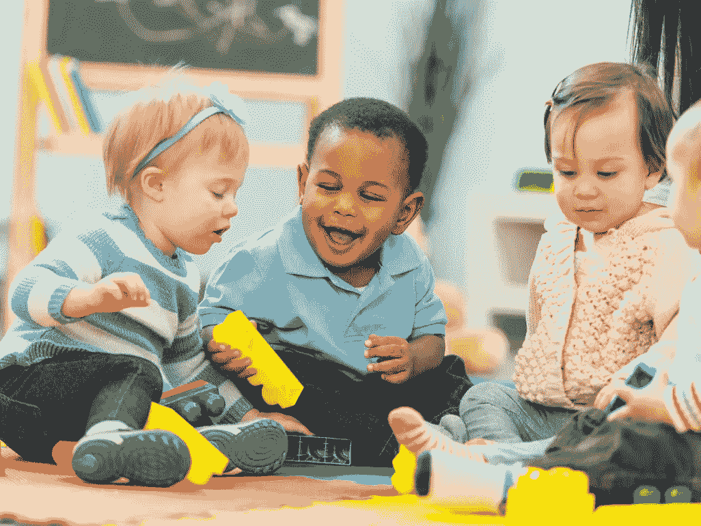
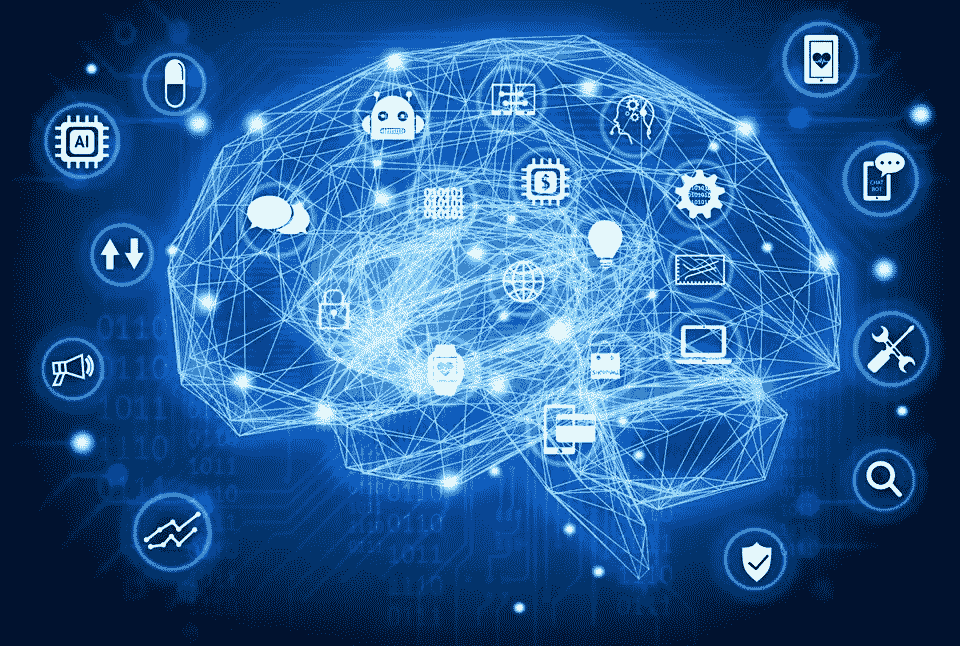

# 如果你是从事人工智能的产品经理，你需要知道这一点

> 原文：<https://towardsdatascience.com/if-you-are-a-product-manager-working-on-ai-you-need-to-know-this-be7f048ecaf9?source=collection_archive---------31----------------------->

## 我们可以从自然智能中学到什么来在人工智能领域取得成功…

作为人工智能产品经理，一个人的任务是创建、部署和发展人工智能产品或应用程序，并确保它在整个生命周期中交付。

在我(20 多年)的人工智能实践中，之前在学术界创造这些算法，然后在私营部门将它们应用到现实世界的应用中，我意识到在我们如何构思我们的人工智能应用中有一个缺失的成分:持续学习。这就是我的意思。

## 回到基础…

我写这篇文章的时候，正看着我的第四个孩子，新生的莱昂纳多·范思哲，在他生命的第五天小睡片刻。它强大的(天生的)智能在几个小时的紧张工作后正在休息。它在学习，为下一次玩耍重新连接自己，重组突触，这样他的大脑会在下一次玩耍时变得更好，哪怕只是一点点。

Taking inspiration from the most powerful learning machines we know of.

正如我听说或看到的所有婴儿一样，莱昂纳多出生时有一套非常基本的技能，而且有点“不熟”。有几个月的时间，他不会走路，不会说话，更不用说为他的爸爸做卡布奇诺了(到两岁时，他应该是一个熟练的咖啡师了)。

大自然母亲为人类选择了一种非常奇特的发展方式。我们的婴儿出生时，基本技能非常有限，但令人印象深刻，其中最重要的是:学习。

然后，日复一日地在球场上重复和不断地学习。

人类天生就有能力建立基本技能，学习和发展超越他们对世界的最初理解，并在现实世界中运用他们的技能。婴儿最终会感知和抓住机器人，并将它们撕碎(见上图，我的长子加布里埃尔在他面前正要撕掉不幸的 iRobot 的各种碎片)。

如果我们能够跟随自己的脚步构建和部署人工智能，我们就可以避免企业通常面临的许多问题。现实是，大多数人工智能开发遵循的过程与上面概述的过程非常不同。产品经理和工程团队倾向于在试图在相关环境中进行测试之前，尽可能多地构建人工智能系统。这个基本的、命运多舛的想法是:“让我尽可能多地将人工智能放入系统，我知道它需要做什么，然后当我在 67 个月后完成时，祈祷它能工作！”。

然后，88 个月后，人工智能失败了。

这是规则，而不是例外，一旦部署，你的人工智能将不会按预期工作。但是在把所有的责任都推给产品经理和 AI 专家之前要三思！今天，部署、培训和测试人工智能的过程很繁琐，为了不浪费宝贵的时间和金钱，尽可能好地进入系统是至关重要的。

只有在相关环境中的早期部署和学习，在一个连续的反馈循环中，它才能使我们真正建立一个(自然或人工)智能，能够应对现实与我们想象的概念。

人类日复一日地学习。AI 也应该这样做

Truly realiable AI should never stop being updated

我学到了艰难的方法…为机器人构建和部署人工智能。我认为花大量的时间设计一个防弹人工智能，然后看看它是否能在实地工作会是最好的。几次尝试失败后，我和我的同事不得不改变策略。现在，我们专注于在投入使用前的快速原型制作。我们越早了解潜在的缺陷，就越能更好地解决它们。

所以，日复一日，部署并坚持学习。和我们一样，AI 永远不应该停止学习！