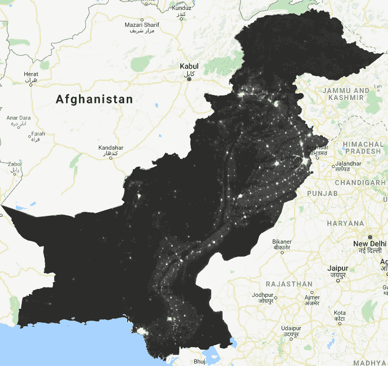

# 用夜灯照亮人类的活动

> 原文：<https://towardsdatascience.com/illuminating-human-activities-using-the-night-light-9caceaab7867?source=collection_archive---------17----------------------->

Nightlights of the earth observed in 2016\. Image processed and released by NASA

> 自从人类出现以来，人类从黎明到黄昏一直工作，日落之后才休息。但是自从托马斯·爱迪生发明了灯泡之后，情况就变了。

今天我们的夜晚变得比以往任何时候都更明亮，原因是我们到处都有灯。我们的市场、广告牌、道路和住宅都被点亮了。如今，人类居住的每个地方都有某种形式的夜灯。

现在多亏了卫星，我们可以从太空中看到并绘制这些夜光。这些数据有多种用途，包括帮助救灾、分析停电，甚至绘制全球和地区二氧化碳排放量的估计图等。

如果你想深入了解外部因素，Nightlights 是一个非常有用的数据集，可以纳入你的分析中。夜间值提供了关于人口和经济发展的非常丰富、独特的见解。

地球在夜间的图像经过处理后产生了这些数据，任何人都可以免费下载和处理/分析这些数据。在我的[上一篇博客](/how-to-work-with-big-geospatial-data-4ba919a8ffc2)中，我谈到了谷歌地球引擎如何提供地理空间数据集，而无需下载和预处理。

使用地球引擎，我分析了从卫星图像中获取的免费夜灯[数据集](https://ngdc.noaa.gov/eog/dmsp/downloadV4composites.html)，发现了一些有趣的使用模式，并认为我应该分享一些。

# 古老的文明围绕河流发展

古老的文明围绕着河流。最有可能的原因是，在那些日子里，人类最依赖农业，这些河流使得大规模的农业成为可能。随着这些文明的消亡，新的文明在它们的足迹上诞生。

所以通过观察今天人类居住的模式，我们可以看到古代文明是如何发展的。所以让我们来看看这个星球上最古老的三个文明。

## 印度河流域文明

> 印度河流域文明，又称哈拉帕文明，始于 5300 年前。它盛行于目前从阿富汗延伸到巴基斯坦和印度的地区。印度河流域文明是旧世界三大早期文明之一，与埃及和美索不达米亚文明齐名。

这条河具有如此重要的历史意义，以至于“印度”这个名字也来源于“印度河”。它的大部分盆地在今天的巴基斯坦，如果你看看巴基斯坦的夜景，你会发现人类出现在印度河及其支流周围。

Nightlight in Pakistan along the river Indus

它非常相似，你可以在这张地图上画出河流。现在看看印度河系统，看看相似之处。

Indus River system

## 古埃及文明

> 古埃及文明发生在公元前 3100 年到公元前 2686 年之间。这是世界上最著名和最受推崇的文化。这种文化是沿着尼罗河两岸发展起来的。宏伟的金字塔是曾经繁荣的河岸文化的一些证据，并提醒人们在埃及沙漠中存在一个强大的帝国。

现代埃及也与古埃及文明位于同一地点，即尼罗河三角洲。夜灯数据集显示，埃及的人口集中在尼罗河及其三角洲周围。这又有一个相似之处。

Nightlights in Egypt along the River Nile

要看相似之处，请看一下埃及和尼罗河的地图。

Map of Egypt and the River Nile

## 美索不达米亚文明

> 美索不达米亚是人类历史上出现的第一个文明。该地区位于底格里斯河和幼发拉底河之间，位于小亚细亚和波斯湾之间。这个地区以其肥沃的农田而闻名。这一文明可以追溯到公元前 10，000 年，当时该地区的人们发现了农业的概念，并开始驯养动物。

这些河流发源于今天的土耳其，流经叙利亚，流入伊拉克，最终汇入波斯湾。如果你看看今天的伊拉克和叙利亚，你会发现他们的城市仍然有这种模式。

Development of Iraqi and Syrian cities around the Tigris and Euphrates rivers

现在看看这两条河的地图，看看有什么相似之处。

Map of rivers Tigris and Euphrates

# 新的文明正在沿海涌现

随着贸易的普及，人类改变了这一趋势，开始在海港周围定居。我们最近看到了迪拜、阿布扎比和沙迦等城市。沿阿联酋海岸弹出。我们在伊朗的恰巴哈尔和巴基斯坦的加瓦达尔沿海看到了类似的新发展。例如，看看澳大利亚

Nightlights in Australia

与我们之前谈到的文明相比，澳大利亚的城市要年轻得多，它们代表了人类居住的新模式。你可以看到澳大利亚是一片广阔的黑暗之地，除了沿海涌现的城市。

# 从太空中可以看到边境的紧张局势

从太空中可以看到的另一种人类活动是边界紧张。我们都知道印度和巴基斯坦相处不好。从上面可以看到。

Pakistan India Border from the space

India Pakistan border zoomed in

他们边界的南部是可见的，因为它位于人烟稀少的沙漠中，这使得两边都很暗，但边界被泛光灯照亮，因为双方全天候监控对方的活动。

出于同样的原因，从上方可以看到的另一条边界是朝鲜和韩国之间的边界。这就更清楚了。

Nightlights of North and South Korea as seen from the space

Korean Border zoomed

这里要看到的另一点是发展的巨大差异。与朝鲜相比，韩国要发达得多，你可以在韩国各地看到充满活力的城市，而在朝鲜，唯一有一些夜景的地方是平壤市。

# 经济发展

夜灯也可以被看作是经济发展的一个标尺。随着经济的发展，城市开始变得越来越大，越来越亮。我使用了 DMSP·OSP 的夜灯数据集进行分析，该数据集可以从 1992 年到 2013 年获得，所以我试图看看世界在这段时间里是如何变化的，我可以看到几乎整个世界都变得更亮了。

Left: South Korea in 1992\. Right: South Korea in 2013

增长最快的两个国家之一是韩国。上图不言自明。在此期间，他们的国内生产总值从 3863 亿美元增加到 1.3 万亿美元，这一点从太空中可以看出。但是有一个国家甚至超过了韩国。

Left: China in 1992\. Right: China in 2013

从 1992 年到 2013 年，中国的国内生产总值从 4269 亿美元增长到 9.6 万亿美元，从空间上可以很容易地看出这一点。但从太空中可以看到的另一件事是，所有的开发都在东半部，而西半部仍然相当不发达。或许这就是为什么中国通过一带一路将它的西半部与巴基斯坦的海港、中东和欧洲连接起来的原因。

# 战争使各国陷入黑暗

战争是地狱。它是冷漠的，向你展示了人类的生命是多么脆弱。战争使国家陷入黑暗。确实如此，我们可以从太空中看到。从 1992 年到 2013 年，两场战争开始了，我想我应该看看这些。

Left: Nightlights of Iraq in 2002\. Right: Nightlights of Iraq in 2005

美国在 2003 年入侵伊拉克，声称伊拉克拥有大规模杀伤性武器。所以我们可以看到，与战争期间的 2005 年(右图)相比，2002 年伊拉克的夜晚更加明亮。

Left: Syria in 2010\. Right: Syria in 2013

叙利亚内战始于 2011 年 3 月，持续至今。2010 年是叙利亚战争爆发的前一年，2013 年是该数据集可用的最后一年。在这三年里，你可以看到叙利亚陷入了黑暗。

## 在[现场](https://www.locale.ai/)对我的朋友大声喊出来

在这个瞬息万变的世界里，夜灯每天都在以非常精细的级别(100 米的分辨率)更新，以提供最新的信息。相比之下，像人口普查这样的数据集大约每 10 年更新一次！

这可以帮助你根据他们的增长情况决定你应该扩展到哪个城市，或者你应该在一个城市内的哪一组地点集中你的发布或营销工作，以这个值作为经济活动的代表。然而，处理这些数据本身就是一个巨大而独特的挑战。你需要大规模地处理它，校正云、森林火灾和太阳耀斑。

如果您想在您的模型中使用这些即插即用的见解，请点击[这些人](https://www.linkedin.com/in/aditi-sinha-6b774ba9/)吧！！

# 光有黑暗的一面

到目前为止，我只谈到了光是和平与繁荣的象征，但故事还有另一面。夜灯也会引起一些问题，这就是为什么它被称为“光污染”的原因。

夜间迁徙的候鸟进化成了跟随远处昏暗的灯光，但现在它们被城市的灯光弄糊涂了，它们绕着亮着灯的建筑物转，由于疲惫而坠落。由于夜灯，每年有数百万只鸟死亡。

动物王国里有一些物种，比如蜣螂，进化到以乳道为参照来导航，但是夜晚的灯光让它看不见。这是一个可视化的展示，展示了它是如何让牛奶通道消失的。

Bortle Scale of Nightlight pollution

情况变得如此糟糕，以至于大多数住在城市的人已经忘记了牛奶路是什么样子。我最近在巴基斯坦的科希斯坦山徒步旅行，过了很久才看到这条奶道。我能看到它是因为这是一个偏远的地区，几乎没有夜灯，没有云，而且是新月。让我给你看看它是什么样子的。

Milkyway in Jahaz Banda meadows of Kohistan mountain range

我敢打赌，你们中的一些人(如果不是大多数人)从来没有见过这样的牛奶通道，城市灯光是罪魁祸首。顺便说一句，上面照片中穿黑色夹克的是我。

夜灯不仅对环境有害。甚至我们人类已经进化到天黑时睡觉，白天醒来。夜晚太多的光线会让我们误以为现在还是白天，这会导致失眠和其他健康问题。

> 我是拉米兹·萨米。我爬山、举重、构建 WebGIS 解决方案。在 [*Linkedin*](https://www.linkedin.com/in/ramizsami/) *上随时与我联系。*