# 插图:10 个 CNN 架构

> 原文：<https://towardsdatascience.com/illustrated-10-cnn-architectures-95d78ace614d?source=collection_archive---------0----------------------->

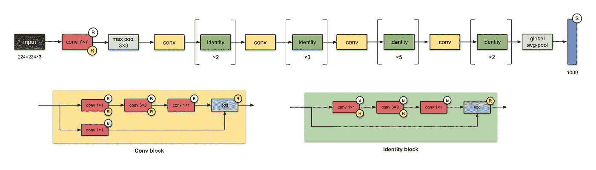

What architecture is this? 🤔

## [**里面的艾**](https://medium.com/towards-data-science/inside-ai/home?source=post_page---------------------------)

## 普通卷积神经网络的编译可视化

*(TL；DR —此处跳转到插图***)**

**变更日志:
2022 年 1 月 5 日—修复错别字并提高清晰度
2020 年 11 月 28 日—更新了每个 CNN 的“最新消息”
2020 年 11 月 17 日—编辑了从 4096 到 1000 的 Inceptionv1 的最后一个密集层的层数
2020 年 9 月 24 日—编辑了 ResNeXt-50 的“最新消息”部分**

*你是如何跟上不同的卷积神经网络(CNN)的？近年来，我们见证了无数 CNN 的诞生。这些网络已经变得如此之深，以至于很难想象整个模型。我们不再跟踪他们，把他们当作黑箱模型。*

*好吧，也许你不知道。但如果你也有罪，那么嘿，你来对地方了！这篇文章是 10 个常见的 CNN 架构的可视化，由你的忠实读者亲自挑选。这些插图提供了整个模型的更紧凑的视图，而不必为了查看 softmax 层而向下滚动几次。除了这些图像，我还写了一些笔记，说明它们是如何随着时间的推移而“演变”的——从 5 到 50 个卷积层，从普通卷积层到模块，从 2-3 个塔到 32 个塔，从 7⨉7 到 5⨉5—，但后面会有更多内容。*

> **我说的‘常见’，是指那些预先训练好的权重通常被深度学习库(如 TensorFlow、Keras、PyTorch)共享给用户使用的模型，以及通常在课堂上教授的模型。这些模型中的一些已经在类似于* [*ImageNet 大规模视觉识别挑战赛*](http://image-net.org/challenges/LSVRC/2016/index) *(ILSVRC)的比赛中取得了成功。**

*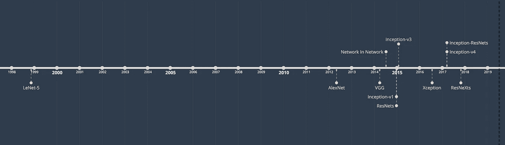*

*The 10 architectures that will be discussed and the year their papers were published.*

*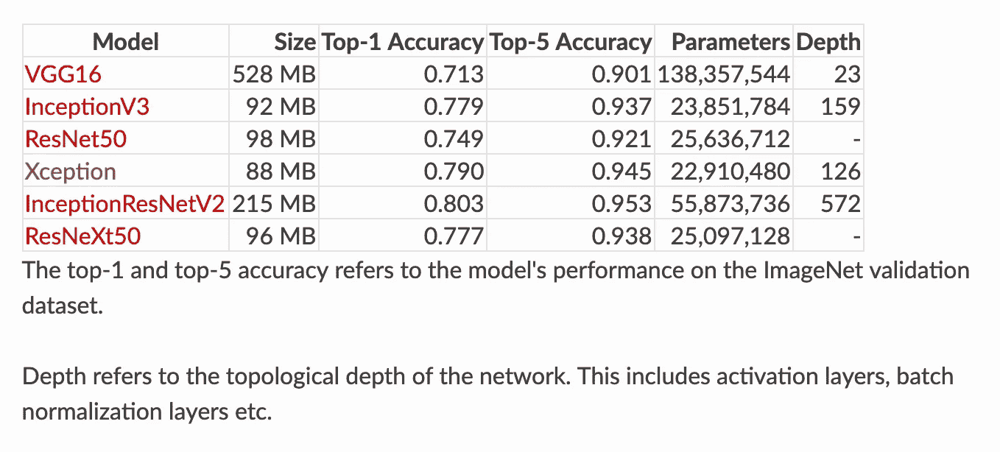*

*Pre-trained weights are available in Keras for 6 of the architectures that we will talk about. Adapted from a table in the [Keras documentation](https://keras.io/applications/).*

*写这篇文章的动机是，没有很多博客和文章有这些紧凑的可视化(如果你知道任何，请与我分享)。所以我决定写一个给大家参考。为了这个目的，我阅读了论文和代码(大部分来自 TensorFlow 和 Keras ),提出了这些 vizzes。*

*这里我想补充一点，我们在野外看到的过多的 CNN 架构是许多事情的结果——改进的计算机硬件、ImageNet 竞争、解决特定任务、新想法等等。谷歌的研究员克里斯蒂安·塞格迪曾经提到*

> *“这些进步不仅仅是更强大的硬件、更大的数据集和更大的模型的结果，更主要的是新思想、算法和改进的网络架构的结果。”(Szegedy 等人，2014 年)*

*现在，让我们继续研究这些野兽，观察网络架构如何随着时间的推移而改进！*

> ****关于可视化的说明*** *注意，我已经排除了插图中卷积滤波器、填充、步幅、漏失和展平操作的数量。**

## *目录(按出版年份排序)*

1.  *[LeNet-5](#e276)*
2.  *[AlexNet](#e971)*
3.  *[VGG-16](#c5a6)*
4.  *[盗梦空间-v1](#81e0)*
5.  *[盗梦空间-v3](#6872)*
6.  *[ResNet-50](#e4b1)*
7.  *[异常](#d27e)*
8.  *[盗梦空间-v4](#b4ed)*
9.  *[盗梦空间](#643c)*
10.  *[ResNeXt-50](#676b)*

## *神话；传奇*

*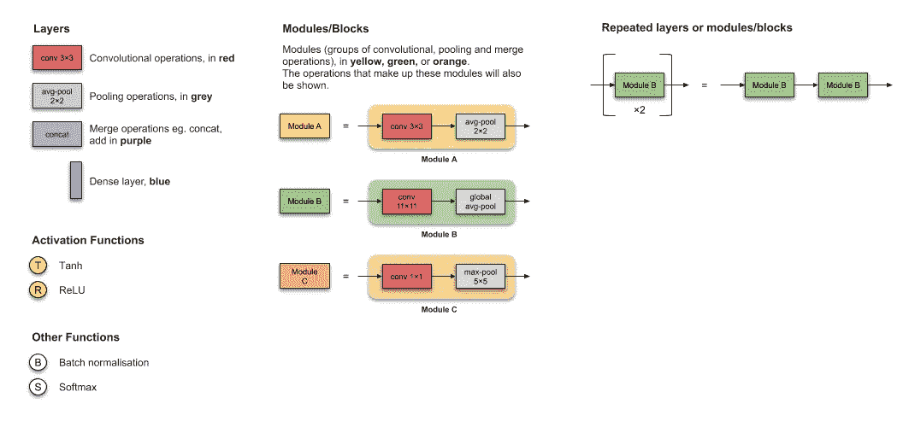*

## *1.LeNet-5 (1998 年)*

*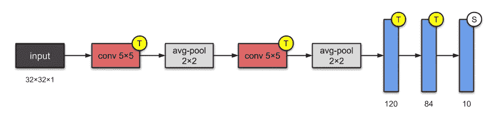*

*Fig. 1: LeNet-5 architecture, based on their [paper](http://yann.lecun.com/exdb/publis/index.html#lecun-98)*

*LeNet-5 是最简单的架构之一。它有 2 个卷积层和 3 个全连接层(因此是“5”——神经网络的名称通常来自它们拥有的*卷积层*和*全连接层*)。我们现在知道的平均池层被称为*子采样层*，它具有可训练的权重(这不是当今设计 CNN 的当前实践)。这个架构大约有**60000 个参数**。*

***⭐️What's 小说？***

*这种架构已经成为标准的“模板”:堆叠具有激活功能的卷积，汇集层，并以一个或多个完全连接的层结束网络。*

***📝出版物***

*   *论文:[基于梯度的学习应用于文档识别](http://yann.lecun.com/exdb/publis/index.html#lecun-98)*
*   *作者:Yann LeCun，Léon Bottou，Yoshua Bengio 和 Patrick Haffner*
*   ***发表于:**IEEE 会议录(1998)*

## *2.AlexNet (2012 年)*

*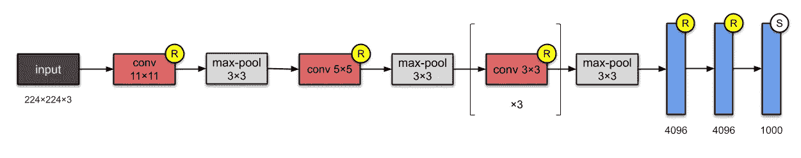*

*Fig. 2: AlexNet architecture, based on their [paper](https://papers.nips.cc/paper/4824-imagenet-classification-with-deep-convolutional-neural-networks).*

*有了 **60M 参数**，AlexNet 有 8 层——5 层卷积，3 层全连接。AlexNet 刚刚在 LeNet-5 上又堆了几层。在发表时，作者指出，他们的架构是“迄今为止 ImageNet 子集上最大的卷积神经网络之一。”*

***⭐️What's 小说？***

1.  *他们首先实现了作为激活函数的整流线性单元(ReLUs)。*
2.  *辍学。*

***📝出版物***

*   *论文: [ImageNet 深度卷积神经网络分类](https://papers.nips.cc/paper/4824-imagenet-classification-with-deep-convolutional-neural-networks)*
*   *作者:亚历克斯·克里热夫斯基，伊利亚·苏茨基弗，杰弗里·辛顿。加拿大多伦多大学。*
*   *发表于:NeurIPS 2012 年*

## *3.VGG-16 (2014 年)*

*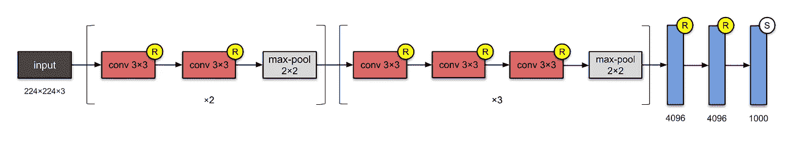*

*Fig. 3: VGG-16 architecture, based on their [paper](https://arxiv.org/abs/1409.1556).*

*到现在为止，你可能已经注意到 CNN 开始越来越深入。这是因为提高深度神经网络性能的最直接的方法是增加它们的大小(Szegedy 等人。al)。视觉几何小组(VGG)的人发明了 VGG-16，它有 13 个卷积层和 3 个全连接层，带有来自 AlexNet 的 ReLU 传统。该网络在 AlexNet 上堆叠更多层，并使用较小尺寸的过滤器(2×2 和 3×3)。它由**138m**参数组成，占用大约 500MB 的存储空间😱。他们还设计了一种更深的变体，VGG-19。*

***⭐️What's 小说？***

1.  *正如他们在摘要中提到的，这篇论文的贡献是设计了更深层次的网络(大约是 AlexNet 的两倍)。这是通过堆积均匀的回旋来实现的。*

***📝出版物***

*   *论文:[用于大规模图像识别的极深度卷积网络](https://arxiv.org/abs/1409.1556)*
*   *作者:卡伦·西蒙扬，安德鲁齐塞曼。英国牛津大学。*
*   *arXiv 预印本，2014 年*

## *4.《盗梦空间》第一版(2014 年)*

**

*Fig. 4: Inception-v1 architecture. This CNN has two auxiliary networks (which are discarded at inference time). Architecture is based on Figure 3 in the [paper](https://arxiv.org/abs/1409.4842).*

*这个拥有 **5M** 参数的 22 层架构被称为 Inception-v1。这里，网络中的网络(参见[附录](#a253))方法被大量使用，如论文中所述。网络中的网络通过*初始模块*实现。一个初始模块的架构设计是对近似稀疏结构进行研究的产物(更多信息请阅读本文！).每个模块提出 3 个想法:*

1.  *让**并行塔**的卷积具有不同的滤波器，然后级联，在 1×1、3×3 和 5×5 捕获不同的特征，从而“聚集”它们。这一想法是由 Arora 等人在论文*中提出的，论文*提出了一种逐层结构，在这种结构中，应该分析最后一层的相关性统计数据，并将它们聚类到具有高相关性的单元组中。*
2.  *1×1 卷积用于降维以消除计算瓶颈。*
3.  *由于来自 1×1 卷积的激活函数，其加法也增加了非线性。这个想法是基于网络论文中的网络。此处见附录[。](#a253)*
4.  *作者还引入了和两个**辅助分类器**，以鼓励在分类器的较低阶段进行区分，增加传播回来的梯度信号，并提供额外的正则化。**辅助网络**(连接到辅助分类器的分支)在推理时被丢弃。*

*值得注意的是，“这种架构的主要特点是提高了网络内部计算资源的利用率。”*

> ****注:*** *模块的名称(Stem 和 Inception)在这个版本的 Inception 中没有使用，直到后来的版本，即 Inception-v4 和 Inception-ResNets。为了便于比较，我在这里添加了它们。**

***⭐️What's 小说？***

1.  *使用模块/块构建网络。我们不是堆叠卷积层，而是堆叠模块或块，模块或块内是卷积层。因此得名《盗梦空间》(参照 2010 年由莱昂纳多·迪卡普里奥主演的科幻电影《盗梦空间》)。*

***📝出版物***

*   *论文:[用卷积深化](https://arxiv.org/abs/1409.4842)*
*   *作者:克里斯蒂安·塞格迪、、贾、Pierre Sermanet、Scott Reed、Dragomir Anguelov、Dumitru Erhan、Vincent Vanhoucke、Andrew Rabinovich。谷歌、密歇根大学、北卡罗来纳大学*
*   *发表于:2015 年 IEEE 计算机视觉和模式识别会议(CVPR)*

## *5.《盗梦空间》第三版(2015 年)*

*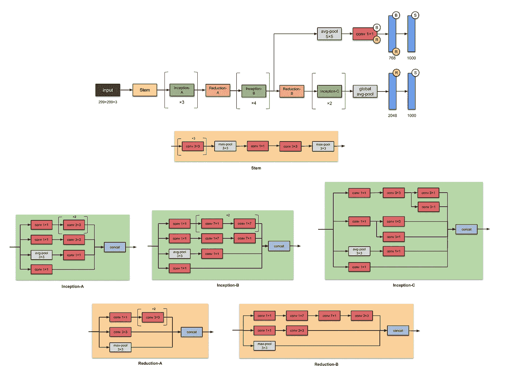*

*Fig. 5: Inception-v3 architecture. This CNN has an auxiliary network (which is discarded at inference time). *Note: All convolutional layers are followed by batch norm and ReLU activation. Architecture is based on their GitHub [code](https://github.com/tensorflow/models/blob/master/research/slim/nets/inception_v1.py).*

*Inception-v3 是 Inception-v1 的后继版本，有 **24M** 参数。等等，盗梦空间 v2 在哪里？不用担心——它是 v3 的早期原型，因此它与 v3 非常相似，但不常用。当作者推出 Inception-v2 时，他们在上面运行了许多实验，并记录了一些成功的调整。Inception-v3 是结合了这些调整的网络(对优化器、损失函数的调整以及对辅助网络中的辅助层添加批量归一化)。*

*Inception-v2 和 Inception-v3 的动机是避免*表示瓶颈*(这意味着极大地减少下一层的输入维度)，并通过使用因式分解方法进行更有效的计算。*

> ****注:*** *模块名称(Stem，Inception-A，Inception-B 等。)直到它的更高版本，即 Inception-v4 和 Inception-ResNets，才被用于这个版本的 Inception。为了便于比较，我在这里添加了它们。**

***⭐️What's 小说？***

1.  *首批使用批量标准化的设计者之一(为简单起见，上图中没有反映)。*

***✨What's 改进自上一版本，** [**盗梦空间-v1**](#81e0) **？***

1.  *将 *n* × *n* 卷积分解为非对称卷积:1×n 和 *n* ×1 *和*卷积*
2.  *将 5×5 卷积分解为两个 3×3 卷积运算*
3.  *用一系列 3×3 卷积替换 7×7*

***📝出版物***

*   *论文:[反思计算机视觉的初始架构](https://arxiv.org/abs/1512.00567)*
*   *作者:克里斯蒂安·塞格迪，文森特·范霍克，谢尔盖·约菲，黄邦贤·施伦斯，兹比格涅夫·沃伊纳。谷歌，伦敦大学学院*
*   *发表于:2016 年 IEEE 计算机视觉与模式识别会议(CVPR)*

## *6.ResNet-50 (2015 年)*

**

*Fig. 6: ResNet-50 architecture, based on the GitHub [code](https://github.com/keras-team/keras-applications/blob/master/keras_applications/resnet_common.py) from keras-team.*

*没错，就是你在文章上方看到的问题的答案[这里](#71ae)(“这是什么架构？”).*

*从过去的几个 CNN 中，我们只看到设计中的层数越来越多，性能越来越好。但是“随着网络深度的增加，精确度会饱和(这并不奇怪)，然后迅速下降。”微软研究院的人用 ResNet 解决了这个问题——在构建更深层次的模型时使用跳过连接(也称为快捷连接，残差)。*

*ResNet 是批量标准化的早期采用者之一(Ioffe 和 Szegedy 撰写的批量标准化论文已于 2015 年提交给 ICML)。上图是 ResNet-50，参数 **26M** 。*

*ResNets 的基本构造块是 conv 和标识块。因为它们看起来很像，你可能会把 ResNet-50 简化成这样(这个不要引用我的话！):*

*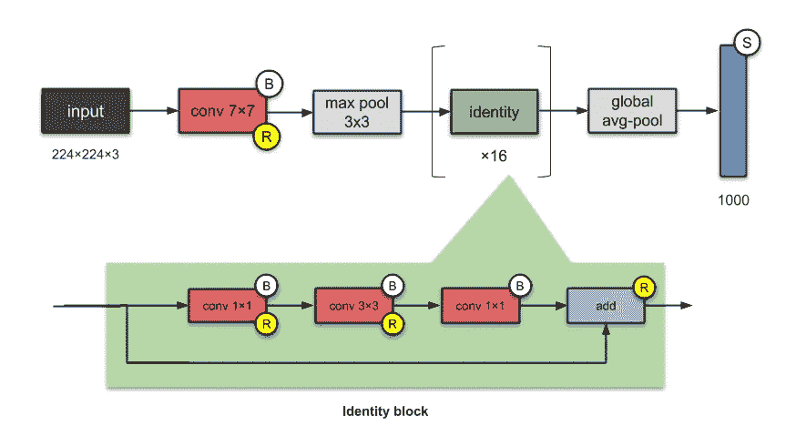*

***⭐️有什么小说？***

1.  **普及*跳过连接(他们不是第一个使用跳过连接的)。*
2.  *设计更深层次的 CNN(多达 152 层),而不影响模型的泛化能力*
3.  *首批使用批量标准化的公司之一。*

***📝出版物***

*   *论文:[用于图像识别的深度残差学习](https://arxiv.org/abs/1512.03385)*
*   *作者:，何，，，任，。微软*
*   *发表于:2016 年 IEEE 计算机视觉与模式识别会议(CVPR)*

## *7.例外(2016 年)*

*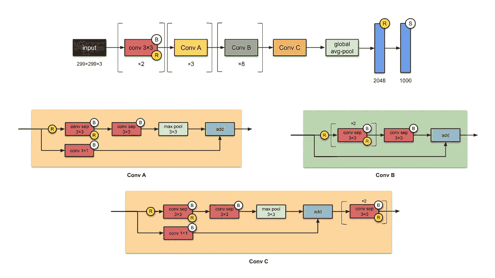*

*Fig. 7: Xception architecture, based on the GitHub [code](https://github.com/keras-team/keras-applications/blob/master/keras_applications/xception.py) from keras-team. Depthwise separable convolutions are denoted by ‘conv sep.’*

*例外是对 Inception 的改编，其中 Inception 模块已经被深度方向可分离的卷积所取代。它还拥有与 Inception-v1 大致相同数量的参数( **23M** )。*

*Xception 将盗梦假设发挥到了极致*(因此得名)。什么是盗梦空间假说？谢天谢地，这篇论文明确而简洁地提到了这一点(谢谢弗朗索瓦！).**

*   **首先，通过 1×1 卷积获得跨通道(或跨特征图)相关性。**
*   **因此，每个通道内的空间相关性通过常规的 3×3 或 5×5 卷积来捕获。**

**将这一想法发挥到极致意味着每个通道执行 1×1 到*，然后每个*通道执行 3×3 到*的输出。这等同于用深度方向可分离的卷积替换初始模块。***

****⭐️What's 小说？****

1.  **介绍了完全基于深度方向可分离卷积层的 CNN。**

****📝出版物****

*   **论文:[例外:深度可分卷积深度学习](https://arxiv.org/abs/1610.02357)**
*   **作者:弗朗索瓦·乔莱。谷歌。**
*   **发表于:2017 年 IEEE 计算机视觉与模式识别会议(CVPR)**

## **8.《盗梦空间》第 4 版(2016 年)**

**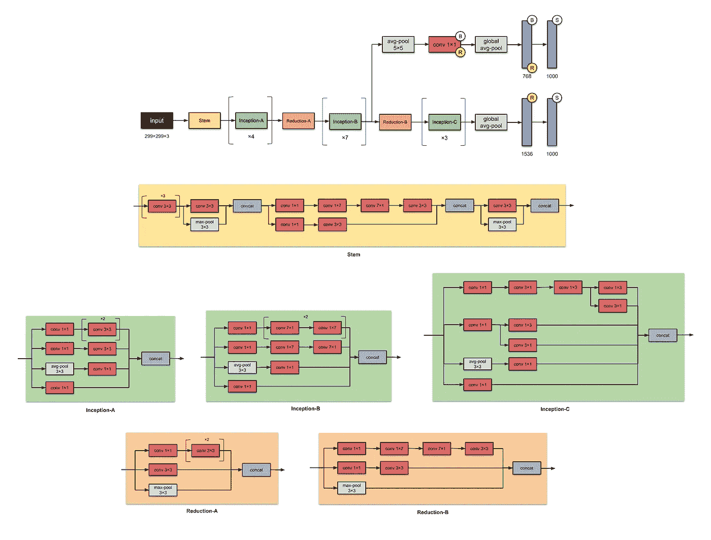**

**Fig. 8: Inception-v4 architecture. This CNN has an auxiliary network (which is discarded at inference time). *Note: All convolutional layers are followed by batch norm and ReLU activation. Architecture is based on their GitHub [code](https://github.com/tensorflow/models/blob/master/research/slim/nets/inception_v4.py).**

**谷歌的人又用 Inception-v4， **43M** 参数罢工了。同样，这是对 Inception-v3 的改进。主要区别是 Stem 组和 Inception-C 模块中的一些小变化。作者还“为每个网格大小的初始块做了统一的选择。”他们还提到，拥有“剩余连接可以显著提高训练速度。”**

**总之，请注意，它提到了 Inception-v4 工作得更好，因为增加了模型大小。**

****✨What's 改进自上一版本，** [**盗梦空间-v3**](#6872) **？****

1.  **阀杆模块的变化。**
2.  **添加更多的初始模块。**
3.  **Inception-v3 模块的统一选择，意味着对每个模块使用相同数量的过滤器。**

****📝出版物****

*   **论文: [Inception-v4，Inception-ResNet 和剩余连接对学习的影响](https://arxiv.org/abs/1602.07261)**
*   **作者:克里斯蒂安·塞格迪，谢尔盖·约菲，文森特·万霍克，亚历克斯·阿莱米。谷歌。**
*   **发表于:第三十一届 AAAI 人工智能会议记录**

## **9.《盗梦空间》-ResNet-V2 (2016 年)**

**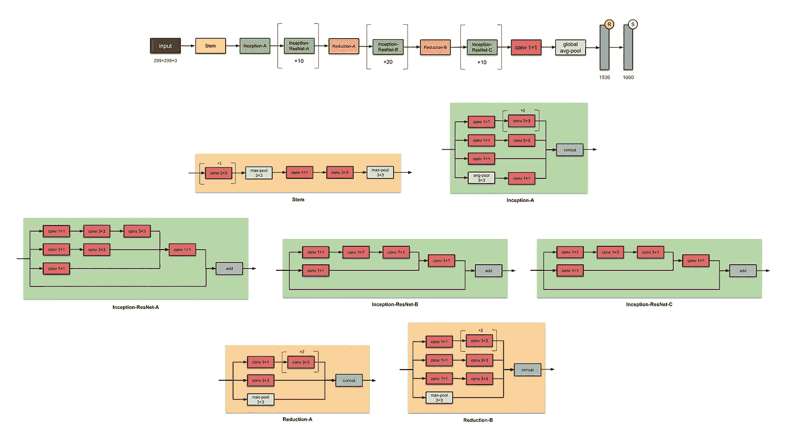**

**Fig. 9: Inception-ResNet-V2 architecture. *Note: All convolutional layers are followed by batch norm and ReLU activation. Architecture is based on their GitHub [code](https://github.com/tensorflow/models/blob/master/research/slim/nets/inception_resnet_v2.py).**

**在与 Inception-v4 相同的论文中，相同的作者还介绍了 Inception-ResNet——Inception-ResNet-v1 和 Inception-ResNet-v2 的家族。家族的后一个成员有 **56M** 参数。**

****✨What's 改进自上一版本，** [**《盗梦空间》-v3**](#6872) **？****

1.  **将初始模块转换成*剩余初始块。***
2.  **添加更多的初始模块。**
3.  **在 Stem 模块之后添加一个新类型的初始模块(Inception-A)。**

****📝出版物****

*   **论文: [Inception-v4，Inception-ResNet 和剩余连接对学习的影响](https://arxiv.org/abs/1602.07261)**
*   **作者:克里斯蒂安·塞格迪，谢尔盖·约菲，文森特·万霍克，亚历克斯·阿莱米。谷歌**
*   **发表于:第三十一届 AAAI 人工智能会议记录**

## **10.ResNeXt-50 (2017 年)**

**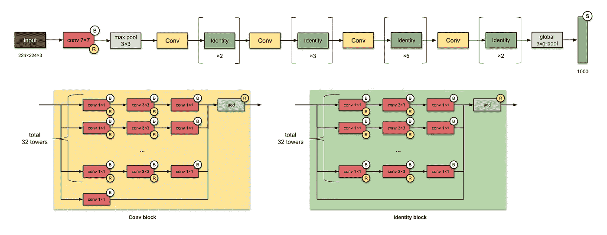**

**Fig. 10: ResNeXt architecture, based on their paper.**

**如果你在想 ResNets，是的，它们是相关的。ResNeXt-50 有 **25M** 参数(ResNet-50 有 25.5M)。ResNeXts 的不同之处在于在每个模块中添加了并行的塔/分支/路径，如上面“总共 32 个塔”所示**

****⭐️有什么小说？****

1.  **扩大一个模块中并行塔的数量(“基数”)(我的意思是这已经被 Inception network 探索过了，除了这些塔是在这里添加的)**

****📝出版物****

*   **论文:[深度神经网络的聚合残差变换](https://arxiv.org/abs/1611.05431)**
*   **作者:谢赛宁，罗斯·吉斯克，彼得·多拉尔，涂，何。加州大学圣地亚哥分校脸书研究所**
*   **发表于:2017 年 IEEE 计算机视觉与模式识别会议(CVPR)**

## ****附录:网络中的网络(2014)****

**回想一下，在卷积中，像素值是过滤器和当前滑动窗口中权重的线性组合。作者建议用一个带有一个隐藏层的迷你神经网络来代替这种线性组合。这就是他们创造的 Mlpconv。因此，我们在这里处理的是(卷积神经)网络中的(简单的 1 个隐藏层)网络。**

**Mlpconv 的这种思想被比作 1×1 卷积，后来成为初始架构的主要特征。**

****⭐️What's 小说？****

1.  **MLP 卷积层，1×1 卷积**
2.  **全局平均池(取每个特征地图的平均值，并将结果向量送入 softmax 层)**

****📝出版物****

*   **论文:[网络中的网络](https://arxiv.org/abs/1312.4400)**
*   **作者:，，水城颜。新加坡国立大学**
*   **arXiv 预印本，2013 年**

**为了便于参考，我们在这里再展示一次:**

## **LeNet-5**

****

## **AlexNet**

****

## **VGG-16**

****

## **盗梦空间-第一版**

**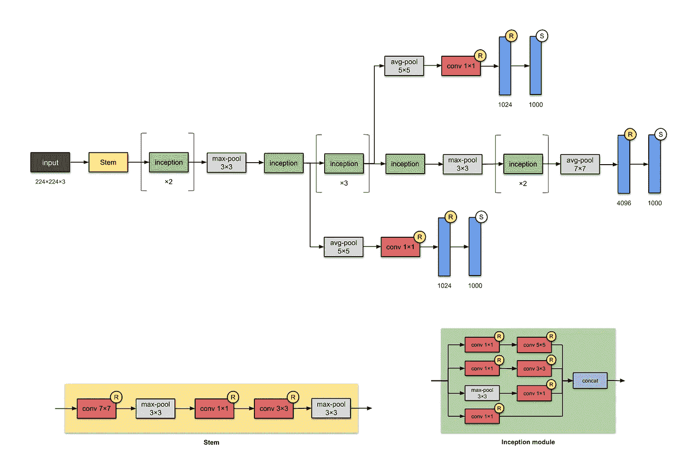**

## **盗梦空间-第三版**

****

## **盗梦空间-第 4 版**

****

## **盗梦空间-ResNet-V2**

****

## **例外**

****

## **ResNet-50**

****

## **ResNeXt-50**

****

## **神经网络可视化资源**

**这里有一些资源供你想象你的神经网络:**

*   **Netron 😍**
*   **[tensor flow 提供的 TensorBoard API](https://www.tensorflow.org/tensorboard/r1/overview)**
*   **Keras 的`[plot_model](https://keras.io/visualization/)` [API](https://keras.io/visualization/)**
*   **`[pytorchviz](https://github.com/szagoruyko/pytorchviz)` [包](https://github.com/szagoruyko/pytorchviz)**

## **类似文章**

**CNN 架构:LeNet、AlexNet、VGG、GoogLeNet、ResNet 等等。**

**[盗梦空间网络版本的简单指南](/a-simple-guide-to-the-versions-of-the-inception-network-7fc52b863202)**

## **参考**

**我参考了上面提到的产生这些架构的论文。除此之外，下面是我在本文中使用的一些其他方法:**

**[https://github . com/tensor flow/models/tree/master/research/slim/nets](https://github.com/tensorflow/models/tree/master/research/slim/nets)(github.com/tensorflow)**

**[Keras 团队深度学习模型的实现](https://github.com/keras-team/keras-applications/tree/master/keras_applications)(github.com/keras-team)**

**[卷积神经网络架构讲义:从 LeNet 到 ResNet](http://slazebni.cs.illinois.edu/spring17/lec01_cnn_architectures.pdf)(slazebni.cs.illinois.edu)**

**[回顾:NIN —网络中的网络(图像分类)](/review-nin-network-in-network-image-classification-69e271e499ee)(towardsdatascience.com)**

**你在观想中注意到什么错误了吗？你觉得我还应该包括什么吗？在下面给我留言吧！**

**如果你喜欢我的内容并且还没有订阅 Medium，请通过我的推荐链接 [*这里*](https://medium.com/@remykarem/membership) *订阅！注意:你的会员费的一部分将作为介绍费分配给我。***

**特别感谢狄强、齐威、任杰、傅楠、希尔琳和德里克审阅本文。**

***关注我上* [*推特*](https://www.twitter.com/remykarem) *@remykarem 或者*[*LinkedIn*](http://www.linkedin.com/in/raimibkarim)*。你也可以通过 raimi.bkarim@gmail.com 联系我。欢迎访问我的网站*[*remykarem . github . io*](https://remykarem.github.io/)*。***