# 图解:有效的神经结构搜索

> 原文：<https://towardsdatascience.com/illustrated-efficient-neural-architecture-search-5f7387f9fb6?source=collection_archive---------4----------------------->


## [内部 AI](/inside-ai/)

## ENAS 宏观和微观搜索策略指南

*(TL；DR 你只需要知道的两个动画是* [*这里*](#d217) *)*

*更新:
2020 年 3 月 23 日:勘误表—之前提到过，micro search 中的所有卷积单元互不相同。这是错误的；卷积单元是* ***在最终的子模型中多次重复*** *。作者核实了这一信息。感谢* [*马丁·费利安*](https://medium.com/u/a83bfe733f25?source=post_page-----5f7387f9fb6--------------------------------) *的指正！*

为图像分类和自然语言理解等各种任务设计神经网络通常需要大量的架构工程和专业知识。进入**神经架构搜索** (NAS)，这是一个自动化人工设计神经网络过程的任务。NAS 将其日益增长的研究兴趣归功于最近深度学习模型的日益突出。

有许多方法可以搜索或发现神经结构。在过去的几年中，社区已经提出了不同的搜索方法，包括:

*   **强化学习** [带强化学习的神经架构搜索](https://arxiv.org/abs/1611.01578) (Zoph and Le，2016)
    [NASNet](https://arxiv.org/abs/1707.07012)(Zoph*et al .*，2017)
    (Pham*et al .*，2018)
*   **进化算法** [分层 Evo](https://arxiv.org/abs/1711.00436) (刘*等人*，2017)
    [阿米巴内](https://arxiv.org/abs/1802.01548)(实*等人*，2018)
*   **【刘*等*，2017**
*   ****贝叶斯优化** [Auto-Keras](https://arxiv.org/abs/1806.10282) (金*等人*，2018)
    [NASBOT](https://arxiv.org/abs/1802.07191)(kanda Samy*等人*。2018)**
*   ****基于梯度的优化** (谢*等*，2018)
    [飞镖](https://arxiv.org/abs/1806.09055)(刘*等*。, 2018)**

**在本帖中，我们将关注**高效神经架构搜索** (ENAS)，它采用强化学习来构建卷积神经网络(CNN)和递归神经网络(RNNs)。作者 Hieu Pham、Melody Guan、Barret Zoph、Quoc V. Le 和 Jeff Dean 提出了一个预定义的神经网络，以使用*宏搜索*和*微搜索*在增强学习框架的指导下生成新的神经网络(参见论文[此处](https://arxiv.org/abs/1802.03268))。没错——一个神经网络构建另一个神经网络。**

**这篇文章是一篇关于宏观和微观搜索策略如何产生神经网络的教程。虽然插图和动画用于指导读者，但动画的顺序并不一定反映操作流程(由于矢量化等原因)。).**

**我们将把本教程的范围缩小到**在图像分类任务**中搜索 CNN 的神经结构。本文假设读者熟悉 RNNs、CNN 和强化学习的基础知识。熟悉像迁移学习和跳过/剩余连接这样的深度学习概念将非常有帮助，因为它们在架构搜索中被大量使用。这并不要求你阅读这篇论文，但它会加快你的理解。**

## **内容**

**0.[概述](#066bb)1。[搜索策略](#9137)
1.1。[宏搜索](#6ae7)
1.2。[微搜](#5b7b)
2。[注释](#d217)注释
3。[概要](#0788)4。[实现](#df67)
5。[参考文献](#0e01)**

## **0.概观**

**在 ENAS，有两种类型的神经网络:**

*   ****控制器**–预定义的 RNN，是一种长短期记忆(LSTM)单元**
*   ****子模型**–用于图像分类的理想 CNN**

**像大多数其他 NAS 算法一样，ENAS 涉及 3 个概念:**

1.  ****搜索空间**——所有可能产生的不同架构或子模型**
2.  ****搜索策略** —生成这些架构或子模型的方法**
3.  ****性能评估** —衡量生成的子模型有效性的方法**

**让我们看看这五个想法是如何形成 ENAS 故事的。**

****控制器**通过使用某种**搜索策略**“生成一组指令”(或者更严格地说，*做出决策*或*采样* *决策*)来控制或指导子模型架构的构建。这些决定是像什么类型的操作(卷积，池等。)在子模型的特定层执行。使用这些决定，建立一个子模型。生成的子模型是可以在**搜索空间**中构建的许多可能的子模型之一。**

**然后，使用随机梯度下降将该特定子模型训练至收敛(约 95%的训练精度)，以最小化预测类和地面真实类之间的预期损失函数(对于图像分类任务)。这是在指定数量的时期内完成的，我称之为*子时期*，比如 100。然后，从该训练的模型获得验证准确度。**

**然后，我们使用基于策略的强化学习算法来更新控制器的参数，以最大化期望奖励函数，即验证准确性。这个参数更新希望改进控制器，以产生更好的决定，给出更高的验证精度。**

**这整个过程(从之前的 3 个段落开始)只是一个时期——姑且称之为*控制器时期。然后，我们对指定数量的控制器时期重复这一过程，比如 2000 个。***

**在所有生成的 2000 个子模型中，具有最高验证准确性的模型将获得*的荣誉，成为执行图像分类任务的*神经网络。然而，这个子模型在用于部署之前，必须再经过一轮训练(同样由子时期的数量指定)。**

**整个训练的伪算法写在下面:**

```
CONTROLLER_EPOCHS = 2000
CHILD_EPOCHS = 100Build controller networkfor i in CONTROLLER_EPOCHS: 1\. Generate a child model
     2\. Train this child model for CHILD_EPOCHS
     3\. Obtain val_acc
     4\. Update controller parametersGet child model with the highest val_acc
Train this child model for CHILD_EPOCHS
```

**这整个问题本质上是一个具有原型元素的强化学习框架:**

*   **代理—控制器**
*   **行动——建立子网络的决策**
*   **奖励—来自子网络的验证准确性**

**这个强化学习任务的目的是最大化代理(控制器)所采取的行动(建立子模型架构的决策)的回报(验证准确性)。**

**[ [返回页首](#3a44)**

## **1.搜索策略**

**回想一下上一节，控制器使用某种搜索策略生成子模型的架构。在这个陈述中，你应该问两个问题——(1)管制员如何做决定，以及(2)什么样的搜索策略？**

****管制员如何决策？****

**这就把我们带到了控制器的模型，这是一个 LSTM。该 LSTM 通过 softmax 分类器以自动回归的方式对决策进行采样:前一步中的决策作为输入嵌入到下一步中。**

****有哪些搜索策略？****

**ENAS 的作者提出了搜索或生成架构的两个策略。**

1.  **宏搜索**
2.  **微搜索**

**宏搜索是一种控制器**设计整个网络**的方法。使用这种方法的出版物包括 Zoph 和 Le 的 NAS、FractalNet 和 SMASH。另一方面，微搜索是一种方法，其中控制器**设计模块或构建块**，它们被组合以构建最终网络。实现这种方法的一些论文是分层 NAS、渐进式 NAS 和 NASNet。**

**在以下两个小节中，我们将了解 ENAS 是如何实施这两项战略的。**

**[ [宏搜索](#6ae7) ][ [微搜索](#5b7b) ]**

## **1.1 宏搜索**

**在宏搜索中，控制器为子模型中的每一层做出 2 个决定:**

*   **对上一层执行的操作(操作列表见[注释](#d217))**
*   **跳过连接时要连接到的上一层**

**在这个宏搜索示例中，我们将看到控制器如何生成 4 层子模型。这个子模型中的每一层分别用红色、绿色、蓝色和紫色进行颜色编码。**

****卷积层 1(红色)****

**我们将从运行控制器的第一个时间步开始。这个时间步骤的输出被软最大化以获得一个向量，该向量被转换成一个`conv3×3`操作。**

**这对子模型意味着，我们在输入图像上用 3×3 滤波器执行卷积。**

****

**The output from the first time step (**conv3×3**) of the controller corresponds to building the first layer (red) in the child model. This means the child model will first perform 3×3 convolution on the input image.**

**我知道我提到过管制员需要做出两个决定，但这里只有一个。由于这是第一层，我们只能对要执行的操作中的一个决策进行采样，因为除了输入图像本身之外，没有其他要连接的内容。**

****卷积层 2(绿色)****

**为了构建随后的卷积层，控制器做出 2 个决定(没有更多谎言):(I)操作和(ii)要连接的层。在这里，我们看到它生成了`1`和`sep5×5`。**

**这对于子模型意味着我们首先对前一层的输出执行`sep5×5` 操作**。然后，该输出沿着深度与层`1`的输出连接在一起，即红色层的输出。****

**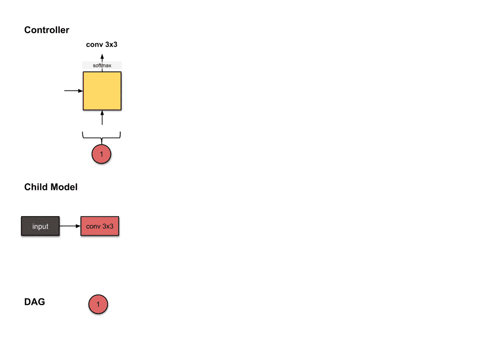**

**The outputs from the 2nd and 3rd time step (**1** and **sep5×5**) in the controller correspond to building Convolutional Layer 2 (green) in the child model.**

****卷积层 3(蓝色)****

**我们再次重复上一步以生成第三卷积层。同样，我们在这里看到控制器生成 2 个东西:(I)操作和(ii)要连接的层。下面，控制器产生`1`和`2`，以及操作`max3×3`。**

**因此，子模型对前一层(第 2 层，绿色)的输出执行操作`max3×3` **。然后，该操作的结果沿着深度维度与层`1`和`2`连接。****

**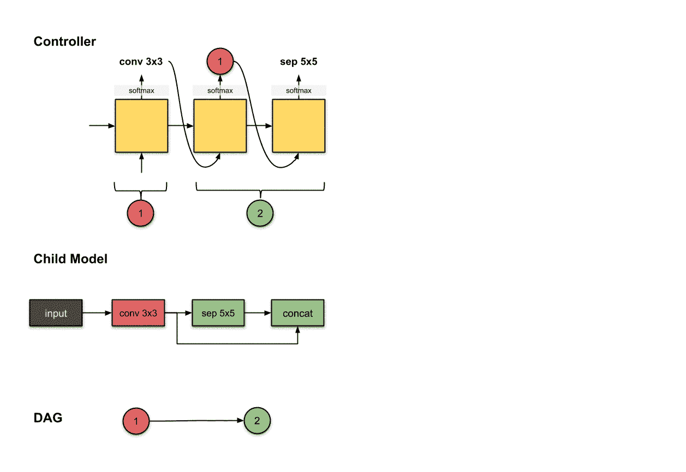**

**The outputs from the 4th and 5th time step (**1,2** and **max3×3**) in the controller correspond to building Convolutional Layer 3 (blue) in the child model.**

****卷积层 4(紫色)****

**我们再次重复上一步以生成第四卷积层。这次控制器产生了`1`和`3`，以及操作`conv5×5`。**

**子模型对前一层(第三层，蓝色)的输出执行操作`conv5×5` **。然后，该操作的结果沿着深度维度与层`1`和`3`连接。****

**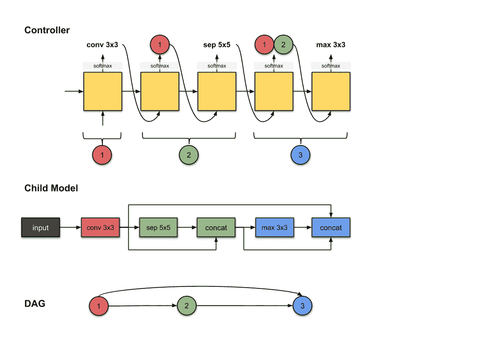**

**The outputs from the 6th and 7th time step (**1,3** and **conv5×5**) in the controller correspond to building Convolutional Layer 4 (purple) in the child model.**

****结束****

**现在，您有了它——一个使用宏搜索生成的子模型！现在转到微搜索。**

**[ [返回顶部](#3a44)**

## **1.2 微搜索**

**微搜索仅设计一个构建块，其架构在整个最终架构中重复。ENAS 称这个构建模块为**卷积单元**和**归约单元**。两者是相似的——约简单元的唯一不同之处是运算的步长为 2，从而减少了空间维度。**

**微搜索的想法是**为卷积单元构建一个单一的架构，并在整个最终模型中重复这个相同的架构。**在下面的例子中，最终模型由一个卷积单元组成，其架构在 3 个模块中重复 *N* 次。如前所述，归约单元类似于卷积单元的架构。**

**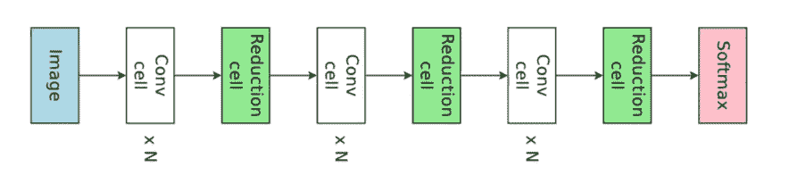**

**Fig. 1.2.1: Overview of the final neural network generated. [Image source](https://arxiv.org/abs/1802.03268).**

**让我们过一会儿再回到这个话题。**

****为微搜索导出的网络构建单元****

**从微搜索衍生的子网络的“构建单元”中有一种等级制度。从最大到最小:**

*   **街区**
*   **卷积单元/归约单元**
*   **结节**

**子模型由几个**模块**组成。每个块由 *N* 个卷积**单元**和 1 个归约单元组成。每个卷积/归约单元包括*B*节点。并且每个节点都由标准卷积运算组成(我们稍后会看到这一点)。( *N* 和 *B* 是超参数，可以由你这个架构师来调优。)**

**下面是一个有 3 个积木的子模型。每个块由 *N* =3 个卷积单元和 1 个归约单元组成。这里没有显示每个单元内的操作。**

****

**Fig. 1.2.2: Overview of the final neural network generated. It has 3 blocks and each block consists of 3 convolutional cells and 1 reduction cell. [Image source](https://arxiv.org/abs/1802.03268).**

**那么你可能会问，如何从微搜索生成这个子模型呢？继续读！**

****通过微搜索生成子模型****

**对于这个微搜索教程，为了简单起见，让我们构建一个有 1 个块的子模型。该块包括 *N* =3 个卷积单元和 1 个归约单元，每个单元包括 *B* =4 个节点。**

**回想一下，这意味着只需为一个卷积单元设计一个架构，然后重复 3 次以上(2 个以上的卷积单元和 1 个归约单元)。这意味着我们生成的子模型应该如下所示:**

**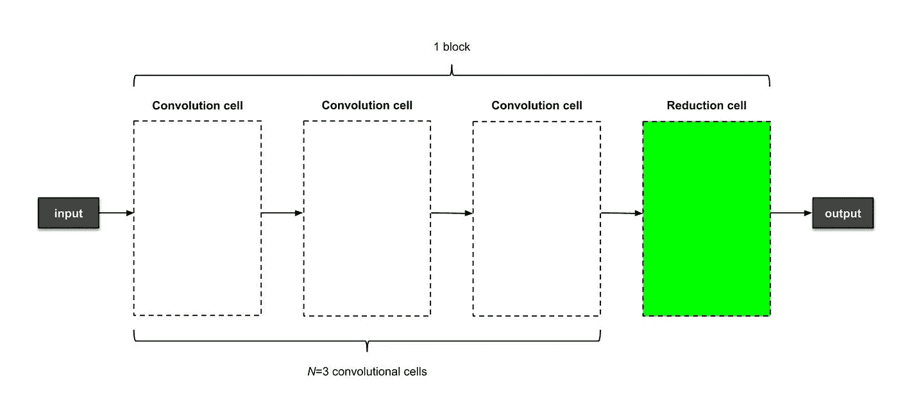**

**Fig. 1.2.3: A neural network generated from micro search which has 1 block, consisting of 3 convolutional cells and 1 reduction cell. The individual operations are not shown here.**

**现在让我们构建一个卷积单元！**

**为了解释如何建立一个卷积单元，让我们假设我们已经有 2 个卷积单元。请注意，这两个单元的最后一个操作是`add`操作。**

**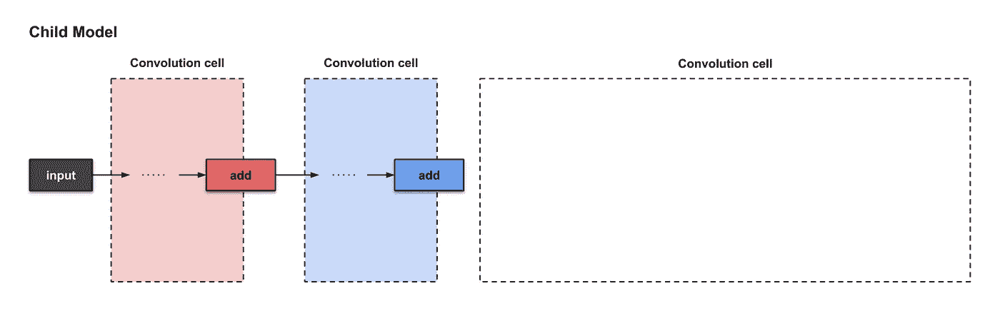**

**Fig. 1.2.5: ‘Preparing’ the third convolutional cell in micro search.**

**回想一下，一个卷积单元由 4 个节点组成。那么这些节点在哪里呢？**

****节点 1 和节点 2****

***前两个单元格* (红色和蓝色)将分别被视为节点 1 和节点 2。其他两个节点就在我们现在正在构建的这个卷积单元中。**

**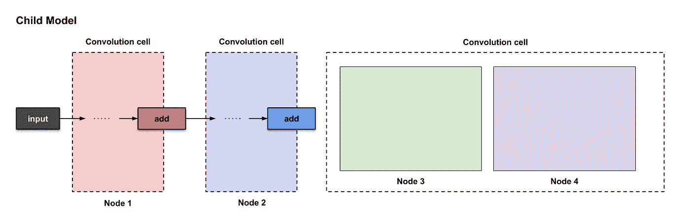**

**Fig. 1.2.6: Identifying the 4 nodes while building Convolutional Cell #3.**

**从本节开始，您可以放心地忽略上图中的“卷积单元”标签，而专注于“节点”标签:**

*   **节点 1 —红色**
*   **节点 2 —蓝色**
*   **节点 3 —绿色**
*   **节点 4 —紫色**

> *****勘误*** *i̶f̶̶y̶o̶u̶'̶r̶e̶̶w̶o̶n̶d̶e̶r̶i̶n̶g̶̶i̶f̶̶t̶h̶e̶s̶e̶̶n̶o̶d̶e̶s̶̶w̶i̶l̶l̶̶c̶h̶a̶n̶g̶e̶̶f̶o̶r̶̶e̶v̶e̶r̶y̶̶c̶o̶n̶v̶o̶l̶u̶t̶i̶o̶n̶a̶l̶̶c̶e̶l̶l̶̶w̶e̶'̶r̶e̶̶b̶u̶i̶l̶d̶i̶n̶g̶*,̶̶t̶h̶e̶̶a̶n̶s̶w̶e̶r̶̶i̶s̶̶y̶e̶s̶！̶̶e̶v̶e̶r̶y̶̶c̶e̶l̶l̶̶w̶i̶l̶l̶̶'̶a̶s̶s̶i̶g̶n̶'̶̶t̶h̶e̶̶n̶o̶d̶e̶s̶̶i̶n̶̶t̶h̶i̶s̶̶m̶a̶n̶n̶e̶r̶.̶**

****节点 3****

**节点 3 是建筑的起点。控制器采样 4 个决策(或者说 2 组决策):**

*   **要连接的 2 个节点**
*   **要在要连接的节点上执行的两个操作**

**有 4 个决策要做，控制器运行 4 个时间步。请看下面:**

**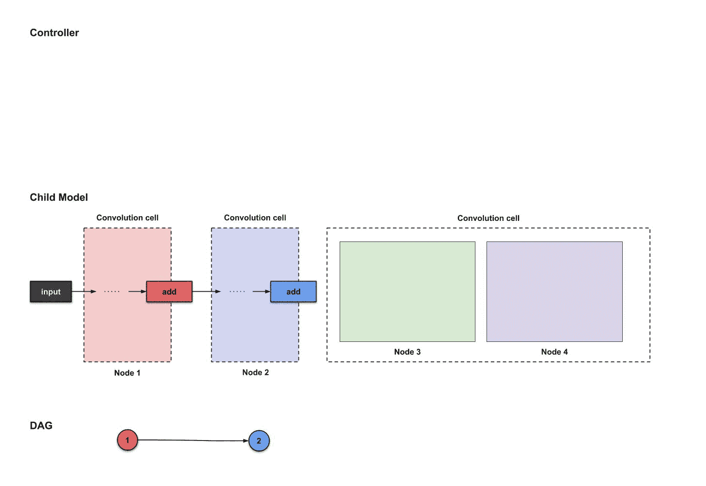**

**Fig. 1.2.7: The outputs of the first four controller time steps (**2**, **1**, `**avg5×5**, **sep5×5**), which will be used to build Node 3.`**

**从上面我们看到，控制器从四个时间步长的每一个采样节点`2`、节点`1`、`avg5×5`和`sep5×5`。这如何转化为子模型的架构？让我们看看:**

**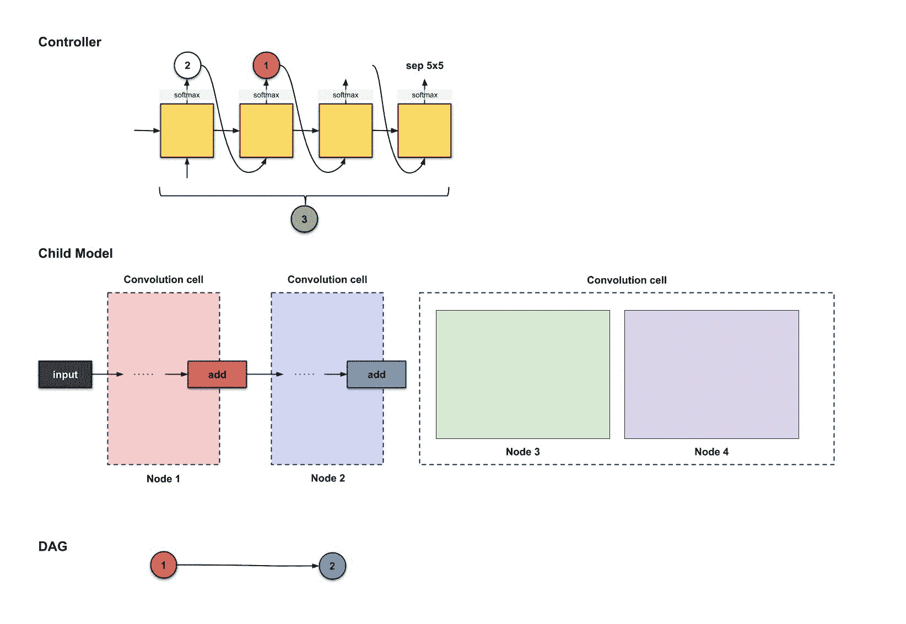**

**Fig. 1.2.8: How the outputs of the first four controller time steps (**2**, **1**, `**avg5×5**, **sep5×5**) are translated to build Node 3.`**

**从上面，我们观察到三件事:**

1.  **节点`2`(蓝色)的输出经过`avg5×5`操作。**
2.  **节点`1`(红色)的输出经过`sep5×5`运算。**
3.  **这两个操作的结果都经过一个`add`操作。**

**来自该节点的**输出**是经过`add`运算的张量。这解释了为什么节点 1 和 2 以`add`操作结束。**

****节点 4****

**现在是节点 4。我们重复相同的步骤，但是现在控制器有三个节点可供选择(节点 1、2 和 3)。下面，控制器生成`3`、`1`、`id`和`avg3×3`。**

**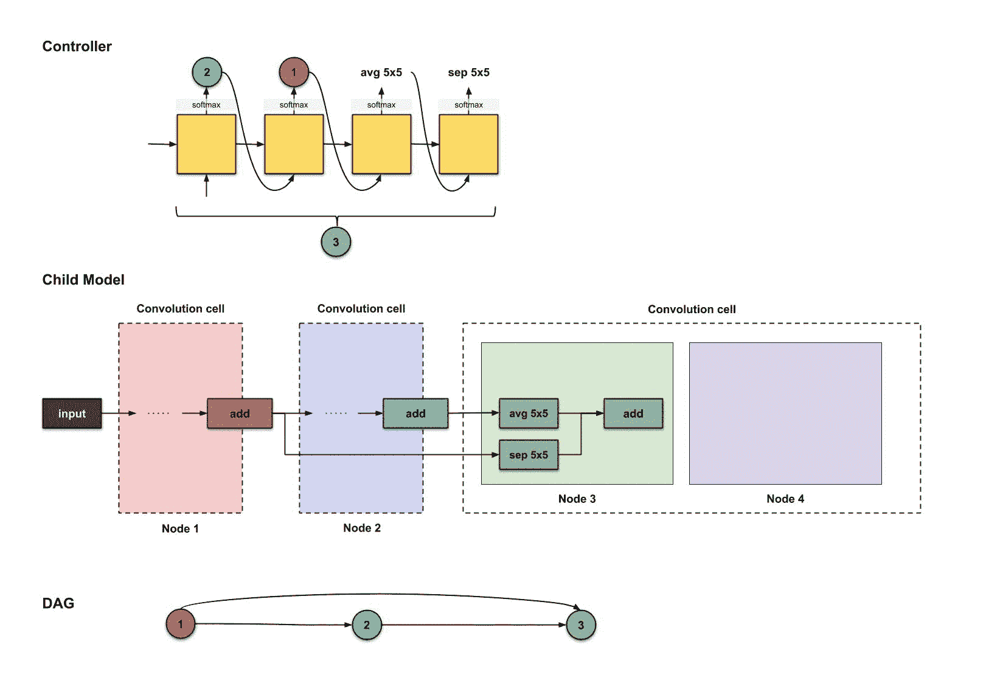**

**Fig. 1.2.9: The outputs of the first four controller time steps (**3**, **1**, `**id**, **avg3×3**), which will be used to build Node 4.`**

**这转化为构建以下内容:**

**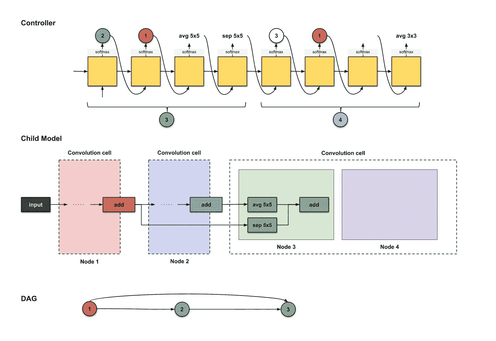**

**Fig. 1.2.10: How the outputs of the first four controller time steps (**3**, **1**, `**id**, **avg3×3**) are translated to build Node 3.`**

**刚刚发生了什么？**

1.  **节点`3`的输出(绿色)经过`id`运算。**
2.  **节点`1`的输出(红色)经过`avg3×3`运算。**
3.  **这两个操作的结果都经过一个`add`操作。**

**就是这样！最终子模型中的所有卷积单元将共享相同的架构。类似地，最终子模型中的所有归约单元(其架构与卷积单元的架构不同，具有步长 2 运算)将共享相同的架构。**

**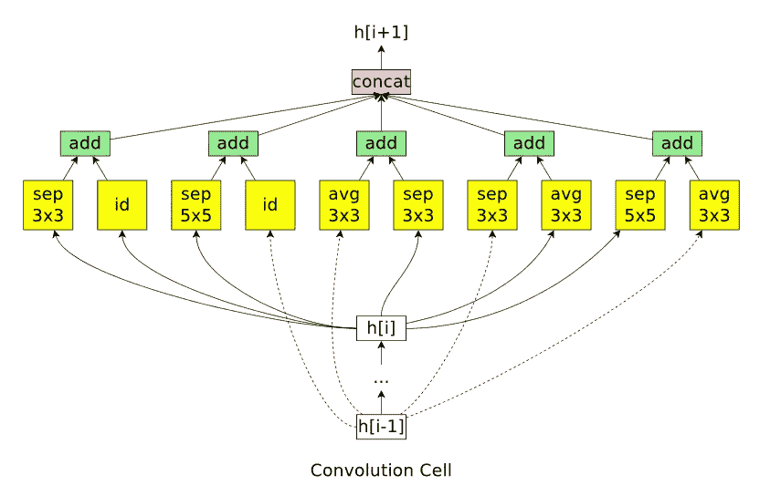**

**Fig. 1.2.11: An example of a convolution cell (with 7 nodes) discovered in the micro search space ([credits](https://arxiv.org/abs/1802.03268)).**

**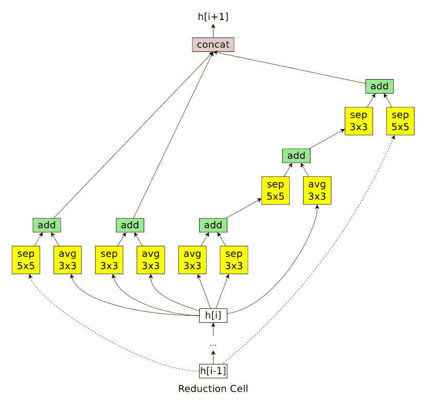**

**Fig. 1.2.12: An example of a reduction cell (with 7 nodes) discovered in the micro search space ([credits](https://arxiv.org/abs/1802.03268)).**

**[ [返回顶部](#3a44)**

## **2.笔记**

**因为这篇文章主要展示了宏观和微观的搜索策略，所以我忽略了许多小细节(尤其是关于迁移学习的概念)。让我简单介绍一下:**

*   **ENAS 有什么这么“高效”？答案:迁移学习。如果两个节点之间的计算之前已经完成(训练),则来自卷积滤波器和 1×1 卷积的权重(以保持信道输出的数量；在前面的章节中没有提到)将被重用。这就是 ENAS 比它的前辈更快的原因！**
*   **控制器有可能对不需要跳过连接的决策进行采样。**
*   **控制器有 6 种操作:滤波器大小为 3×3 和 5×5 的卷积，滤波器大小为 3×3 和 5×5 的深度可分卷积，内核大小为 3×3 的最大池和平均池。**
*   **请仔细阅读每个单元格末尾的 concatenate 操作，它将任何节点的“松散端”连接起来。**
*   **请简要阅读政策梯度算法(强化)强化学习。**

**[ [返回页首](#3a44)**

## **3.摘要**

****宏搜索(针对整个网络)****

**最终的子模型如下所示。**

****

**Fig. 3.1: Generating a convolutional neural network with macro search.**

****微搜索(针对卷积小区)****

**注意，这里只显示了最终子模型的一部分。**

****

**Fig. 3.2: Generating a convolutional neural network with micro search. Only part of the full architecture is shown.**

**[ [返回页首](#3a44)**

## **4.履行**

*   **[TensorFlow 由作者实现](https://github.com/melodyguan/enas)**
*   **[Keras 实施](https://github.com/shibuiwilliam/ENAS-Keras)**
*   **[PyTorch 实施](https://github.com/carpedm20/ENAS-pytorch)**

**[ [返回页首](#3a44)**

## **5.参考**

**[通过参数共享进行有效的神经结构搜索](https://arxiv.org/abs/1802.03268)**

**[具有强化学习的神经架构搜索](https://arxiv.org/abs/1611.01578)**

**[学习可扩展图像识别的可转移架构](https://arxiv.org/abs/1707.07012)**

**就是这样！记得阅读 ENAS 的论文[通过参数共享进行有效的神经架构搜索](https://arxiv.org/abs/1802.03268)。如果您有任何问题，请突出显示并留下评论。**

## **其他关于深度学习的文章**

****一般****

**[统计深度学习模型中的参数数量](/counting-no-of-parameters-in-deep-learning-models-by-hand-8f1716241889)**

****与 NLP 相关****

**[动画版的 RNN、LSTM 和 GRU](/animated-rnn-lstm-and-gru-ef124d06cf45)**

**[经办人:图文并茂](/attn-illustrated-attention-5ec4ad276ee3)**

**[画报:自我关注](/illustrated-self-attention-2d627e33b20a)**

**[逐行 Word2Vec 实现](/an-implementation-guide-to-word2vec-using-numpy-and-google-sheets-13445eebd281)**

****与计算机视觉相关****

**[分解平均平均精度(mAP)](/breaking-down-mean-average-precision-map-ae462f623a52)**

****优化****

**[带随机梯度下降的线性回归分步指南](/step-by-step-tutorial-on-linear-regression-with-stochastic-gradient-descent-1d35b088a843)**

**[10 种梯度下降优化算法+备忘单](/10-gradient-descent-optimisation-algorithms-86989510b5e9)**

***关注我上* [*推特*](https://www.twitter.com/remykarem) *@remykarem 或者*[*LinkedIn*](http://www.linkedin.com/in/raimibkarim)*。你也可以通过 raimi.bkarim@gmail.com 联系我。欢迎访问我的网站*[*remykarem . github . io*](https://remykarem.github.io/)*。***