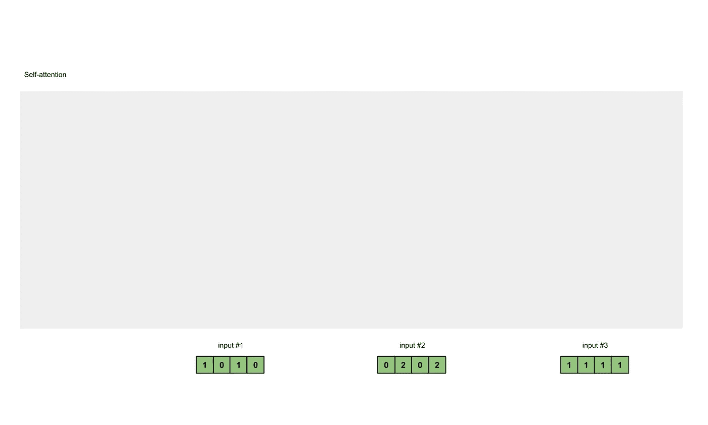
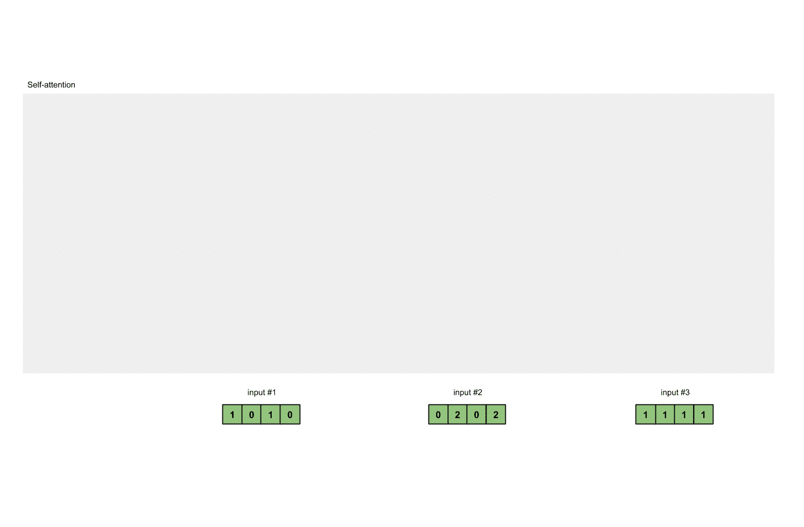
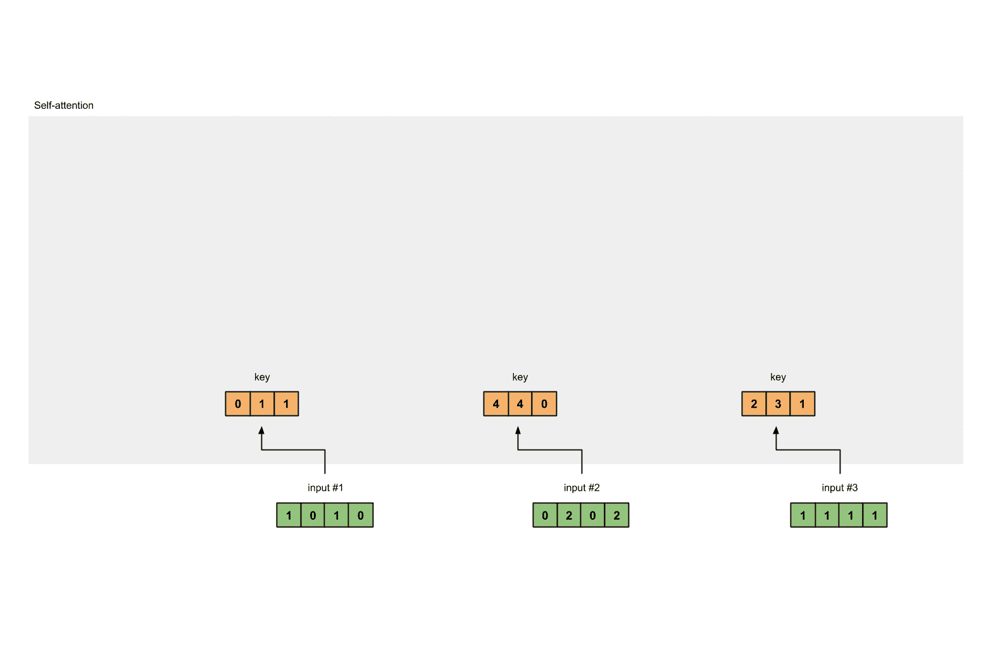
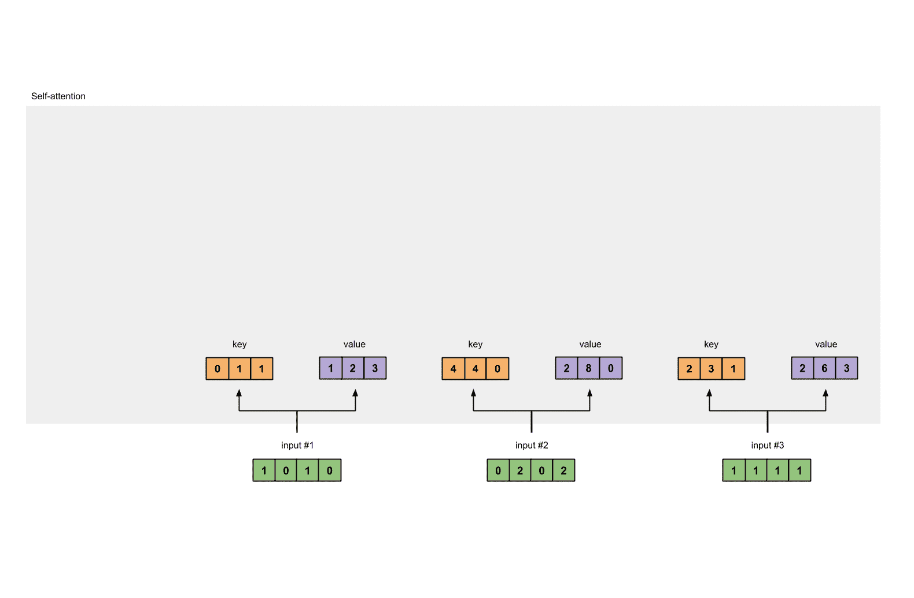
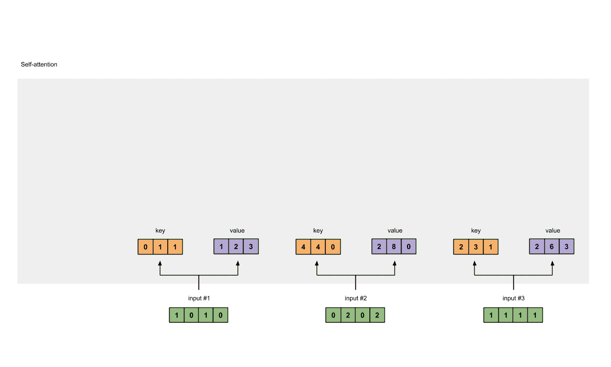
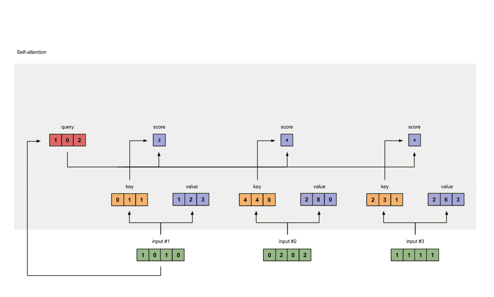
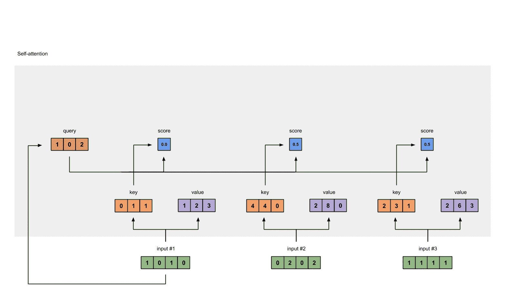
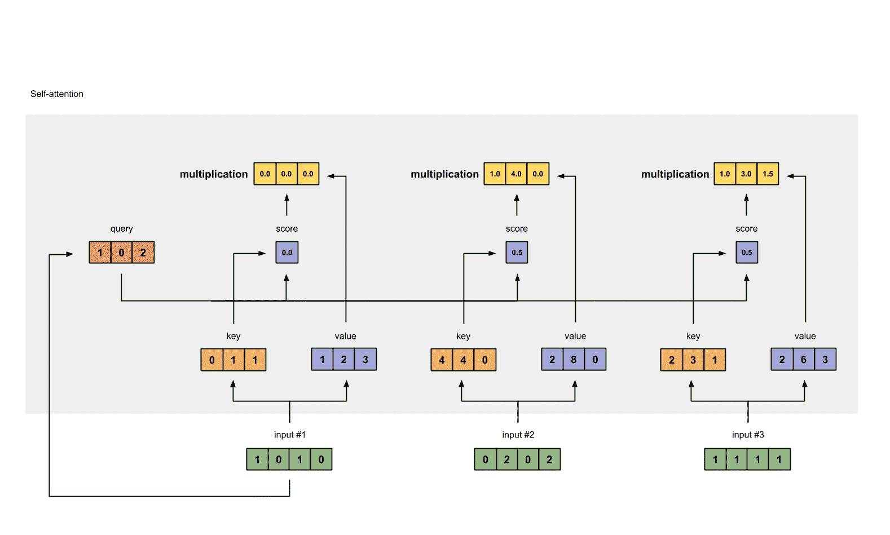
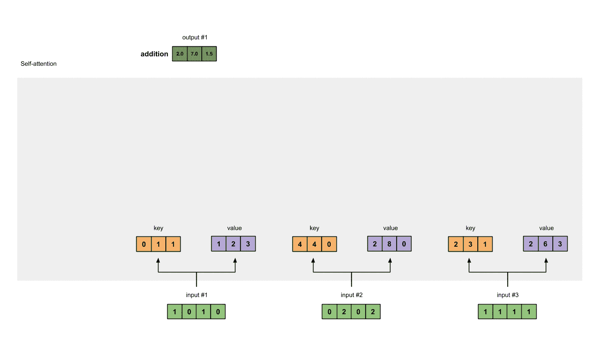

# 插图:自我关注

> 原文：<https://towardsdatascience.com/illustrated-self-attention-2d627e33b20a?source=collection_archive---------0----------------------->


## 内部人工智能

## 带插图和代码的自我关注循序渐进指南

插图最好在桌面上看。一个 Colab 版本可以在这里找到[](https://colab.research.google.com/drive/1rPk3ohrmVclqhH7uQ7qys4oznDdAhpzF)**(感谢* [*罗梅洛*](https://medium.com/u/3f2bb9b4510b?source=post_page-----2d627e33b20a--------------------------------) *！).**

**变更日志:
2022 年 12 月 30 日—使用 Medium 的新代码块突出显示语法
2022 年 1 月 12 日—提高清晰度
2022 年 1 月 5 日—修复错别字并提高清晰度**

*伯特、罗伯塔、艾伯特、斯潘伯特、迪尔伯特、塞姆斯伯特、森伯特、西伯特、比奥伯特、莫比尔伯特、蒂尼伯特和卡门伯特有什么共同点？我不是在寻找答案“伯特”🤭。*

***回答:自我关注🤗**。我们不仅在谈论名为“BERT”的架构，更准确地说，是基于**变压器的**架构。基于转换器的架构主要用于建模语言理解任务，避免了神经网络中的递归，而是完全依靠**自我关注**机制来绘制输入和输出之间的全局依赖关系。但是这背后的数学原理是什么呢？*

*这就是我们今天要发现的。这篇文章的主要内容是引导你完成自我关注模块中的数学运算。到本文结束时，您应该能够从头开始编写或编码自我关注模块。*

*这篇文章的目的不是提供自我关注模块中不同的数字表示和数学运算背后的直觉和解释。它也没有试图证明变形金刚中自我关注的原因和方式(我相信已经有很多了)。注意，本文中也没有详细说明注意力和自我注意力之间的区别。*

## *内容*

1.  *[插图](#570c)*
2.  *[代码](#8481)*
3.  *[延伸至变压器](#faae)*

*现在让我们开始吧！*

## *0.什么是自我关注？*

*如果你觉得自我关注也差不多，那么答案是肯定的！它们从根本上共享相同的概念和许多共同的数学运算。*

*自关注模块接收 *n* 个输入，并返回 *n* 个输出。在这个模块中发生了什么？通俗地说，自我注意机制就是让输入相互作用(“自我”)，找出自己应该更注意谁(“注意”)。输出是这些交互和注意力分数的集合。*

## *1.插图*

*插图分为以下几个步骤:*

1.  *准备输入*
2.  *初始化重量*
3.  *导出**键**、**查询**和**值***
4.  *计算输入 1 的注意力分数*
5.  *计算 softmax*
6.  *将分数乘以**值***
7.  *对**加权**和**值**求和，得到输出 1*
8.  *对输入 2 和输入 3 重复步骤 4-7*

> ****注*** *实际上，数学运算是矢量化的，即所有的输入一起进行数学运算。我们将在后面的代码部分看到这一点。**

***步骤 1:准备输入***

**

*Fig. 1.1: Prepare inputs*

*对于本教程，我们从 3 个输入开始，每个输入的维度为 4。*

```
*Input 1: [1, 0, 1, 0] 
Input 2: [0, 2, 0, 2]
Input 3: [1, 1, 1, 1]*
```

***步骤 2:初始化砝码***

*每个输入必须有三个表示(见下图)。这些表示被称为**键**(橙色)**查询**(红色)，以及**值**(紫色)。对于这个例子，让我们假设我们希望这些表示具有 3 维。因为每个输入的维数为 4，所以每组权重的形状必须为 4×3。*

> ****注*** *我们后面会看到* ***值*** *的维度也是输出维度。**

**

*Fig. 1.2: Deriving **key**, **query** and **value** representations from each input*

*为了获得这些表示，每个输入(绿色)都要乘以一组**键**的权重、一组**查询**的权重(我知道这不是正确的拼写)，以及一组**值**的权重。在我们的例子中，我们如下初始化三组权重。*

***键**的重量:*

```
*[[0, 0, 1],
 [1, 1, 0],
 [0, 1, 0],
 [1, 1, 0]]*
```

***查询**的权重:*

```
*[[1, 0, 1],
 [1, 0, 0],
 [0, 0, 1],
 [0, 1, 1]]*
```

***值**的权重:*

```
*[[0, 2, 0],
 [0, 3, 0],
 [1, 0, 3],
 [1, 1, 0]]*
```

> ****注释*** *在神经网络设置中，这些权重通常是小数字，使用适当的随机分布(如高斯、泽维尔和明凯分布)进行随机初始化。该初始化在训练前进行一次。**

***第三步:导出关键字、查询和值***

*现在我们有了三组权重，让我们获得每个输入的**键**、**查询**和**值**表示。*

*输入 1 的**键**表示:*

```
 *[0, 0, 1]
[1, 0, 1, 0] x [1, 1, 0] = [0, 1, 1]
               [0, 1, 0]
               [1, 1, 0]*
```

*使用相同的一组权重来获得输入 2 的**键**表示:*

```
 *[0, 0, 1]
[0, 2, 0, 2] x [1, 1, 0] = [4, 4, 0]
               [0, 1, 0]
               [1, 1, 0]* 
```

*使用相同的一组权重来获得输入 3 的**键**表示:*

```
 *[0, 0, 1]
[1, 1, 1, 1] x [1, 1, 0] = [2, 3, 1]
               [0, 1, 0]
               [1, 1, 0]*
```

*更快的方法是将上述操作矢量化:*

```
 *[0, 0, 1]
[1, 0, 1, 0]   [1, 1, 0]   [0, 1, 1]
[0, 2, 0, 2] x [0, 1, 0] = [4, 4, 0]
[1, 1, 1, 1]   [1, 1, 0]   [2, 3, 1]*
```

**

*Fig. 1.3a: Derive **key** representations from each input*

*让我们做同样的事情来获得每个输入的**值**表示:*

```
 *[0, 2, 0]
[1, 0, 1, 0]   [0, 3, 0]   [1, 2, 3] 
[0, 2, 0, 2] x [1, 0, 3] = [2, 8, 0]
[1, 1, 1, 1]   [1, 1, 0]   [2, 6, 3]*
```

**

*Fig. 1.3b: Derive **value** representations from each input*

*最后是**查询**交涉:*

```
 *[1, 0, 1]
[1, 0, 1, 0]   [1, 0, 0]   [1, 0, 2]
[0, 2, 0, 2] x [0, 0, 1] = [2, 2, 2]
[1, 1, 1, 1]   [0, 1, 1]   [2, 1, 3]*
```

**

*Fig. 1.3c: Derive **query** representations from each input*

> ****注意事项*** *实际上，一个*偏置向量*可能被加到矩阵乘法的乘积上。**

***步骤 4:计算输入 1 的关注度分数***

**

*Fig. 1.4: Calculating attention scores (blue) from query 1*

*为了获得*注意力分数*，我们首先在输入 1 的**查询**(红色)和所有**键**(橙色)之间取点积，包括它本身。由于有 3 个**键**表示(因为我们有 3 个输入)，我们获得 3 个注意力分数(蓝色)。*

```
 *[0, 4, 2]
[1, 0, 2] x [1, 4, 3] = [2, 4, 4]
            [1, 0, 1]*
```

*注意，我们只使用输入 1 中的**查询**。稍后，我们将对其他**查询**重复同样的步骤。*

> ****注意*** *以上操作就是众所周知的*点积注意*，其中的几个* [***得分功能***](/attn-illustrated-attention-5ec4ad276ee3#ba24) 。*其他得分功能包括*缩放点积*和*加法/串联。*

***第五步:计算 softmax***

**

*Fig. 1.5: Softmax the attention scores (blue)*

*将 [softmax](https://en.wikipedia.org/wiki/Softmax_function) 穿过这些注意力得分(蓝色)。*

```
*softmax([2, 4, 4]) = [0.0, 0.5, 0.5]*
```

*注意，为了可读性，我们在这里四舍五入到小数点后 1 位。*

***第六步:将分数与数值相乘***

**

*Fig. 1.6: Derive **weighted** **value** representation (yellow) from multiply **value** (purple) and score (blue)*

*每个输入(蓝色)的最大关注分数乘以其相应的**值**(紫色)。这产生了 3 个*对准矢量*(黄色)。在本教程中，我们将它们称为**加权值**。*

```
*1: 0.0 * [1, 2, 3] = [0.0, 0.0, 0.0]
2: 0.5 * [2, 8, 0] = [1.0, 4.0, 0.0]
3: 0.5 * [2, 6, 3] = [1.0, 3.0, 1.5]*
```

***步骤 7:加权值求和得到输出 1***

**

*Fig. 1.7: Sum all **weighted values** (yellow) to get Output 1 (dark green)*

*取所有**加权** **值**(黄色)并按元素求和:*

```
 *[0.0, 0.0, 0.0]
+ [1.0, 4.0, 0.0]
+ [1.0, 3.0, 1.5]
-----------------
= [2.0, 7.0, 1.5]*
```

*结果向量[2.0，7.0，1.5](深绿色)是输出 1，它基于来自输入 1 的**查询表示**与所有其他键交互，包括它自己。*

***第 8 步:重复输入 2 &输入 3***

*现在我们已经完成了输出 1，我们对输出 2 和输出 3 重复步骤 4 到 7。我相信我可以让你自己解决这个问题👍🏼。*

**

*Fig. 1.8: Repeat previous steps for Input 2 & Input 3*

> ****备注*** *维度* ***查询*** *和* ***键*** *因为点积得分函数的关系必须始终相同。但是* ***值*** *的维度可能与* ***查询*******键*** *不同。结果输出将遵循* ***值*** *的尺寸。***

## **2.密码**

**下面是 [PyTorch](https://pytorch.org/) 中的代码🤗，Python 中流行的深度学习框架。要在下面的代码片段中享受用于`@`操作符、`.T`和`**None**`索引的 API，请确保您使用的是 Python≥3.6 和 PyTorch 1.3.1。只需跟着做，将这些复制粘贴到 Python/IPython REPL 或 Jupyter 笔记本中。**

****步骤 1:准备输入****

```
**>>> import torch

>>> x = [
...   [1, 0, 1, 0], # Input 1
...   [0, 2, 0, 2], # Input 2
...   [1, 1, 1, 1], # Input 3
... ]
>>> x = torch.tensor(x, dtype=torch.float32)**
```

****步骤 2:初始化砝码****

```
**>>> w_key = [
...   [0, 0, 1],
...   [1, 1, 0],
...   [0, 1, 0],
...   [1, 1, 0],
... ]
>>> w_query = [
...   [1, 0, 1],
...   [1, 0, 0],
...   [0, 0, 1],
...   [0, 1, 1],
... ]
>>> w_value = [
...   [0, 2, 0],
...   [0, 3, 0],
...   [1, 0, 3],
...   [1, 1, 0],
... ]

>>> w_key = torch.tensor(w_key, dtype=torch.float32)
>>> w_query = torch.tensor(w_query, dtype=torch.float32)
>>> w_value = torch.tensor(w_value, dtype=torch.float32)**
```

****步骤 3:导出密钥、查询和值****

```
**>>> keys = x @ w_key
>>> querys = x @ w_query
>>> values = x @ w_value

>>> keys
tensor([[0., 1., 1.],
        [4., 4., 0.],
        [2., 3., 1.]])

>>> querys
tensor([[1., 0., 2.],
        [2., 2., 2.],
        [2., 1., 3.]])

>>> values
tensor([[1., 2., 3.],
        [2., 8., 0.],
        [2., 6., 3.]])**
```

****第四步:计算注意力得分****

```
**>>> attn_scores = querys @ keys.T
>>> attn_scores
tensor([[ 2.,  4.,  4.],  # attention scores from Query 1
        [ 4., 16., 12.],  # attention scores from Query 2
        [ 4., 12., 10.]]) # attention scores from Query 3**
```

****第五步:计算 softmax****

```
**>>> from torch.nn.functional import softmax

>>> attn_scores_softmax = softmax(attn_scores, dim=-1)
tensor([[6.3379e-02, 4.6831e-01, 4.6831e-01],
        [6.0337e-06, 9.8201e-01, 1.7986e-02],
        [2.9539e-04, 8.8054e-01, 1.1917e-01]])

>>> # For readability, approximate the above as follows
>>> attn_scores_softmax = [
...   [0.0, 0.5, 0.5],
...   [0.0, 1.0, 0.0],
...   [0.0, 0.9, 0.1],
...  ]
>>> attn_scores_softmax = torch.tensor(attn_scores_softmax)**
```

****第六步:将分数与数值相乘****

```
**>>> weighted_values = values[:,None] * attn_scores_softmax.T[:,:,None]
>>> weighted_values
tensor([[[0.0000, 0.0000, 0.0000],
         [0.0000, 0.0000, 0.0000],
         [0.0000, 0.0000, 0.0000]],

        [[1.0000, 4.0000, 0.0000],
         [2.0000, 8.0000, 0.0000],
         [1.8000, 7.2000, 0.0000]],

        [[1.0000, 3.0000, 1.5000],
         [0.0000, 0.0000, 0.0000],
         [0.2000, 0.6000, 0.3000]]])**
```

****步骤 7:加权值求和****

```
**>>> outputs = weighted_values.sum(dim=0)
>>> outputs
tensor([[2.0000, 7.0000, 1.5000],  # Output 1
        [2.0000, 8.0000, 0.0000],  # Output 2
        [2.0000, 7.8000, 0.3000]]) # Output 3**
```

> *****注*** *PyTorch 为此提供了一个 API 叫做* `[*nn.MultiheadAttention*](https://pytorch.org/docs/master/nn.html#multiheadattention)` *。但是，这个 API 要求您输入键、查询和值 PyTorch 张量。此外，该模块的输出经历线性变换。***

## **3.延伸到变压器**

**那么，我们该何去何从？变形金刚！事实上，我们生活在深度学习研究和高计算资源的激动人心的时代。变形金刚是来自[注意力就是一切](#9abf)的化身，原本是为了执行[神经机器翻译](https://en.wikipedia.org/wiki/Neural_machine_translation)而生。研究人员从这里开始，重新组装，切割，添加和扩展部件，并将其应用于更多的语言任务。**

**在这里，我将简要地提到我们如何将自我关注扩展到一个 Transformer 架构。**

**在自我关注模块中:**

*   **尺寸**
*   **偏见**

**自我关注模块的输入:**

*   **嵌入模块**
*   **位置编码**
*   **缩短**
*   **掩饰**

**添加更多自我关注模块:**

*   **多传感头**
*   **层堆叠**

**自我关注模块之间的模块:**

*   **线性变换**
*   **层状**

**那都是乡亲们！希望你觉得内容容易消化。你认为我应该在这篇文章中进一步补充或阐述什么吗？请留言！此外，一定要看看下面我创作的一幅插图**

## **参考**

**你所需要的就是关注(arxiv.org)**

**[图解变压器](https://jalammar.github.io/illustrated-transformer/) (jalammar.github.io)**

## **相关文章**

**【towardsdatascience.com】经办人:图文并茂**

***如果你喜欢我的内容并且还没有订阅 Medium，请通过我的推荐链接* [*这里*](https://medium.com/@remykarem/membership) *订阅！注意:你的会员费的一部分将作为介绍费分配给我。***

***特别感谢 Xin Jie、Serene、任杰、Kevin 和 Wei Yih 为本文提供想法、建议和更正。***

***在 Twitter 上关注我*[*@ remykarem*](https://twitter.com/remykarem)*关于 AI、ML、深度学习和 Python 的消化文章和其他推文。***