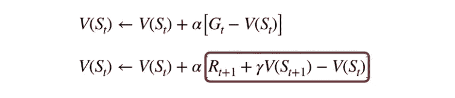
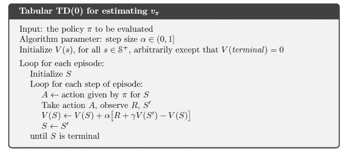
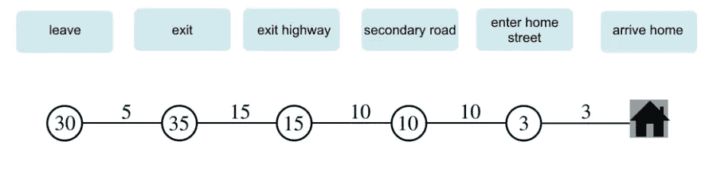
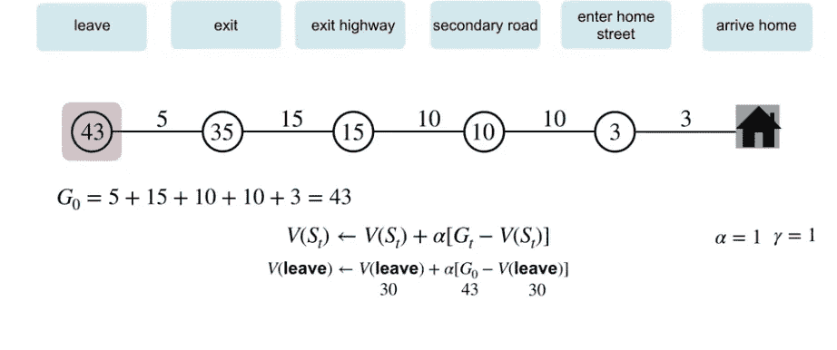
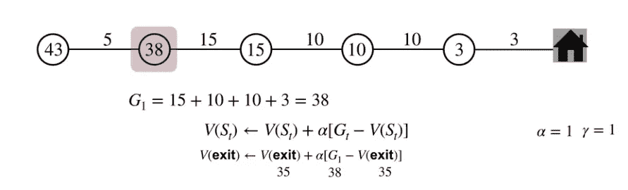
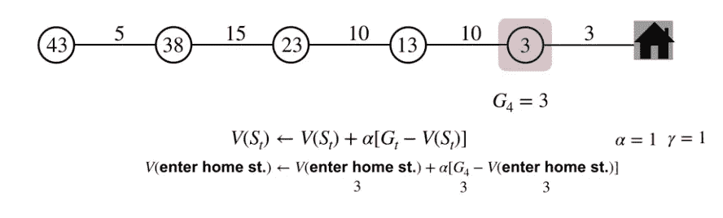
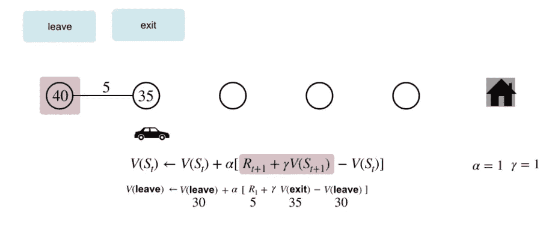
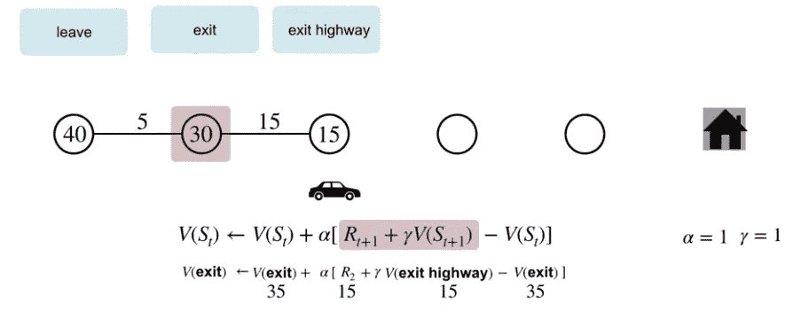
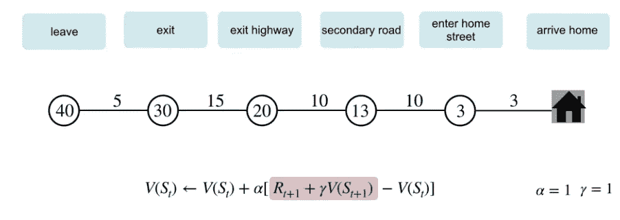

# 通过时差说明在线学习

> 原文：<https://towardsdatascience.com/illustrating-online-learning-through-temporal-differences-6a09daf61604?source=collection_archive---------36----------------------->

## 强化学习的基础

# 介绍

在我们关于 GradientCrescent 强化学习基础的文章中，我们研究了基于[模型和基于](https://medium.com/gradientcrescent/fundamentals-of-reinforcement-learning-markov-decision-processes-policies-value-functions-94f7389e1e82)样本的强化学习方法。简而言之，前一类的特点是需要了解所有可能的状态转移的完整概率分布，并以[马尔可夫决策过程](https://medium.com/gradientcrescent/fundamentals-of-reinforcement-learning-markov-decision-processes-policies-value-functions-94f7389e1e82)为例。相比之下，[基于样本的学习方法](https://medium.com/gradientcrescent/fundamentals-of-reinforcement-learning-automating-pong-in-using-a-policy-model-an-implementation-b71f64c158ff)允许简单地通过重复观察来确定状态值，消除了对转换动态的需要。在我们的[上一篇文章](https://medium.com/gradientcrescent/fundamentals-of-reinforcement-learning-automating-pong-in-using-a-policy-model-an-implementation-b71f64c158ff)中，我们讨论了蒙特卡罗方法在简单地通过环境采样来确定不同状态和行为的值中的应用。

更一般地，蒙特卡罗方法属于离线学习方法家族，就此而言，仅当达到终端状态时，或者在一集结束时，才允许更新状态的值。虽然这种方法对于许多受控或模拟环境来说似乎足够了，但对于需要快速变化的应用来说，比如在自动驾驶汽车的训练中，这种方法就远远不够了。在这种应用中使用离线学习可能会导致事故，因为更新状态值的延迟会导致不可接受的生命或财产损失。

Different agents playing Breakout via OpenAI’s gym utilizing DQN, an online-learning approach based on TD.

因此，今天使用的大多数强化学习算法都被归类为在线学习。换句话说，状态和动作的值是通过一系列的估计不断更新的。这也被称为时间差异学习，是更高级算法的基础，这些算法用于训练代理处理游戏环境，如在 OpenAI Atari 健身房观察到的环境。

# 时间差异学习

正如在蒙特卡罗中一样，时间差分学习(TD)是一种基于采样的方法，因此不需要模型知识来估计其价值函数。然而，与蒙特卡罗方法不同，TD 是一种在线方法，依赖于具有增量时间步长的剧集内更新。时间差异学习的核心是状态 *St，*的增量更新函数(“自举”)，其特征在于 TD 误差(在底部以红色显示):

Monte Carlo (top) versus Temporal Difference (bottom) update functions.

注意在 TD 更新函数中引入了两个不同的时间步长( *t* 和 *t+1* )。TD 误差包含下一时间步的返回与状态 *St+1* 的当前估计值之和，并从该和中减去前一状态 *St* 的值。本质上，我们用在稍后的时间步骤中获得的另一个估计值来更新状态的估计值，在之前对于神经网络观察到的复制梯度下降中。

这在实践中是如何运作的？考虑状态(S)、动作(A)和(奖励)的顺序

由于这种循环行为，我们可以在到达下一个状态时更新前一个状态的值。更正式的定义，

# 时间差分学习与蒙特卡罗

为了更好地说明在线学习和离线学习的区别，考虑一下预测从办公室回家的路程的例子，这是在阿尔伯塔大学的强化学习课程中引入的。在下面指定的每个位置或州，预测的剩余时间以分钟为单位显示在圆圈内，实际经过的时间显示在每个州之间。

Locations, predictions, and time elapsed on a trip home from the office

让我们首先使用蒙特卡罗方法。我们将等待这一集结束，以获取旅行的实际总耗时，然后通过用返回更新值来更新我们的每个状态。因此，在出发点(离开)的情况下，我们可以累积我们的回报(在这种情况下没有折扣因子)，并在剧集结束时更新其值，如下所示:

类似地，我们可以通过使用 38 的实际运行返回来更新下一个状态的估计值 35:

然后，我们依次对每个中间目的地重复这一过程，并实现最终更新，如下所示:

因此，我们的状态值现在更好地反映了我们旅行的实际花费时间。**但是，请注意我们是如何不得不等到旅程结束时才执行更新的。**如果我们的旅行目标是在特定时间在中间目的地取包裹，会怎么样？延迟更新可能会导致明显的延迟。

让我们使用时间差异分析来重复我们的估计。使用我们新的估计和实际经过的时间，我们可以使用时间差分析来更新我们先前的初始估计。从办公室 *(t)* 出发，估计要 30 分钟才能到家。然而，在五分钟 *(t+1)* 后到达“退出”状态，我们发现我们落后于计划，因此将时间步长 *t* 的剩余时间更新为 40 分钟。

继续前行，我们需要 15 分钟到达“出口高速公路”，从那里我们估计还需要 15 分钟才能到家。由于这比我们预期的要快，我们可以用这个增量回报来更新我们之前的估计:

我们可以在整个旅程中重复这个过程。

比较这两种方法，很明显，时间差异分析允许进入集内优化，增加我们的代理的反应能力，以更好地收敛，在最短的时间内找到最佳策略。在自动驾驶应用中，这将允许我们在更早的时间点监控和评估代理的性能，并允许我们更快地做出调整，防止探索中不必要的事故。

这就结束了对时间差异分析的介绍。在下一篇教程中，我们将在此基础上，通过 SARSA 和 Q-learning 介绍状态动作值的 TD，后者是一种众所周知的在线学习方法，用于在各种游戏环境中优化代理策略。

我们希望您喜欢这篇文章，并希望您查看关于[gradient crescent covering applied AI](https://medium.com/gradientcrescent)的许多其他文章。要了解 GradientCrescent 的最新动态，请考虑关注该出版物。

**参考文献**

萨顿等人。强化学习

怀特等人。阿尔伯塔大学强化学习基础

席尔瓦等人。阿尔，强化学习，UCL