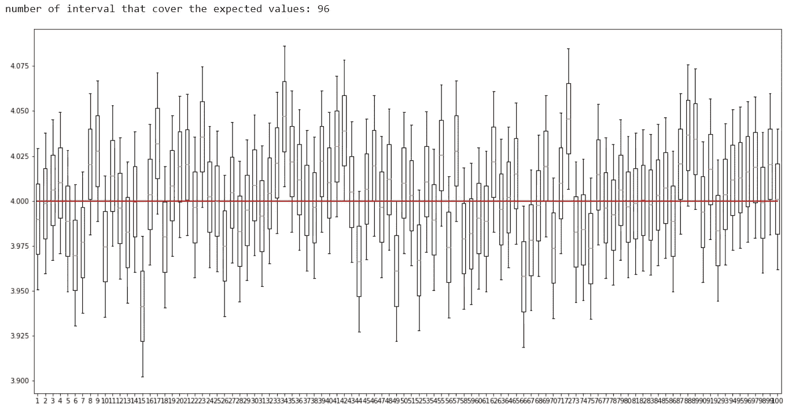

# Python 插图:置信区间

> 原文：<https://towardsdatascience.com/illustration-with-python-confidence-interval-ee4736cc3dc2?source=collection_archive---------6----------------------->

本文使用了[中的知识，中心极限定理](https://medium.com/@c.chaipitakporn/illustration-with-python-central-limit-theorem-aa4d81f7b570)，还有[的概念，弱大数定律](https://medium.com/@c.chaipitakporn/illustration-with-python-weak-law-of-large-numbers-2a644b862985)和[的切比雪夫不等式](https://medium.com/analytics-vidhya/illustration-with-python-chebyshevs-inequality-b34be151c547)，你可以通过访问链接来复习这些题目。如果你想继续下去，你可以从这个链接获得代码: [Jupyter 笔记本](https://github.com/chaipi-chaya/Illustration-with-Python/blob/master/Illustration%20with%20Python%20Confidence%20Interval.ipynb)。

在我看来，这个话题是最令人困惑的定理，甚至维基百科的文章也提到了对它的误解，所以我会尽力解释它。

在深入研究之前，请记住，总体的均值(我们要估计的东西)是一个常数，这个数字没有随机性。

置信区间是我们用来估计总体参数值的估计量。间隔将创建一个可能包含这些值的范围。当我们创建区间时，我们使用样本均值。回想一下中心极限定理，如果我们多次采样，样本均值将呈正态分布。

我创建了样本均值分布来演示这个估计量。

```
# use gamma distribution
shape, scale = 2.0, 2.0  # mean=4, std=2*sqrt(2)
s = np.random.gamma(shape, scale, 1000000)
mu = shape*scale # mean and standard deviation
sigma = scale*np.sqrt(shape)# create sample mean distribution
meansample = []
# sample size
samplesize = 500
for j in range(0,50000):
    # sampling 500 sample from population
    rc = random.choices(s, k=samplesize)
    # collect mean of each sample
    meansample.append(sum(rc)/len(rc))plt.figure(figsize=(20,10))
plt.hist(meansample, 200, density=True, color='lightblue')
plt.show()
```


样本均值分布是正态分布，均值等于总体均值 4。我们可以把这个分布改成标准的正态分布，用 Z 表来计算概率。

我使用 Z 表创建一个覆盖样本平均值 95%的范围，如下图所示。

```
# set mean and 95% probability
plt.figure(figsize=(20,10))
plt.hist(meansample, 200, density=True, color='lightblue')
plt.plot([mu,mu],[0, 3.2], 'k-', lw=4, color='green')
plt.plot([mu-(1.96*sigma/np.sqrt(samplesize)),mu-(1.96*sigma/np.sqrt(samplesize))],[0, 3.2], 'k-', lw=2, color='navy')
plt.plot([mu+(1.96*sigma/np.sqrt(samplesize)),mu+(1.96*sigma/np.sqrt(samplesize))],[0, 3.2], 'k-', lw=2, color='navy')
plt.show()
```


The green line is the true mean or population mean. The two blue lines are a 95% border.

如果我们从总体中取样并计算平均值，在 95%的情况下，我们将得到两条蓝线内的平均值。

不幸的是，我们无法采样 50，000 次并创建这个分布。假设我们只能采样 1 次，我们得到的样本平均值为 3.85。我们得到的平均值是黑线。

```
# suppose that we sample 500 data that has a mean as 3.85
# Xbar mean = 3.85, sigma = sigma/np.sqrt(samplesize)
m, ss = 3.85, sigma/np.sqrt(samplesize) # mean and standard deviation
plt.figure(figsize=(20,10))
plt.hist(meansample, 200, density=True, color='lightblue')
plt.plot([mu,mu],[0, 3.2], 'k-', lw=4, color='green')
plt.plot([mu-(1.96*sigma/np.sqrt(samplesize)),mu-(1.96*sigma/np.sqrt(samplesize))],[0, 3.2], 'k-', lw=2, color='navy')
plt.plot([mu+(1.96*sigma/np.sqrt(samplesize)),mu+(1.96*sigma/np.sqrt(samplesize))],[0, 3.2], 'k-', lw=2, color='navy')
plt.plot([m,m],[0, 3.2], 'k-', lw=2, color='black')
plt.show()
```


The black line is the mean we got from sampling.

根据我们得到的平均值，我们希望创建一个估计量来估计真实平均值的值，因此我们使用 95%的范围(黄色区域)创建一个区间。稍后我会解释为什么我们使用 95%的范围。

```
# the interval we create cover the population mean because it is within 95% range from population mean
plt.figure(figsize=(20,10))plt.hist(meansample, 200, density=True, color='lightblue')
plt.plot([mu,mu],[0, 3.2], 'k-', lw=4, color='green')
plt.plot([mu-(1.96*sigma/np.sqrt(samplesize)),mu-(1.96*sigma/np.sqrt(samplesize))],[0, 3.2], 'k-', lw=1, color='navy')
plt.plot([mu+(1.96*sigma/np.sqrt(samplesize)),mu+(1.96*sigma/np.sqrt(samplesize))],[0, 3.2], 'k-', lw=1, color='navy')
plt.plot([m,m],[0, 3.2], 'k-', lw=4, color='black')
plt.plot([m-(1.96*ss),m-(1.96*ss)],[0, 3.2], 'k-', lw=2, color='red')
plt.plot([m+(1.96*ss),m+(1.96*ss)],[0, 3.2], 'k-', lw=2, color='red')
# Create a Rectangle patch
plt.gca().add_patch(plt.Rectangle((m-(1.96*ss), 0),2*(1.96*ss),3.21, fill=True, linewidth=3, fc=(1,1,0,0.3)))
plt.xlim(3.43, 4.67) 
plt.show()
```


The yellow area is an interval of the sample mean.

我们可以看到区间覆盖了真实均值(绿线)。区间(黄色区域)覆盖了真实平均值，因为样本平均值落在总体平均值(绿线)的 95%范围内。

由于样本均值是随机的，因此有 5%的概率均值会超出 95%的范围。当样本平均值超出 95%范围时，就会出现这种情况。

```
# if the interval is not within 95% range from population mean the interval will not cover the true population mean
plt.figure(figsize=(20,10))
m = 3.72
plt.hist(meansample, 200, density=True, color='lightblue')
plt.plot([mu,mu],[0, 3.2], 'k-', lw=4, color='green')
plt.plot([mu-(1.96*sigma/np.sqrt(samplesize)),mu-(1.96*sigma/np.sqrt(samplesize))],[0, 3.2], 'k-', lw=1, color='navy')
plt.plot([mu+(1.96*sigma/np.sqrt(samplesize)),mu+(1.96*sigma/np.sqrt(samplesize))],[0, 3.2], 'k-', lw=1, color='navy')
plt.plot([m,m],[0, 3.2], 'k-', lw=4, color='black')
plt.plot([m-(1.96*ss),m-(1.96*ss)],[0, 3.2], 'k-', lw=2, color='red')
plt.plot([m+(1.96*ss),m+(1.96*ss)],[0, 3.2], 'k-', lw=2, color='red')
# Create a Rectangle patch
plt.gca().add_patch(plt.Rectangle((m-(1.96*ss), 0),2*(1.96*ss),3.21, fill=True, linewidth=3, fc=(1,1,0,0.3)))
plt.xlim(3.43, 4.67) 
plt.show()
```


If we sample and get the mean that falls outside blue lines, the interval will not cover the true mean.

黄色区域不包含人口平均值。

我们使用 95%的范围，因为它与样本均值的概率相匹配。如果样本均值在概率的边界上，则该范围仍然覆盖真实均值，但如果再远一点，则不会覆盖真实均值。样本均值落在两条蓝线内的概率为 95%，因此两条线外 5%的区间不会覆盖真实均值。

95%这个数字是一个任意的数字，你可以把它设置成任意的数字。例如，我们可以将其设置为 90%的范围。

```
# use 90% instead of 95%
plt.figure(figsize=(20,10))
m = 3.72
plt.hist(meansample, 200, density=True, color='lightblue')
plt.plot([mu,mu],[0, 3.2], 'k-', lw=4, color='green')
plt.plot([mu-(1.645*sigma/np.sqrt(samplesize)),mu-(1.645*sigma/np.sqrt(samplesize))],[0, 3.2], 'k-', lw=1, color='navy')
plt.plot([mu+(1.645*sigma/np.sqrt(samplesize)),mu+(1.645*sigma/np.sqrt(samplesize))],[0, 3.2], 'k-', lw=1, color='navy')
plt.plot([m,m],[0, 3.2], 'k-', lw=4, color='black')
plt.plot([m-(1.645*ss),m-(1.645*ss)],[0, 3.2], 'k-', lw=2, color='red')
plt.plot([m+(1.645*ss),m+(1.645*ss)],[0, 3.2], 'k-', lw=2, color='red')
# Create a Rectangle patch
plt.gca().add_patch(plt.Rectangle((m-(1.645*ss), 0),2*(1.645*ss),3.21, fill=True, linewidth=3, fc=(1,1,0,0.3)))
plt.xlim(3.43, 4.67) 
plt.show()
```


When we change the confidence from 95% to 90%, the interval becomes narrower.

因此，当我们说 95%的置信度时，意味着我们确信 95%的样本的平均值在真实平均值的 95%范围内(两条蓝线内)。问题是如果我们知道真正的意思，我们就不会这么做了。为了解决这个问题，我们将解释改为“我们确信 95%的抽样，样本将具有一个平均值，该平均值可以创建覆盖真实平均值的区间”。

就像我上面提到的，这里唯一随机的是样本均值，所以我们不能说真均值的概率在区间内，因为总体均值不是随机变量，真均值是一个数字。

理论上，如果我们采样 100 次，95 次，我们将得到一个样本均值，其区间覆盖真实均值，因此我使用 python 模拟 100 次采样，这就是所发生的情况。

```
# simulate 100 interval with 5,000 sample size
mu = shape*scale # mean
sigma = scale*np.sqrt(shape) # standard deviation
intervallist = []
k = 1.96
# sample size
samplesize = 5000
# start count
c = 0
for i in range(0,100):
    # sample 100 sample
    rs = random.choices(s, k=samplesize)
    # calculate mean
    mean = np.mean(rs)
    upbound = mean + k*sigma/np.sqrt(samplesize)
    lowbound = mean - k*sigma/np.sqrt(samplesize)
    # collect difference between sample mean and mu
    intervallist.append([lowbound,mean,upbound])
    if upbound >= mu and lowbound <= mu:
        c += 1

print("number of interval that cover the expected values:", c)
# set figure size.
plt.figure(figsize=(20,10))
# plot box plots of each sample mean.
plt.boxplot(intervallist)
plt.plot([1, 100],[mu,mu], 'k-', lw=2, color='red')
# show plot.
plt.show()
```


The red line is a true mean, the box plots are intervals.

这个数字可能不是精确的 95，因为它毕竟是一个概率。

最后一点，样本大小对这个话题有巨大的影响。如果样本量增加，样本均值的方差会减小。因此，间隔范围也减小。

```
# simulate 100 interval with 20,000 sample size
intervallist = []
# sample size
samplesize = 20000
# start count
c = 0
for i in range(0,100):
    # sample 100 sample
    rs = random.choices(s, k=samplesize)
    # calculate mean
    mean = np.mean(rs)
    upbound = mean + k*sigma/np.sqrt(samplesize)
    lowbound = mean - k*sigma/np.sqrt(samplesize)
    # collect difference between sample mean and mu
    intervallist.append([lowbound,mean,upbound])
    if upbound >= mu and lowbound <= mu:
        c += 1

print("number of interval that cover the expected values:", c)
# set figure size.
plt.figure(figsize=(20,10))
# plot box plots of each sample mean.
plt.boxplot(intervallist)
plt.plot([1, 100],[mu,mu], 'k-', lw=2, color='red')
# show plot.
plt.show()
```



Notice the y-axis scale is smaller.

如果我们的样本量很大，估计量会更精确。

代码可以在这个链接找到: [Jupyter 笔记本](https://github.com/chaipi-chaya/Illustration-with-Python/blob/master/Illustration%20with%20Python%20Confidence%20Interval.ipynb)。