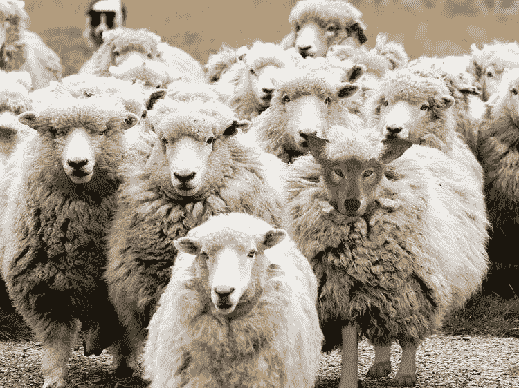
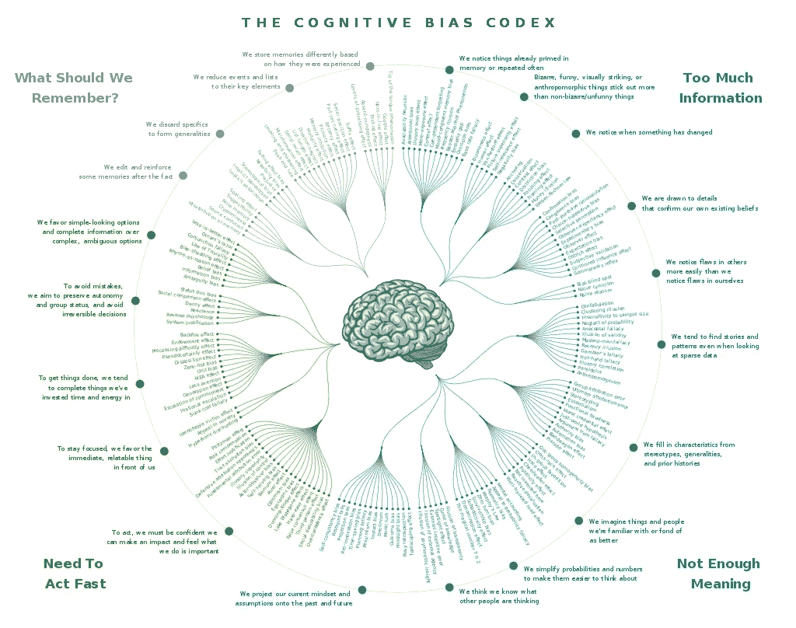
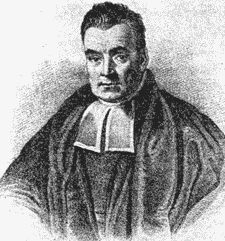

# 我是贝塞德，我知道

> 原文：<https://towardsdatascience.com/im-bayesed-and-i-know-it-b8bfd71c2338?source=collection_archive---------24----------------------->

Source: [deeredeemed.wordpress.com](https://deeredeemed.wordpress.com/2013/10/31/wolves-dont-lose-sleep-over-opinions-of-sheep/)

如果你还太年轻，不知道标题出处，我会让你失去理智。它与聚会、摇滚和圣歌有关。实际上，不，我只是想让你玩得开心，所以我想让你看看标题图片。你注意到了什么？

显然，我让你注意标题和图片是有原因的。有了这个标题，你可能不会意识到它有一个“模式”，直到我指出来。对于这幅图，如果你只是匆匆一瞥，你可能只看到了羊。

如果你在我没有指出来的情况下，设法把两者都搞清楚了，你可以停止阅读了。

对于那些不知道的人来说，我(试着)比你们强一点的原因是因为我想谈谈偏见。不，不是机器学习中的偏见，这是指一个模型不能“学习”任何东西。我将要谈到的偏见更为严重，它与人类而非机器有关。你现在可能已经明白了…我们将要谈论认知偏见。为什么？因为它们通常与数据驱动的决策和数据科学有很大关系。

让我们开门见山吧。下面你会发现一些我们人类的认知偏见。本帖，我只说一个；它对我们的生活有着重大的影响，但也许还没有被人们谈论的那么多。这被称为基础率谬误。

Source & interactive version: [Wikipedia](https://en.wikipedia.org/wiki/List_of_cognitive_biases)

**基础利率谬误**

想想你最后一次参与项目的时候。它是否比您最初预期的花费了更多的时间？对我来说，在团队工作时，这种情况总是会发生。你还有一周就要截稿了；由于团队花了 4 天时间完成上一个项目，你们都认为这次最多花 4 天时间就能完成。突然到了晚上 11:50，离截止日期还有 5 分钟，在吃了四天街角小店的烤肉串后，你开始争先恐后地完成所有事情。

每当这种情况发生时，我也会责怪我的队友或老板，而不是我自己(顺便说一下，这实际上是一种偏见，自私的偏见)，但事实上，我没有忽略基本率，因为作为一个人，我不太擅长将信息与概率分开。为了向你解释什么是基础利率谬误，我将遵从这方面的专家:

两位最著名的行为科学家阿莫斯·特拉弗斯基和丹尼尔·卡内曼进行了一项实验，他们向参与者描述了从 70 名律师和 30 名工程师中随机选出的 5 个人。参与者需要预测这 5 个人是律师还是工程师。Kahneman & Traversky 发现，参与者的预测完全忽略了这个群体的特征(这个群体由 30%的工程师或 70%的律师组成，这是 5 种描述中的每一种落入每一组的各自概率)，最终的描述是从这个群体中得出的。相反，参与者似乎将他们对每个人职业的预测建立在描述与典型的律师或工程师相似的程度上。显然，参与者有偏见。如果不是，从 5 个样本中，他们最好说 3 个是律师，2 个是工程师(每个人的期望值)。

这种偏见对你和你未来的小组项目意味着什么？不要考虑以前同一个团队完成一个项目花了多长时间，开始收集在你之前其他团队完成相同或相似项目花了多长时间的数据！这样，你就不会忽略基础利率。

快速提示:显然，有相当大的一个专门的机器学习研究人员小组试图建立可以仅基于相似性进行预测的算法。佩德罗·多明戈斯(Pedro Domingos)在他的书《算法大师》(The Master Algorithm)中，将这些人描述为类比者。

**对数据科学的影响**

回到正题，基础率谬误不仅仅局限于团体项目。它对决策制定有深远的影响，并与数据科学相关联。通过忽略基础利率，我们可能会基于某人的长相(光环效应，或者*为什么骗子会成功*)而不是他们的实际支付能力，认为他们不支付信用卡账单的概率更高。另一个例子是医生误诊病人，因为他们没有考虑疾病发生的基本比率，本质上是给非常罕见的疾病附加了更高的概率。

现在戴上你的数据科学家帽子，想想机器学习是如何防止这种偏见干扰决策的？让我给你一个提示:

Thomas Bayes, Source: Wikipedia

事实证明，贝叶斯是没有偏见的。

由托马斯·贝叶斯在 18 世纪首次提出的贝叶斯定理，通过在计算后验概率时结合先验概率来考虑基础率。我不会在这篇文章中花时间解释它是如何工作的，因为佩德罗·多明戈斯做得更好，所以我强烈推荐他的书给那些更渴望了解居住在“ML 土地”上的部落的人。

我要说的是，贝叶斯定理是当今机器学习中最重要(也是最流行)的算法之一，它的应用见于一种叫做朴素贝叶斯的机器学习算法。

**那又怎样？**

你可能想知道我想证明什么。有些文章将数据科学和/或机器学习描述为会带来大量失业、过滤泡沫等等的东西。对这个行业的看法是，计算机科学家被付钱编写成千上万行代码，因为自动化比付钱给信贷员更便宜，或者更糟的是，公司想要发布假新闻来影响人们的决定。

我在这里的目的是给你一个不同的视角。事实上，许多数据科学都是基于被开发(或重新发现)以摆脱所有人类都有的认知偏见的想法。这包括信贷员和数据科学家。随着偏见的减少，我们以前做错的决定正在变得正确。例如，我们不再有仅仅因为信贷员不喜欢他们的穿着而不给他们贷款的问题(但没有意识到这影响了他/她的决定)。

我并不是说这都是阳光和彩虹，因为有许多关于数据科学的伦理困境正在进行辩论。无可争议的是，由于数据科学，我们在决策中的人类偏见更少了，这改善了全人类的生活。

你同意吗？