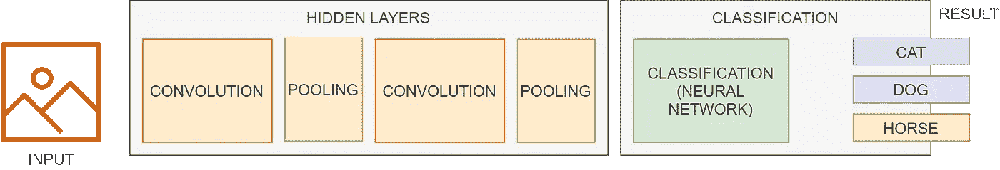
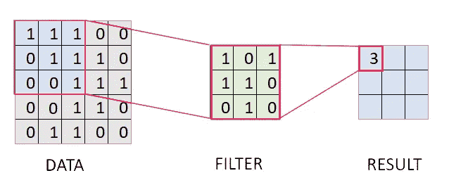
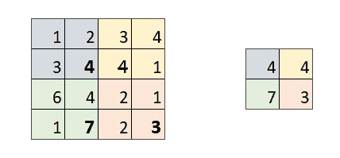

# 向我奶奶解释图像分类

> 原文：<https://towardsdatascience.com/image-classification-explained-to-my-grandma-665d81a31e9?source=collection_archive---------31----------------------->

## 简明英语中的 CNN 是什么

2019 年，我参加了由 CodeProject 组织的国际活动，我的项目 KerasUI 取得了胜利，这是一个实现用于训练和消费神经网络的 web GUI 的工具。这是一个特别的机会，让我在神经网络和人工智能领域沉寂了几年之后，重新获得这方面的知识。现在两年过去了，我偶尔和朋友和同事聊天，但我仍然觉得社区对这个话题没有正确的认识。除了专家，大多数人根本忽略了什么是图像分类，或者简单地用 [TensorFlow](https://medium.com/u/b1d410cb9700?source=post_page-----665d81a31e9--------------------------------) 库的一些方法来识别。嗯，这促使我再次写这个话题，只关注理论部分！

在文章的结尾，您会找到阅读获奖文章和下载代码的链接。我试图让事情变得尽可能简单，简单到可以向我奶奶解释😃

让我们开始解释吧！

Photo by [Possessed Photography](https://unsplash.com/@possessedphotography?utm_source=medium&utm_medium=referral) on [Unsplash](https://unsplash.com?utm_source=medium&utm_medium=referral)

# 学习什么是图像分类

图像分类问题是从一组固定的类别中给一幅图像分配一个标签的任务。这是计算机视觉中的核心问题之一，尽管它很简单，却有大量的实际应用。用穷人的话说，你想要的是，如果你给计算机一个狗的图像，它告诉你“这是一只狗”。

这是一个可以使用人工智能和计算机视觉解决的问题。计算机视觉有助于操纵和预处理图像，使它们成为计算机可以使用的形式(从位图到相关值的矩阵)。一旦你有了一个好的输入形式，你就可以应用一个算法来预测结果。

现在最常见的解决方案是使用 CNN(卷积神经网络)。这种神经网络对于图像处理非常方便，并且根据您将提供的数据集进行训练。

数据集只是一个样本列表，每个样本都有标签。主要话题是你告诉机器如何通过例子来决定。通常，数据集分为训练集、测试集和验证集。这是因为您想要训练网络，然后测试它如何在单独的数据上工作，直到它按预期工作。最后，如果你想得到客观的反馈，你必须使用其他数据:验证集。这是必需的，因为如果你让网络总是在相同的数据上训练，它将丢弃任何错误，但是将能够只处理你提供的样本。所以，如果你投入一点点不同的东西，你会想要得到一个好的结果。这被称为过度拟合，是应该避免的，因为这意味着网络没有抽象规则，而只是重复你告诉它的东西。想想一个数学表达式 2*5+10，就像记住结果是 25，而不是能够计算它。

# 理解卷积神经网络

在本节中，我们将了解什么是 CNN 及其工作原理。下一张图是网络的图形表示。这将在下面的章节中解释，但是现在，你可以把 CNN 想象成一个预处理管道，为最终的神经网络润色数据。我知道，这个定义可能看起来很胭脂，但是让我们跳到下一段，详细看看它是如何工作的！

A sample architecture for a CNN. made with ❤️ by the Daniele Fontani

## 输入

在图像分类中，我们从…图像开始！不难理解，图像是由像素组成的二维矩阵(宽*高)。每个像素由 RGB、红、绿、蓝三种不同的值组成。使用 CNN 可以方便的分离 3 个不同的图层，所以你最终的输入矩阵将会是 *image_size x image_size x 3* 。当然，如果你有一个黑色的&白色的图像，你不需要 3 层，只需要一层，所以你会有 *image_size x image_size x 1。*嗯，如果你也考虑到你的数据集将由 N 项组成，整个输入矩阵将是 *N x 图像大小 x 图像大小 x 3* 。图像的大小必须是相同的，不能是全高清图像，以避免太长的时间处理。这方面没有成文的规定，但通常是一种妥协:在某些情况下，256x256 可能是一个不错的值，换句话说，您将需要更高的分辨率。

## 卷积

在图像内部，许多细节、暗示和阴影与网络无关。所有这些细节可能会混淆训练，因此主要思想是简化图像，保留带来信息的所有数据。这很直观，在文字上很容易，但在实践中呢？CNN 使用卷积步骤，这是这种方法的核心，来减小图像的大小，保留图像中更相关的部分。卷积层之所以有这个名字，是因为它在矩阵的滑动部分和过滤器之间进行卷积。过滤器的大小和要分析的矩阵块是相同的。这一块叫内核。为了使矩阵大小适合内核大小，在所有维度上都用零填充。卷积为所有内核乘法生成一个标量值。这将产生尺寸下降，例如，在 32x32 矩阵(1024 个元素)上使用内核 4x4，您将在输出中得到 4x4 矩阵(16 个元素)。内核的大小会影响最终结果，通常最好保持小内核并链接多个卷积层，我可以在中间添加一些池层(我稍后会谈到池)。

The convoluton process. made with ❤️ by the Daniele Fontani

## 汇集

汇集层用于减少矩阵大小。有许多方法，但基本的是:我取一组相邻的值，我只用了一个。最常见的算法是最大池，所以，基本上，你把更大的元素放入集合。

The max pool layer. made with ❤️ by the author

## 完全连接的层

最后一步是神经网络。直到这最后一步，我们已经做了一些“确定性”的运算，只是代数计算。这一步，我们有了真正的人工智能。之前已经完成了所有工作，目的只是生成网络可以理解的数据。

# 结论

自从我第一次踏入这个领域，在 2008 年，就有了相关的变化。作为一个业余爱好者的第一感觉，就是现在所有的过程都是“确定性的”。通过使用标准技术和良好的文档，使网络工作变得更加容易。体验仍然很重要，我不想将人工智能与常规的数据库读/写操作进行比较，但找到大量的资料、教程、指南是让新手能够工作的事情。

这要归功于大玩家，像往常一样，他们让开发者可以访问 AI，共享他们的库，也许只是让我们知道把他们的所有东西作为服务来消费更容易。😃

给开发者，尤其是最年轻的开发者的大建议是，即使有很多实现神经网络的工具，也要首先专注于一个理论。当您将在库的基础上构建的系统将停止工作，并且您无法理解原因时，理解幕后的工作方式是非常重要的。

# 参考

*   我的原创文章发表于 2019 年 5 月 13 日*[*【https://www.codeproject.com】*](https://www.codeproject.com/Articles/4053651/Keras-UI-A-GUI-to-Manage-Image-Classification)*。**
*   *[维基百科上的 CNN](https://en.wikipedia.org/wiki/Convolutional_neural_network)*
*   *[维基百科上的图像分类](https://en.wikipedia.org/wiki/Computer_vision#Recognition)*
*   *[KerasUI](https://github.com/zeppaman/KerasUI) 的源代码*
*   *[代码项目获奖](https://www.codeproject.com/Competitions/1079/Image-Classification-Challenge)*