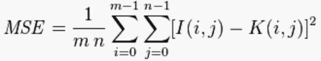

# 利用 SSIM 进行图像分类

> 原文：<https://towardsdatascience.com/image-classification-using-ssim-34e549ec6e12?source=collection_archive---------3----------------------->

## 用 OpenCV 实现简单的图像分类器

[Find the Differences](http://www.champak.in/wp-content/uploads/2017/09/09_Spot-the-Difference-1.jpg)

作为人类，我们通常非常善于发现图片中的差异。比如我们看看上面这张图，看看它们有什么不同。首先，水果、冰淇淋和饮料明显发生了变化。很简单，对吧？

然而，对于计算机来说，这并不是一件容易的事情。计算机只能从我们训练它的模型的东西中学习。有一些很棒的模型可以很好地分类批量图像，比如谷歌的 [TensorFlow](https://www.tensorflow.org/) 和 [Keras](https://keras.io/) 。

多亏了像这样的图像分类器库，计算机视觉有了巨大的飞跃。现在我们可以创建复杂的模型，比如 kaggle 中的这个: [Animals-10](https://www.kaggle.com/alessiocorrado99/animals10) ，它包含十种不同类型的动物以及已经训练和清洗过的非动物的数千张图片。你所要做的就是创建一个模型，看看你的模型能多好地预测每一种不同类型的动物。有关图像分类模型的教程，请查看 [Prabhu](https://medium.com/@RaghavPrabhu/a-simple-tutorial-to-classify-images-using-tensorflow-step-by-step-guide-7e0fad26c22) 或 [Amitabha](https://medium.com/datadriveninvestor/building-an-image-classifier-using-tensorflow-3ac9ccc92e7c) 。

然而，我想创建一个图像分类器，可以告诉如何相似的两个图像。为此，不需要任何复杂的库，如 TensorFlow 或上面链接的图像分类模型。有两种方法可以发现一个图像是否与另一个图像相似。首先是看**均方差** ( **MSE** )其次是**结构相似指数** ( **SSIM** )。

Left is **MSE** while right is **SSIM**

他们看起来都很可怕，但没必要担心。由于 NumPy 和 SSIM 是 Sci-Kit 图像库的内置方法部分，所以 MSE 可以很容易地计算出来，所以我们可以加载它。

在我们做所有这些之前，让我们定义一下每个人在计算什么。MSE 将计算我们正在比较的两幅图像的每个像素之间的均方误差。而 SSIM 会反其道而行之，在像素中寻找相似之处；即两个图像中的像素是否对齐和/或具有相似的像素密度值。唯一的问题是 MSE 往往有任意高的数字，所以很难标准化。虽然一般来说，mse 越高，它们越不相似，但如果图片集之间的 MSE 随机出现差异，我们就很难区分任何东西。另一方面，SSIM 把每件事都放在-1 到 1 的范围内(但是我不能给出小于 0 的分数)。1 分意味着它们非常相似，而-1 分意味着它们非常不同。在我看来，这是一个更好的衡量标准。

现在让我们关注代码，并开始导入所有必需的库:

Loading up necessary libraries

我使用 CV2(OpenCV 的一部分)来阅读和编辑我的图片。如果你愿意，也可以用 matplotlib 的 imread 来代替。我的朋友 [Yish Lim](https://medium.com/u/6ac286c49dad?source=post_page-----34e549ec6e12--------------------------------) 在她的[博客中为口袋妖怪比赛](/whos-that-pokémon-39d1150aedfe)的相似性做了这件事，这真是太棒了。

现在是写 MSE 公式的可怕部分:

Woah, that was tough

因为 SSIM 已经通过 skimage 导入，所以不需要手工编码。现在我们创建一个函数，它将接收两幅图像，计算它的 mse 和 ssim，并一次显示所有的值。

现在，接下来的三个步骤可以用 for 循环一次完成，但让我们在下面的代码中将其分解，这样更容易理解:

I chose a purposely large picture size for better SSIM, but beware it takes some time to calculate

首先，我们加载保存在目录中的图像。第二，我们必须确保它们都是相同的尺寸，否则我们会得到一个尺寸误差。这样做的问题是会导致图像失真，所以继续玩下去，直到你找到完美的数字。接下来我们再做一个函数，这样我们就可以看到我们的图片是什么样子。

It looks very small, and I haven’t figured out how to increase the size

现在来测试一下，看看我们的 MSE 和 SSIM 是否可以通过比较一张图片来工作。如果可行，那么我们应该得到 0 的 MSE 和 1 的 SSIM。

Yes, it works!

既然我们知道我们的电脑可以判断正在比较的图片是否相同，那么我们比较不同的图片怎么样？为了简单起见，我就把三张狗的图片比作自己，三张猫的图片比作自己。

Left: Comparing three different dogs to each other. Right: Comparing three different cats to each other

让我们看看我们的简单算法刚刚比较了什么。如你所见，MSE 变化很大，所以很难区分什么是什么。但是看看 SSIM，我们可以看到狗 2 和狗 3 相对于其他的狗是最相似的。视觉上，我同意，特别是耳朵。但是我认为狗 1 和狗 3 由于它们的姿势会有更高的 SSIM。事实上，在图片的灰度循环之前，狗 2 和狗 3 的鼻子周围有相似的白色皮毛，而狗 1 没有。这很可能是狗 2 和 3 比狗 1 具有更高 SSIM 值的原因。对于猫来说，这有点困难。猫 1 和猫 2 有相似的形状，照片是从相似的距离拍摄的，但是猫 2 和猫 3 有相似颜色的毛。这可能就是为什么第 1 类和第 3 类与第 2 类和第 3 类评级相似，而第 1 类和第 2 类评级不同的原因。

我只想再进行两项测试。一个是关于一只狗在一只猫面前的样子，第二个是每只动物如何与原始源代码附带的 gate 图片进行比较。

Dog vs. Gate vs. Cat

正如所料，狗和猫是相似的，特别是与一个无生命的物体相比，如侏罗纪公园 1 入口大门(侧注:如此伟大的电影！).狗和猫在门图片上有高 SSIM 的唯一原因是因为它的大小和灰度过滤器。

当谈到调整图像大小和重新配置图像时，OpenCV 不是最好的。为此，谷歌的 TensorFlow 是最好的。然而，我在 TensorFlow 上遇到的问题是，我无法将单张图片加载到它们的图库模块中。TensorFlow 最适合批量图片。

对于未来，我希望使用我提到的 kaggle Animal-10 数据集和 TensorFlow 来运行一个完整的图像分类实验室。

感谢阅读。

 [## 图像相似性使用 SSIM

### 我的 github 链接包含代码。

github.com](https://github.com/imamun93/Image-Similarities-using-SSIM)  [## 如何:Python 比较两个图像- PyImageSearch

### 你能猜到我是一个集邮者吗？开玩笑的。我没有。但是让我们玩一个假装的小游戏…

www.pyimagesearch.com](https://www.pyimagesearch.com/2014/09/15/python-compare-two-images/)