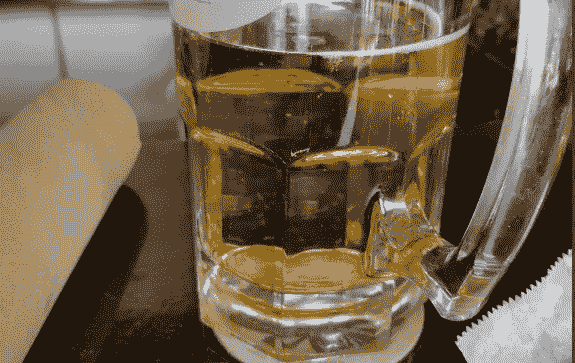
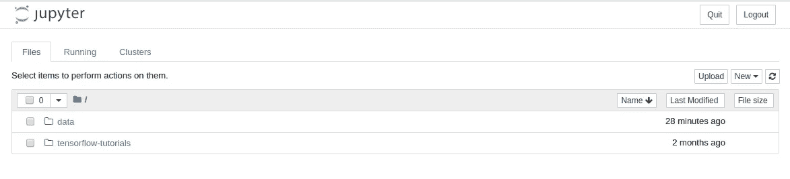
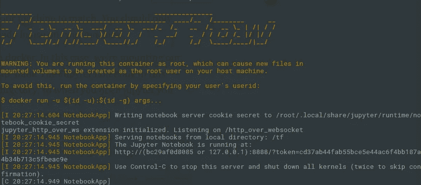
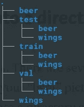
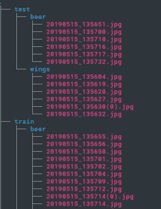
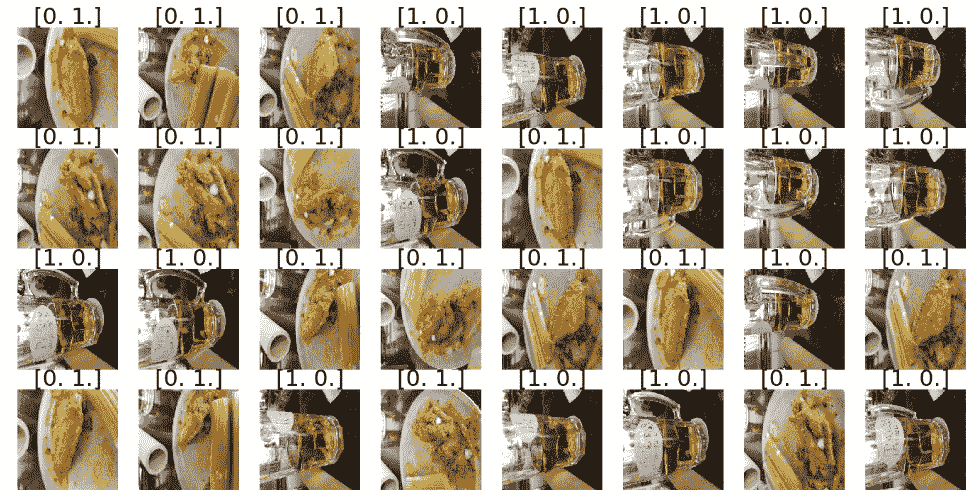
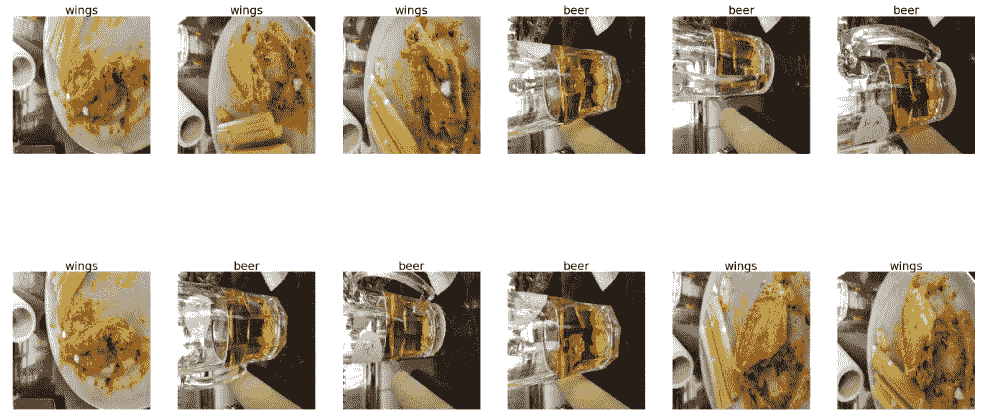

# 基于 Tensorflow 2.0 的影像分类

> 原文：<https://towardsdatascience.com/image-classification-with-tensorflow-2-0-7696e4aa5ca7?source=collection_archive---------8----------------------->

## 对自定义图像进行分类的端到端流程



在这篇文章中，我们将解决一个最常见的人工智能问题。场景是这样的:你正在酒吧上网，喝着啤酒，吃着鸡翅，这时你开始想“我能使用 Tensorflow 2.0 和迁移学习编写一个图像分类器吗？”本文将展示实现这一点的端到端过程。注意，我不会深入研究这个模型是如何工作的，那将是另外一篇文章。本文将向您展示如何使用 Tensorflow 2.0。一旦我们有了它，我们就可以回过头来使用参数，这可能会使代码更有效。

唯一的先决条件是:

1.  一台电脑(显然)。我在一台没有 GPU 的小型笔记本电脑上运行我的程序。
2.  带摄像头的手机。我们将会生成我们自己的图像。
3.  (可选)云图像存储。我用了亚马逊照片。
4.  Docker，我们将用它来托管我们的 Tensorflow 2.0 环境。如果你没有，安装说明可以在[这里](https://docs.docker.com/install/)找到

我们将遵循的步骤是:

1.  安装 Tensorflow 2.0 Docker 镜像。
2.  获取一组图像来训练/验证/测试我们的模型。
3.  将我们的图像组织成适合我们模型的目录结构。
4.  下载一个预先训练好的深度学习模型。
5.  为我们的特定用例(啤酒或鸡翅)定制我们的模型。
6.  训练我们的定制模型。
7.  可视化模型预测。

# 安装 Tensorflow 2.0 Docker 映像

我按照 T2 页面上的指示做了。以下是我使用的具体命令。注意，对于本教程，图像必须包含 Jupyter。

```
docker pull tensorflow/tensorflow:2.0.0a0-py3-jupyter
```

首先，cd 到您将存储源代码的目录。从那里，我们将启动我们的映像。我创建了一个简单的 shell 脚本(注意，我是在 Linux 上运行的，如果你在 Mac 或 Windows 上，你可能不需要 sudo 命令:

sudo docker run-it-p 8888:8888-v $ PWD:/TF/data-w/TF/data tensor flow/tensor flow:2 . 0 . 0 A0-py3-jupyter

这里需要知道的最重要的事情是:

*   -p 是端口映射，我们的 Jupyter 笔记本在 Docker 中的端口 8888 上运行，因此我们将在我们的机器上映射端口 8888 以进行匹配。只有当端口 8888 已经在您的机器上使用时，您才应该更改它。
*   -v 是如何在 docker 中挂载一个卷。在本例中，我们将当前目录($ term)挂载为/tp/data。这个 Docker 映像中的 jupyter 笔记本运行在/tp 目录中，因此当您打开 Jupyter 时，应该会看到以下内容:



其中数据目录映射到机器上的当前目录。

运行上述命令后，您将在命令提示符下看到类似这样的内容。



这里重要的一行是“Jupyter 笔记本运行于”之后的一行。您需要复制以“:8888”开头的那一行。然后在你的浏览器中输入 [http://localhost](http://localhost) 并粘贴你复制的行。在这种情况下:

```
http://localhost:8888/?token=cd37ab44fab55bce5e44ac6f4bb187a4b34b713c5fbeac9e
```

至此，Tensorflow 2.0 已经在 Docker 容器中启动并运行，可以访问您的本地文件系统。

# 获取一组图像来训练/验证/测试我们的模型

这一步很容易。我用手机从不同角度拍了大约 30 张啤酒杯的照片，从不同角度拍了 30 张鸡翅的照片。我是亚马逊 Prime 的大用户，所以我把手机设置成把我的照片备份到亚马逊照片。你可以使用任何你喜欢的云环境(ICloud，Google photos 等)，甚至可以用电子邮件给自己发照片。这里的重点是把照片复制到你的电脑上。

# 将我们的图像组织成适合我们模型的目录结构

第一步是给我们的图像贴标签。有几种方法可以做到这一点，但最终，你会想把所有的“啤酒”图片复制到一个名为“啤酒”的目录中，把你的“翅膀”图片复制到一个名为“翅膀”的目录中。从这里开始，您需要创建一个如下所示的目录结构:



以下是我在 Linux 中使用的命令:

```
mkdir train
mkdir test
mkdir val
mkdir train/beer
mkdir train/wings
mkdir test/beer
mkdir test/wings
mkdir val/beer
mkdir val/wings
```

此时，您需要将数据的子集移动到 val 和 test 目录中。经过一些谷歌搜索，我找到了这个命令:

```
shuf -n 6 -e * | xargs -i mv {} target-directory
```

我使用以下命令实现了这一点:

```
cd beer
shuf -n 6 -e * | xargs -i mv {} ../test/beer
shuf -n 6 -e * | xargs -i mv {} ../val/beer
mv * ../train/beer
cd ..
cd wings
shuf -n 6 -e * | xargs -i mv {} ../test/wings
shuf -n 6 -e * | xargs -i mv {} ../val/wings
mv * ../train/wings
```

这段代码将 6 幅图像分别移动到我们的 val 和 test 文件夹，其余的移动到我们的 train 文件夹。完成这些步骤后，您的目录结构应该如下所示:



# 下载预先训练好的深度学习模型

此时，在浏览器中返回到 Jupyter 笔记本，并创建一个新笔记本。首先，我们需要导入将要使用的 Python 库:

```
import numpy as np
import tensorflow.keras
from tensorflow.keras.models import Sequential, Model
from tensorflow.keras.layers import  Dropout, Input
from tensorflow.keras.layers import Dense, Flatten
from tensorflow.keras.optimizers import Adam
from tensorflow.keras.metrics import categorical_crossentropy
from tensorflow.keras.preprocessing.image import ImageDataGenerator
import itertools
import matplotlib.pyplot as plt
%matplotlib inline
```

**重要的故障排除步骤:**您可能会得到缺少库的错误。根据 Docker 映像的版本，您可能需要运行以下步骤:

```
!pip install --upgrade pip
!pip install pillow
!pip install scipy
!pip install pandas
```

运行之后，您需要点击重启内核按钮并重新运行导入语句。

现在我们已经完成了 Python 导入，我们需要为每个图像文件夹生成 ImageGenerator 对象。图像生成器获取输入图像，并对其稍加修改，以提供一致性和形状来训练神经网络。请注意，我们的图片将是 224x224。

```
train_path = '/tf/data/beer_wings/train'
valid_path = '/tf/data/beer_wings/val'
test_path = '/tf/data/beer_wings/test'
train_batches = ImageDataGenerator().flow_from_directory(train_path, target_size=(224,224), classes=['beer', 'wings'], batch_size=32)
valid_batches = ImageDataGenerator().flow_from_directory(valid_path, target_size=(224,224), classes=['beer', 'wings'], batch_size=32)
test_batches = ImageDataGenerator().flow_from_directory(test_path, target_size=(224,224), classes=['beer', 'wings'], batch_size=32)
```

这是一个有用的函数，可以看看我们的图像生成器在做什么。我从一个非常有用的 [Youtube 系列](https://www.youtube.com/watch?v=LhEMXbjGV_4)中找到了这个函数:

```
# plots images with labels within jupyter notebook
def plots(ims, figsize=(24,12), rows=4, interp=False, titles=None):
    if type(ims[0]) is np.ndarray:
        ims = np.array(ims).astype(np.uint8)
        if (ims.shape[-1] != 3):
            ims = ims.transpose((0,2,3,1))
    f = plt.figure(figsize=figsize)
    cols = len(ims)//rows if len(ims) % 2 == 0 else len(ims)//rows + 1
    for i in range(len(ims)):
        sp = f.add_subplot(rows, cols, i+1)
        sp.axis('Off')
        if titles is not None:
            sp.set_title(titles[i], fontsize=32)
        plt.imshow(ims[i], interpolation=None if interp else 'none')
imgs, labels = next(train_batches)
plots(imgs, titles=labels)
```

输出是:



注[0，1] =鸡翅，[1，0] =啤酒。

最后，我们准备下载我们的预训练模型。在这种情况下，我们将使用 VGG16 型号。Tensorflow 2.0 内置了众多模型。它们在这里被定义为。

这是导入预训练 VGG16 模型的代码:

```
vgg16_model = tensorflow.keras.applications.vgg16.VGG16(weights='imagenet', include_top=False, input_tensor=Input(shape=(224,224,3)))
```

就这么简单！嗯，差不多吧，重要的是我们设置 include_top = False，因为我们要创建自己的最终层，还要注意我们的输入形状是(224，224，3)。(224，224)与上面的图像生成器相匹配。多出来的 3 个是颜色通道(红、蓝、绿)。

# 为我们的特定用例(啤酒或鸡翅)定制我们的模型

现在我们已经下载了一个预训练的模型，它通常可以预测图像分类，让我们根据自己的需要定制它。从理论上讲，像这样的前几层模型简化了图像的部分，并识别出其中的形状。那些早期的标签非常普通(线条、圆环、正方形等等)，所以我们不想重新训练它们。我们希望只训练网络的最后几层以及我们添加的新层。

首先，让我们禁用预训练模型中除最后 4 层以外的所有层的训练。

```
for layer in vgg16_model.layers[:-4]:
    layer.trainable = False
```

现在，让我们将自己的最后几层添加到网络中:

```
# Create the model
model = Sequential()

# Add the vgg convolutional base model
model.add(vgg16_model)

# Add new layers
model.add(Flatten())
model.add(Dense(1024, activation='relu'))
model.add(Dropout(0.5))
model.add(Dense(2, activation='softmax'))

# Show a summary of the model. Check the number of trainable parameters
model.summary()
```

这就是我们基于 VGG16 定制的模型！

# 训练我们的定制模型

现在我们已经定义了模型，让我们编译它并训练它。

```
model.compile(loss='categorical_crossentropy',
              optimizer=tensorflow.keras.optimizers.RMSprop(lr=1e-4),
              metrics=['acc'])
history = model.fit_generator(
      train_batches,
      steps_per_epoch=train_batches.samples/train_batches.batch_size ,
      epochs=5,
      validation_data=valid_batches,
      validation_steps=valid_batches.samples/valid_batches.batch_size,
      verbose=1)
```

# 可视化模型预测

现在，让我们给训练好的模型输入一组它从未见过的图像。代码中最重要的部分是这两行:

```
test_imgs, test_labels = next(test_batches)predictions = model.predict(test_imgs)
```

第一个生成一批新的以前没有见过的图像。让我们看看我们的模型对这些图像的预测:

```
import pandas as pddef to_label(value):
    if value==0:
        return 'beer'
    else:
        return 'wings'test_imgs, test_labels = next(test_batches)
predictions = model.predict(test_imgs)

df = pd.DataFrame()
df['actual'] = test_labels[:,1]
df['predicted'] = np.round(predictions[:,1])df['predicted_labels']=df['predicted'].map(lambda x: to_label(x))
plots(test_imgs, titles=df['predicted_labels'])
```



# 结论

显然，这是一个实现图像分类的无意义的例子，但它确实提供了一些有价值的信息，可以应用于未来的项目。即数据获取、迁移学习和模型评估。请注意，代码可以很容易地修改，以允许多种分类(我们的例子只有 2 个)。