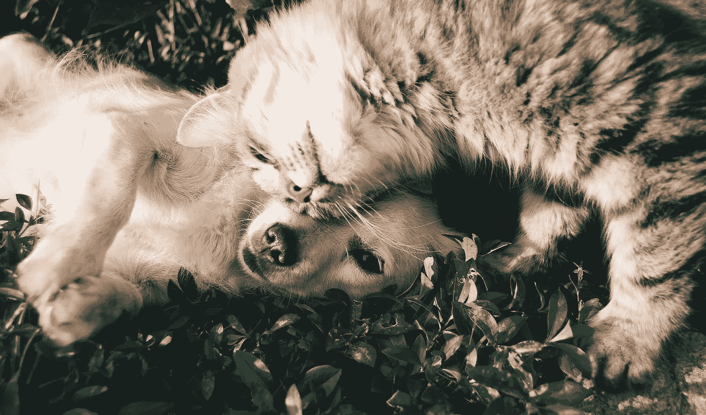
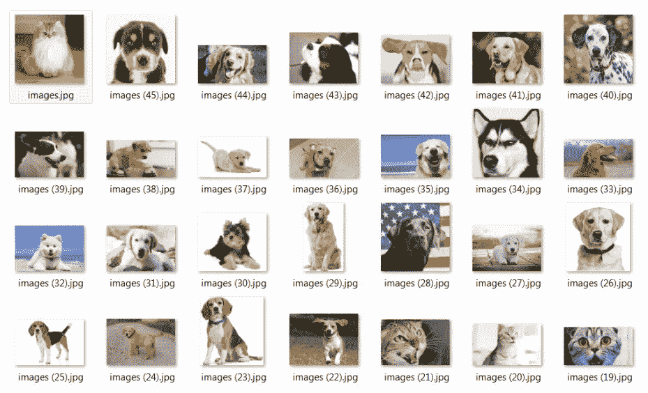
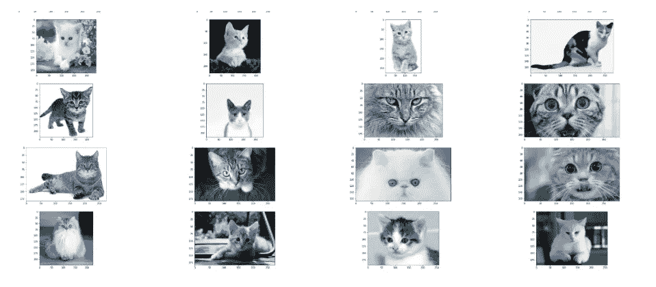
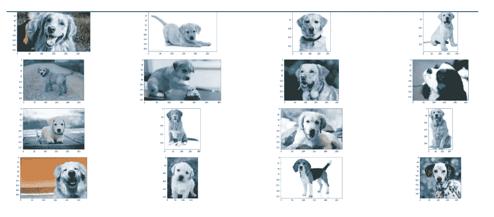
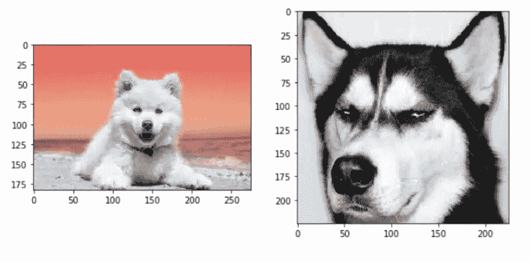
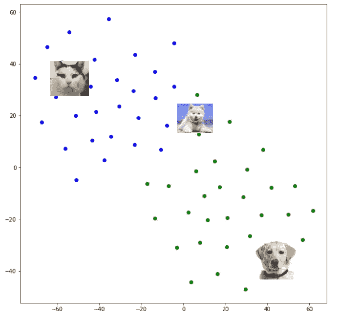

# 基于迁移学习的图像聚类

> 原文：<https://towardsdatascience.com/image-clustering-using-transfer-learning-df5862779571?source=collection_archive---------2----------------------->

## 基于 Resnet50 + Kmeans 的猫狗图像聚类模型！！！！



聚类是无监督机器学习的一个有趣领域，我们将数据集分类到一组相似的组中。这是“无监督学习”含义的一部分，其中没有事先训练发生，数据集将是无标签的。可以使用不同的技术进行聚类，如 K-means 聚类、均值漂移聚类、DB 扫描聚类、层次聚类等。所有聚类算法背后的关键假设是特征空间中的邻近点具有相似的质量，并且它们可以被聚类在一起。

在本文中，我们将对图像进行聚类。图像也与常规 ML 中的数据点相同，可视为类似问题。但是最大的问题是，

定义图像的相似度！！！！！

相似性可以意味着看起来相似的图像，或者可以是相似的尺寸，或者可以是相似的像素分布，相似的背景等。对于不同的用例，我们必须导出特定的图像向量。即，包含图像实体(包含猫或狗)的图像向量将不同于具有像素分布的图像向量。

在这篇文章中，我们将有一组猫和狗的图片。我们会试着把它们聚类成猫照和狗照。为此，我们可以从预先训练的 CNN 模型(如 Resnet50)中导出图像向量。我们可以删除 resnet50 的最后一层，并提取 2048 大小的矢量。一旦我们有了向量，我们就在数据点上应用 KMeans 聚类。

这是我的数据集中的一些图片，大约有 60 张从网上随机抽取的猫狗图片。



# 代码遍历

第一步是加载所需的库并加载预训练的 Resnet50 模型。请记住从模型中移除最后一个 softmax 层。

```
resnet_weights_path = '../input/resnet50/resnet50_weights_tf_dim_ordering_tf_kernels_notop.h5'

my_new_model = Sequential()
my_new_model.add(ResNet50(include_top=False, pooling='avg', weights=resnet_weights_path))

*# Say not to train first layer (ResNet) model. It is already trained*
my_new_model.layers[0].trainable = False
```

一旦我们加载了模型，我们可以有一个函数来加载所有的图像，将图像调整到固定的像素大小(224，224)，通过模型传递它并提取特征集。

```
def extract_vector(path):
    resnet_feature_list = []

    for im in glob.glob(path):

        im = cv2.imread(im)
        im = cv2.resize(im,(224,224))
        img = preprocess_input(np.expand_dims(im.copy(), axis=0))
        resnet_feature = my_new_model.predict(img)
        resnet_feature_np = np.array(resnet_feature)
        resnet_feature_list.append(resnet_feature_np.flatten())

    return np.array(resnet_feature_list)
```

一旦我们有了提取的特征集，我们就可以对数据集进行 KMeans 聚类。K 必须事先确定，或者我们可以画出损失函数与 K 的关系，并推导出它。由于我们知道 K 的值为 2，所以可以直接代入。

```
kmeans = KMeans(n_clusters=2, random_state=0).fit(array)
print(kmeans.labels_)
```

就这些！！！！我们已经完成了图像聚类模型。让我们看看，我们的模型能多好地聚集图像。

以下是与第一组相对应的一些图像:



这是另一个集群:



总体而言，集群性能似乎非常好。在我聚类的 60 个图像中，只有两个图像被错误地聚类。这些图片如下:



上面两只狗被错误的聚类成了猫。可能是 ML 模型觉得它们很像猫。:)

我们可以使用 t-SNE 算法进一步研究图像的分布。这是一种降维算法，其中 2048 图像向量将被降低到更小的维度，以便更好地绘图、存储和时间限制。下面是我得到的 60 个图像数据集的结果。

蓝点代表聚类-1(猫)，绿点代表聚类-2(狗)。请注意，迷你照片不是 t-SNE 的一部分，它只是额外添加的。相交区域可以被认为是模型发现难以恰当地拟合聚类的地方。



# 结论

希望您对使用迁移学习构建一个基本的图像聚类方法有很好的理解。正如我已经说过的，在某些情况下，CNN 输出可能不是图像特征的最佳选择。我们也可以用 bagging 技术考虑 HSV(色调-饱和度-值)来创建向量，其中相似的像素分布是我们的聚类方法。

快乐学习:)