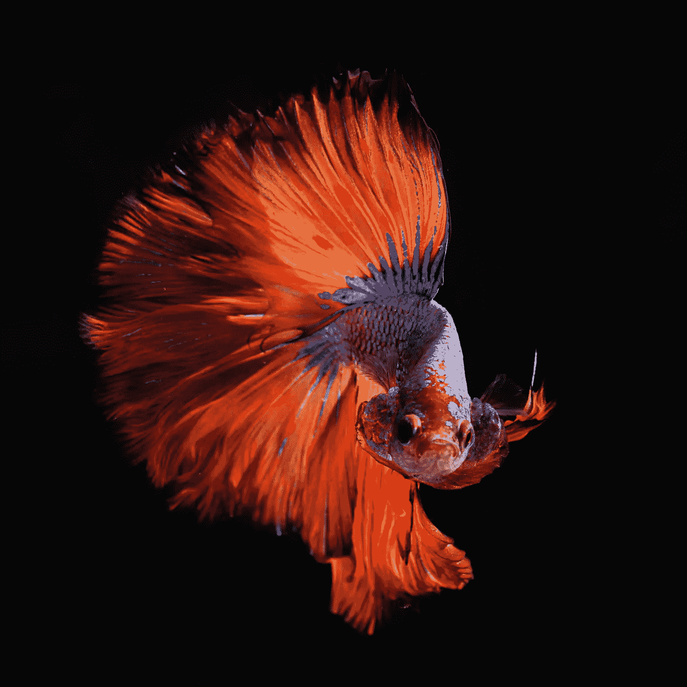
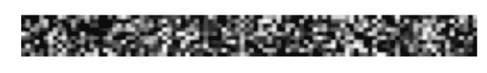
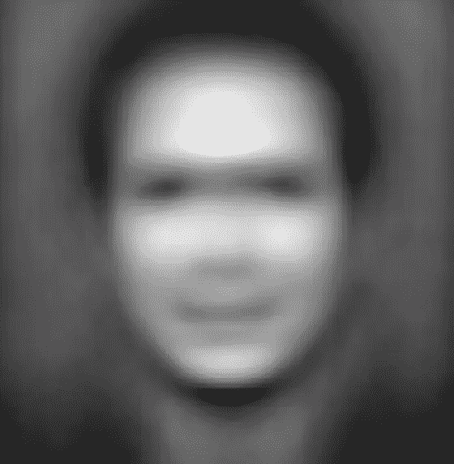
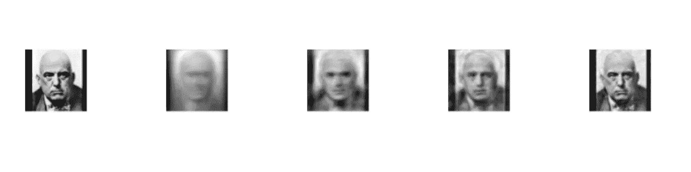
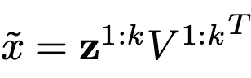

# 无监督学习:10 行 R 代码中的图像压缩

> 原文：<https://towardsdatascience.com/image-compression-in-10-lines-of-r-code-7d7a8578d3bb?source=collection_archive---------27----------------------->

## 机器学习:无监督学习

## 使用主成分分析压缩图像的酷方法


Photo by [Gaetano Cessati](https://unsplash.com/@gaetanocessati?utm_source=unsplash&utm_medium=referral&utm_content=creditCopyText) on [Unsplash](https://unsplash.com/s/photos/image-compress?utm_source=unsplash&utm_medium=referral&utm_content=creditCopyText)

主成分分析(PCA)是一种强大的机器学习工具。作为一种无监督的学习技术，它擅长于降维和特征提取。

> 但是，你知道我们可以用 PCA 来压缩图像吗？

在这篇文章中，我将介绍这个过程，并解释 PCA 如何用 10 行 R 代码压缩图像，最后描述了简单的数学运算。



Photo by [Pietro Jeng](https://unsplash.com/@pietrozj?utm_source=unsplash&utm_medium=referral&utm_content=creditCopyText) on [Unsplash](https://unsplash.com/s/photos/animal?utm_source=unsplash&utm_medium=referral&utm_content=creditCopyText)

**#安装包并加载库**

```
#install.packages(“tidyverse”)
#install.packages(“gbm”)
#install.packages(“e1071”)
#install.packages(“imager”)
library(tidyverse)
library(tree) 
library(randomForest) 
library(gbm) 
library(ROCR) 
library(e1071) 
library(imager)# load the dataset. This is a 100*100*1000 array of data. An array is a generalization of a matrix to more than 2 dimensions. The first two dimensions index the pixels in a 100*100 black and white image of a face; the last dimension is the index for one of 1000 face images. The dataset can be accessed at: [https://cyberextruder.com/face-matching-data-set-download/](https://cyberextruder.com/face-matching-data-set-download/).load(“faces_array.RData”)#PAC requires a single matrix. so, we need to transform the 100*100 matrix into a single vector (10,000). face_mat <- sapply(1:1000, function(i) as.numeric(faces_array[, , i])) %>% t# To visualize the image, we need a matrix. so, let's convert 10000 dimensional vector to a matrix
plot_face <- function(image_vector) { 
 plot(as.cimg(t(matrix(image_vector, ncol=100))), axes=FALSE, asp=1)
 }plot_face(face_mat[, sample(1000, 1)])
```



这里，我们试图获得数据集的基本信息，并构造一个新的函数进行分析。

**#查平均脸**

```
face_average = colMeans(face_mat)plot_face(face_average)
```



很大程度上，我们可以把“平均脸”理解为其他图像的基线。通过在平均脸上加上或减去数值，我们可以得到其他的脸。

**#以上代码不算 10 行的限制。#**

**#这是我们的 10 行代码#**

```
# generate PCA results;
# scale=TRUE and center=TRUE --> mean 0 and variance 1
pr.out = prcomp(face_mat,center=TRUE, scale=FALSE)# pr.out$sdev: the standard deviations of the principal components; 
# (pr.out$sdev)²: variance of the principal components
pr.var=(pr.out$sdev)² # pve: variance explained by the principal component
pve = pr.var/sum(pr.var) # cumulative explained variance
cumulative_pve <-cumsum(pve)**#see the math explanation attached in the end** U = pr.out$rotation
Z = t(pr.out$x)# Let's compress the 232nd face of the dataset and add the average face back and create four other images adopting the first 10,50,100, and 300 columns.
par(mfrow=c(1,5))
plot_face(face_mat[232,])
for (i in c(10,50,100,300))
 {
 plot_face((U[,1:i]%*%Z[1:i,])[,232]+face_average) 
 }
```



我们做到了！成绩还不算太差。最左边是原始图像，后面是四幅压缩图像。

简单的数学解释。

PCA 与矩阵的奇异值分解(SVD)密切相关。所以，**x**= ud(v^t)=**z***(v^t)，

其中 **x** 是的 1000*10000 矩阵，

*   v:特征向量的矩阵(由 prcomp 返回的旋转)
*   d:主成分的标准偏差(由 prcomp 返回的 sdev)
*   所以， **z** = UD(旋转空间中主分量的坐标(prcomp$x))。

换句话说，我们可以使用 V 的前 k 列和 z 的前 k 列来压缩图像:



数学结束。

## 喜欢读这本书吗？

> 请在 [LinkedIn](https://www.linkedin.com/in/leihuaye/) 和 [Twitter](https://twitter.com/leihua_ye) 找到我。
> 
> 查看我关于人工智能和机器学习的其他帖子。

[](/classifying-rare-events-using-five-machine-learning-techniques-fab464573233) [## 使用 5 种机器学习算法对罕见事件进行分类

### 哪一种最适合不平衡数据？有什么权衡吗？

towardsdatascience.com](/classifying-rare-events-using-five-machine-learning-techniques-fab464573233)