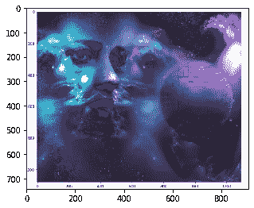
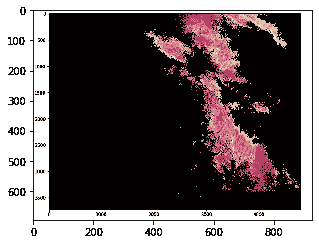
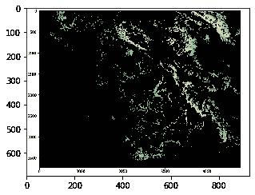

# 使用 Python 进行影像数据分析:

> 原文：<https://towardsdatascience.com/image-data-analysis-using-python-edddfdf128f4?source=collection_archive---------1----------------------->


## 本教程着眼于如何导入图像和观察它的属性，分裂层，还着眼于灰度。

# 内容:

*   简介:关于像素的一点点
*   观察图像的基本属性
*   灰度
*   使用逻辑运算符处理像素值
*   掩饰
*   图像处理


# 简介:关于像素的一点点

计算机将图像存储为微小方块的马赛克。这就像古代艺术形式的瓷砖马赛克，或者今天孩子们玩的熔珠工具。现在，如果这些方形瓷砖太大，就很难做出光滑的边缘和曲线。我们使用越多越小的瓷砖，图像就越平滑，或者说像素化程度越低。这些有时被称为图像的分辨率。

矢量图形是一种有点不同的存储图像的方法，旨在避免像素相关的问题。但即使是矢量图像，最终也显示为像素的马赛克。像素这个词的意思是一个图像元素。描述每个像素的简单方法是使用三种颜色的组合，即红、绿、蓝。这就是我们所说的 RGB 图像。

每张数码形式的照片都是由像素组成的。它们是组成图片的最小信息单位。通常为圆形或方形，它们通常排列成二维网格。

现在，如果这三个值都是最大强度，那就意味着它们是 255。然后它显示为白色，如果三种颜色都被静音，或者值为 0，则颜色显示为黑色。这三者的结合将依次给我们一个特定的像素颜色的阴影。因为每个数字都是 8 位数字，所以值的范围是从 0 到 255。


这三种颜色的组合趋于其中的最高值。因为每个值可以有 256 个不同强度或亮度值，所以总共有 1680 万种色调。

现在让我们加载一个图像，观察它的各种属性。

```
 import imageio
 import matplotlib.pyplot as plt
 %matplotlib inline
 pic = imageio.imread(‘images/me.jpg’)
 plt.figure(figsize = (5,5))
 plt.imshow(pic)
```


# 观察图像的基本属性

```
 print('Type of the image : ' , type(pic)) 
print('Shape of the image : {}'.format(pic.shape)) 
print('Image Hight {}'.format(pic.shape[0])) 
print('Image Width {}'.format(pic.shape[1])) 
print('Dimension of Image {}'.format(pic.ndim)) 
```

输出:

```
 Type of the image :  <class 'imageio.core.util.Array'> 
Shape of the image : (728, 720, 3) 
Image Hight 728 
Image Width 720 
Dimension of Image 3 
```

阵列的形状表明它是一个三层矩阵。这里的前两个数字是长度和宽度，第三个数字(即 3)用于三层:红色、绿色、蓝色。因此，如果我们计算一个 RGB 图像的大小，总的大小将被计算为高 x 宽 x 3

```
 print('Image size {}'.format(pic.size)) 
print('Maximum RGB value in this image {}'.format(pic.max())) print('Minimum RGB value in this image {}'.format(pic.min())) 
```

输出:

```
 Image size 1572480 
Maximum RGB value in this image 255 
Minimum RGB value in this image 0 # A specific pixel located at Row : 100 ; Column : 50  
# Each channel's value of it, gradually R , G , B  
print('Value of only R channel {}'.format(pic[ 100, 50, 0])) print('Value of only G channel {}'.format(pic[ 100, 50, 1])) print('Value of only B channel {}'.format(pic[ 100, 50, 2])) 
```

输出:

```
Value of only R channel 168
Value of only G channel 189
Value of only B channel 182
```

好了，现在让我们快速浏览一下整个图像中的每个通道。

```
plt.title('R channel') 
plt.ylabel('Height {}'.format(pic.shape[0])) 
plt.xlabel('Width {}'.format(pic.shape[1])) 
plt.imshow(pic[ : , : , 0])
plt.show()
```


```
plt.title('G channel')
plt.ylabel('Height {}'.format(pic.shape[0])) 
plt.xlabel('Width {}'.format(pic.shape[1])) 
plt.imshow(pic[ : , : , 1]) 
plt.show()
```


```
plt.title('B channel') 
plt.ylabel('Height {}'.format(pic.shape[0])) 
plt.xlabel('Width {}'.format(pic.shape[1])) 
plt.imshow(pic[ : , : , 2]) 
plt.show()
```


现在，我们还可以改变 RGB 值的数量。作为一个例子，让我们设置红色，绿色，蓝色层的后续行值为全强度。

*   r 通道:第 100 至 110 行
*   g 通道:第 200 至 210 行
*   b 通道:行— 300 至 310

我们将加载图像一次，这样我们可以同时看到每个变化。

```
pic[50:150 , : , 0] = 255 # full intensity to those pixel's R channel 
plt.figure( figsize = (5,5)) 
plt.imshow(pic) 
plt.show()
```


```
pic[200:300 , : , 1] = 255 # full intensity to those pixel's G channel 
plt.figure( figsize = (5,5)) 
plt.imshow(pic) 
plt.show()
```


```
pic[350:450 , : , 2] = 255 # full intensity to those pixel's B channel 
plt.figure( figsize = (5,5)) 
plt.imshow(pic) 
plt.show()
```


为了使它更清楚，让我们改变列部分，这一次我们将同时改变 RGB 通道。

```
# set value 200 of all channels to those pixels which turns them to white 
pic[ 50:450 , 400:600 , [0,1,2] ] = 200  
plt.figure( figsize = (5,5)) 
plt.imshow(pic) 
plt.show()
```


# 拆分层

现在，我们知道图像的每个像素由三个整数表示。将图像分割成单独的颜色分量仅仅是取出图像阵列的正确切片的问题。

```
import numpy as np 
pic = imageio.imread('images/me.jpg') 
fig, ax = plt.subplots(nrows = 1, ncols=3, figsize=(15,5))  
for c, ax in zip(range(3), ax):     
     # create zero matrix        
     split_img = np.zeros(pic.shape, dtype="uint8") 
     # 'dtype' by default: 'numpy.float64'  # assing each channel      
     split_img[ :, :, c] = pic[ :, :, c] # display each channel     
     ax.imshow(split_img)
```


# 灰度

黑白图像存储在二维数组中。有两种类型的黑白图像:

```
- Binary: Pixel is either black or white:0 or 255
- Greyscale: Ranges of shades of grey:0 ~ 255
```

现在，灰度化是一个将图像从全色转换为灰色阴影的过程。例如，在图像处理工具中:在 OpenCV 中，许多函数在处理之前使用灰度图像，这样做是因为它简化了图像，几乎起到了降噪的作用，并增加了处理时间，因为图像中的信息较少。

在 python 中有几种方法可以将图像转换为灰度，但使用 matplotlib 的一种直接方法是使用此公式对原始图像的 RGB 值进行加权平均。

# Y' = 0.299 R + 0.587 G + 0.114 B

```
pic = imageio.imread('images/me.jpg') 
gray = lambda rgb : np.dot(rgb[... , :3] , [0.299 , 0.587, 0.114])   gray = gray(pic) plt.figure( figsize = (5,5))  
plt.imshow(gray, cmap = plt.get_cmap(name = 'gray')) 
plt.show()
```


# 使用逻辑运算符处理像素值

我们可以使用逻辑运算符创建一个相同大小的金块数组。然而，这不会创建任何新的数组，只是将 True 返回给它的主机变量。例如，假设我们想要过滤掉 RGB 图像中的一些低值像素或高值像素或(任何条件),是的，将 RGB 转换为灰度是很好的，但目前，我们不会这样做，而是处理彩色图像。

让我们首先加载一个图像并在屏幕上显示它。

```
pic = imageio.imread('images/logic_op_pic.JPG') 
plt.figure(figsize=(5,5)) 
plt.imshow(pic) 
plt.show()
```


让我们考虑这个转储图像。现在，在任何情况下，我们都要过滤掉所有的像素值，假设低于 20。为此，我们将使用一个逻辑操作符来完成这项任务，我们将为所有索引返回 True 值。

```
low_pixel = pic < 20  
# to ensure of it let's check if all values in low_pixel are True or not 
if low_pixel.any() == True:     
    print(low_pixel.shape)
```

输出:

```
(743, 911, 3)
```

正如我们所说的，主机变量传统上不被使用，但是我引用它是因为它的行为。它只包含真正的值，没有其他内容。所以，如果我们同时看到 low_pixel 和 pic 的形状，我们会发现两者的形状是一样的。

```
print(pic.shape)
print(low_pixel.shape)
```

输出:

```
(743, 911, 3)
(743, 911, 3)
```

我们使用全局比较运算符为所有小于 200 的值生成了低值过滤器。但是，我们可以使用这个 low_pixel 数组作为索引，将那些低值设置为一些特定的值，这些值可能高于或低于前面的像素值。

```
# randomly choose a value 
import random

# load the orginal image

pic = imageio.imread('images/logic_op_pic.JPG')

# set value randomly range from 25 to 225 - these value also randomly choosen
pic[low_pixel] = random.randint(25,225)
# display the image
plt.figure( figsize = (5,5))
plt.imshow(pic)
plt.show()
```



# 掩饰

图像遮罩是一种图像处理技术，用于从具有模糊边缘、透明或毛发部分的照片中移除背景。

现在，我们将创建一个圆盘形状的遮罩。首先，我们将测量从图像中心到每个边界像素值的距离。我们取一个方便的半径值，然后使用逻辑运算符，我们将创建一个圆盘。挺简单的，看看代码吧。

```
# Load the image 
pic = imageio.imread('images/logic_op_pic.JPG')  
# seperate the row and column values  
total_row , total_col , layers = pic.shape  
'''     Create vector.     Ogrid is a compact method of creating a multidimensional     ndarray operations in single lines.     
for ex:     
>>> ogrid[0:5,0:5]     
output: [array([[0],
                [1],
                [2],
                [3],
                [4]]),
         array([[0, 1, 2, 3, 4]])]  
''' 
x , y = np.ogrid[:total_row , :total_col]  
# get the center values of the image 
cen_x , cen_y = total_row/2 , total_col/2 '''    
 Measure distance value from center to each border pixel.     To make it easy, we can think it's like, we draw a line from center-     to each edge pixel value --> s**2 = (Y-y)**2 + (X-x)**2  
''' 
distance_from_the_center = np.sqrt((x-cen_x)**2 + (y-cen_y)**2)  
# Select convenient radius value 
radius = (total_row/2)  
# Using logical operator '>'  
''' 
logical operator to do this task which will return as a value  of True for all the index according to the given condition 
''' 
circular_pic = distance_from_the_center > radius ''' 
let assign value zero for all pixel value that outside the cirular disc. All the pixel value outside the circular disc, will be black now. 
''' pic[circular_pic] = 0 
plt.figure(figsize = (5,5)) 
plt.imshow(pic)  
plt.show()
```


# 图像处理

关于 edX 的 MOOC 课程之一，我们已经介绍了一些卫星图像及其处理系统。这当然是非常有益的。但是，让我们对它进行一些分析

这幅图像有一些有趣的地方。像许多其他可视化一样，每个 RGB 层中的颜色都有一定的含义。例如，红色的强度将指示像素中地理数据点的高度。蓝色的强度表示坡向的度量，绿色表示坡度。这些颜色将有助于以更快、更有效的方式传达这些信息，而不是显示数字。

```
Red pixel indicates: Altitude
Blue pixel indicates: Aspect
Green pixel indicates: Slope
```

仅仅通过看这张彩色的图像，一只训练有素的眼睛就能分辨出高度、坡度和方位。所以，这就是给这些颜色赋予更多意义的想法，以表明一些更科学的东西。

```
# Only Red Pixel value , higher than 180
pic = imageio.imread('images/sat_img.JPG')
red_mask = pic[:, :, 0] < 180
pic[red_mask] = 0
plt.figure(figsize=(5,5))
plt.imshow(pic)

# Only Green Pixel value , higher than 180
pic = imageio.imread('images/sat_img.JPG')
green_mask = pic[:, :, 1] < 180
pic[green_mask] = 0
plt.figure(figsize=(5,5))
plt.imshow(pic)
# Only Blue Pixel value , higher than 180
pic = imageio.imread('images/sat_img.JPG')
blue_mask = pic[:, :, 2] < 180
pic[blue_mask] = 0
plt.figure(figsize=(5,5))
plt.imshow(pic)
# Composite mask using logical_and
pic = imageio.imread('images/sat_img.JPG')
final_mask = np.logical_and(red_mask, green_mask, blue_mask)
pic[final_mask] = 40
plt.figure(figsize=(5,5))
plt.imshow(pic)
```



记住你可以在我的 github 库[这里](https://github.com/Yassine-Hamdaoui/Image-Data-Analysis)找到完整的工作代码。

**感谢**的阅读，我很高兴讨论你可能有的任何问题或纠正:)如果你想讨论机器学习或其他任何问题，请在 [LinkedIn](https://www.linkedin.com/in/yassine-hamdaoui/) 上找到我。