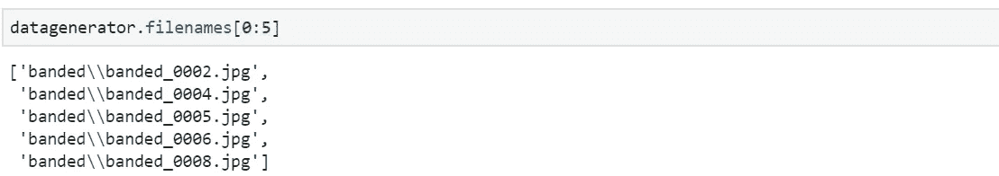

# Keras 中的图像数据生成器

> 原文：<https://towardsdatascience.com/image-data-generators-in-keras-7c5fc6928400?source=collection_archive---------4----------------------->

## 如何有效和高效地使用 Keras 中的数据生成器进行深度学习的计算机视觉应用

我做过学术研究员，目前在业内做研究工程师。到目前为止，我在这两个角色中的经验告诉我，不能过分强调数据生成器对于培训的重要性。从只有 6 万张训练图像的 [MNIST 数据集](http://yann.lecun.com/exdb/mnist/)到拥有超过 1400 万张图像的 ImageNet 数据集[1]，数据生成器将是深度学习训练和推理的无价工具。使用数据生成器的几个主要优势如下:

*   **允许使用多处理:**在多个 CPU 内核上并行化加载过程，以加快进程。
*   **允许你生成批次:**你可以使用更小的数据块通过[批次梯度下降](/gradient-descent-unraveled-3274c895d12d)来训练你的模型。实际上，所有与深度学习相关的真实世界数据集通常都无法一次放入内存，所以大多数时候这是唯一可能的解决方案。
*   **允许您进行数据增强:**不管您的数据是否有限，也不管您是否希望在噪声增强方面增加多样性，您通常都会这样做。通过使用现代 CPU 的多处理能力，数据生成器有助于静态和动态地完成这些工作。
*   **不需要编写样板代码:**大多数深度学习框架都支持他们的数据加载器/数据生成器版本，这减少了您必须编写样板代码来处理批量数据的创建及其并行化增加的时间。这也在代码中引入了一致性和可读性。

在本文中，我将讨论如何使用 Keras[中的数据生成器进行图像处理相关的应用，并分享我在研究期间使用的技术。](https://keras.io/)

## Keras 中的数据生成器[2]

Keras 有适用于不同数据类型的 DataGenerator 类。然而，正如我前面提到的，这篇文章是关于图像的，对于这个数据来说，ImageDataGenerator 是相应的类。

我将使用代码来解释这个过程，因为我相信这会导致更好的理解。我将涉及六个方面。

1.  创建数据生成器
2.  一些有用的数据生成器属性
3.  用于快速正确性测试的可视化数据生成器张量
4.  使用数据生成器进行培训
5.  使用数据生成器进行预测
6.  培训、验证和测试集创建

## 1.创建数据生成器

我们从本教程所需的导入开始。这涉及 ImageDataGenerator 类和其他一些可视化库。

创建生成器包括两个主要步骤。

1.  用必需的参数实例化 ImageDataGenerator 以创建对象
2.  根据数据在磁盘上的存储方式，使用适当的 flow 命令(稍后将详细介绍)。这个命令将允许您动态地生成和访问批量数据。

下面显示了实现上述两个步骤的示例代码。

我们从指定批量大小的第一行代码开始。我们将其设置为 32，这意味着一批图像将有 32 个图像以张量形式堆叠在一起。这个数组的形状应该是(batch_size，image_y，image_x，channels)。这是信道最后的方法，即信道的数量在最后的维度中。

字典中为 ImageDataGenerator 构造函数指定的参数很少。下面将对它们进行解释。[2]

*   **旋转 _ 范围**:整数。随机旋转的度数范围。
*   **height_shift_range** :沿高度方向移动图像。它支持各种输入。对于浮动，如果<为 1，图像将移动总高度的
    部分，或者如果> = 1，图像将移动像素。
*   **width_shift_range** :沿宽度方向移动图像。
*   **重新调整**:重新调整因子。默认为无。如果无或为 0，则不应用重缩放，否则我们将数据乘以所提供的值(在应用所有其他变换之后)。
*   **fill_mode** :为{"constant "、" nearest "、" reflect "或" wrap"}之一。默认值为“最近”。根据给定的模式填充输入边界外的点。

除了上述论点之外，还有其他几个论点。这些允许你在向你的网络提供数据的时候动态地扩充你的数据。有关更多详细信息，请参考文档[2]。

然后，使用 python 关键字参数将这些参数传递给 ImageDataGenerator，我们创建 datagen 对象。下一步是使用这个对象的 flow_from _directory 函数。当您将映像组织到操作系统上的文件夹中时，可以使用这种方法。

目录结构应该如下所示。

Source: From author

数据目录应该为每个类包含一个文件夹，该文件夹与该类以及该特定类的所有训练样本具有相同的名称。在上面的例子中，每个类有 k 个类和 n 个**类。这使得样本总数 **nk** 。虽然每个类可以有不同数量的样本。**

flow_from_directory 函数的参数解释如下。[2]

*   **目录**:字符串，目标目录的路径。每个类应该包含一个子目录。
*   **类**:可选的类子目录列表(如`['dogs', 'cats']`)。如果你只需要直接在中的几个类，只需要把它们指定为一个列表。顺序事项和类别索引按照列表顺序分配。
*   **class_mode** :“分类”、“二元”、“稀疏”、“输入”或无之一。默认:“分类”。这决定了生成器返回的标签类型。
    ‣**‘分类’**用于多个类。标签是一种热编码。
    ‣**‘二进制’**是两个类。
    ‣ **“稀疏”**返回 1D 整数标签
    ‣ **“输入”**这对于自动编码器非常有用，因为您需要输入图像是标签
    ‣ **“无”**将导致生成器不返回任何标签
*   **target_size** :整数元组`(height, width)`，默认:`(256, 256)`。找到的所有图像将被调整到的尺寸。
*   **插值**:如果目标尺寸与加载的图像尺寸不同时，用于对图像重新取样的插值方法。“lanczos”在你缩小图片时很有用。在这个例子中，这就是我使用“lanczos”的原因。

在本教程中，我使用的是可描述的纹理数据集[3]，它可以在[这里](https://www.robots.ox.ac.uk/~vgg/data/dtd/)找到。它包含 47 节课，每节课 120 个例子。所有的图像都有不同的尺寸。flow_from_directory 的 target_size 参数允许您创建大小相等的批。如果数据集包含不同大小的图像，这将非常方便。

## 2.一些有用的数据生成器属性

接下来，我们看看我们刚刚创建的数据生成器的一些有用的属性和函数。“样本”给出了数据集中可用图像的总数。' class _ indices '给出了类名到整数映射的字典。这些是非常重要的，因为当你做预测的时候你会需要这个。因为当你做预测时，你将得到类别号，除非你知道映射，否则你将不能区分哪个是哪个。

Source: From author

Source: From author

“文件名”给出了目录中所有文件名的列表。如果您想要分析模型在几个选定样本上的性能，或者想要将输出概率直接分配给样本，这将非常有用。

Source: From author

datagenerator 对象是一个 python 生成器，在每一步都生成(x，y)对。在 python 中，应用于生成器的 next()从生成器生成一个样本。

Source: From author

正如所料,( x，y)都是 numpy 数组。图像批次是具有(128，128，3)维的 32 个样本的 4d 阵列。标签是一个具有(32，47)形状的热编码矢量。一种热编码意味着将类别号编码为长度等于类别数的向量。除了样本所属的类别之外，所有类别的向量都为零。因此，对于一个三类数据集，来自类 2 的样本的一个热向量将是[0，1，0]。

## 3.用于快速正确性测试的可视化数据生成器张量

因为我们现在有了一个批次和它的标签，我们将观察并检查是否一切都如预期的那样。

我已经编写了一个网格绘图实用函数，它可以绘制整洁的图像网格，并有助于可视化。它接受输入 **image_list** 作为图像列表或 numpy 数组。 **nrows** 和 **ncols** 分别是结果网格的行和列。

下面显示了一个可视化示例。

Source: [https://www.robots.ox.ac.uk/~vgg/data/dtd/](https://www.robots.ox.ac.uk/~vgg/data/dtd/)

我们看到图像如预期的那样随机旋转，并且填充是最近的，它重复有效帧中最近的像素值。图像也在水平和垂直方向上随机移动。它们都被调整到(128，128)的大小，并且它们保留它们的颜色值，因为颜色模式是“rgb”。

在这个阶段，你应该观察几个批次，确保样品看起来像你想要的样子。转换工作正常，没有任何不希望的结果。例如，如果对包含手写数字的 MNIST 数据集应用垂直翻转，9 将变成 6，反之亦然。这将损害训练，因为即使对于正确的预测，模型也会受到惩罚。

接下来，让我们比较一下与原始图像相比，图像批次是如何出现的。为此，我们将 shuffle 设置为 False，并创建另一个生成器。这允许我们将文件名映射到由数据生成器生成的批处理。datagenerators 有一个 reset()方法，可以将它重置为第一批。因此，每当您想要将模型输出与文件名相关联时，您需要将 shuffle 设置为 False，并在执行任何预测之前重置数据生成器。这将确保我们的文件被正确读取，并且没有任何错误。

Source: From author

我们可以看到原始图像具有不同的大小和方向。我们批量获得增强图像。

## 4.使用数据生成器进行培训

接下来，让我们继续讨论如何使用数据生成器来训练模型。这就是 Keras 的亮点，它提供了这些训练抽象，可以让你快速训练你的模型。这对快速成型非常有利。并且训练样本将使用多处理(如果启用的话)动态生成，从而使训练更快。

我将解释所使用的论点。[2]

*   **steps_per_epoch** :整数。在宣布一个时期结束并开始下一个时期之前，从`generator`开始产生的总步骤数(样品批次)。它通常应该等于`ceil(num_samples / batch_size). This ensures that the model sees all the examples once per epoch.`
*   **历元**:整数。训练模型的时期数。按照`steps_per_epoch`的定义，一个历元是对所提供的全部数据的迭代。
*   **工人**:整数。使用基于进程的线程时要加速运行的最大进程数。如果未指定，`workers`将默认为 1。如果为 0，将在主线程上执行生成器。
*   **使用 _ 多重处理**:布尔型。如果`True`，使用基于进程的线程。如果未指定，`use_multiprocessing`将默认为`False`。注意，因为这个实现依赖于多重处理，所以您不应该将不可选择的参数传递给生成器，因为它们不容易传递给子进程。
*   **验证 _ 数据**:这可以是下面的:
    ‣验证数据的生成器或对象`Sequence`
    ‣元组`(x_val, y_val)` ‣元组`(x_val, y_val, val_sample_weights)`在每个时期结束时在其上评估损失和任何模型度量。该模型不会根据此数据进行训练。
*   **验证 _ 步骤**:仅当`validation_data`为发电机时相关。在每个时期结束时停止之前，从`validation_data`发生器产生的总步骤数(样品批次)。它通常应等于认证数据集的样本数除以批次大小。`Sequence`可选:如果未指定，将使用`len(validation_data)`作为多个步骤。

workers 和 use_multiprocessing 函数允许您使用多重处理。一次只指定其中一个。请记住将该值设置为 CPU 上的核心数，否则如果您指定一个更高的值，将会导致性能下降。

## 5.使用数据生成器进行预测

Keras 使得使用数据生成器进行预测变得非常简单和直接。

它有相同的多重处理参数可用。

## 6.培训、验证和测试集创建

本文最后一部分将集中在训练、验证和测试集创建上。这可以通过两种不同的方式实现。

1.  **第一种方法是创建三个独立的目录，并创建三个不同的数据生成器。**关于如何以可重复的方式进行分割，请参考【4】。这是一个简单的选择，因为你知道训练集、val 集和测试集中有哪些样本。
2.  **第二种方法是在 ImageDataGenerator 构造函数中使用“validation_split”参数。**仅当每个类别有一个包含训练和验证样本的文件夹，而不是有两个不同的目录时，才使用此参数。但是在这种情况下，您仍然有一个单独的测试集目录。此外，您必须为 flow_from_directory 函数使用 subset 参数。这些论点解释如下。
    ‣ **验证 _ 拆分**:浮点。保留用于验证的图像比例(严格介于 0 和 1 之间)。因此，如果使用值 0.2，那么将为验证集保留 20%的样本，为训练集保留剩余的 80%。
    ‣ **子集**:如果`ImageDataGenerator`中设置了`validation_split`，则为数据的子集(`"training"`或`"validation"`

第二种方法的代码如下所示，因为第一种方法很简单，已经在第 1 节中介绍过了。

Source: From author

由于我将 validation_split 值指定为 0.2，因此 20%的样本(即 1128 幅图像)被分配给验证生成器。训练和验证生成器是在 flow_from_directory 函数中用 subset 参数标识的。

关于 Keras 中数据生成器的教程到此结束。希望到现在为止，您已经对 Keras 中的数据生成器有了更深的理解，为什么这些很重要，以及如何有效地使用它们。

我已经在下面的库中提供了代码。

[https://github.com/msminhas93/KerasImageDatagenTutorial](https://github.com/msminhas93/KerasImageDatagenTutorial)

如果您发现任何错误或面临任何困难，请不要犹豫，通过 LinkedIn 或 GitHub 与我联系。

感谢您阅读帖子。快乐学习！

## 参考

[1][ImageNet(image-net.org)](http://image-net.org/about-stats)

[2][https://keras.io/preprocessing/image/](https://keras.io/preprocessing/image/)

[https://www.robots.ox.ac.uk/~vgg/data/dtd/](https://www.robots.ox.ac.uk/~vgg/data/dtd/)

[https://cs230.stanford.edu/blog/split/](https://cs230.stanford.edu/blog/split/)