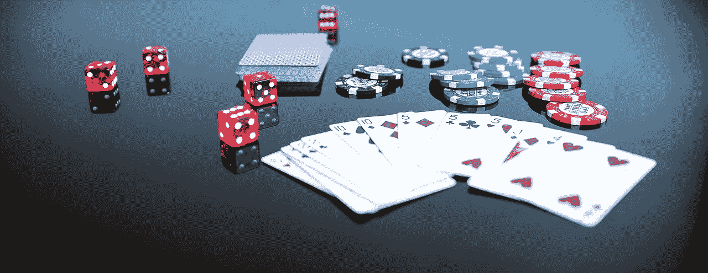
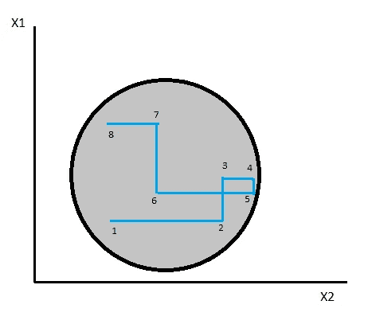
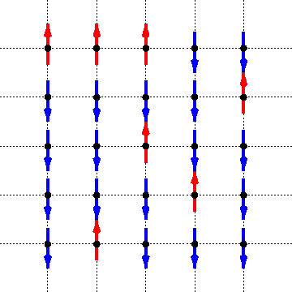
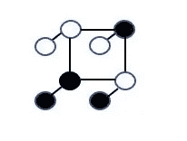
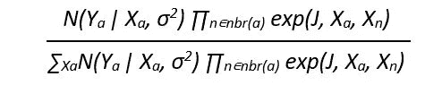
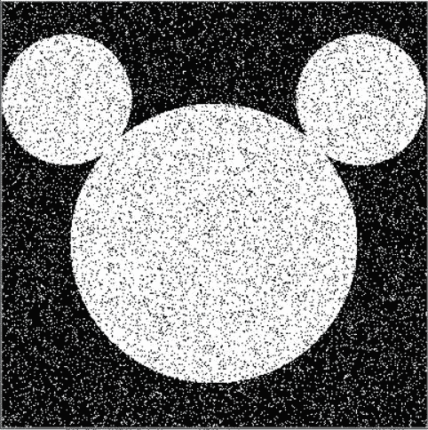
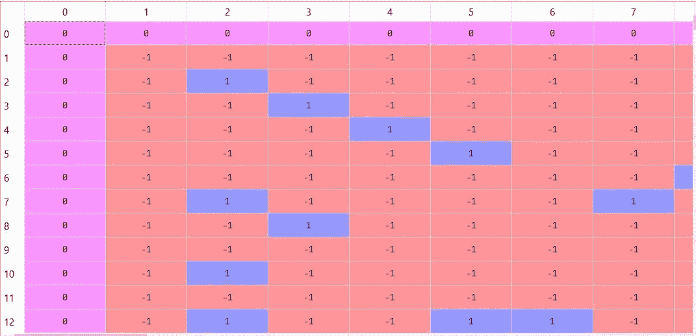
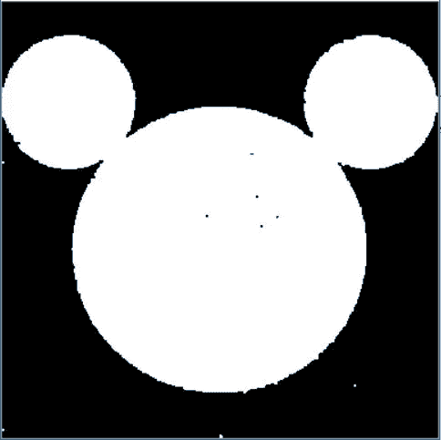

# 基于 MCMC 的图像去噪

> 原文：<https://towardsdatascience.com/image-denoising-by-mcmc-fc97adeaba9b?source=collection_archive---------27----------------------->

## 用马尔可夫链蒙特卡罗结合伊辛模型清除噪声二值图像



在这篇文章中，我将演示使用马尔可夫链蒙特卡罗去噪二值图像。

马尔可夫链蒙特卡罗(简称 MCMC)是指一类通过抽样来估计概率分布的技术。基于用于绘制样本的方法，构成 MCMC 的各种技术彼此不同。一些更著名的 MCMC 技术是 Metropolis-Hastings、Gibbs 抽样和 Hamiltonian 蒙特卡罗。我将使用的技术是吉布斯抽样。

Gibbs 抽样是在所有其他变量保持不变的情况下，从多元分布中进行抽样的一种方法。

例如，如果分布只有两个变量 x1 和 x2，则抽样如下:



Example distribution

它从点 1 开始，然后当要对第二个点进行采样时，它是这样的:

P(x2|x1)，它在与 x1 相同的行上寻找下一个样本(保持不变)

随后第三个点采样如下:

P(x1|x2)，它在与 x2 相同的线上寻找下一个样本(保持不变)

依此类推，采样过程针对设定数量的点继续进行，从而允许其遍历整个空间。



Ising Model

伊辛模型是对应于用于模拟相变的正方形晶格的数学模型。晶格中的每个元素可以以两种离散状态存在，可以用+1 和-1 来表示。每个元素对其所有相邻元素施加影响，并试图达到一种平衡状态，在这种状态下，所有元素都以相同的状态存在。

# **应用:**



Conceptualized model of image

二进制图像可以被认为是格子的形式，每个像素代表一个元素。根据像素的颜色，像素的状态可以表示为 1 或-1。图像可以想象为由两层组成，下面的层代表真实的图像，上面的层代表噪声。高斯噪声被称为叠加在图像上，它在某些地方与实际图像匹配，而在某些地方取相反的值。

伊辛模型被应用于由噪声组成的上述层。噪声受每个相邻噪声的影响取决于它们之间的紧密程度，由边缘电位表示。他们越是紧密地联系在一起，就越是试图处于同一种状态。边缘电位的公式由下式给出:

> *exp(J，X* ₐ *，X* ₙ *)*

这里 J 是耦合常数，它表示邻居之间的联系有多紧密。Xₐ代表考虑中的像素，Xₙ代表其邻居的观察值。

高斯观察模型用于模拟噪声和预先存在的像素之间的关系。噪声被认为是实际基础像素值的函数，也是与其标准偏差的函数。它可以表示为:

> N(Yₐ | Xₐ，σ)

这里，Yₐ代表像素的观察值，Xₐ代表考虑中的像素，σ代表标准差。

正是这两种力量的相互作用决定了像素的最终值。耦合常数试图保持所有相邻像素(噪声)处于相同的状态或颜色。高斯模型试图将像素的实际颜色与观察到的颜色(噪声)相匹配。这两种力的影响可以通过改变 J 和σ的值来控制。

所应用的吉布斯采样将根据其所有邻居和基础真值对每个像素进行采样。然后，它会修正这个值，继续处理下一个元素，并重复相同的操作。当它遍历完整个网格时，一次迭代就完成了。根据迭代次数，最终图像质量可能会有所不同。



Xₐ所考虑的像素可以取值+1 或-1。上面的表达式给出了 Xₐ取值+1 或-1 的可能性。

分子给出 Xₐ为例如+1 的可能性，并检查其与像素 Yₐ的观察值以及与其邻居 Xₙ.的观察值的关系

它除以分别取值为+1 和-1 的可能性之和，得出 Xₐ实际值为+1 的概率。

**代码:**

代码的目的是从损坏的图像中恢复原始图像。



Corrupted image

```
import numpy as np
import cv2 
import random 
import scipy
from scipy.spatial import distance
from scipy.stats import multivariate_normal
import pandas as pd
from PIL import Imagedata = Image.open('noise_img.png')
image = np.asarray(data).astype(np.float32)
```

图像以二维数组的形式导入并保存，其中包含像素的灰度值。为了便于操作，这个图像被转换成一个数组。

然后通过将所有 0(对应黑色)替换为-1，将所有 255(对应白色)替换为+1，将其转换为伊辛模型。数组的所有边都用 0 填充，以使在网格上迭代的任务更容易。

```
#Convert image values to ising model
for i in range(len(image)):
    for j in range(len(image[0])):
        if image[i,j,:] == 255:
            image[i,j,:] = 1
        else:
            image[i,j,:] = -1#Create array to perform operations on
ising = np.zeros((len(image)+2,len(image[0])+2))for i in range(len(image)):
    for j in range(len(image[0])):
        ising[i+1,j+1] = image[i,j,:]
```



Image array

第一行和第一列是填充。其余的行和列分别对应于一个像素的颜色。行号和列号对应于像素的位置，单元值对应于颜色。

在开始吉布斯采样之前，为耦合强度设置一个值。

```
#Coupling strength
J=4#Gibbs sampling 
for n in range(3):
    for i in range(1,len(ising[0])-1):
        for j in range(1,len(ising)-1):
            pot = []
            for x in [-1, 1]:
                edge_pot = np.exp(J*ising[j-1,i]*x) * np.exp(J*ising[j,i-1]*x) * np.exp(J*ising[j+1,i]*x) * np.exp(J*ising[j,i+1]*x)
                pot.append(edge_pot)
            prob1 = multivariate_normal.pdf(image[j-1,i-1,:], mean = 1, cov = 1)*pot[1]/(multivariate_normal.pdf(image[j-1,i-1,:], mean = 1, cov = 1)*pot[1] + multivariate_normal.pdf(image[j-1,i-1,:], mean = -1, cov = 1)*pot[0]) 
            if np.random.uniform() <= prob1:
                ising[j,i] = 1
            else:
                ising[j,i] = -1
```

迭代原始数组中除零以外的所有值。通过检查原始颜色为+1 或-1 的可能性，对每个点进行采样。对于这两种情况，都计算了与其邻居的边缘电势。与边缘电位一起，观察值的可能性是相对于真实值+1 或-1 计算的。

基于以上两个值，像素为+1 的可能性通过将其除以像素为+1 和-1 的可能性来计算。

然后将该值与从标准正态分布中随机抽取的值进行比较。如果原始值为+1 的概率较高，则该值被设置为+1，否则被设置为-1。

当下一个元素被采样时，它在计算边沿电位时采用上述元素的新值。这段代码遍历整个点阵的每个元素三次。

```
#Retrieving the final array
final = np.zeros((len(image),len(image[0])))
final = ising[1:len(ising)-1,1:len(ising[0])-1]#Converting it back to image
for i in range(len(final[0])):
    for j in range(len(final)):
        if final[j,i] == 1:
            final[j,i] = 255
        else:
            final[j,i] = 0
```

然后移除填充，然后将值转换回灰度值，然后可视化。



Cleaned image

最后，我们有去噪的图像。

你也可以通过 LinkedIn 与我联系。