# Python 中的图像过滤器

> 原文：<https://towardsdatascience.com/image-filters-in-python-26ee938e57d2?source=collection_archive---------2----------------------->

我目前正在从事一个计算机视觉项目，我想研究图像预处理，以帮助改进我计划建立的机器学习模型。图像预处理包括对图像应用图像过滤器。本文将比较一些最著名的图像过滤器。

图像过滤器可用于减少图像中的噪声量并增强图像的边缘。图像中可能存在两种类型的噪声:斑点噪声和椒盐噪声。斑点噪声是在图像采集期间出现的噪声，而椒盐噪声(指稀疏出现的白色和黑色像素)是由图像信号中的突然干扰引起的。增强图像的边缘可以帮助模型检测图像的特征。

图像预处理步骤可以提高机器学习模型的准确性。当与在未经预处理的图像上训练的更复杂的模型相比时，预处理的图像可以帮助基本模型实现高精度。对于 Python，Open-CV 和 PIL 包允许你应用几个数字滤波器。应用数字滤波器需要将图像与内核(一个小矩阵)进行卷积。内核是一个*n×n*的方阵，其中 *n* 是奇数。内核依赖于数字滤波器。图 1 显示了用于 3 x 3 均值滤波器的内核。来自 http://kdef.se/ KDEF 数据集的一幅图像(可以在这里找到:)将用于数字滤波器示例。

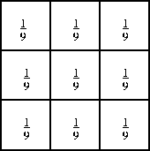

Figure 1: A 3 x 3 mean filter kernel

# 1.均值滤波器

均值滤波器用于模糊图像，以消除噪声。它包括确定一个*n×n*内核中像素值的平均值。然后，中心元素的像素强度由平均值代替。这消除了图像中的一些噪声，并平滑了图像的边缘。Open-CV 库中的模糊函数可用于对图像应用均值滤镜。

当处理彩色图像时，首先需要从 RGB 转换到 HSV，因为 RGB 的维度相互依赖，而 HSV 中的三个维度相互独立(这允许我们分别对三个维度中的每一个应用过滤器。)

以下是均值过滤器的 python 实现:

```
import numpy as npimport cv2from matplotlib import pyplot as pltfrom PIL import Image, ImageFilter%matplotlib inlineimage = cv2.imread('AM04NES.JPG') # reads the imageimage = cv2.cvtColor(image, cv2.COLOR_BGR2HSV) # convert to HSVfigure_size = 9 # the dimension of the x and y axis of the kernal.new_image = cv2.blur(image,(figure_size, figure_size))plt.figure(figsize=(11,6))plt.subplot(121), plt.imshow(cv2.cvtColor(image, cv2.COLOR_HSV2RGB)),plt.title('Original')plt.xticks([]), plt.yticks([])plt.subplot(122), plt.imshow(cv2.cvtColor(new_image, cv2.COLOR_HSV2RGB)),plt.title('Mean filter')plt.xticks([]), plt.yticks([])plt.show()
```

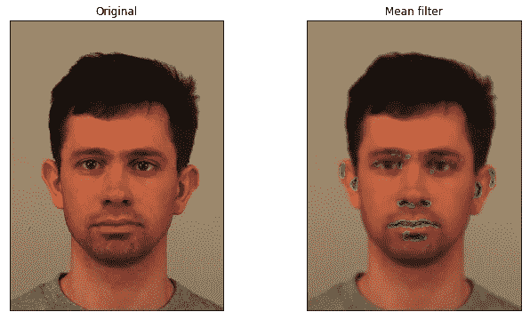

Figure 2: The result of applying a mean filter to a color image

图 2 显示，虽然一些散斑噪声已经减少，但是图像中现在存在许多以前不存在的伪像。我们可以检查在对灰度图像应用均值滤波时是否产生了任何伪像。

```
# The image will first be converted to grayscale
image2 = cv2.cvtColor(image, cv2.COLOR_HSV2BGR)image2 = cv2.cvtColor(image2, cv2.COLOR_BGR2GRAY)figure_size = 9new_image = cv2.blur(image2,(figure_size, figure_size))plt.figure(figsize=(11,6))plt.subplot(121), plt.imshow(image2, cmap='gray'),plt.title('Original')plt.xticks([]), plt.yticks([])plt.subplot(122), plt.imshow(new_image, cmap='gray'),plt.title('Mean filter')plt.xticks([]), plt.yticks([])plt.show()
```


Figure 3: The result of applying a mean filter to a grayscale image

图 3 显示均值滤波去除了一些噪声，并且不会为灰度图像产生伪像。然而，一些细节已经丢失。

# 2.高斯滤波器

高斯滤波器类似于均值滤波器，但是它涉及周围像素的加权平均，并且具有参数σ。核表示高斯分布的离散近似。虽然高斯滤波器会模糊图像的边缘(像均值滤波器一样)，但它在保留边缘方面比类似大小的均值滤波器做得更好。Open-CV 软件包中的“GaussianBlur”函数可用于实现高斯滤波器。该函数允许您指定内核的形状。您也可以分别指定 x 和 y 方向的标准偏差。如果只指定了一个西格玛值，那么它被认为是 x 和 y 方向的西格玛值。

```
new_image = cv2.GaussianBlur(image, (figure_size, figure_size),0)plt.figure(figsize=(11,6))plt.subplot(121), plt.imshow(cv2.cvtColor(image, cv2.COLOR_HSV2RGB)),plt.title('Original')plt.xticks([]), plt.yticks([])plt.subplot(122), plt.imshow(cv2.cvtColor(new_image, cv2.COLOR_HSV2RGB)),plt.title('Gaussian Filter')plt.xticks([]), plt.yticks([])plt.show()
```

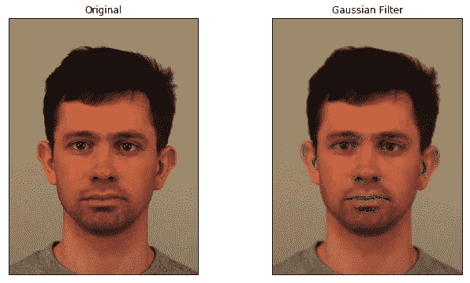

Figure 4: The result of applying a Gaussian filter to a color image

图 4 显示，与均值滤波器相比，高斯滤波器在保留图像边缘方面做得更好，但是它也会在彩色图像上产生伪像。我们现在可以检查高斯滤波器是否会在灰度图像上产生伪像。

```
new_image_gauss = cv2.GaussianBlur(image2, (figure_size, figure_size),0)plt.figure(figsize=(11,6))plt.subplot(121), plt.imshow(image2, cmap='gray'),plt.title('Original')plt.xticks([]), plt.yticks([])plt.subplot(122), plt.imshow(new_image_gauss, cmap='gray'),plt.title('Gaussian Filter')plt.xticks([]), plt.yticks([])plt.show()
```


Figure 5: The result of applying a Gaussian filter to a grayscale image

图 5 显示 9 x 9 高斯滤波器应用于灰度图像时不会产生伪像。该滤波器可以保留比 9 x 9 均值滤波器更多的细节，并去除一些噪声。

# 3.中值滤波器

中值滤波器计算在 *n x n* 内核中围绕中心像素的像素亮度的中值。然后，中值替换中心像素的像素强度。与均值和高斯滤波器相比，中值滤波器在去除椒盐噪声方面做得更好。中值滤波器保留了图像的边缘，但它不处理斑点噪声。Open-CV 库中的“medianBlur”函数可用于实现中值滤波器。

```
new_image = cv2.medianBlur(image, figure_size)plt.figure(figsize=(11,6))plt.subplot(121), plt.imshow(cv2.cvtColor(image, cv2.COLOR_HSV2RGB)),plt.title('Original')plt.xticks([]), plt.yticks([])plt.subplot(122), plt.imshow(cv2.cvtColor(new_image, cv2.COLOR_HSV2RGB)),plt.title('Median Filter')plt.xticks([]), plt.yticks([])plt.show()
```

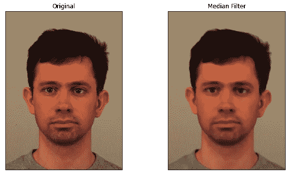

Figure 6: The result of applying a median filter to a color image.

图 6 显示中值滤波器能够保留图像的边缘，同时消除椒盐噪声。与均值和高斯滤波器不同，中值滤波器不会在彩色图像上产生伪像。中值滤波器现在将应用于灰度图像。

```
new_image = cv2.medianBlur(image2, figure_size)plt.figure(figsize=(11,6))plt.subplot(121), plt.imshow(image2, cmap='gray'),plt.title('Original')plt.xticks([]), plt.yticks([])plt.subplot(122), plt.imshow(new_image, cmap='gray'),plt.title('Median Filter')plt.xticks([]), plt.yticks([])plt.show()
```

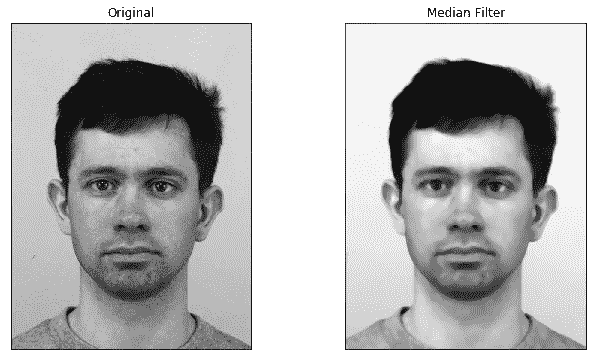

Figure 7: The result of applying the median filter to a grayscale image

图 7 显示 9 x 9 中值滤波器可以去除一些椒盐噪声，同时保留图像的边缘。

# 其他过滤器:

以下是几个可用于图像预处理的过滤器:

# 保守滤波器

保守滤波器用于去除椒盐噪声。确定像素邻域内的最小强度和最大强度。如果中心像素的亮度大于最大值，它将被最大值取代。如果它小于最小值，则用最小值代替。保守滤波器保留边缘，但不去除斑点噪声。

以下代码可用于定义保守过滤器:

```
# first a conservative filter for grayscale images will be defined.def conservative_smoothing_gray(data, filter_size):temp = []

    indexer = filter_size // 2

    new_image = data.copy()

    nrow, ncol = data.shape

    for i in range(nrow):

        for j in range(ncol):

            for k in range(i-indexer, i+indexer+1):

                for m in range(j-indexer, j+indexer+1):

                    if (k > -1) and (k < nrow):

                        if (m > -1) and (m < ncol):

                            temp.append(data[k,m])

            temp.remove(data[i,j])

            max_value = max(temp)

            min_value = min(temp)

            if data[i,j] > max_value:

                new_image[i,j] = max_value

            elif data[i,j] < min_value:

                new_image[i,j] = min_value

            temp =[]

    return new_image.copy()
```

现在保守滤波器可以应用于灰度图像:

```
new_image = conservative_smoothing_gray(image2,5)plt.figure(figsize=(11,6))plt.subplot(121), plt.imshow(image2, cmap='gray'),plt.title('Original')plt.xticks([]), plt.yticks([])plt.subplot(122), plt.imshow(new_image, cmap='gray'),plt.title('Conservative Smoothing')plt.xticks([]), plt.yticks([])plt.show()
```

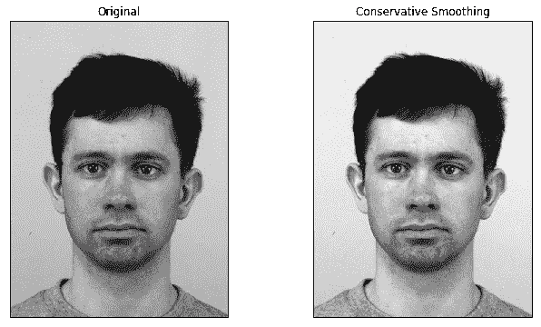

Figure 9: The result of applying the conservative smoothing filter to a grayscale image

图 9 显示保守平滑滤波器能够消除一些椒盐噪声。它还表明，该滤波器不能像中值滤波器那样去除那么多的椒盐噪声(尽管它确实保留了更多的细节)。)

# 拉普拉斯滤波器

图像的拉普拉斯算子突出了强度快速变化的区域，因此可以用于边缘检测。如果我们让 *I(x，y)* 表示图像的强度，则图像的拉普拉斯由以下公式给出:

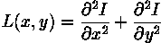

特定像素处的拉普拉斯算子的离散近似可以通过取该像素的小邻域中的像素强度的加权平均值来确定。图 10 示出了代表近似拉普拉斯算子的两种不同方式的两个核。

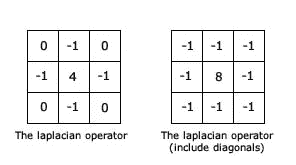

Figure 10: Two kernels used to approximate the Laplacian

因为拉普拉斯滤波器检测图像的边缘，所以它可以与高斯滤波器一起使用，以便首先去除斑点噪声，然后突出图像的边缘。这种方法被称为高斯滤波的拉普拉斯算子。Open-CV 库中的“拉普拉斯”函数可用于查找图像的拉普拉斯。

```
new_image = cv2.Laplacian(image2,cv2.CV_64F)plt.figure(figsize=(11,6))plt.subplot(131), plt.imshow(image2, cmap='gray'),plt.title('Original')plt.xticks([]), plt.yticks([])plt.subplot(132), plt.imshow(new_image, cmap='gray'),plt.title('Laplacian')plt.xticks([]), plt.yticks([])plt.subplot(133), plt.imshow(image2 + new_image, cmap='gray'),plt.title('Resulting image')plt.xticks([]), plt.yticks([])plt.show()
```

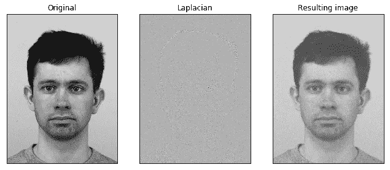

Figure 11: The result of adding the Laplacian of an image to the original image

图 11 示出了虽然将图像的拉普拉斯算子添加到原始图像可以增强边缘，但是一些噪声也被增强。

# 频率滤波器

当对图像应用频率滤波器时，重要的是首先将图像转换成图像的频域表示。傅立叶变换(将函数分解成正弦和余弦分量)可以应用于图像，以获得其频域表示。我们对图像的频域表示感兴趣的原因是，在频域中对图像应用频率滤波器比在空间域中应用滤波器成本更低。这是因为频域表示中的每个像素对应于图像的频率而不是位置。

低通滤波器和高通滤波器都是频率滤波器。低通滤波器保留最低频率(低于阈值)，这意味着它模糊了边缘，并在空间域中从图像中去除了斑点噪声。高通滤波器保留高频，这意味着它保留边缘。“dft”函数确定图像的离散傅立叶变换。对于*N×N*图像，二维离散傅立叶变换由下式给出:

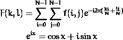

其中 F 是空间域中的图像值，F 是频域中的图像值。以下是离散傅里叶逆变换(将图像从频域转换到空间域)的公式:

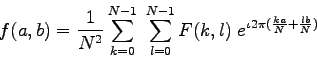

一旦对图像应用了频率滤波器，就可以使用傅立叶逆变换将图像转换回空间域。现在将给出低通滤波器的 python 实现:

```
dft = cv2.dft(np.float32(image2),flags = cv2.DFT_COMPLEX_OUTPUT)# shift the zero-frequncy component to the center of the spectrum
dft_shift = np.fft.fftshift(dft)# save image of the image in the fourier domain.
magnitude_spectrum = 20*np.log(cv2.magnitude(dft_shift[:,:,0],dft_shift[:,:,1]))# plot both imagesplt.figure(figsize=(11,6))plt.subplot(121),plt.imshow(image2, cmap = 'gray')plt.title('Input Image'), plt.xticks([]), plt.yticks([])plt.subplot(122),plt.imshow(magnitude_spectrum, cmap = 'gray')plt.title('Magnitude Spectrum'), plt.xticks([]), plt.yticks([])plt.show()
```

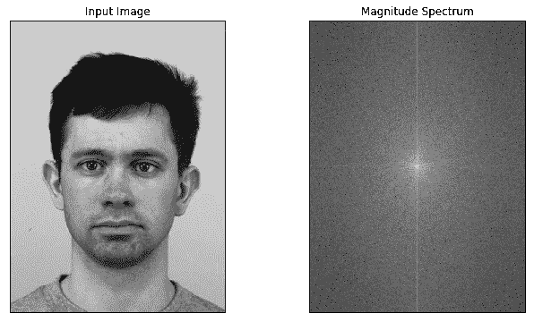

Figure 12: An image’s spatial domain and frequency domain representations

```
rows, cols = image2.shapecrow,ccol = rows//2 , cols//2# create a mask first, center square is 1, remaining all zerosmask = np.zeros((rows,cols,2),np.uint8)mask[crow-30:crow+30, ccol-30:ccol+30] = 1# apply mask and inverse DFTfshift = dft_shift*maskf_ishift = np.fft.ifftshift(fshift)img_back = cv2.idft(f_ishift)img_back = cv2.magnitude(img_back[:,:,0],img_back[:,:,1])# plot both imagesplt.figure(figsize=(11,6))plt.subplot(121),plt.imshow(image2, cmap = 'gray')plt.title('Input Image'), plt.xticks([]), plt.yticks([])plt.subplot(122),plt.imshow(img_back, cmap = 'gray')plt.title('Low Pass Filter'), plt.xticks([]), plt.yticks([])plt.show()
```

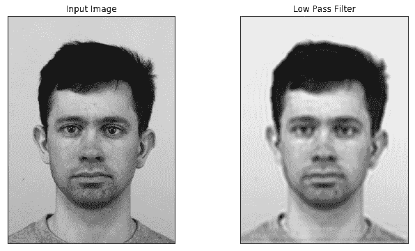

Figure 13: The result of applying a low pass filter to an image.

图 13 显示丢失了相当多的细节，但是去除了一些斑点噪声。

# Crimmins 斑点去除

Crimmins 互补剔除算法用于去除斑点噪声和平滑边缘。它还降低了椒盐噪声的强度。该算法将图像中一个像素的亮度与其 8 个相邻像素的亮度进行比较。该算法考虑了 4 组邻居(南北、东西、西北-东南、东北-西南。)设 *a，b* ， *c* 为三个连续像素(例如从 E-S)。那么算法就是:

1.  对于每次迭代:
    a)暗像素调整:对于四个方向中的每一个方向
    1)处理整个图像:如果 *a* ≥ *b* + *2* 则*b*=*b*+*1*
    2)处理整个图像:如果 *a > b* 和 *b ≤ c* 则 处理整幅图像用:如果 *c > b* 和 *b ≤ a* 则*b*=*b*+*1*
    4)处理整幅图像用:如果*c*≥*b*+*2*则 *b* = *b* + *处理整幅图像用:如果 *a* ≤ *b — 2* 那么*b*=*b*—*1*
    2)处理整幅图像用:如果 *a < b* 和 *b ≥ c* 那么*b*=*b *处理整幅图像用:如果 *c < b* 和 *b ≥ a* 则*b*=*b*—*1*
    4)处理整幅图像用:如果 *c ≤ b — 2* 则*b*=*b*—*1****

互补剔除算法的 Python 实现可以在这里找到:[https://github . com/m4nv1r/medium _ articles/blob/master/Image _ Filters _ in _ Python . ipynb](https://github.com/m4nv1r/medium_articles/blob/master/Image_Filters_in_Python.ipynb)

图 14 显示了对图像应用 Crimmins 斑点去除滤波器的结果。一些斑点噪声被去除，但是一些边缘是模糊的。

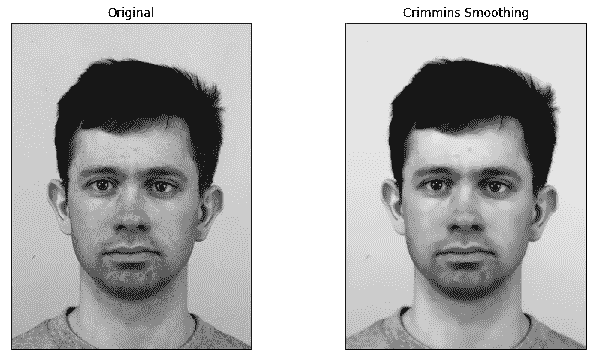

Figure 14: The result of applying the Crimmins Speckle Removal filter

# 模糊滤镜

钝化滤镜可用于增强图像的边缘。图像过滤器。PIL 软件包的反锐化掩模功能将反锐化滤波器应用于图像(图像首先需要转换为 PIL 图像对象。)图像过滤器。Unsharpmask 函数有三个参数。“半径”参数指定边缘周围有多少相邻像素受到影响。“百分比”参数指定边缘变暗或变亮的程度。第三个参数“阈值”定义了在滤波器执行任何操作之前，相邻色调值之间的距离。

```
image = Image.fromarray(image.astype('uint8'))
new_image = image.filter(ImageFilter.UnsharpMask(radius=2, percent=150))plt.subplot(121),plt.imshow(image, cmap = 'gray')
plt.title('Input Image'), plt.xticks([]), plt.yticks([])
plt.subplot(122),plt.imshow(new_image, cmap = 'gray')
plt.title('Unsharp Filter'), plt.xticks([]), plt.yticks([])
plt.show()
```

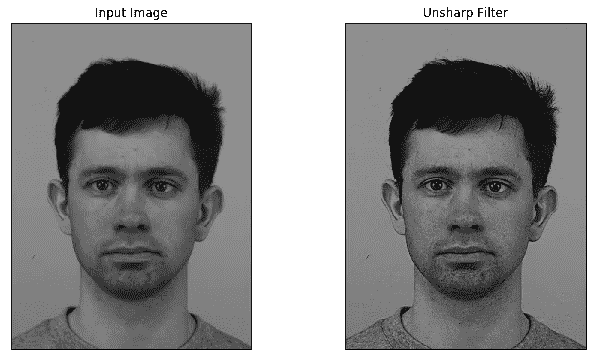

Figure 15: The result of applying the Unsharp filter

图 15 显示了反锐化滤波器的结果。当图像的边缘被增强时，一些噪声也被增强。

# 结论

在去除噪声和保留图像边缘之间总是有一个权衡。为了去除图像中的斑点噪声，需要应用模糊滤波器，这反过来模糊了图像的边缘。如果你想保留图像的边缘，唯一可以去除的噪声就是椒盐噪声。包含本文使用的所有代码的 Jupyter 笔记本可以在这里找到:[https://github . com/m4nv1r/medium _ articles/blob/master/Image _ Filters _ in _ python . ipynb](https://github.com/m4nv1r/medium_articles/blob/master/Image_Filters_in_Python.ipynb)