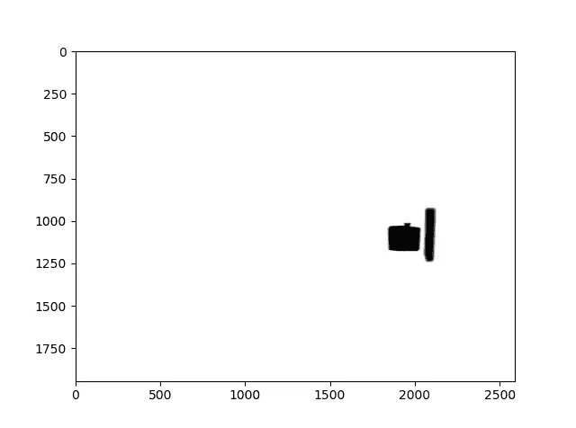

# 图像伪造检测

> 原文：<https://towardsdatascience.com/image-forgery-detection-2ee6f1a65442?source=collection_archive---------1----------------------->

## 利用 CNN 的力量来检测图像操纵

随着脸书和 Instagram 等社交网络服务的出现，过去十年中生成的图像数据量大幅增加。使用图像(和视频)处理软件，如 [GNU Gimp](https://www.gimp.org/) 、 [Adobe Photoshop](https://www.adobe.com/in/products/photoshop.html) 创建篡改过的图像和视频，是脸书等互联网公司的一大担忧。这些图像是假新闻的主要来源，并经常被恶意使用，如煽动暴民。在根据可疑图像采取行动之前，我们必须验证其真实性。IEEE 信息取证与安全技术委员会(IFS-TC)于 2013 年发起了一项检测和定位取证挑战，即[首届图像取证挑战](http://ifc.recod.ic.unicamp.br/fc.website/index.py?sec=0)，以解决这一问题。他们提供了一个开放的数字图像数据集，包括在不同光照条件下拍摄的图像和使用以下算法创建的伪造图像:

*   内容感知填充和修补匹配(用于复制/粘贴)
*   内容感知修复(用于复制/粘贴和拼接)
*   克隆图章(用于复制/粘贴)
*   线缝雕刻(图像重定向)
*   修复(受损部分的图像重建——复制/粘贴的特殊情况)
*   阿尔法抠图(用于拼接)

挑战包括两个阶段。

1.  第一阶段要求参与团队将图像分类为伪造的或原始的(从未被篡改)
2.  第二阶段要求他们检测/定位伪造图像中的伪造区域

这篇文章将讲述一种解决第一阶段挑战的深度学习方法。从数据清洗，预处理，CNN 架构到训练和评估的一切都将被阐述。

# 为什么用 CNN？

在人工智能的深度学习时代之前，即在 2012 年的[图像网络挑战赛之前，图像处理领域的研究人员过去常常设计手工制作的功能来解决一般图像处理问题，特别是图像分类问题。一个这样的例子是用于边缘检测的 Sobel 内核。之前使用的图像取证工具可分为 5 类，即](http://www.image-net.org/challenges/LSVRC/2012/index)

1.  基于像素的技术，检测像素级引入的统计异常
2.  基于格式的技术，利用特定有损压缩方案引入的统计相关性
3.  基于相机的技术，利用相机镜头、传感器或片内后处理引入的伪像
4.  基于物理的技术，明确地模拟和检测物理对象、光和相机之间的三维交互中的异常
5.  基于几何的技术，对世界上的对象及其相对于相机的位置进行测量

礼貌:[https://ieeexplore.ieee.org/abstract/document/4806202](https://ieeexplore.ieee.org/abstract/document/4806202)

几乎所有这些技术都利用了图像的基于内容的特征，即图像中存在的视觉信息。CNN 的[灵感来自视觉皮层](https://medium.com/@gopalkalpande/biological-inspiration-of-convolutional-neural-network-cnn-9419668898ac)。从技术上讲，这些网络被设计成提取对分类有意义的特征，即最小化损失函数的特征。网络参数——通过梯度下降学习内核权重，以便从输入网络的图像中生成最具鉴别性的特征。这些特征然后被馈送到一个完全连接的层，该层执行分类的最终任务。

在看了一些伪造的图像后，很明显通过人类视觉皮层定位伪造区域是可能的。因此，CNN 是这项工作的完美深度学习模型。如果人类的视觉皮层能够探测到它，那么在一个专门为这项任务设计的网络中肯定会有更多的能量。

# 资料组

在对数据集进行概述之前，先要弄清楚所使用的术语

*   假图像:使用两种最常见的操作，即复制/粘贴和图像拼接，对图像进行了处理/篡改。
*   原始图像:除了根据比赛规则调整所有图像的尺寸以达到标准尺寸之外，没有被处理过的图像。
*   图像拼接:拼接操作可以组合人的图像，给建筑物添加门，给停车场添加树和汽车等。拼接图像还可以包含复制/粘贴操作产生的部分。接收拼接部分的图像称为“主”图像。与宿主图像拼接在一起的部分被称为“外星人”。

第一阶段和第二阶段的整个数据集可以在[这里](http://ifc.recod.ic.unicamp.br/fc.website/index.py?sec=5)找到。对于这个项目，我们将只使用列车组。它包含两个目录——一个包含假图像及其相应的遮罩，另一个包含原始图像。伪图像的遮罩是描述伪图像的拼接区域的黑白(非灰度)图像。蒙版中的黑色像素代表在源图像中执行操作以获得伪造图像的区域，具体来说，它代表拼接区域。

Example of a fake image and corresponding mask

该数据集由 1050 幅原始图像和 450 幅伪图像组成。彩色图像通常是 3 个通道的图像，每个通道用于红色、绿色和蓝色，然而有时可能存在用于黄色的第四通道。我们数据集中的图像是 1、3 和 4 通道图像的混合。在查看了几幅 1 通道图像(即灰度图像)后，很明显这些图像

1.  数量非常少
2.  是黑色或蓝色的溪流

挑战设置者故意添加这些图像，因为他们希望解决方案对这种噪声具有鲁棒性。尽管一些蓝色图像可以是晴朗天空的图像。因此，它们中的一些被包含在内，而另一些则作为噪声被丢弃。来到四通道图像——他们也没有任何有用的信息。它们只是用 0 值填充的像素网格。因此，清理后的原始数据集包含大约 1025 幅 RGB 图像。

伪图像是 3 和 4 通道图像的混合，然而，它们都没有噪声。相应的遮罩是 1、3 和 4 通道图像的混合。我们将使用的特征提取只需要来自掩模的一个通道的信息。因此，我们的假货图像语料库有 450 个假货。接下来，我们做了一个训练测试分割，保留 1475 个图像中的 20%用于最终测试。

# 训练集上的特征提取

当前状态的数据集不适合训练模型。它必须被转换成非常适合手头任务的状态，即检测由于伪造操作而引入的像素级异常。从[这里的](https://ieeexplore.ieee.org/abstract/document/7823911)中汲取灵感，我们设计了以下方法来从给定的数据中创建相关的图像。

对于每一个假图像，我们都有一个相应的面具。我们使用该掩模沿着拼接区域边界对伪图像进行采样，以确保图像的伪造部分和非伪造部分至少有 25%的贡献。这些样本将具有只有在假图像中才会出现的有区别的边界。这些界限是我们设计的 CNN 要学习的。由于遮罩的所有 3 个通道包含相同的信息(不同像素的图像的虚假部分)，我们只需要 1 个通道来提取样本。

为了使边界更加清晰，在使用高斯滤波器去噪后，使用 [Otsu 的阈值](https://en.wikipedia.org/wiki/Otsu%27s_method)(在 [OpenCV](https://opencv.org/) 中实现)将灰度图像转换为二进制。在此操作之后，采样仅仅是移动 64×64 的窗口(步长为 8)通过假图像，并计数相应蒙版中的 0 值(黑色)像素，并在值位于某个区间的情况下进行采样。

Boundaries in a binary mask are much more distinct than in grayscale

经过采样，我们从假图像中得到了 175，119 个 64×64 的面片。为了生成 0 个标记的(原始的)补丁，我们从真实图像中采样了大致相同的数量。最后，我们有 350，728 个补丁，这些补丁被分成训练集和交叉验证集。

现在我们有了一个大的高质量输入图像数据集。是时候试验各种 CNN 架构了。

# 定制 CNN 架构

我们尝试的第一个架构受到了最初的[研究论文](https://ieeexplore.ieee.org/abstract/document/7823911)中给出的架构的启发。他们的输入图像大小为 128×128×3，因此网络很大。由于我们只有一半的空间大小，我们的网络也更小。这是第一个尝试的建筑。

First architecture

这里绿色层是卷积层，蓝色层是最大池。该网络在 150，000 个训练样本(用于测试目的)和 25，000 个验证样本上被训练。该网络有 8，536 个参数，与训练样本相比相对较少，因此避免了对更激进的退出的需要。0.2 的退出率适用于 20 个单位的扁平化产出。我们使用 Adam 优化器，默认值为学习率(0.001)和 beta_1、beta_2。大约 ___ 个时期后，结果如下

训练准确率:77.13%，训练损失:0.4678

验证准确率:75.68%，验证损失:0.5121

这些数字并不令人印象深刻，因为 2012 年 CNN 以巨大优势击败了专家长达一年的研究。然而，考虑到我们完全没有使用图像取证知识(像素统计和相关概念)来获得看不见的数据的 ___ 准确性，这些数字也不是很糟糕。

# 迁移学习

既然 CNN 在 [ImageNet](http://www.image-net.org/) 分类任务中击败了所有经典的机器学习算法，为什么不利用这些强大机器中的一个来解决手头的问题呢？这就是[转移学习](/transfer-learning-946518f95666)背后的理念。简而言之，我们使用预训练模型的权重来解决我们的问题，该模型可能是在更大的数据集上训练的，并且在解决问题时给出了更好的结果。换句话说，我们“转移”一个模型的知识来构建我们的模型。在我们的例子中，我们使用在 ImageNet 数据集上训练的 [VGG16](https://www.kaggle.com/keras/vgg16) 网络来矢量化数据集中的图像。

从[这里](https://blog.keras.io/building-powerful-image-classification-models-using-very-little-data.html)获取想法，我们尝试了两种方法

1.  使用 VGG16 输出的瓶颈特性，并在此基础上构建一个浅层网络
2.  微调上面(1)中 vgg 16+浅层模型的最后一个卷积层

很明显，2 比 1 给出了更好的结果。在最终实现之前，我们尝试了多种浅层网络架构

Top layer architecture

展平层的输入是 VGG16 输出的瓶颈特征。这些是形状为(2×2×512)的张量，因为我们使用了 64×64 的输入图像。

以上架构给出了以下结果

训练准确率:83.18%，训练损失:0.3230

验证准确率:84.26%，验证损失:0.3833

它使用 Adam optimizer 进行训练，具有每 10 个时期后降低的自定义学习率(除了 Adam 在每批后的定期更新之外)。

Custom update rule

第二种方法需要最后一层的**微调**。这里需要注意的重要一点是，我们必须使用预训练的顶层模型进行微调。目标是稍微改变已经学习的权重，以便更好地适应数据。如果我们使用一些随机初始化的权重，微小的变化对它们没有任何好处，大的变化会破坏卷积层的学习权重。我们还需要一个非常小的学习率来微调我们的模型(原因和上面提到的一样)。在[这个](https://blog.keras.io/building-powerful-image-classification-models-using-very-little-data.html)帖子里，建议使用 SGD 优化器进行微调。然而，我们观察到亚当在这项任务中表现优于 SGD。

微调模型给出了以下结果

训练准确率:99.16%，训练损失:0.018

验证准确率:94.77%，验证损失:0.30

稍微过度拟合的模型，可以通过使用更小的学习率来补救(我们使用 1e-6)。

除了 VGG16，我们还尝试了在 Image-Net 数据集上预训练的 ResNet50 和 VGG19 模型的瓶颈特征。ResNet50 的特性优于 VGG16。VGG19 没有给出一个很满意的表现。我们使用相同的学习率更新策略，以类似于 VGG16 的方式微调 ResNet50 架构(最后一个卷积层),它给出了更有希望的结果，过拟合问题更少。

训练准确率:98.65%，训练损失:0.048

验证准确率:95.22%，验证损失:0.18

# 测试数据的最终模型预测

为了从先前创建的测试集中采样图像，我们采用了与用于创建训练和交叉验证集类似的策略，即使用它们的遮罩在边界处采样伪图像，并采样相同数量的具有相同尺寸的原始图像。微调的 VGG16 模型用于预测这些补丁的标签，并给出以下结果

测试准确率:94.65%，测试损失:0.31

另一方面，ResNet50 对测试数据给出了以下结果

测试准确率:95.09%，测试损失:0.19

如我们所见，我们的模特表现不错。我们仍有很大的改进空间。如果通过数据扩充(剪切、调整大小、旋转和其他操作)可以生成更多的数据，也许我们可以微调更多层的 SOTA 网络。

在这篇文章中，我们谈到了检测假图像。然而，一旦检测到伪造图像，我们必须确定该图像中的伪造区域。假图像中拼接区域的定位将是下一篇文章的主题。这部分的全部代码可以在[这里](https://github.com/vishu160196/image-forgery-detection)找到。

这个帖子到此为止。请在评论区告诉我其他检测假图片的好方法。下次见…再见。

# 来源

1.  http://ifc.recod.ic.unicamp.br/fc.website/index.py?sec=5
2.  【https://ieeexplore.ieee.org/abstract/document/4806202 
3.  [https://www.youtube.com/watch?v=uihBwtPIBxM](https://www.youtube.com/watch?v=uihBwtPIBxM)
4.  [https://medium . com/@ gopalkalpande/biological-inspiration-of-convolutionary-neural-network-CNN-9419668898 AC](https://medium.com/@gopalkalpande/biological-inspiration-of-convolutional-neural-network-cnn-9419668898ac)
5.  [https://ieeexplore.ieee.org/abstract/document/7823911](https://ieeexplore.ieee.org/abstract/document/7823911)
6.  [https://blog . keras . io/building-powerful-image-class ification-models-using-very-little-data . html](https://blog.keras.io/building-powerful-image-classification-models-using-very-little-data.html)