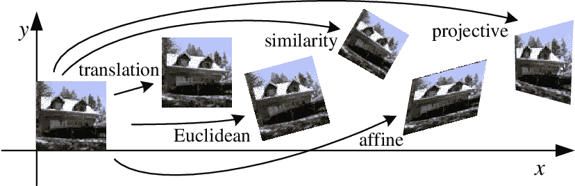
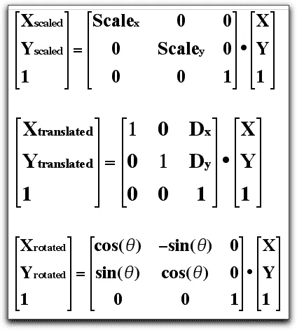
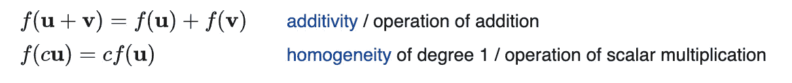
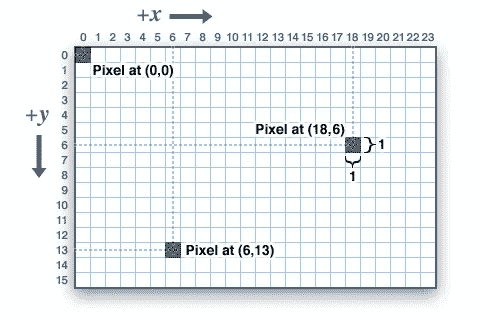
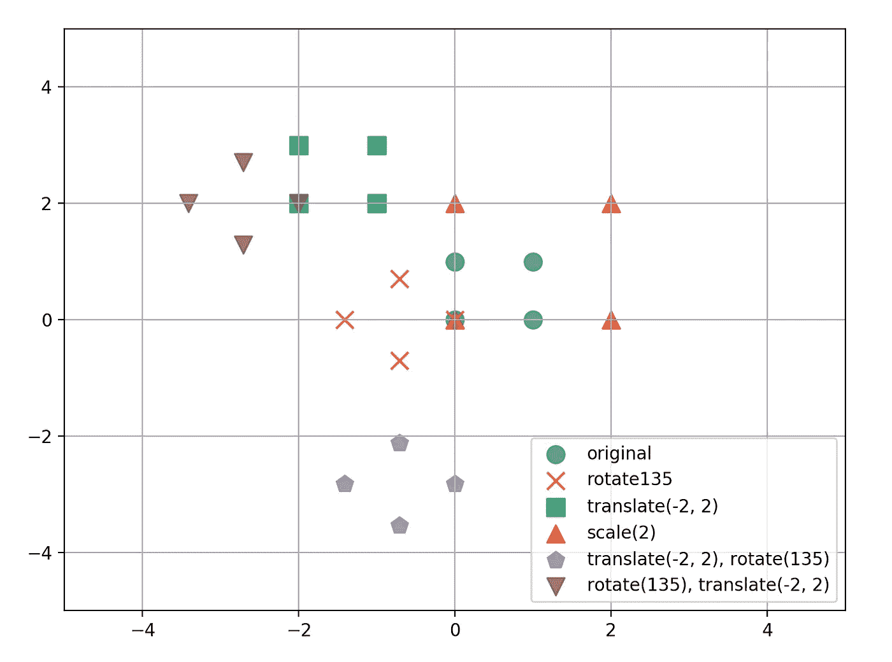
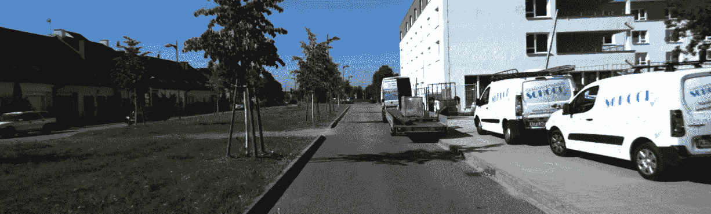
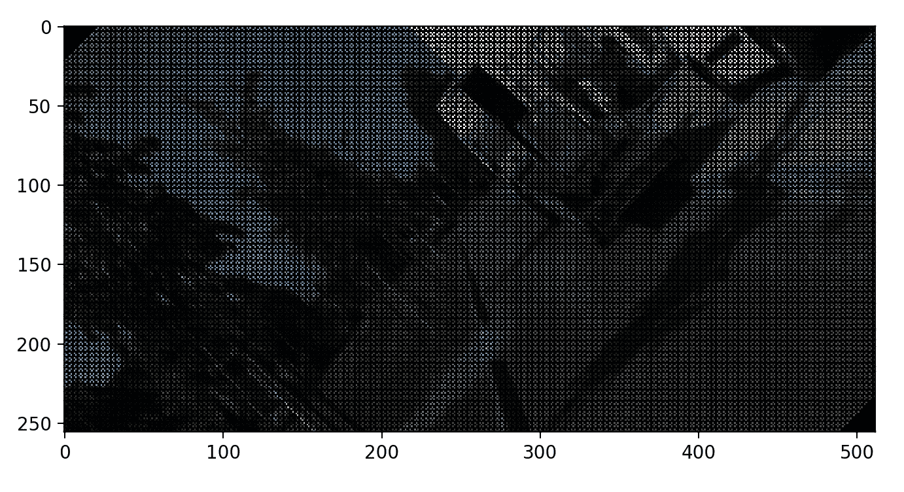
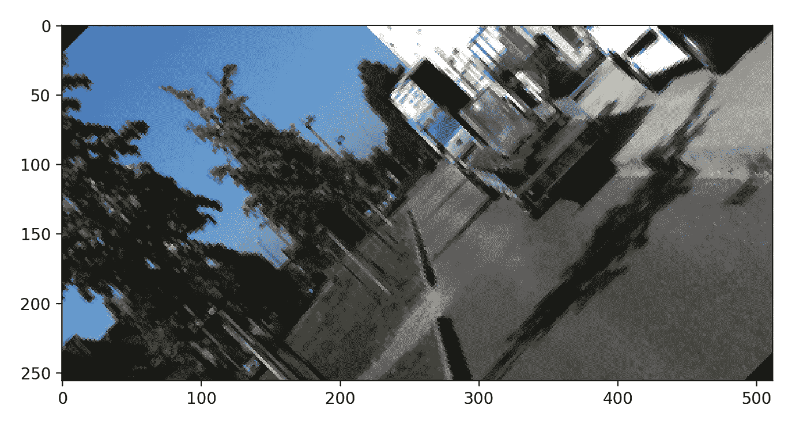

# Numpy 和 OpenCV 中的图像几何变换

> 原文：<https://towardsdatascience.com/image-geometric-transformation-in-numpy-and-opencv-936f5cd1d315?source=collection_archive---------4----------------------->

## 图像变形背后的数学和代码



Source: [Geometric Transformations](https://www.semanticscholar.org/paper/Computer-Vision-Algorithms-and-Applications-Szeliski/4282a344671189e17c9c9e00e329fe2d0fa71769/figure/263)

## 几何变换在计算机视觉中普遍存在

几何变换是一种重要的图像处理技术，有着广泛的应用。例如，在计算机图形学中，一个简单的用例是在桌面和移动设备上显示图形内容时简单地重新缩放图形内容。

它还可以应用于将图像投影扭曲到另一个图像平面。例如，我们希望从另一个角度看一个场景，而不是直直地看着它，在这个场景中应用了透视变换来实现这一点。

另一个令人兴奋的应用是训练深度神经网络。训练深度模型需要大量数据。几乎在所有情况下，随着训练数据的增加，模型都会受益于更高的泛化性能。人工生成更多数据的一种方法是对输入数据随机应用仿射变换。这种技术也被称为**增强**。

在本文中，我将带您了解一些转换，以及我们如何在 Numpy 中执行它们，首先从基本原则上理解这个概念。然后如何使用 OpenCV 轻松实现。如果你像我一样喜欢从基础理论中理解概念，这篇文章会让你感兴趣！

我将特别关注 **2D 仿射变换**。你需要的是一些线性代数的基础知识，你应该能跟上。附带的代码可以在[这里](https://github.com/darylclimb/image_affine_transform)找到，如果你喜欢自己尝试的话！

## **仿射变换的类型**

在不深入数学细节的情况下，变换的行为由仿射 **A** 中的一些参数控制。

**x' = Ax**

```
where A = [[a_11, a_12, a_13],
           [a_21, a_22, a_23],
           [  0 ,   0 ,   1 ]]
```

是齐次坐标中的 2x3 矩阵或 3x3，并且 **x** 是齐次坐标中形式为`[x, y]`或`[x, y, 1]`的向量。上面的公式说 **A** 取任意向量 **x** 并将其映射到另一个向量**x’。**

通常，仿射变换具有 6 个自由度，在逐像素矩阵相乘之后，将任何图像扭曲到另一个位置。变换后的图像保留了原图像中的**平行线**和**直线**(想想剪切)。满足这两个条件的任何矩阵 **A** 都被认为是仿射变换矩阵。

缩小我们的讨论，有一些特殊形式的 A，这是我们感兴趣的。这包括如下图所示的**旋转**、**平移**和**缩放**矩阵。



Figure 1: 2D Coordinate Transformations. Note that rotation is about z-axis

上述仿射变换的一个非常有用的特性是它们是线性函数。它们保留了乘法和加法的运算，遵守叠加原理。



source: [Wikipedia](https://en.wikipedia.org/wiki/Linear_map)

换句话说，我们可以组合两个或更多的变换:向量加法来表示平移，矩阵乘法来表示线性映射，只要我们在齐次坐标中表示它们。例如，我们可以将旋转后的平移表示为

```
A = array([[cos(angle),  -sin(angle), tx],
            [sin(angle), cos(angle),  ty],
            [0,          0,           1]])
```

## **图像表示**



Figure 2: [Pixel Coordinates](https://learn.adafruit.com/assets/1264)

在 Python 和 OpenCV 中，2D 矩阵的原点位于左上角，从 x，y= (0，0)开始。坐标系是左手坐标系，其中 x 轴指向正右侧，y 轴指向正下方。

但是你在教科书和文献中找到的大多数变换矩阵，包括上面显示的 3 个矩阵，都遵循右手坐标系。所以必须做一些小的调整来对齐轴的方向。

## **欧氏空间中的常见变换**

在我们对图像进行变换实验之前，让我们看看如何在点坐标上进行变换。因为它们本质上与图像是网格中的 2D 坐标阵列是一样的。

利用我们在上面学到的知识，下面的代码可以用来转换点`[0, 0], [0, 1], [1, 0], [1,1]`。图 3 中的蓝点。

Python 提供了一个有用的速记运算符，`@` 来表示矩阵乘法。

```
# Points generator
def get_grid(x, y, homogenous=False):
    coords = np.indices((x, y)).reshape(2, -1)
    return np.vstack((coords, np.ones(coords.shape[1]))) if homogenous else coords# Define Transformations
def get_rotation(angle):
    angle = np.radians(angle)
    return np.array([
        [np.cos(angle), -np.sin(angle), 0],
        [np.sin(angle),  np.cos(angle), 0],
        [0, 0, 1]
    ])
def get_translation(tx, ty):
    return np.array([
        [1, 0, tx],
        [0, 1, ty],
        [0, 0, 1]
    ])
def get_scale(s):
    return np.array([
        [s, 0, 0],
        [0, s, 0],
        [0, 0, 1]
    ])R1 = get_rotation(135)
T1 = get_translation(-2, 2)
S1 = get_scale(2)# Apply transformation x' = Ax
coords_rot = R1 @ coords
coords_trans = T1 @ coords
coords_scale = S1 @ coords
coords_composite1 = R1 @ T1 @ coords
coords_composite2 = T1 @ R1 @ coords
```



Figure 3: Transforming points: (0,0), (0,1), (1,0), (1,1)

重要的是要注意，除了少数例外，矩阵通常不**交换**。即

```
A1 @ A2 != A2 @ A1
```

因此，对于转换来说

```
# Translation and then rotation
coords_composite1 = R1 @ T1 @ coords# Rotation and then translation
coords_composite2 = T1 @ R1 @ coords
```

您将在图 3 中观察到，它们不会导致相同的映射，并且**顺序**很重要。函数如何应用可以从右到左理解。

# 数字转换



Source: Kitti Dataset

现在对于图像，有几件事需要注意。首先，如前所述，我们必须重新调整垂直轴。其次，变换后的点必须投影到图像平面上。

本质上，需要采取的步骤是:

1.  创建一个新的图像 I'(x，y)来输出变换点
2.  应用转换**一个**
3.  将这些点投影到一个新的图像平面上，只考虑那些位于图像边界内的点。

## **示例:关于图像中心的旋转、缩放和平移**

让我们来看一个变换，我们希望**放大 2 倍**并将图像围绕其中心位置旋转 **45 度**。

这可以通过应用以下复合矩阵来实现。

```
height, width = image.shape[:2]
tx, ty = np.array((width // 2, height // 2))
angle = np.radians(45)
scale = 2.0R = np.array([
    [np.cos(angle), np.sin(angle), 0],
    [-np.sin(angle), np.cos(angle), 0],
    [0, 0, 1]
])T = np.array([
    [1, 0, tx],
    [0, 1, ty],
    [0, 0, 1]
])S = np.array([
    [scale, 0, 0],
    [0, scale, 0],
    [0, 0, 1]
])A = T @ R @ S @ np.linalg.inv(T)
```

*应用于图像*

```
# Grid to represent image coordinate
coords = get_grid(width, height, True)
x_ori, y_ori = coords[0], coords[1] # Apply transformation
warp_coords = np.round(A@coords).astype(np.int)
xcoord2, ycoord2 = warp_coords[0, :], warp_coords[1, :]# Get pixels within image boundary
indices = np.where((xcoord >= 0) & (xcoord < width) &
                   (ycoord >= 0) & (ycoord < height))xpix2, ypix2 = xcoord2[indices], ycoord2[indices]xpix, ypix = x_ori[indices], y_ori[indices]# Map the pixel RGB data to new location in another array
canvas = np.zeros_like(image)
canvas[ypix, xpix] = image[yy, xx]
```

在上面的两个代码片段中有几点需要注意。

1.  左手坐标系旋转通过交换符号来解决。
2.  因为点是围绕原点旋转的，所以在进行旋转和缩放之前，我们首先将中心平移到原点。
3.  然后，点被转换回图像平面
4.  变换点被四舍五入为整数以表示离散的像素值。
5.  接下来，我们只考虑位于图像边界内的像素
6.  映射对应 I(x，y)和 I'(x，y)

正如你所看到的，由于步骤 4，结果图像(图 4)将有几个锯齿和漏洞。为了消除这一点，开源库使用插值技术来填充转换后的缺口。



Figure 4: Image rotated by 45 degrees counter-clockwise and scale by 2x. Aliasing effect is significant

**逆翘曲**

另一种防止混叠的方法是在给定扭曲点 X’的情况下，将扭曲公式化为从源图像 I(x，y)重采样的扭曲。这可以通过将 X '乘以 a 的倒数来实现。注意，变换必须是可逆的。

1.  对 X '进行逆变换。

```
X = np.linalg.inv(A) @ X'
```

注意:对于图像，X '的逆变形只是将 I'(x，y)重新投影到 I(x，y)上。所以我们简单地对 I'(x，y)像素坐标进行逆变换，如下图所示。

2.确定它在原始图像平面中的位置

3.从 I(x，y)重新采样 RGB 像素，并将其映射回 I'(x，y)

**代码**

```
# set up pixel coordinate I'(x, y)
coords = get_grid(width, height, True)
x2, y2 = coords[0], coords[1]# Apply inverse transform and round it (nearest neighbour interpolation)
warp_coords = (Ainv@coords).astype(np.int)
x1, y1 = warp_coords[0, :], warp_coords[1, :]# Get pixels within image boundaries
indices = np.where((x1 >= 0) & (x1 < width) &
                   (y1 >= 0) & (y1 < height))xpix1, ypix1 = x2[indices], y2[indices]
xpix2, ypix2 = x1[indices], y1[indices]# Map Correspondence
canvas = np.zeros_like(image)
canvas[ypix1, xpix1] = image[ypix2,xpix2]
```

运行上面的代码应该会给你一个密集的、没有孔洞的图像:)可以随意下载代码并使用参数来应用其他的转换。



# OpenCV 中的转换

既然您对几何变换有了更好的理解，大多数开发人员和研究人员通常会省去编写所有这些变换的麻烦，只需依靠优化的库来执行任务。在 OpenCV 中做[仿射变换非常简单。](https://docs.opencv.org/2.4/modules/imgproc/doc/geometric_transformations.html)

有几种方法可以做到。

1.  自己写仿射变换，调用`cv2.**warpAffine**(image, A, output_shape)`

下面的代码显示了整个仿射矩阵，它将给出与上面相同的结果。一个很好的练习就是自己推导公式！

```
def get_affine_cv(t, r, s):
    sin_theta = np.sin(r)
    cos_theta = np.cos(r)

    a_11 = s * cos_theta
    a_21 = -s * sin_theta

    a_12 = s * sin_theta
    a_22 = s * cos_theta

    a_13 = t[0] * (1 - s * cos_theta) - s * sin_theta * t[1]
    a_23 = t[1] * (1 - s * cos_theta) + s * sin_theta * t[0]return np.array([[a_11, a_12, a_13],
                 [a_21, a_22, a_23]])A2 = get_affine_cv((tx, ty), angle, scale)
warped = cv2.warpAffine(image, A2, (width, height))
```

2.依靠 OpenCV 使用`cv2.**getRotationMatrix2D**(center, angle, scale)`返回仿射变换矩阵。

该功能将图像绕点*中心旋转*角度，并用*标尺*对其进行缩放

```
A3 = cv2.getRotationMatrix2D((tx, ty), np.rad2deg(angle), scale)warped = cv2.warpAffine(image, b3, (width, height), flags=cv2.INTER_LINEAR, borderMode=cv2.BORDER_CONSTANT, borderValue=0)
```

# 摘要

在本文中，我介绍了几何变换的基本概念，以及如何将它应用于图像。许多先进的计算机视觉，如使用视觉里程计的 slam 和多视图合成依赖于首先理解变换。

我相信，作为一名计算机视觉从业者，当我们使用 imgaug 和 albumentation 等强大的库时，理解这些转换是如何工作的肯定是有益的。

感谢阅读！我希望您已经更好地理解了这些公式是如何在库中编写和使用的。请关注查看更多关于计算机视觉和机器学习的帖子:)如果你发现任何错误或任何不清楚的地方，请在评论中指出来！

**更多文章**

[](/depth-estimation-1-basics-and-intuition-86f2c9538cd1) [## 深度估计:基础和直觉

### 理解事物相对于相机有多远仍然是困难的，但对于激动人心的…

towardsdatascience.com](/depth-estimation-1-basics-and-intuition-86f2c9538cd1) [](https://medium.com/swlh/camera-lidar-projection-navigating-between-2d-and-3d-911c78167a94) [## 相机-激光雷达投影:在 2D 和 3D 之间导航

### 激光雷达和相机是感知和场景理解的两个必不可少的传感器。他们建立了一个环境…

medium.com](https://medium.com/swlh/camera-lidar-projection-navigating-between-2d-and-3d-911c78167a94)