# 10 个 Python 图像处理工具。

> 原文：<https://towardsdatascience.com/image-manipulation-tools-for-python-6eb0908ed61f?source=collection_archive---------2----------------------->

## 概述了一些常用的 Python 库，它们提供了一种简单直观的方法来转换图像。


Photo by [Luriko Yamaguchi](https://www.pexels.com/@luri?utm_content=attributionCopyText&utm_medium=referral&utm_source=pexels) from [Pexels](https://www.pexels.com/photo/person-holding-camera-film-2061678/?utm_content=attributionCopyText&utm_medium=referral&utm_source=pexels)

> 本文内容改编自我之前在[opensource.com](https://opensource.com/)发表的 [**自己的文章**](https://opensource.com/article/19/3/python-image-manipulation-tools) 。

# 介绍

当今世界充满了数据，而图像是这些数据的重要组成部分。然而，为了投入使用，这些图像需要被处理。因此，图像处理是分析和处理数字图像的过程，主要目的是提高图像质量或从中提取一些信息，然后加以利用。

图像处理中的典型任务包括显示图像、基本操作，如裁剪、翻转、旋转等。图像分割、分类和特征提取、图像恢复和图像识别。Python 成为这种图像处理任务的合适选择。这是因为它作为一门科学编程语言越来越受欢迎，并且在其生态系统中有许多先进的图像处理工具可以免费获得。

让我们看看一些常用于图像操作任务的 Python 库。

# 1.scikit 图像

[scikit-image](https://scikit-image.org/) 是一个开源 Python 包，可以与`[numpy](http://docs.scipy.org/doc/numpy/reference/index.html#module-numpy)`数组一起工作。它在研究、教育和工业应用中实现算法和实用程序。这是一个相对简单的库，即使对于那些不熟悉 Python 生态系统的人来说也是如此。该代码由一群活跃的志愿者编写，质量很高，经过了同行评审。

## 资源

有很多例子和实际使用案例很好地证明了这一点。在这里阅读文档。

## 使用

这个包作为`skimage`导入，大多数功能都在子模块中。克扣的一些例子包括:

*   滤像

```
import matplotlib.pyplot as plt 
%matplotlib inlinefrom skimage import data,filtersimage = data.coins()
# ... or any other NumPy array!
edges = filters.sobel(image)
plt.imshow(edges, cmap='gray')
```

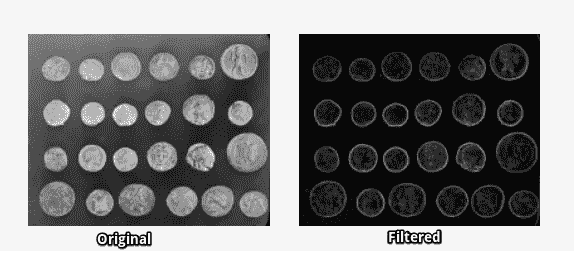

Image filtering in skimage

*   使用 [match_template](http://scikit-image.org/docs/dev/auto_examples/features_detection/plot_template.html#sphx-glr-auto-examples-features-detection-plot-template-py) 函数进行模板匹配

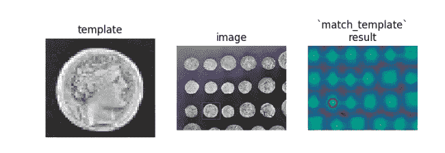

Template Matching using [match_template](http://scikit-image.org/docs/dev/auto_examples/features_detection/plot_template.html#sphx-glr-auto-examples-features-detection-plot-template-py) function

您可以在[图库](https://scikit-image.org/docs/dev/auto_examples)中找到更多示例。

# 2.Numpy

[**Numpy**](http://www.numpy.org/) 是 Python 编程中的核心库之一，提供对数组的支持。图像本质上是包含数据点像素的标准 Numpy 数组。因此，通过使用基本的 NumPy 操作，如切片、遮罩和花式索引，我们可以修改图像的像素值。可以使用 skimage 加载图像，并使用 matplotlib 显示图像。

## 资源

Numpy 的[官方文档页面](http://www.numpy.org/)上有完整的资源和文档列表。

## 使用

使用 Numpy 遮罩图像。

```
import numpy as np
from skimage import data
import matplotlib.pyplot as plt 
%matplotlib inlineimage = data.camera()
type(image)**numpy.ndarray #Image is a numpy array**mask = image < 87
image[mask]=255
plt.imshow(image, cmap='gray')
```

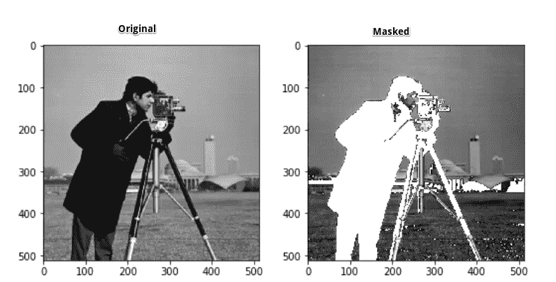

# 3.Scipy

scipy 是 Python 的另一个核心科学模块，类似于 Numpy，可用于基本的图像操作和处理任务。特别地，子模块`[**scipy.ndimage**](https://docs.scipy.org/doc/scipy/reference/ndimage.html#module-scipy.ndimage)`提供了在 n 维 NumPy 阵列上操作的功能。该软件包目前包括线性和非线性过滤功能，二元形态学，B 样条插值，和对象测量。

## 资源

关于`scipy.ndimage`包提供的功能的完整列表，请参考此处的文档[。](https://docs.scipy.org/doc/scipy/reference/tutorial/ndimage.html#correlation-and-convolution)

## 使用

使用 SciPy 使用[高斯滤波器](https://docs.scipy.org/doc/scipy/reference/generated/scipy.ndimage.gaussian_filter.html)进行模糊处理:

```
from scipy import misc,ndimageface = misc.face()
blurred_face = ndimage.gaussian_filter(face, sigma=3)
very_blurred = ndimage.gaussian_filter(face, sigma=5)#Results
plt.imshow(<image to be displayed>)
```

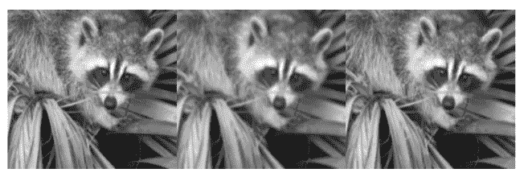

# 4.PIL/枕头

**PIL** ( Python 图像库)是 Python 编程语言的免费库，增加了对打开、操作和保存许多不同图像文件格式的支持。然而，它的发展停滞不前，最后一次发布是在 2009 年。幸运的是，还有 [**Pillow**](https://python-pillow.org/) ，这是 PIL 积极开发的一款更容易安装的 fork，可以运行在所有主流操作系统上，并且支持 Python 3。该库包含基本的图像处理功能，包括点操作、使用一组内置卷积核进行过滤以及色彩空间转换。

## 资源

[文档](https://pillow.readthedocs.io/en/stable/)包含安装说明和涵盖库每个模块的示例。

## 使用

使用图像过滤器增强 Pillow 中的图像:

```
**from** PIL **import** Image**,** ImageFilter
*#Read image*
im = Image.open**(** 'image.jpg' **)**
*#Display image*
im.show**()**from PIL import ImageEnhance
enh = ImageEnhance.Contrast(im)
enh.enhance(1.8).show("30% more contrast")
```

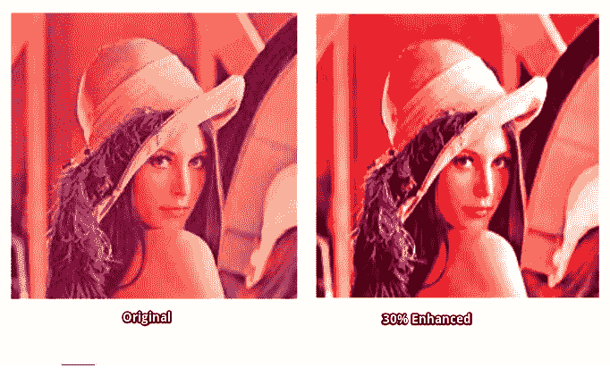

[Source](http://sipi.usc.edu/database/)

# 5.OpenCV-Python

OpenCV ( **开源计算机视觉库)**是计算机视觉应用**最广泛使用的库之一。**[**OpenCV-Python**](https://opencv-python-tutroals.readthedocs.io/en/latest/py_tutorials/py_setup/py_intro/py_intro.html)是针对 OpenCV 的 Python API。OpenCV-Python 不仅速度快，因为后台包含用 C/C++编写的代码，而且易于编码和部署(由于前台有 Python 包装器)。这使得它成为执行计算密集型计算机视觉程序的最佳选择。

## 资源

[OpenCV2-Python-Guide](https://github.com/abidrahmank/OpenCV2-Python-Tutorials) 让 OpenCV-Python 的入门变得简单。

## 使用

下面这个例子展示了 OpenCV-Python 在使用金字塔创建一个名为**“苹果”的新水果的**图像混合中的能力****

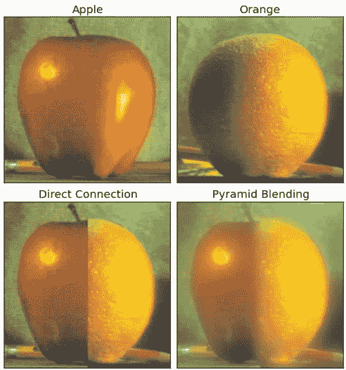

[Source](https://opencv-python-tutroals.readthedocs.io/en/latest/py_tutorials/py_imgproc/py_pyramids/py_pyramids.html#pyramids)

# 6.简单 CV

[SimpleCV](http://simplecv.org/) 也是一个构建计算机视觉应用的开源框架。有了它，您可以访问 OpenCV 等几个高性能的计算机视觉库，而不必先了解位深度、文件格式、色彩空间等。学习曲线比 OpenCV 小得多，正如他们的标语所说，“这是使计算机视觉变得容易的**”支持 SimpleCV 的一些观点有:**

*   即使是初级程序员也能编写简单的机器视觉测试
*   相机、视频文件、图像和视频流都可以互操作

## 资源

T21 的官方文档简单易懂，有大量的例子和用例可供参考。

## 使用

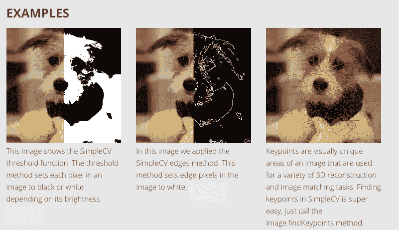

# 7.马霍塔斯

[Mahotas](https://mahotas.readthedocs.io/en/latest/) 是另一个用于 Python 的计算机视觉和图像处理库。它包含传统的图像处理功能，如过滤和形态学操作，以及用于特征计算的更现代的计算机视觉功能，包括兴趣点检测和局部描述符。界面是 Python 语言的，适合快速开发，但算法是用 C++实现的，并针对速度进行了微调。Mahotas 库速度很快，代码很少，依赖性也很小。点击阅读他们的官方论文[获得更多见解。](https://openresearchsoftware.metajnl.com/articles/10.5334/jors.ac/)

## [资源](https://mahotas.readthedocs.io/en/latest/index.html)

[文档](https://mahotas.readthedocs.io/en/latest/install.html) n 包含安装说明、示例，甚至一些教程来帮助开始使用 Mahotas。

## 使用

Mahotas 库依靠使用简单的代码来完成工作。对于' [**寻找沃利**](https://blog.clarifai.com/wheres-waldo-using-machine-learning-to-find-all-the-waldos) **的问题，'** Mahotas 做得非常出色，而且代码量也很少。下面是[源代码](https://mahotas.readthedocs.io/en/latest/wally.html)。

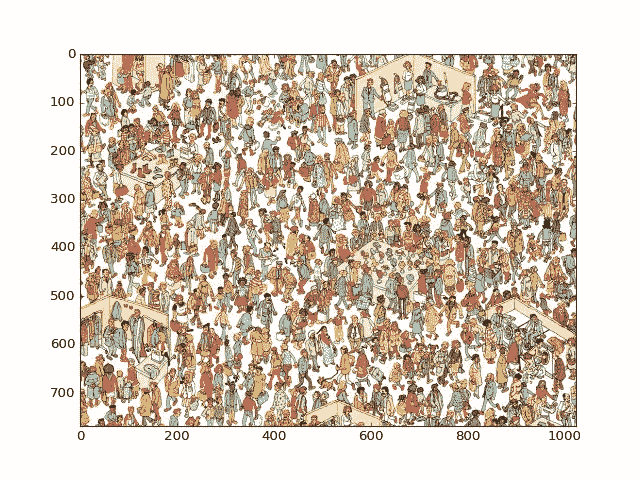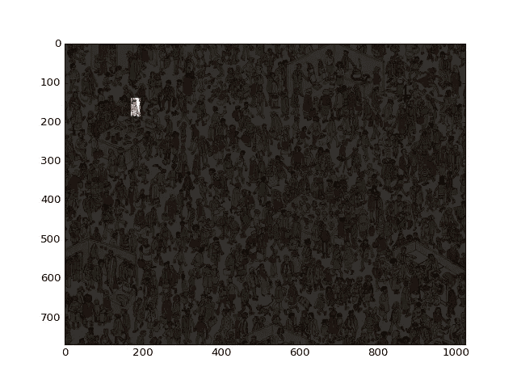

Source

# 8.SimpleITK

[ITK](https://itk.org/) 或**Insight Segmentation and Registration Toolkit**是一个开源的跨平台系统，为开发人员提供了一套广泛的图像分析软件工具。K 是建立在 ITK 之上的一个简化层，旨在促进它在快速原型、教育和解释语言中的使用。 [SimpleITK](https://itk.org/ITK/resources/resources.html) 是一个图像分析工具包，包含许多支持一般过滤操作、图像分割和配准的组件。SimpleITK 是用 C++编写的，但可用于许多编程语言，包括 Python。

## 资源

已经提供了大量的 Jupyter 笔记本来说明 SimpleITK 在教育和研究活动中的应用。这些笔记本演示了使用 Python 和 R 编程语言使用 SimpleITK 进行交互式图像分析。

## 使用

下面的动画显示了用 SimpleITK 和 Python 创建的严格的 CT/MR 配准过程。这里看源代码[。](https://github.com/InsightSoftwareConsortium/SimpleITK-Notebooks/blob/master/Utilities/intro_animation.py)

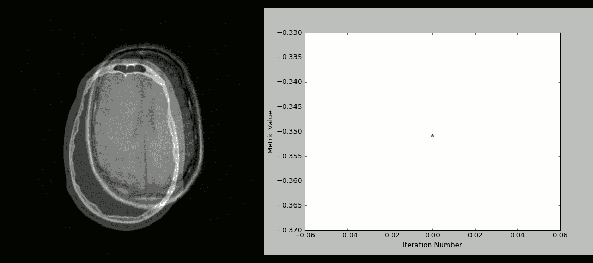

[Source](https://github.com/InsightSoftwareConsortium/SimpleITK-Notebooks/blob/master/Utilities/intro_animation.py)

# 9.pgmagick

p [**gmagick**](https://pypi.org/project/pgmagick/) 是 GraphicsMagick 库的基于 Python 的包装器。[**GraphicsMagick**](http://www.graphicsmagick.org/)**图像处理系统有时被称为图像处理的瑞士军刀。它提供了一个强大而高效的工具和库集合，支持以超过 88 种主要格式读取、写入和操作图像，包括重要的格式，如 DPX、GIF、JPEG、JPEG-2000、PNG、PDF、PNM 和 TIFF。**

## **资源**

**PgMagick 的官方 [Github 库](https://github.com/hhatto/pgmagick)有安装说明和要求。关于这个主题还有一个详细的用户 guid。**

## **使用**

**使用 **pgmagic** k 可以执行的一些图像操作活动包括:**

**[**图像缩放**](https://pgmagick.readthedocs.io/en/latest/cookbook.html#scaling-a-jpeg-image) **g** :**

****

**[**边缘提取:**](https://pgmagick.readthedocs.io/en/latest/cookbook.html#edge-extraction)**

**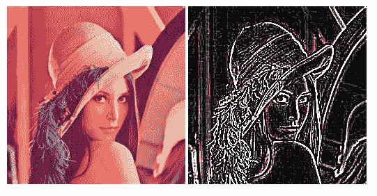**

# **10.皮开罗**

**Pycairo 是图形库 [**Cairo**](https://cairographics.org/) 的一套 Python 绑定。Cairo 是一个用于绘制矢量图形的 2D 图形库。矢量图形很有趣，因为它们在调整大小或变换时不会失去清晰度。Pycairo 是用 Python 为 cairo 编写的一组绑定。**

## **资源**

**Pycairo [GitHub 资源库](https://github.com/pygobject/pycairo)是一个很好的资源，里面有关于安装和使用的详细说明。还有一个 **G** [**etting 入门**](https://pycairo.readthedocs.io/en/latest/tutorial.html) 指南，里面有 Pycairo 的简要教程。**

## **使用**

**使用 Pycairo 绘制线条、基本形状和径向渐变**

**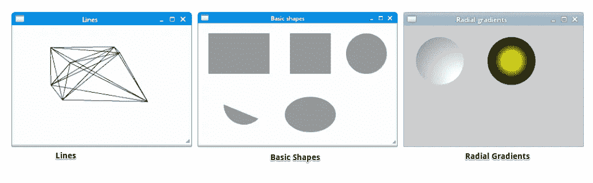**

# **结论**

**这些是 Python 的一些有用的免费图像处理库。有些相对比较了解，有些可能对你来说比较陌生。尝试一下，了解更多。**