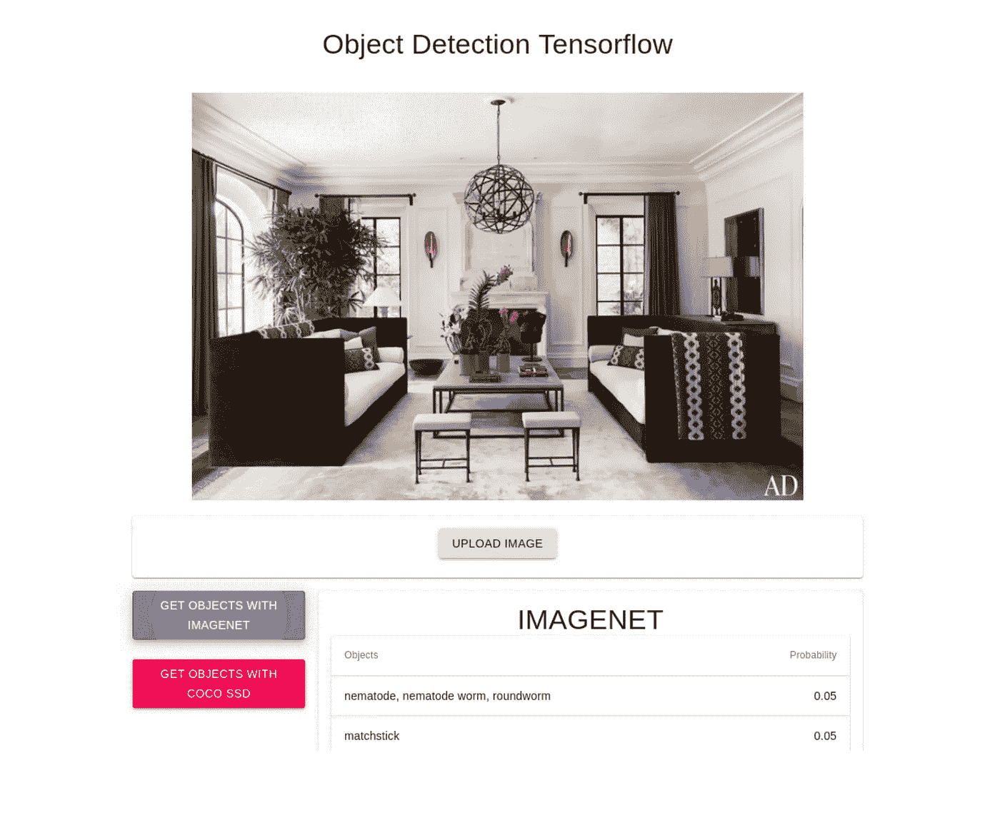
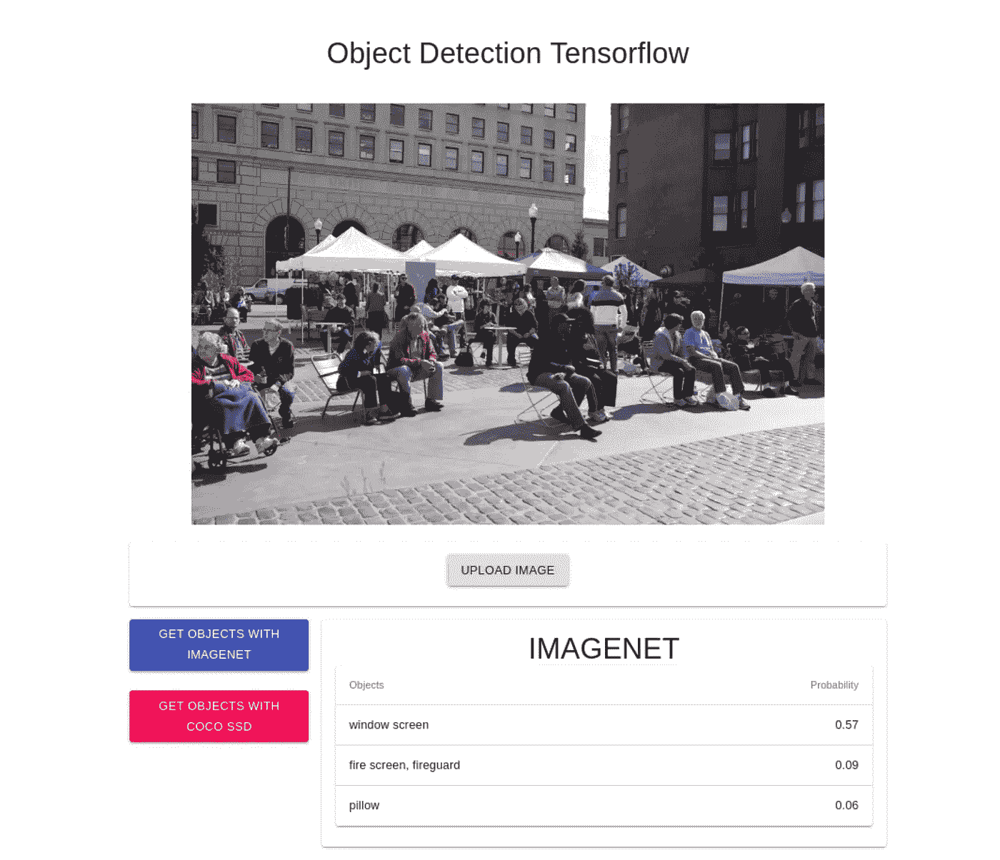
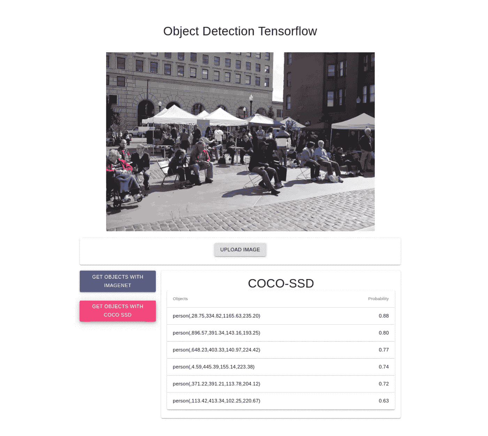

# 基于 Tensorflow-js 的图像目标检测🤔

> 原文：<https://towardsdatascience.com/image-object-detection-with-tensorflow-js-b8861119ed46?source=collection_archive---------7----------------------->


这是图像处理系列从零到一的第四篇帖子。

这是其他帖子的列表

1.  [图像处理— OpenCV 和 Node.js(第三部分)](https://overflowjs.com/posts/Image-Processing-OpenCV-and-Nodejs-Part-3.html)
2.  [图像处理—制作自定义滤镜— React.js —第二部分](https://overflowjs.com/posts/Image-Processing-Making-Custom-Filters-Reactjs-Part-2.html)
3.  [使用 Cloundinary 的图像处理(第一部分)](https://overflowjs.com/posts/Image-Processing-In-Reactjs-Part-1.html)

在这篇文章中，我们将使用 Tensorflow-js 和预训练的模型构建一个图像对象检测系统。

首先，在网页中部署 TensorFlow 有很多方法，其中一种方法是包含 ml5js。参观 https://ml5js.org/。它是 tf.js 的包装器，一个张量流和 p5.js 库，用于在 Html 元素中进行操作。

但是，我们希望保持后端部分的电源，以便我可以尝试使用 API 的后端进程等在后端运行这些模型。

因此，在本文的前半部分，我们将使用 React.js 和 Material-UI 创建一个 UI，在后半部分，我们将在 Node.js 中创建一个 API 来支持这个 UI。

让我们从构建一个示例 React 项目开始。🚀

# 前端部分:-

如果您遵循了我的前一篇文章，那么 react 项目似乎很容易构建。

1.  打开终端，做

```
create-react-app image_classification_react_ui
```

这将创建一个 react 项目来使用。

2.让我们安装所需的依赖项

```
npm install @material-ui/core
npm install — save isomorphic-fetch es6-promise
```

> 注意:从 React 代码调用对象检测 API 端点需要同构提取。

3.在你最喜欢的编辑器中打开项目，让我们创建两个文件夹

1.  **容器** —这将包含一个文件— `ImageOps.jsx`，其中包含所有的前端 UI 代码。
2.  **utils** —这将包含一个文件`Api.js`，用于调用对象检测端点。

```
└── src
    ├── containers
        ├── ImageOps.jsx
    ├── utils
        ├── Api.js
```

让我们研究一下`ImageOps.jsx`代码并理解它。

```
import React from 'react';

import Container from '[@material](http://twitter.com/material)-ui/core/Container';
import Grid from '[@material](http://twitter.com/material)-ui/core/Grid';

import Card from '[@material](http://twitter.com/material)-ui/core/Card';
import CardContent from '[@material](http://twitter.com/material)-ui/core/CardContent';
import Typography from '[@material](http://twitter.com/material)-ui/core/Typography';
import Button from '[@material](http://twitter.com/material)-ui/core/Button';
import { red } from '[@material](http://twitter.com/material)-ui/core/colors';

import {api} from '../utils/Api';

import Table from '[@material](http://twitter.com/material)-ui/core/Table';
import TableBody from '[@material](http://twitter.com/material)-ui/core/TableBody';
import TableCell from '[@material](http://twitter.com/material)-ui/core/TableCell';
import TableHead from '[@material](http://twitter.com/material)-ui/core/TableHead';
import TableRow from '[@material](http://twitter.com/material)-ui/core/TableRow';
import Paper from '[@material](http://twitter.com/material)-ui/core/Paper';
import CircularProgress from '[@material](http://twitter.com/material)-ui/core/CircularProgress';

export default class ImageOps extends React.Component {

   constructor(props) {
       super(props);

       this.state = {
           image_object: null,
           image_object_details: {},
           active_type: null
       }
   }

   updateImageObject(e) {
       const file  = e.target.files[0];
       const reader = new FileReader();

       reader.readAsDataURL(file);
       reader.onload = () => {
           this.setState({image_object: reader.result, image_object_details: {}, active_type: null});
       };

   }

   processImageObject(type) {

       this.setState({active_type: type}, () => {

           if(!this.state.image_object_details[this.state.active_type]) {
               api("detect_image_objects", {
                   type,
                   data: this.state.image_object
               }).then((response) => {

                   const filtered_data = response;
                   const image_details = this.state.image_object_details;

                   image_details[filtered_data.type] = filtered_data.data;

                   this.setState({image_object_details: image_details });
               });
           }
       });
   }

   render() {
       return (
           <Container maxWidth="md">
               <Grid container spacing={2}>
                   <Grid item xs={12}>
                       <CardContent>
                           <Typography variant="h4" color="textPrimary" component="h4">
                               Object Detection Tensorflow
                           </Typography>
                       </CardContent>
                   </Grid>
                   <Grid item xs={12}>
                       {this.state.image_object &&
                           
                       }
                   </Grid>
                   <Grid item xs={12}>
                       <Card>
                           <CardContent>
                               <Button variant="contained"
                                   component='label' // <-- Just add me!
                                   >
                                   Upload Image
                                   <input accept="image/jpeg" onChange={(e) =>  this.updateImageObject(e)} type="file" style={{ display: 'none' }} />
                               </Button>
                           </CardContent>
                       </Card>
                   </Grid>
                   <Grid item xs={3}>
                       <Grid container justify="center" spacing={3}>
                           <Grid item >
                               {this.state.image_object && <Button onClick={() => this.processImageObject("imagenet")}variant="contained" color="primary">
                                   Get objects with ImageNet
                               </Button>}
                           </Grid>
                           <Grid item>
                               {this.state.image_object && <Button onClick={() => this.processImageObject("coco-ssd")}variant="contained" color="secondary">
                                   Get objects with Coco SSD
                               </Button>}
                           </Grid>
                       </Grid>
                   </Grid>
                   <Grid item xs={9}>
                       <Grid container justify="center">
                           {this.state.active_type && this.state.image_object_details[this.state.active_type] &&
                               <Grid item xs={12}>
                                   <Card>
                                       <CardContent>
                                           <Typography variant="h4" color="textPrimary" component="h4">
                                               {this.state.active_type.toUpperCase()}
                                           </Typography>
                                           <ImageDetails type={this.state.active_type} data = {this.state.image_object_details[this.state.active_type]}></ImageDetails>
                                       </CardContent>
                                   </Card>
                               </Grid>
                           }
                           {this.state.active_type && !this.state.image_object_details[this.state.active_type] &&
                               <Grid item xs={12}>
                                   <CircularProgress
                                       color="secondary"
                                   />
                               </Grid>
                           }
                       </Grid>
                   </Grid>
               </Grid>
           </Container>
       )
   }
}

class ImageDetails extends React.Component {

   render() {

       console.log(this.props.data);

       return (
           <Grid item xs={12}>
               <Paper>
                   <Table>
                   <TableHead>
                       <TableRow>
                       <TableCell>Objects</TableCell>
                       <TableCell align="right">Probability</TableCell>
                       </TableRow>
                   </TableHead>
                   <TableBody>
                       {this.props.data.map((row) => {
                           if (this.props.type === "imagenet") {
                               return (
                                   <TableRow key={row.className}>
                                       <TableCell component="th" scope="row">
                                       {row.className}
                                       </TableCell>
                                       <TableCell align="right">{row.probability.toFixed(2)}</TableCell>
                                   </TableRow>
                               )
                           } else if(this.props.type === "coco-ssd") {
                               return (
                                   <TableRow key={row.className}>
                                       <TableCell component="th" scope="row">
                                       {row.class}
                                       </TableCell>
                                       <TableCell align="right">{row.score.toFixed(2)}</TableCell>
                                   </TableRow>
                               )
                           }
                           })
                       }
                   </TableBody>
                   </Table>
               </Paper>

           </Grid>
       )
   }
}

}
```

> 注:这里是上面的 Github repo 链接—[https://Github . com/overflow js-com/image _ object _ det ction _ react _ ui](https://github.com/overflowjs-com/image_object_detction_react_ui)。如果你觉得理解很难，那么我强烈推荐你阅读我们的第 2 部分和第 1 部分。

在渲染中，我们创建了一个三行的网格，其中一行包含标题

第二，包含要显示的图像

```
<Grid item xs={12}>
  {this.state.image_object &&
    }                
</Grid>
```

如果图像已经上传或图像对象处于可用状态，我们将在此显示图像

下一个网格包含一个按钮，用于上传文件并将上传的文件更新到当前状态。

```
<Grid item xs={12}>
    <Card>
        <CardContent>
            <Button variant="contained"
                component='label' // <-- Just add me!
                >
                Upload Image
                <input accept="image/jpeg" onChange={(e) =>  this.updateImageObject(e)} type="file" style={{ display: 'none' }} />
            </Button>
        </CardContent>
    </Card>
</Grid>
```

我们调用了一个函数`updateImage`来更新状态下当前选中的图像。

```
updateImageObject(e) {
       const file  = e.target.files[0];
       const reader = new FileReader();

       reader.readAsDataURL(file);
       reader.onload = () => {
           this.setState({image_object: reader.result, image_object_details: {}, active_type: null
           });
       };
}
```

在上面的代码中，我们从文件输入上传器中读取当前文件对象，并在当前状态下加载它的数据。随着新图像的上传，我们正在重置 image_object_details 和 active_type，以便可以对上传的图像应用新的操作

下面是下一个网格，包含每个模型的两个按钮的代码。

```
<Grid item xs={3}>
        <Grid container justify="center" spacing={3}>
            <Grid item >
                {this.state.image_object && <Button onClick={() => this.processImageObject("imagenet")}variant="contained" color="primary">
                    Get objects with ImageNet
                </Button>}
            </Grid>
            <Grid item> 
                {this.state.image_object && <Button onClick={() => this.processImageObject("coco-ssd")}variant="contained" color="secondary">
                    Get objects with Coco SSD
                </Button>}
            </Grid>
        </Grid>
    </Grid>
    <Grid item xs={9}>
        <Grid container justify="center">
            {this.state.active_type && this.state.image_object_details[this.state.active_type] &&
                <Grid item xs={12}>
                    <Card>
                        <CardContent>
                            <Typography variant="h4" color="textPrimary" component="h4">
                                {this.state.active_type.toUpperCase()}
                            </Typography>
                            <ImageDetails data = {this.state.image_object_details[this.state.active_type]}></ImageDetails>
                        </CardContent>
                    </Card>
                </Grid>
            }
            {this.state.active_type && !this.state.image_object_details[this.state.active_type] && 
                <Grid item xs={12}>
                    <CircularProgress
                        color="secondary"
                    />
                </Grid>
            }
     </Grid>
</Grid>
```

在这里，我们将网格从 12 列父网格分为 3 列和 9 列两部分。

第一个有 3 列的网格包含两个有两个按钮的网格

```
<Grid container justify="center" spacing={3}>
    <Grid item >
        {this.state.image_object && <Button onClick={() => this.processImageObject("imagenet")}variant="contained" color="primary">
            Get objects with ImageNet
        </Button>}
    </Grid>
    <Grid item> 
        {this.state.image_object && <Button onClick={() => this.processImageObject("coco-ssd")}variant="contained" color="secondary">
            Get objects with Coco SSD
        </Button>}
    </Grid>
</Grid>
```

> 我们正在使用 **ImageNet 和 Coco SSD 型号**分析图像检测，并比较输出。

每个按钮都有一个动作事件 onClick，它调用一个函数`processImageObject()`,该函数将模型的名称作为参数。

```
processImageObject(type) {this.setState({active_type: type}, () => {
        api("detect_image_objects", {
            type,
            data: this.state.image_object
        }).then((response) => {

            const filtered_data = response;
            const image_details = this.state.image_object_details;image_details[filtered_data.type] = filtered_data.data;this.setState({image_object_details: image_details });
        });
    });
}
```

我们正在用当前选择的模态设置状态对象`action_type`。

Process image 对象函数将从 state 中获取当前图像，并将其发送给 API 函数，我接下来将向您展示该函数，API 将被调用`detect_image_objects`，作为响应，我们将在 UI 中进行处理和显示。

将从 API 获取响应，并在阶段`image_object_details`中设置。

我们根据型号类型 **(imagenet/coco-ssd)** 设置每个 API 响应

该按钮仅在`image_object`处于该状态时可见。

```
{
 this.state.image_object && 
 <Button onClick={() => this.processImageObject()} variant="contained" color="primary">Process Image 
 </Button>
}
```

下面是我们创建的另一个网格:

```
<Grid item xs={9}>
    <Grid container justify="center">
        {this.state.active_type && this.state.image_object_details[this.state.active_type] &&
            <Grid item xs={12}>
                <Card>
                    <CardContent>
                        <Typography variant="h4" color="textPrimary" component="h4">
                            {this.state.active_type.toUpperCase()}
                        </Typography>
                        <ImageDetails  type={this.state.active_type} data = {this.state.image_object_details[this.state.active_type]}></ImageDetails>
                    </CardContent>
                </Card>
            </Grid>
        }
        {this.state.active_type && !this.state.image_object_details[this.state.active_type] && 
            <Grid item xs={12}>
                <CircularProgress
                    color="secondary"
                />
            </Grid>
        }
    </Grid>
</Grid>
```

这里我们已经检查了当前的`action_type`模式是否被选中，如果 API 已经处理了细节，它将显示对象细节。为此，我们创建了一个组件`ImageDetails`。

让我们看看`ImageDetails`组件代码，它很容易理解。

```
class ImageDetails extends React.Component {

   render() {

       console.log(this.props.data);

       return (
           <Grid item xs={12}>
               <Paper>
                   <Table>
                   <TableHead>
                       <TableRow>
                       <TableCell>Objects</TableCell>
                       <TableCell align="right">Probability</TableCell>
                       </TableRow>
                   </TableHead>
                   <TableBody>
                       {this.props.data.map((row) => {
                           if (this.props.type === "imagenet") {
                               return (
                                   <TableRow key={row.className}>
                                       <TableCell component="th" scope="row">
                                       {row.className}
                                       </TableCell>
                                       <TableCell align="right">{row.probability.toFixed(2)}</TableCell>
                                   </TableRow>
                               )
                           } else if(this.props.type === "coco-ssd") {
                               return (
                                   <TableRow key={row.className}>
                                       <TableCell component="th" scope="row">
                                       {row.class}
                                       </TableCell>
                                       <TableCell align="right">{row.score.toFixed(2)}</TableCell>
                                   </TableRow>
                               )
                           }
                           })
                       }
                   </TableBody>
                   </Table>
               </Paper>

           </Grid>
       )
   }
}
```

该组件将显示从对象的模态名称接收的详细信息及其概率。基于我们正在处理的模态的类型，我们可以显示在这个类中处理的两个不同的输出。

4.最后一步是编写 API.js 包装器进行服务器端调用。

```
import fetch from  'isomorphic-fetch';

const BASE_API_URL = "[http://localhost:4000/api/](http://localhost:4000/api/)"

export function api(api_end_point, data) {

   return fetch(BASE_API_URL+api_end_point,
       {
           method: 'POST',
           headers: {
               'Content-Type': 'application/json'
           },
           body:JSON.stringify(data)
       }).then((response) => {
           return response.json();
       });
}
```

在这个示例代码中，我们提供了一个通过获取 API 函数的包装器，它将获取 API 端点和数据，并将构造完整的 URL 和从 API 发送的返回响应。

最终的用户界面将如下所示



# 后端部分:-

现在，既然我们已经有了自己的 UI，让我们开始使用 tensorflow.js 创建一个 API 端点，看起来像这样

```
[http://localhost:4000/api/detect_image_objects](http://localhost:4000/api/detect_image_objects)
```

1.  第一步是选择一个样板文件，它使用 express.js 并提供只编写路由和对象检测逻辑的能力。在本教程中，我们使用[https://github.com/developit/express-es6-rest-api](https://github.com/developit/express-es6-rest-api)。让我们克隆它

```
git clone [https://github.com/developit/express-es6-rest-api](https://github.com/developit/express-es6-rest-api) image_detection_tensorflow_api
```

2.现在，通过运行以下命令安装所有依赖项

```
cd image_detection_tensorflow_api
npm install
```

3.转到项目根目录下的`config.json`，将`port`编辑为 4000，将`bodylimit`编辑为 10000kb。

> 注意:我们将使用预先训练的模型`imagenet and coco-ssd.`从图像中寻找多个对象是一项繁琐的工作，尽管 image net 以从图像中检测单个对象(动物/其他对象)而闻名，但这两种模型都基于非常广泛的不同数据集。所以，如果你没有得到你的目标，不要担心😅。

4.从 TensorFlow 开始，如果您使用的是旧版本，我们需要更新节点版本。在你熟悉了节点版本之后，让我们运行下面的命令来安装[https://github.com/tensorflow/tfjs-models](https://github.com/tensorflow/tfjs-models/tree/master/coco-ssd/demo)

```
npm install @tensorflow/tfjs-node
```

> 注意:您可以根据您的系统 Linux/Windows/Mac 使用—[https://www.npmjs.com/package/@tensorflow/tfjs-node](https://www.npmjs.com/package/@tensorflow/tfjs-node)安装 [tfjs-node](https://www.npmjs.com/package/@tensorflow/tfjs-node)

5.现在让我们安装我们将要使用的两个模型，所以运行

```
npm install @tensorflow-models/mobilenet — save
npm install @tensorflow-models/coco-ssd — save
```

6.我们需要安装下面的模块，因为需要依赖

```
npm install base64-to-uint8array — save
```

7.现在转到`src > api`文件夹下的`index.js`，创建一个新的端点

```
api.post('/detect_image_objects', async (req, res) => {
  const data = req.body.data;
  const type = req.body.type; const objectDetect = new ObjectDetectors(data, type);
  const results = await objectDetect.process(); res.json(results);
});
```

这里我们调用`ObjectDetectors`类并传递从 UI 接收的两个参数，一个是 base64 编码的图像，另一个是模型的类型。

8.现在让我们创建`ObjectDetectors`类。转到`src > api`文件夹并创建`object_detector`文件夹。在`object_detector`中，我们将创建一个新文件`ObjectDetectors.js`

```
const tf = require('[@tensorflow/tfjs-node](http://twitter.com/tensorflow/tfjs-node)');

const cocossd = require('[@tensorflow](http://twitter.com/tensorflow)-models/coco-ssd');
const mobilenet = require('[@tensorflow](http://twitter.com/tensorflow)-models/mobilenet');

import toUint8Array from 'base64-to-uint8array';

export default class ObjectDetectors {

   constructor(image, type) {

       this.inputImage = image;
       this.type = type;
   }

   async loadCocoSsdModal() {
       const modal = await cocossd.load({
           base: 'mobilenet_v2'
       })
       return modal;
   }

   async loadMobileNetModal() {
       const modal = await mobilenet.load({
           version: 1,
           alpha: 0.25 | .50 | .75 | 1.0,
       })
       return modal;
   }

   getTensor3dObject(numOfChannels) {

       const imageData = this.inputImage.replace('data:image/jpeg;base64','')
                           .replace('data:image/png;base64','');

       const imageArray = toUint8Array(imageData);

       const tensor3d = tf.node.decodeJpeg( imageArray, numOfChannels );

       return tensor3d;
   }

   async process() {

       let predictions = null;
       const tensor3D = this.getTensor3dObject(3);

       if(this.type === "imagenet") {

           const model =  await this.loadMobileNetModal();
           predictions = await model.classify(tensor3D);

       } else {

           const model =  await this.loadCocoSsdModal();
           predictions = await model.detect(tensor3D);
       }

       tensor3D.dispose();

      return {data: predictions, type: this.type};
   }
}
```

我们有一个构造函数，它有两个参数，一个是图像 base64 编码，另一个是图像类型。

调用一个调用`getTensor3dObject(3).`的`process`函数

> 注意:这里 3 是通道的数量，因为在 UI 中，我们将图像类型限制为 jpeg，现在是 3 通道图像。我们不处理 png 的 4 通道图像，你可以很容易地建立这个，因为你可以在 API 中发送图像类型，并根据需要改变给定的函数。

```
getTensor3dObject(numOfChannels) {
 const imageData = this.inputImage.replace('data:image/jpeg;base64','')
           .replace('data:image/png;base64','');const imageArray = toUint8Array(imageData);const tensor3d = tf.node.decodeJpeg( imageArray, numOfChannels );return tensor3d;
}
```

在这个函数中，我们从 base64 图像中移除标签，将其转换为图像数组，并构建 tensor3d。

我们的预训练模型使用 tensor3d 对象或`` HTML 标记或 HTML 视频标记，但当我们从 Node.js API 执行此操作时，我们有一个 base64 图像，它被转换为 tensor3d 对象。

欣然 tensorflow.js 为它提供了一个函数`decodeJpeg`。

> TensorFlow 还提供了其他功能，您可以查看更多详细信息—[https://js.tensorflow.org/api_node/1.2.7/#node.decodeJpeg](https://js.tensorflow.org/api_node/1.2.7/#node.decodeJpeg)

现在`decodeJpeg`将把我们的 3 通道图像的`ArrayBuffer`转换成 tesnor3d 对象。

```
if(this.type === "imagenet") {
 const model =  await this.loadMobileNetModal();
 predictions = await model.classify(tensor3D);} else {
 const model =  await this.loadCocoSsdModal();
 predictions = await model.detect(tensor3D);
}
```

基于选择的模型类型，我们在 API 调用中加载模型。你可以在 API 开始加载的时候加载模型，但是对于这个博客，我只是在 API 得到一个调用的时候加载它们，所以 API 可能需要时间来响应。

下面是我目前为止得到的结果

## IMAGENET 模型输出



`imagenet`的输出它提供了物体的名称及其概率有三个物体用`imagenet.`标识

## COCO-SSD 模型输出-

如果您了解更多关于 coco-ssd 的信息，它可以识别多个对象，即使它们是相似的。以及它们的对象所依赖的矩形坐标。

> 在这里阅读更多—[https://github . com/tensor flow/tfjs-models/tree/master/coco-SSD](https://github.com/tensorflow/tfjs-models/tree/master/coco-ssd)



在这里你可以看到它已经确定了 6 个人，他们的位置是一个矩形。现在，您可以将这些坐标用于任何目的，因为它们会告诉您对象名称和对象位置。

您可以使用任何图像库来绘制这些矩形，围绕这些细节构建一些很酷的图像效果应用程序。

你可以试试我在 React.js 上的关于 Cloudniary 和 OpenCV 的教程，以前文章中的 Nodejs 试图使用这些知识来构建很酷的东西。

快乐编码❤️

如果您想被添加到我的电子邮件列表中，请考虑在这里输入您的电子邮件地址 和**关注我的** [**medium**](https://medium.com/@ideepak.jsd) **阅读更多关于 javascript 的文章，并关注**[**github**](https://github.com/dg92)**查看我的疯狂代码**。如果有什么不清楚或者你想指出什么，请在下面评论。

你可能也会喜欢我的其他文章

1.  [用 Tensorflow-js 进行图像目标检测🤔](https://levelup.gitconnected.com/image-object-detection-with-tensorflow-js-b8861119ed46)
2.  Nodejs 应用程序结构——构建高度可扩展的架构。
3.  [图像处理——在 React.js 中制作自定义图像滤镜](https://levelup.gitconnected.com/image-processing-making-custom-image-filters-react-js-part-2-ee2787f56b0d)

如果你喜欢这篇文章，请随意分享并帮助他人找到它！

谢谢你！