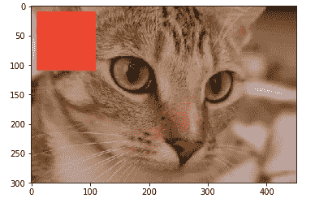

# 使用 scikit 图像进行图像处理

> 原文：<https://towardsdatascience.com/image-processing-using-scikit-image-cb57ce4321ed?source=collection_archive---------13----------------------->

## 突破图像分析的恐惧和复杂性

数据科学求职过程的一个积极方面是暴露在现实世界中的挑战和问题。一个这样的挑战是检测图像中的对象位置。这个项目可以用两种方法来处理。

*   不使用神经网络的计算机视觉
*   卷积神经网络的计算机视觉

对于一个不知道如何在没有神经网络的情况下进行基本图像分析的人来说，我最终在 4 天内成功完成了这个项目。这样做最关键的部分是弄清楚图像实际上是什么，以及如何处理它们。

这篇文章的重点就是要做到这一点，用 scikit image 简单地理解图像。遵循这些要点将对对计算机视觉感兴趣的初露头角的数据科学家大有裨益。

**1。什么是图像？**

它们只是 numpy 数组。对于数据科学家来说，搞清楚这一点可以减少一半的复杂性。

不相信我，试试这个。你将画出一幅 80 年代没有任何信号接收的电视机的图像。

```
import numpy as np
import matplotlib.pyplot as pltrandom_image = np.random.random([500,500])
plt.imshow(random_image, cmap = 'gray')
plt.colorbar();
```


TV set from the past

**2。大致来说，图像有三层:红色、蓝色和绿色**

图像只是数字的集合。您可以在真实图像上通过调整值和编辑图像来改变这些。这是一个演示，将显示图像的规模，也是它的形状。

```
#Checking out a color image
from skimage import data
cat = data.chelsea()print(f'Shape: {cat.shape}')
print("Values min/max", cat.min(), cat.max())
plt.imshow(cat)
```


注意形状中的 3。这些表示红色、蓝色和绿色层。编辑这些数组中的值应该可以编辑图像。让我们来测试一下。让我们在图像上画一个正方形。

```
#Drawing a red square on the image
cat[10:110, 10:110, :] = [255, 0, 0] #{red, green, blue }
plt.imshow(cat)
```



就像一个上课无聊的学生，我只是用 python 代码丑化了一个图像。如果有人感兴趣的话，试着用一些颜色和一条金链让这只猫看起来更酷(这是一个完整的附带项目)。我们继续吧。

**3。在您的系统上处理图像**

学习将图像从您的系统上传到 python 环境是必不可少的，可以使用以下代码完成

```
from skimage import io
image = io.imread('image path')
```

**4。将图像转换为灰度**

大多数时候，灰度图像的图像处理不太复杂，用外行人的话来说就是黑白图像。浏览可以通过以下方式将彩色(红、蓝、绿)图像转换为灰度图像:

```
gray_image = color.rgb2gray(image)
plt.imshow(gray_image, cmap = 'gray');
```


**5。寻找图像的边缘**

图像中对象检测和定位的一个非常关键的因素是检测其边缘的能力。让我们拍下这张一个人操作照相机的照片。


skimage 过滤并模糊这张图片，不要太详细，但找到了这个人的轮廓。这被称为像素化。

```
####Code for smooth pixelation####from skimage import filters, img_as_float
import scipy.ndimage as ndi#Convolution step(Like in CNN's)smooth_mean = ndi.convolve(image, mean_kernel)
image = data.camera()
pixelated = image[::10, ::10]
pixelated_float = img_as_float(pixelated)
sigma  =1
smooth = filters.gaussian(pixelated_float, sigma)
plt.imshow(smooth);
```


使用来自滤波器的 sobel 滤波，可以容易地找到该图像的边缘。使用下面的代码:

```
#Using the Sobel filter
plt.imshow(filters.sobel(pixelated_float))
```


建立在这些基础知识点上，肯定会是进入计算机视觉的一个很好的开始。通过观看和学习 2019 年 SciPy 会议，这些方法可以进入更实际的细节。它在 youtube 上免费提供，正是它教会了我基础知识。

跟随这个链接到达那里

*   [https://www.youtube.com/watch?v=d1CIV9irQAY](https://www.youtube.com/watch?v=d1CIV9irQAY)

我对每一个阅读这篇文章的读者的最终意图是消除对任何图像分析任务的恐惧和恐吓。图像只是基本的数字，这是每个数据科学家都乐于接受的一件事。