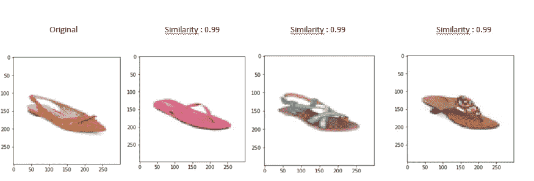

# 图像推荐引擎—利用迁移学习

> 原文：<https://towardsdatascience.com/image-recommendation-engine-leverage-transfert-learning-ec9af32f5239?source=collection_archive---------12----------------------->

## 应用于图像推荐的预训练模型世界之旅

在本文中，我们将开发一个基于图像这种非结构化数据的推荐系统。为了有一个快速、可操作的模型，而不需要费力地微调`[Convolutional neural network](https://en.wikipedia.org/wiki/Convolutional_neural_network)`算法，我们将使用`[Transfer Learning](https://en.wikipedia.org/wiki/Transfer_learning)`。

> **迁移学习**是[机器学习](https://en.wikipedia.org/wiki/Machine_learning)中的一个研究问题，它专注于存储在解决一个问题时获得的知识，并将其应用于另一个不同但相关的问题。[【1】](https://en.wikipedia.org/wiki/Transfer_learning#cite_note-1)例如，在学习[识别](https://en.wikipedia.org/wiki/Computer_vision#Recognition)汽车时获得的知识可以应用于识别卡车

为了使它更容易，我们将使用高级 API `[Keras](https://keras.io/)`。Keras 提供了几个预训练模型，这些模型已经证明了它们在泛化方面的价值。让我们立即开始建模吧！

我有一些关于时尚产品的数据，我在这里得到了，由于计算时间的原因，我将语料库减少到 2000 张图片。因此，正如我之前所说，Keras 提供了几个只需导入的预训练模型。

我输入了他们已经在训练的算法，现在我该怎么办？有几个初步的步骤，我们将准备我们的图像语料库并重新设计算法，以便它将返回通过训练确定的高级特征。

## 1.准备图片语料库

我们有一份巴布亚新几内亚的清单:

*   对于每个 png，我们将调整它的大小
*   把它变成三维数组
*   在 3D 数组列表上构建矩阵
*   用 Keras 内置函数对其进行预处理。

## 2.准备算法

*   为了预测最后一个要素而不是预测的 1000 个标注的最后一层，我们需要重新设计模型以移除预测层。

首先，我们需要知道模型的输入是什么形状，并根据这个形状调整图像的大小。让我们用 VGG16 来做我们的预处理，它有如下结构。


VGG16 structure model

由于我们看到输入层中的输入形状是(none，224，224，3)，我们将直接从模型中提取输入中请求的大小和宽度，这样我们就不必查看每个模型的摘要。

```
#with vgg model (or any model above)
image_width = eval(str(vgg_model.layers[0].output.shape[1]))
image_height = eval(str(vgg_model.layers[0].output.shape[2]))
```

注意:由于 self . model . layers[0]. output . shape[1]的输出是***tensor flow . python . framework . tensor _ shape。Dimension*** 对象，我将对其求值以获得整数。然后，我们加载和调整图像大小为一个 ***PIL。Image . Image***

```
pil_img = load_img('image.png',  target_size=(image_width, image_height))
```

我们将它转换为 shape (224，224，3)数组，并使用额外的维度对其进行扩展，以适应算法所需的(none，224，224，3)输入形状。

```
from keras.preprocessing.image import load_img,img_to_arrayarray_img = img_to_array(pil_img)
images = np.expand_dims(array_img, axis=0)
```

我们可以对每个文件都这样做，然后把它变成一个矩阵。

**预处理 _ 输入**减去数据的平均 RGB 通道。这是因为您正在使用的模型已经在不同的数据集上进行了训练:`image.shape`仍然是带有堆栈和预处理 _ 输入的`(1, 224, 224, 3)`，它变成了带有 n 个输入数(即图像数)的`(n, 224, 224, 3)`。

现在我们的输入已经准备好了，可以放入算法中了。我们需要重新设计我们的模型，在新模型中加入预先训练的输入和输出的倒数第二层。

```
from keras.models import Modelfeat_extract = Model(inputs=vgg_model.input,outputs=vgg_model.layers[-2].output)
```

有了这个模型，我们就可以使用**。预测方法**得到的图像特征与第二层特征一样多(vgg_model 'fc2 层'为 4096)。

```
imgs_features = feat_extract.predict(dense_mat)
```

现在，我们可以计算每个图像之间的余弦相似性，以获得索引和列中有 png 的(n*n)密集矩阵，然后我们可以提出一个或多个推荐。

```
cosSimilarities = cosine_similarity(imgs_features)cos_similarities_df = pd.DataFrame(cosSimilarities, columns=files, index=files)
```

让我们将所有这些归纳起来，一次测试几个模型。

我们已经定义了一个通用类，它采用任何预训练模型，并相应地调整图像集，并针对给定的图像提出建议，让我们看看结果。

*   MobileNetV2


*   移动网络


*   InceptionResNet


*   VGG16



很酷不是吗！尽管我们使用了只有 2000 张图片的语料库，但我们有非常相关的推荐。

# 最后

我们已经看到了使用迁移学习的优势。为了有一个更准确的推荐系统，创建我们自己的卷积网络会更有意义，这将是下一篇文章的主题**，保持联系！谢了。**

此处代码:[https://github.com/AlexWarembourg/Medium/blob/master/](https://github.com/AlexWarembourg/Medium/blob/master/product_recommendation.ipynb)product _ recommendation . ipynb