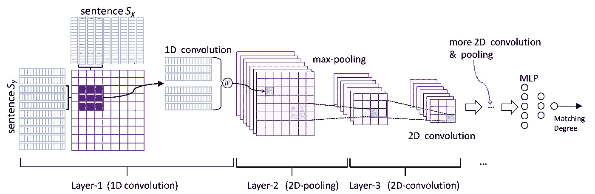
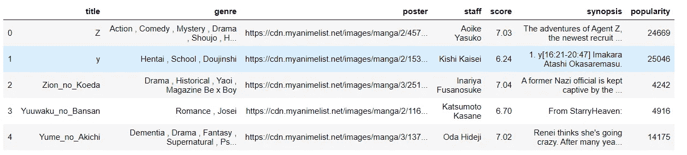
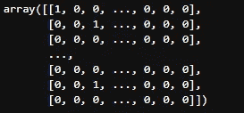
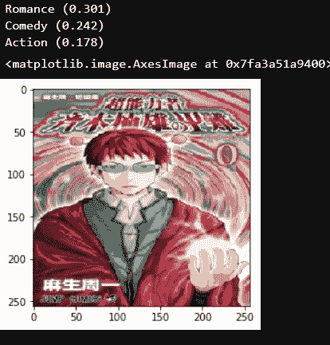
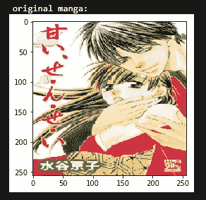
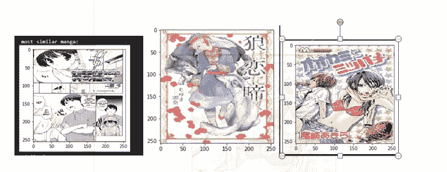

# 带有 Keras 的图像推荐引擎

> 原文：<https://towardsdatascience.com/image-recommendation-engine-with-keras-d227b0996667?source=collection_archive---------25----------------------->

## 建立一个 CNN 分类器，把它变成一个推荐引擎。



[https://www.cleanpng.com/png-convolutional-neural-network-natural-language-proc-3083964/](https://www.cleanpng.com/png-convolutional-neural-network-natural-language-proc-3083964/)

我有一些漫画数据，我甚至写了一篇文章，以便你可以收集这些数据集(有一些修改)见:[https://towards data science . com/scrape-multiple-pages-with-scrapy-ea 8 EDFA 4318](/scrape-multiple-pages-with-scrapy-ea8edfa4318)



对于每一部漫画，我都在海报栏里找到了他的照片的网址。我将在此基础上建立我的图像语料库

```
import requestsmanga["title"] = manga["title"].replace({"%" : ""}, regex=True)
manga= manga[(manga["title"] != "") & (manga["title"].notnull()) & (manga["poster"].notnull())]import requests
from tqdm import tqdmkeep_in_memory = []for url, title in tqdm(zip(manga["poster"], manga["title"])) : 
    str_name = "/home/jupyter/Untitled Folder/%s.jpg" %title
    str_name = str_name.strip()
    keep_in_memory.append(str_name)
    with open(str_name, 'wb') as f:
        f.write(requests.get(url).content)

manga["pics_ref"] = keep_in_memory
```

我将使用性别列作为我的图像分类器的标签。但是我之前需要做一点清理，因为我有大约 3000 个独特的标签，我会清理我的标签并减少它们。

```
manga["genre"] = manga["genre"].str.strip()
manga["genre"] = manga["genre"] +  " ,"import redef clean(genre, string_to_filter) :
    return re.sub('(?<={})(.*\n?)(?=,)'.format(string_to_filter), '', genre)manga["genre"] = manga["genre"].apply(lambda  x : clean(str(x), 'Comic'))
manga["genre"] = manga["genre"].apply(lambda  x : clean(str(x), 'Action'))
manga["genre"] = manga["genre"].apply(lambda  x : clean(str(x), 'Josei'))
manga["genre"] = manga["genre"].apply(lambda  x : clean(str(x), 'Shoujo'))
manga["genre"] = manga["genre"].apply(lambda  x : clean(str(x), 'Shounen'))
manga["genre"] = manga["genre"].apply(lambda  x : clean(str(x), 'Horror'))manga['genre'] = [list(map(str.strip, y)) for y in [x.split(',') for x in manga['genre']]]manga['genre'] =[','.join(x) for x in manga['genre']]my_cat = ['Action', 'Adventure', 'Comedy', 'Hentai',
          'Harem', 'Fantasy', 'Drama', 'Horror', 'Romance','Josei',
          'Fantasy', 'Seinen', 'Sci-Fi', 'Slice of Life', 'Mecha', 'Yaoi',
          'Yuri', 'Thriller', 'Comic']manga["genre"] = manga["genre"].apply(lambda z : [x for x in my_cat if x in z])
manga['genre'] =[','.join(x) for x in manga['genre']]genre = manga["genre"].str.get_dummies(',')
manga = pd.concat([manga, genre], axis = 1)
```

我现在有 18 个标签，我把它们编码成每个标签的二进制矩阵。



我还有另一个问题:我的标签是不平衡的，所以我们将定义一个类权重，稍后我将在我的模型中传递它。

```
label_cnt = [(columns, manga[columns].sum()) for columns in manga.columns[8:]]
tot = sum([x[1] for x in label_cnt])
class_weight = dict(zip([x[0] for x in label_cnt], [x[1]/tot for x in label_cnt]))
```

最后，我们将建立我们的输入矩阵。

```
train_image = []
index_to_drop = []
for i, png in tqdm(list(enumerate(manga["pics_ref"]))):
    try : 
        img = image.load_img(png,target_size=(256,256,3))
        img = image.img_to_array(img)
        img = img/255
        train_image.append(img)
    except OSError : 
        index_to_drop.append(i)manga = manga.drop(manga.index[index_to_drop])

X = np.array(train_image)
y = np.array(manga[manga.columns[8:].tolist()])from sklearn.model_selection import train_test_split
X_train, X_test, y_train, y_test = train_test_split(X, y, test_size = 0.2, random_state = 777)
```

然后，我们将定义我们的模型。不管结构如何，这里有一点很重要，即我们的预测必须通过 sigmoid 函数激活，而不是 softmax，因为否则我们将有属于这样一个标签的累积概率，或者我们想要属于一个标签的独立概率。

最后，使用 ImageDataGenerator 模块增加数据，该模块将通过更改 RGB 通道、缩放、翻转图像等方式生成新照片…..

我们的模型拟合得非常准确，但它不是这项任务的完美指标。我们试试吧，省省吧。

```
randint = np.random.randint(1, manga.shape[0], 1)[0]
poster = manga["pics_ref"].iloc[randint]
img = image.load_img(poster, target_size=(256,256,3))
img = image.img_to_array(img)
img = img/255classes = np.array(manga.columns[8:])
proba = model.predict(img.reshape(1,256,256,3))
top_3 = np.argsort(proba[0])[:-4:-1]
for i in range(3):
    print("{}".format(classes[top_3[i]])+" ({:.3})".format(proba[0][top_3[i]]))
plt.imshow(img)
```



```
from keras.models import model_from_json# serialize model to JSON
model_json = model.to_json()
with open("model.json", "w") as json_file:
    json_file.write(model_json)
# serialize weights to HDF5
model.save_weights("model.h5")
print("Saved model to disk")
# load json and create model
json_file = open('model.json', 'r')
loaded_model_json = json_file.read()
json_file.close()
'''
loaded_model = model_from_json(loaded_model_json)
loaded_model.compile(optimizer='adam', loss='binary_crossentropy', metrics=['accuracy'])
'''
```

无论如何，我们对分类器的准确性不感兴趣，而是对训练产生的特征感兴趣，这将允许我们建立我们的推荐！首先，我们将通过删除最后一个预测层，用我们的预训练模型重建一个模型。

```
image_features_extractor = Model(inputs=model.input,  outputs=model.layers[-2].output)img_features = image_features_extractor.predict(X)cosSimilarities = cosine_similarity(img_features)cos_similarities_df = pd.DataFrame(cosSimilarities,
                                   columns=manga["title"],
                                   index=manga["title"])
```

最后，我们得到与给定海报最相似的海报。

```
def most_similar_to(given_img, nb_closest_images = 5):print("-----------------------------------------------------------------------")
    print("original manga:")original = load_img(given_img, target_size=(256,256,3))
    plt.imshow(original)
    plt.show()print("-----------------------------------------------------------------------")
    print("most similar manga:")closest_imgs = cos_similarities_df[given_img].sort_values(ascending=False)[1:nb_closest_images+1].index
    closest_imgs_scores = cos_similarities_df[given_img].sort_values(ascending=False)[1:nb_closest_images+1]for i in range(0,len(closest_imgs)):
        img = image.load_img(closest_imgs[i], target_size=(256,256,3))
        plt.imshow(img)
        plt.show()
        print("similarity score : ",closest_imgs_scores[i])
```



*   推荐



看起来不错！但是还可以更好！

# 最后

我们编写了一个卷积神经网络来对我们的漫画进行分类，然后我们检索了训练过程中产生的变量，使其成为一个推荐系统。同一个模型的几种用法相当不错不是吗！
谢谢，代码在这里:[https://github.com/AlexWarembourg/Medium](https://github.com/AlexWarembourg/Medium)